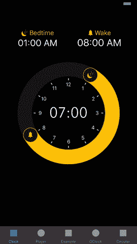
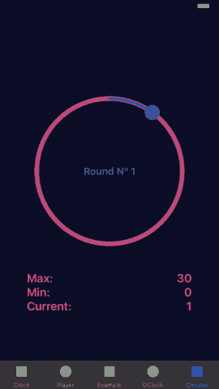
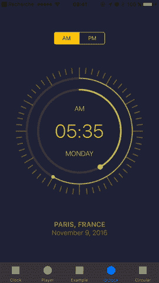
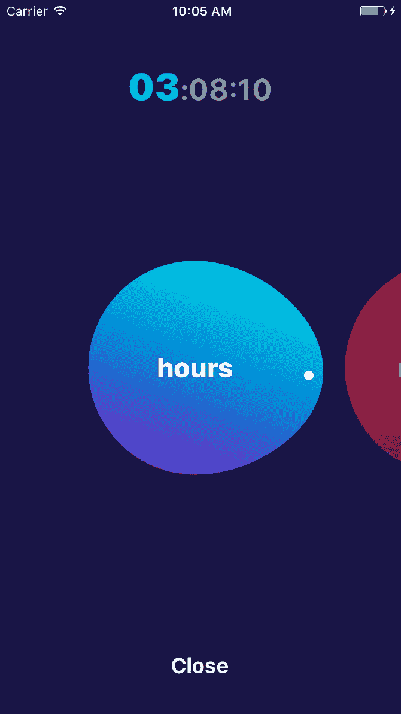
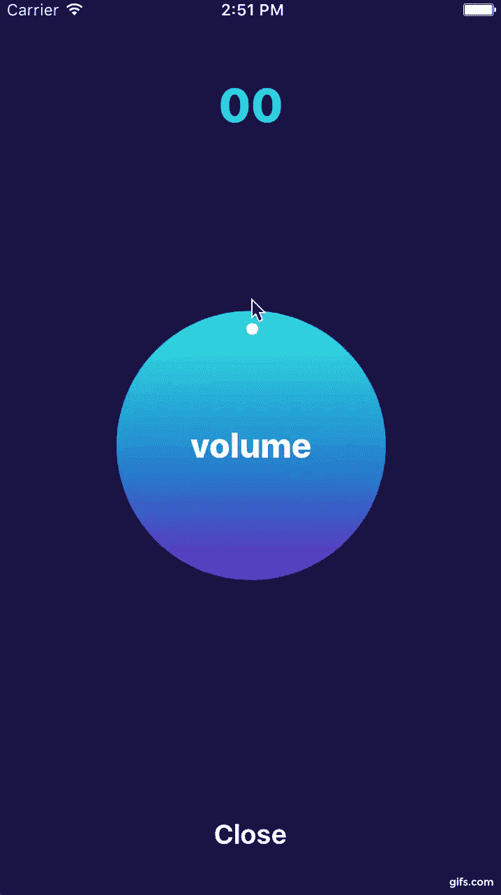
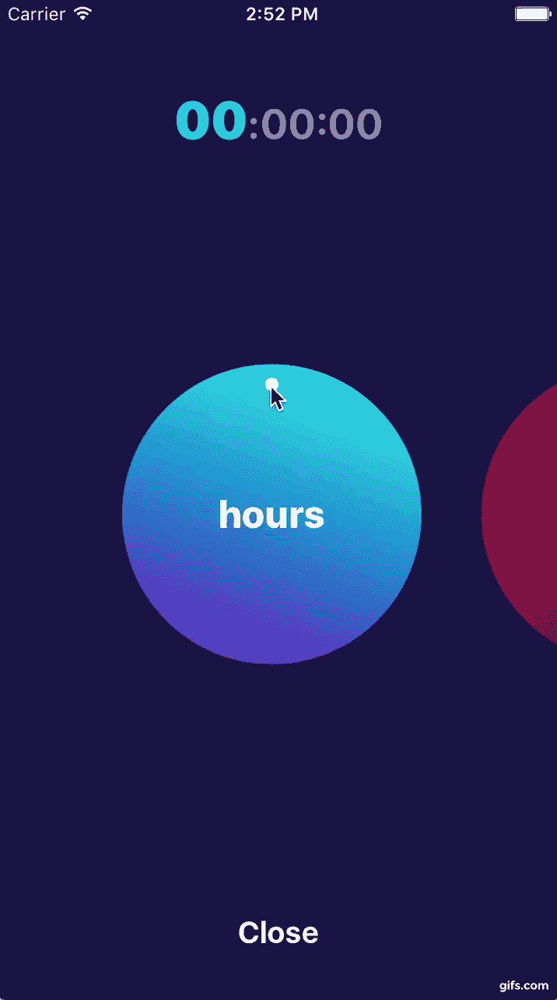
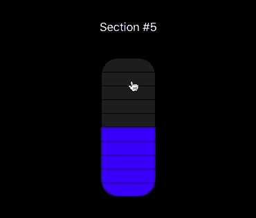
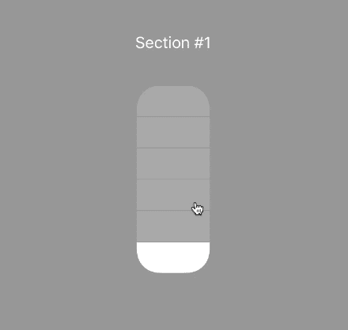
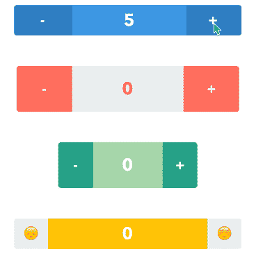
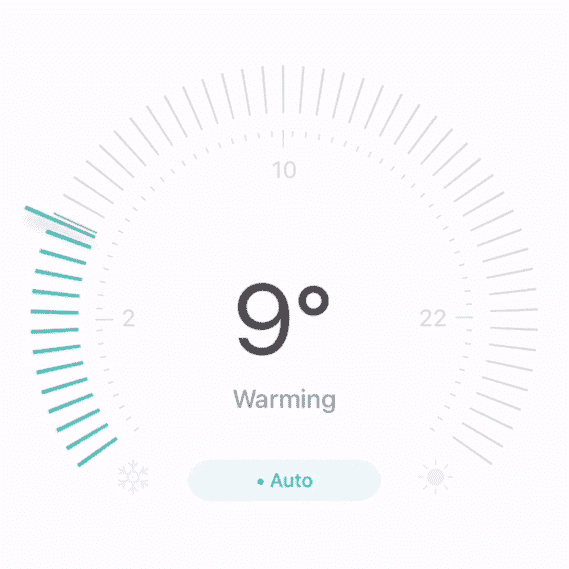

# 5 个 iOS 库来改进您的应用程序

> 原文：<https://betterprogramming.pub/5-ios-libraries-to-improve-your-app-d88ffa3cc676>

## 圆形视图滑块、选择器、体积状滑块、步进器等等


照片由 [Fabian Grohs](https://unsplash.com/@grohsfabian?utm_source=medium&utm_medium=referral) 在 [Unsplash](https://unsplash.com?utm_source=medium&utm_medium=referral) 上拍摄

# 1.hgcircularlslider



我们将从 hgcircularlslider**、**开始，这是一个用于 iOS 的自定义可重用圆形视图和滑块控件。

这个库有三个不同的类，每个类对应一个可用的模式:`CircularSlider`、`RangeCircularSlider`或`MidPointCircularSlider`。

更多细节可以在官方文档[这里](http://cocoadocs.org/docsets/HGCircularSlider/2.0.0/)找到。

[](https://github.com/HamzaGhazouani/HGCircularSlider) [## HamzaGhazouani/hgcircularlslider

### 要运行示例项目，首先克隆 repo，并从示例目录运行 pod install。Hg 占位符-很好…

github.com](https://github.com/HamzaGhazouani/HGCircularSlider) 

# 2.AGCircularPicker



AGCircularPicker 是一个轻量级的库，非常有助于创建一个可以用作循环选择器的控制器。

有许多定制可用，开发人员可以在视图中间更改颜色、渐变最小/最大值和标题。它可以从界面构建器中使用，也可以从代码中以编程方式使用。

该图书馆由三个主要群体组成:

*   `AGCircularPickerTitleOption`:定义标题、颜色和字体
*   `AGCircularPickerValueOption`:定义控制器的最小/最大值和数量
*   `AGCircularPickerColorOption`:定义渐变颜色、位置和角度

[](https://github.com/agilie/AGCircularPicker) [## agilie/AGCircularPicker

### 我们很高兴为您提供我们新的免费轻量级插件 AGCircularPicker。AGCircularPicker 有助于…

github.com](https://github.com/agilie/AGCircularPicker) 

# 3.SectionedSlider



[SectionedSlider](https://github.com/LeonardoCardoso/SectionedSlider) 是 Swift 制作的一个库，它创建了一个类似于 iOS 11 的音量滑块的滑块。

您可以从故事板中使用它，或者以如下方式在您的代码中以编程方式创建 UIView:

```
SectionedSlider(
    frame: CGRect(x: 0, y: 0, width: 55, height: 300),
    selectedSection: 5,
    sections: 10
)
```

还可以通过以下方式定制颜色，记住`viewBackgroundColor`是控件背景，`sliderBackgroundColor`是未选中部分的颜色，`sliderColor`是选中部分的颜色:

```
SectionedSlider(
    frame: wrapView.frame,
    selectedSection: 5,
    sections: 10,
    palette: Palette(
        viewBackgroundColor: UIColor?,
        sliderBackgroundColor: UIColor?,
        sliderColor: UIColor?
    )
)
```

[](https://github.com/LeonardoCardoso/SectionedSlider) [## Leonardo card oso/sectioned slider

### 控制中心滑块 CocoaPods 是 Cocoa 项目的依赖管理器。您可以用以下软件安装它…

github.com](https://github.com/LeonardoCardoso/SectionedSlider) 

# 4.GMStepper



[GMStepper](https://github.com/gmertk/GMStepper) 是一个漂亮的步进器，中间有一个滑动标签。为了使用它，您可以向左/向右平移标签或点击按钮。您可以通过故事板来实现它，只需将一个 UIView 放到您的故事板中，并将其类设置为`GMStepper`，或者以编程方式创建并初始化它。

许多可以自定义的参数包括:起始值、最小/最大值、步长值、左/右按钮文本、文本颜色、文本字体、背景颜色等等。

[](https://github.com/gmertk/GMStepper) [## gmertk/GMStepper

### 中间有滑动标签的步进器。平移标签或点击按钮。查看教程，如何建立一个…

github.com](https://github.com/gmertk/GMStepper) 

# 5.量规滑动器



最后， [GaugeSlider](https://github.com/edgar-zigis/GaugeSlider) 是一个库，用几行代码就可以创建一个可定制的标尺滑块，既可以编程使用，也可以与故事板一起使用。

在可定制的参数中，我们可以找到:左/右图标、最小/最大值、起始值、步进进度、动画样式、占位符文本、字体、文本颜色和线条颜色。

[](https://github.com/edgar-zigis/GaugeSlider) [## 埃德加-齐吉斯/高斯林德

### 高度可定制的 GaugeSlider 主要为智能家居应用程序设计。埃德加·齐吉斯/高斯林德

github.com](https://github.com/edgar-zigis/GaugeSlider) [](https://www.buymeacoffee.com/nicolidomenico)