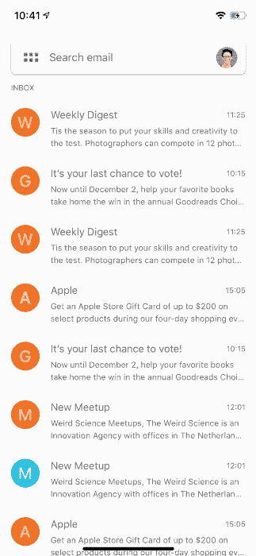
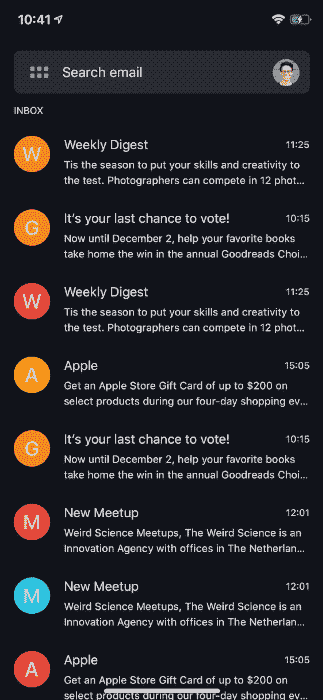
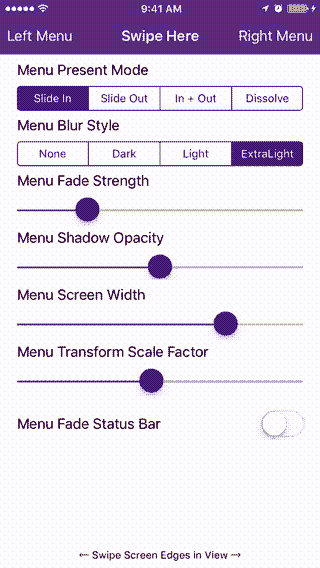
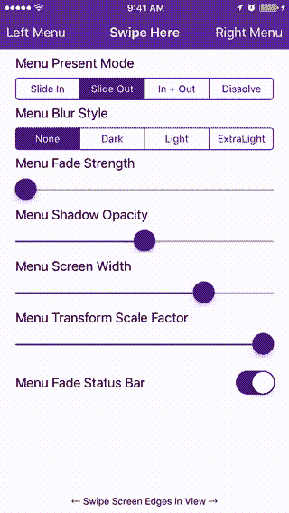
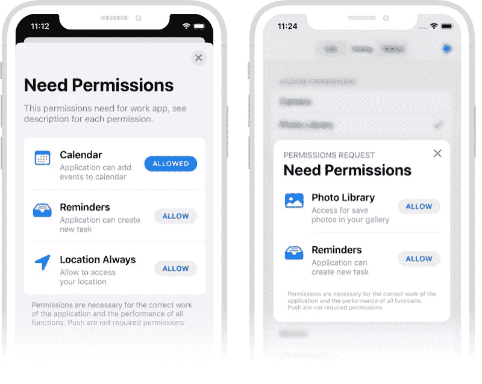

# 5 个 iOS 库来改善您项目的用户体验

> 原文：<https://betterprogramming.pub/5-ios-libraries-to-improve-your-projects-user-experience-c079fb81416f>

## 动态菜单、图像浏览器、侧边菜单等等

妮可·沃尔夫在 [Unsplash](https://unsplash.com?utm_source=medium&utm_medium=referral) 上的照片

# 1.格梅努

今天，我们将从 [*Gmenu*](https://github.com/amirdew/gmenu) 开始，这是一个在 Swift 5.1 中制作并使用 SwiftUI 实现的强大库。这是一个为 Gmail 应用程序重新设计的菜单，但可以很容易地实现到您的项目中使用它！

从顶部搜索栏中的一个按钮开始，这个库显示一个带有大图标的菜单，并向下滚动表格视图行。

 [## amirdew/gmenu

### 此时您不能执行该操作。您已使用另一个标签页或窗口登录。您已在另一个选项卡中注销，或者…

github.com](https://github.com/amirdew/gmenu) 

# 2.ImageViewer.swift

[image viewer . swift](https://github.com/michaelhenry/ImageViewer.swift)by[Michael Henry](https://github.com/michaelhenry)是一个易于使用的库，用于显示图库。

它支持黑暗模式、风景模式和拖动关闭手势。

 [## michaelhenry/ImageViewer.swift

### 一个易于使用的图像浏览器，灵感来自于脸书使用 cocoapods 最简单的方法是使用…

github.com](https://github.com/michaelhenry/ImageViewer.swift) 

# 3.侧菜单

[侧菜单](https://github.com/jonkykong/SideMenu)是一个具有高度可定制控件的侧菜单。它可以在故事板或编程中实现，并有八种不同的动画风格可用。

高度可定制，支持两侧侧菜单间的划动手势。

 [## jonkykong/侧面菜单

### SideMenu 需要你的帮助！如果你是一个熟练的 iOS 开发者，想帮助维护这个库并回答问题…

github.com](https://github.com/jonkykong/SideMenu) 

# 4.sp 权限

[SPPermissions](https://github.com/ivanvorobei/SPPermissions) 是一个 API，通过三个不同的选项询问用户权限:列表、对话框和本地。

以苹果风格创建的界面支持 iPhone、iPad、黑暗模式和 tvOS。支持的权限请求有:

*   照相机
*   照片库
*   通知
*   位置
*   麦克风
*   日历
*   联系人
*   提醒
*   移动
*   媒体
*   演讲
*   蓝牙

 [## ivanvorobei/sp 权限

### SPPermissions 是一个使用 Swift 请求用户权限的 API。API 提供了三个 UI 选项(列表、对话框和…

github.com](https://github.com/ivanvorobei/SPPermissions) 

# 5.SPStorkController

最后， [SPStorkController](https://github.com/ivanvorobei/SPStorkController) 是 Swift 制造的控制器，类似于 Apple Music、Mail 和 Podcast 应用程序。

它只是在导航栏的左边添加了一个关闭按钮，在中间添加了一个箭头。

 [## ivanvorobei/SPStorkController

### 苹果音乐、播客和邮件应用中的控制器。简单添加关闭按钮和居中箭头指示器…

github.com](https://github.com/ivanvorobei/SPStorkController) 

# 阅读更多

不要错过之前的版本！

*   [在你的下一个应用中使用的 5 个 iOS 库](https://medium.com/better-programming/5-ios-libraries-to-use-on-your-next-app-5510659afcdb)
*   [5 个 iOS 库让你的应用界面更好](/better-programming/5-ios-libraries-to-make-your-app-interface-better-fcbb2292e0e8)
*   [5 个 iOS 库让你的应用 UI 真正流行](/better-programming/5-ios-libraries-to-make-your-app-s-ui-really-pop-7037998772af)