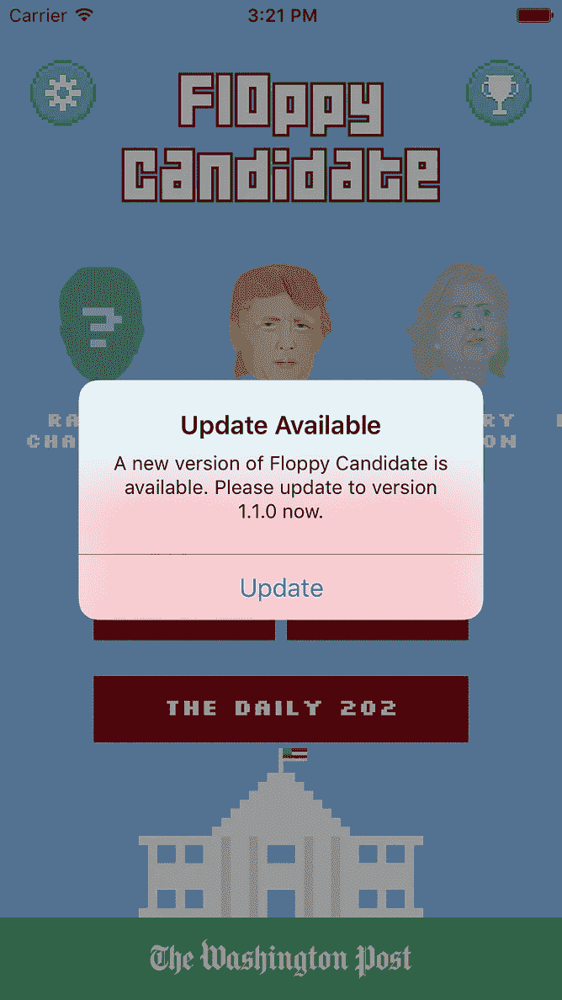
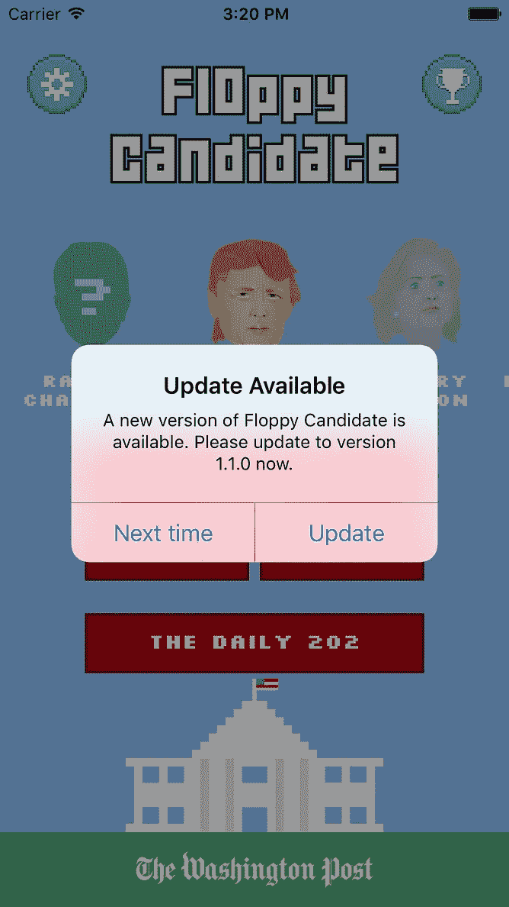
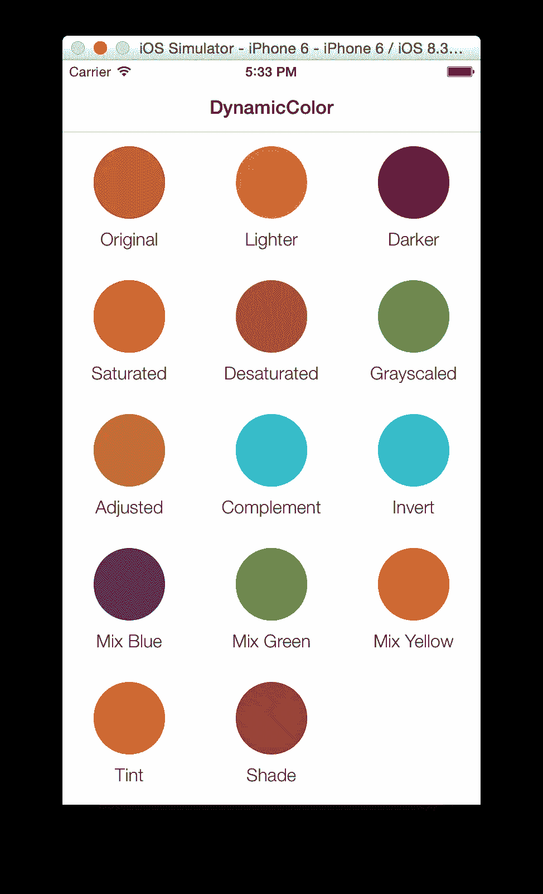
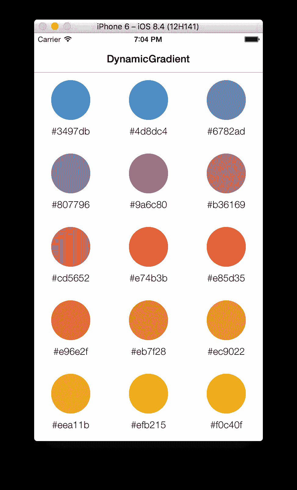
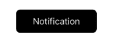
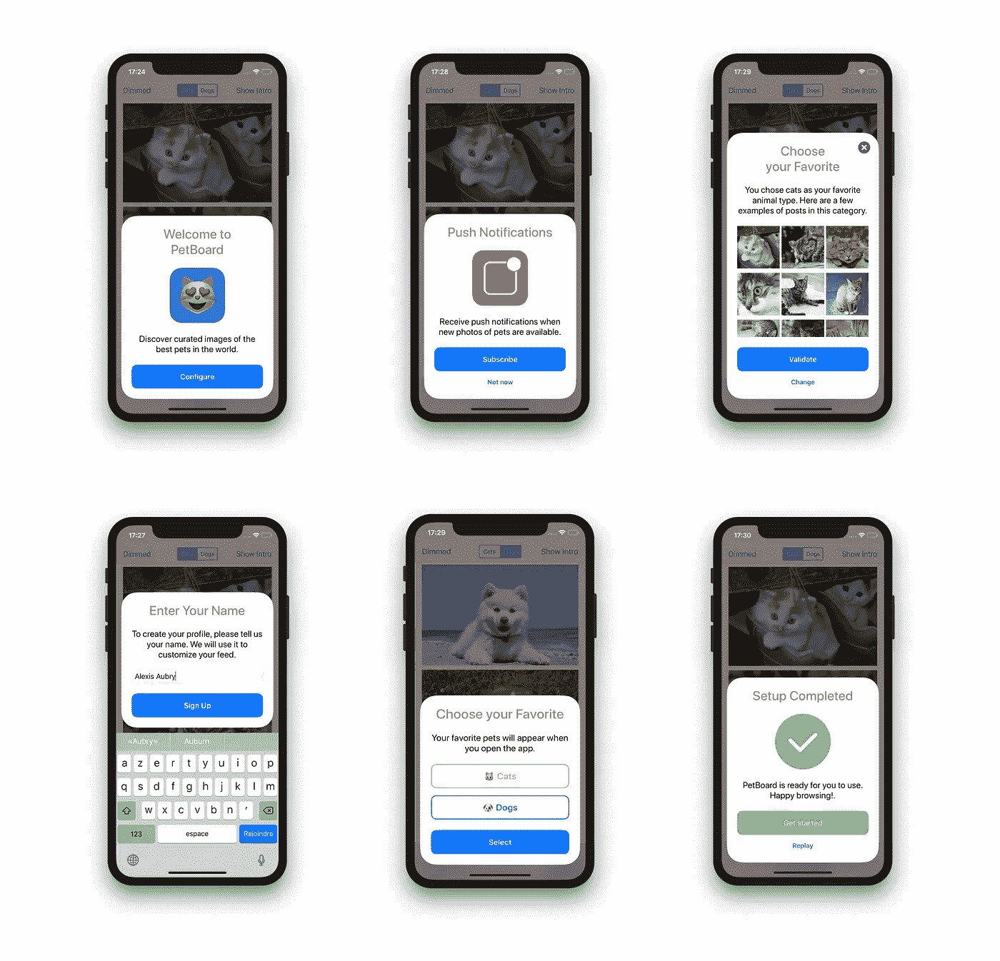

# 5 个 iOS 库，让你的应用更出色

> 原文：<https://betterprogramming.pub/5-ios-libraries-to-make-your-app-better-cfbafdc1c65b>

## 新版本通知，动态颜色，查看徽章图标，等等

照片由[赞力克](https://unsplash.com/@zanilic?utm_source=medium&utm_medium=referral)在 [Unsplash](https://unsplash.com?utm_source=medium&utm_medium=referral)

# 1.汽笛

Siren 是检查用户当前安装的应用程序版本的完美工具。如果 App Store 中有新版本，Siren 会显示一个语言本地化的警告来通知用户，让他们选择更新它。

主要特点:

*   强制用户更新应用程序
*   它为用户提供了更新应用程序或稍后更新的选项
*   它给了用户完全跳过当前更新的选项

 [## ArtSabintsev/警报器

### Siren 会将用户当前安装的 iOS 应用程序版本与当前可用的版本进行比较…

github.com](https://github.com/ArtSabintsev/Siren) 

# 2.动态颜色

这个库提供了许多功能强大的方法来轻松地使用和操作颜色。

首先，你需要从一个十六进制或 RGB 值开始创建一个新的颜色。颜色准备好之后，您可以:

*   变暗和变亮
*   饱和、去饱和和灰度
*   调整色调和补色
*   色调和阴影
*   转化的
*   混合
*   制作渐变

你可以在这里找到完整的文档[，里面有关于如何使用它的所有细节。](https://github.com/yannickl/DynamicColor/blob/master/README.md)

 [## yannickl/DynamicColor

### DynamicColor 提供了在 Swift 中以简单的方式操纵颜色的强大方法。要求*使用*…

github.com](https://github.com/yannickl/DynamicColor) 

# 3.BadgeHub

您可以使用这个小库在应用程序的任何视图上快速添加通知标记图像。

配置、使用、定制和动画真的很容易做，你只需要几行代码就能让它们工作。

 [## jogendra/BadgeHub

### 向任何视图快速添加通知徽章图标的方法。对于演示:要运行示例项目，克隆 repo，然后…

github.com](https://github.com/jogendra/BadgeHub) 

# 4.公告板

BulletinBoard 是一个 iOS 库，它创建了一个显示在屏幕底部的卡片视图。它支持像 VoiceOver 这样的辅助功能。它看起来也很适合入门屏幕或初始配置(我在我的一个应用程序上使用它就是因为这个原因)。

 [## alexaubry/公告板

### BulletinBoard 是一个 iOS 库，它生成并管理显示在屏幕底部的上下文卡片。它…

github.com](https://github.com/alexaubry/BulletinBoard) 

# 5.sp 权限

这个库允许你用最少的样式显示一个优雅的用户界面对话框，向用户请求不同的权限。

当前支持的权限有:

*   照相机
*   照片库
*   通知
*   位置
*   麦克风
*   日历
*   联系人
*   催单
*   移动
*   媒体库
*   演讲

 [## ivanvorobei/SPPermission

### 使用对话框请求权限。我做苹果风格的对话框界面。观看 timelaps 我是如何为这个 pod 设计 UI 的…

github.com](https://github.com/ivanvorobei/SPPermission) 

**感谢阅读！**