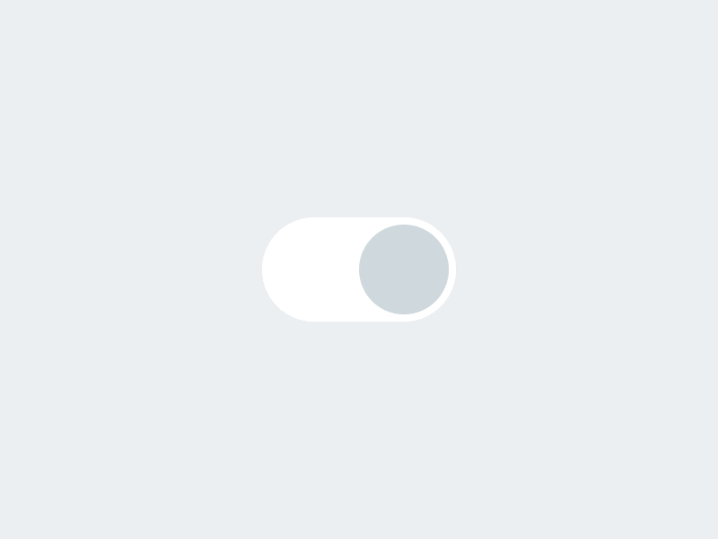
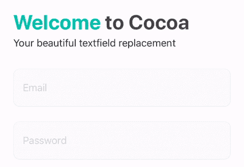
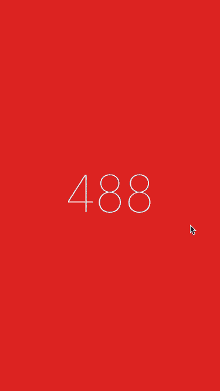
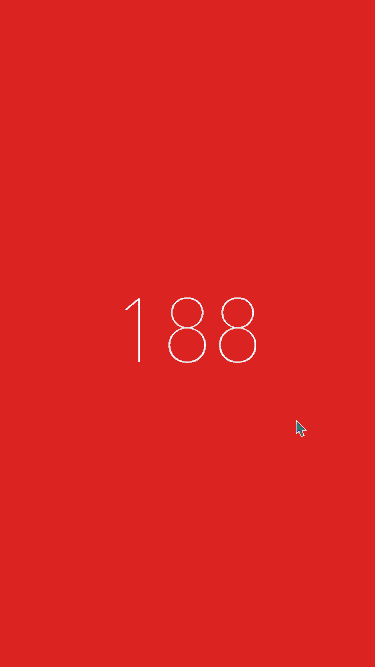

# 5 个 iOS 库让你的应用程序界面真正流行起来

> 原文：<https://betterprogramming.pub/5-ios-libraries-to-make-your-app-s-ui-really-pop-7037998772af>

## 动态开关，惊人的文本字段，不同的动画视图，等等！


照片由 [Raagesh C](https://unsplash.com/@raagesh?utm_source=medium&utm_medium=referral) 在 [Unsplash](https://unsplash.com?utm_source=medium&utm_medium=referral) 上拍摄

# 1.TKSwitcherCollection



今天，我们将从[**TKSwitcherCollection**](https://github.com/TBXark/TKSwitcherCollection)开始，这是一个动画开关控件的集合。

它真的很容易使用——你只需要下载并把`TKSwitcherCollection`放到你的项目中，你就准备好了！

目前，有四种不同的开关可供选择:

*   TKSimpleSwitch→iOS 上可用的传统开关，但在 vertical 上也可用。
*   TKExchangeSwitch →接触时改变形态的开关。
*   TKSmileSwitch →有两个值的开关:悲伤和快乐。
*   TKLiquidSwitch →带有液体风格动画的开关。

[](https://github.com/TBXark/TKSwitcherCollection) [## TBXark/TKSwitcherCollection

### 一个动画开关集合 CocoaPods 你可以使用 CocoaPods 来安装 TKSwitcherCollection，方法是把它添加到你的…

github.com](https://github.com/TBXark/TKSwitcherCollection) 

# 2.CocoaTextField



[**CocoaTextField**](https://github.com/edgar-zigis/CocoaTextField)是一个小型的、高度可定制的文本字段库，可以通过编程和故事板来使用。

当然，您可以自定义一些东西，比如非活动提示颜色、活动提示颜色、默认/聚焦背景颜色、边框颜色和错误颜色。

如果您想以编程方式使用它，下面是一个用法示例:

```
let v = CocoaTextField()
v.inactiveHintColor = UIColor(red: 145/255, green: 222/255, blue: 233/255, alpha: 1)
v.activeHintColor = UIColor(red: 777/255, green: 122/255, blue: 187/255, alpha: 1)
v.focusedBackgroundColor = UIColor(red: 200/255, green: 230/255, blue: 250/255, alpha: 1)
v.defaultBackgroundColor = UIColor(red: 250/255, green: 250/255, blue: 250/255, alpha: 1)
v.borderColor = UIColor(red: 239/255, green: 239/255, blue: 239/255, alpha: 1)
v.errorColor = UIColor(red: 231/255, green: 76/255, blue: 60/255, alpha: 0.7)
v.borderWidth = 3
v.cornerRadius = 14
```

[](https://github.com/edgar-zigis/CocoaTextField) [## 埃德加-齐吉斯/科科阿特克斯菲尔德

### 根据材料创建的高度可定制的文本字段。IO 指南。

github.com](https://github.com/edgar-zigis/CocoaTextField) 

# 3.扩大收藏


[**扩展集合**](https://github.com/Ramotion/expanding-collection) 是 Swift 中制作的库，创建动画材质设计 UI 卡 peek/pop 控制器。

为了使用这个库，您必须导入`expanding_collection`，然后创建一个继承自`BasePageCollectionCell`的 UICollectionViewCell。然后，添加前视图和后视图。

现在可以创建一个继承自`ExpandingViewController`的 UIViewController，注册第一步中创建的单元格，并添加 UICollectionViewDataSource。

关于实现的更多信息可以在下面的官方 Github 资源库中找到。

[](https://github.com/Ramotion/expanding-collection) [## 移动/扩展-收集

### octocat: ExpandingCollection 是一个动画材质设计 UI 卡 peek/pop 控制器。@Ramotion 做的 iOS 库…

github.com](https://github.com/Ramotion/expanding-collection) 

# 4.动画集合视图布局



`UICollectionView`当您在项目间滚动时，默认情况下没有过渡效果动画。

[**animatedcollectionview layout**](https://github.com/KelvinJin/AnimatedCollectionViewLayout)**是一个 UICollectionViewLayout 子类，可以在不影响现有代码的情况下为您的 UICollectionView 添加自定义过渡和动画！**

**要使用它，您需要将库导入到您的项目中。然后，您必须创建一个`AnimatedCollectionViewLayout`对象，设置它的`animator`，并将其分配给您的`UICollectionView`。**

**[](https://github.com/KelvinJin/AnimatedCollectionViewLayout) [## kelvin Jin/animatedcollectionview layout

### 通常，当您从一个项目滚动到另一个项目时，UICollectionView 没有过渡效果。有很多方法…

github.com](https://github.com/KelvinJin/AnimatedCollectionViewLayout)** 

# **5.集合视图倾斜布局**

****

**最后，[**collectionview slandedlayout**](https://github.com/yacir/CollectionViewSlantedLayout)**是 [UICollectionViewLayout](https://developer.apple.com/documentation/uikit/uicollectionviewlayout) 的另一个子类，它允许在 [UICollectionView](https://developer.apple.com/documentation/uikit/uicollectionview) 中显示倾斜的单元格。****

****该库适用于每个 UICollectionView，水平和垂直的动态单元格高度。****

****在可配置的东西中，我们发现:倾斜大小、倾斜方向、倾斜角度、滚动方向、行间距、项目大小，以及排除第一个或最后一个单元格倾斜的可能性。****

****[](https://github.com/yacir/CollectionViewSlantedLayout) [## yacir/collectionviewlandlayout

### CollectionViewSlantedLayout 是 UICollectionViewLayout 的一个子类，允许在一个…

github.com](https://github.com/yacir/CollectionViewSlantedLayout) [](https://www.buymeacoffee.com/nicolidomenico)****