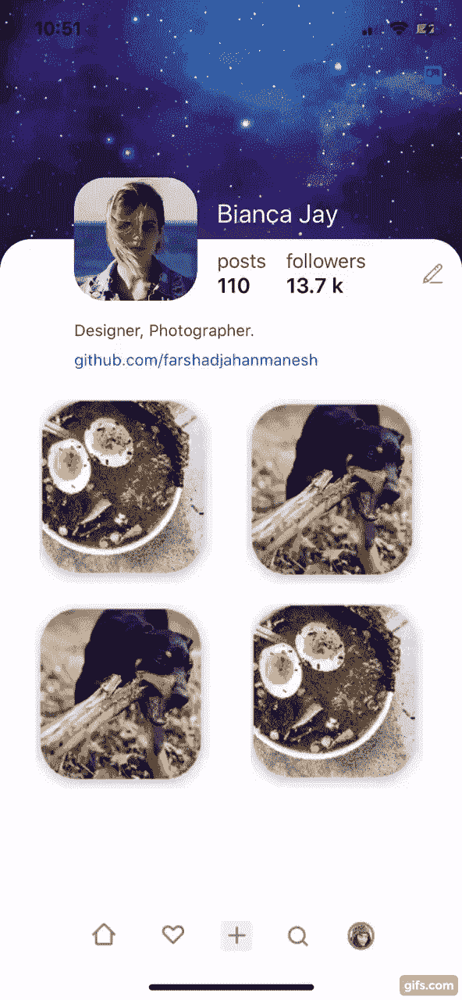
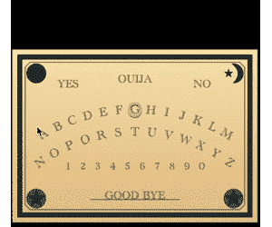
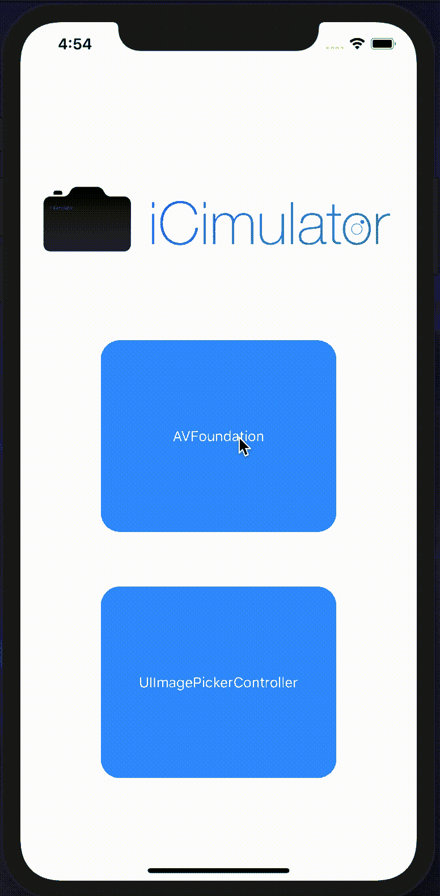
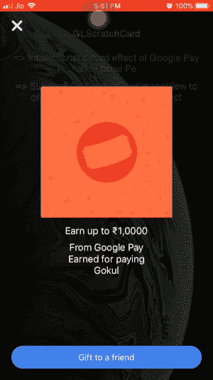

# 5 个 iOS 库让你的应用与众不同

> 原文：<https://betterprogramming.pub/5-ios-libraries-to-make-your-app-special-28516e6538b1>

## 在模拟器中使用相机、显示提示、动画标签栏等


照片由[布鲁斯·马斯](https://unsplash.com/@brucemars?utm_source=unsplash&utm_medium=referral&utm_content=creditCopyText)在 [Unsplash](https://unsplash.com/s/photos/app?utm_source=unsplash&utm_medium=referral&utm_content=creditCopyText) 拍摄

# 1.小费者



今天，我们从 [TipSee](https://github.com/farshadjahanmanesh/TipSee) 开始，这是一个轻量级的可定制库，它将帮助你在应用程序中显示提示。

这个库非常智能，在你选择视图后，它会根据可用空间和文本大小找到显示提示的最佳位置。您可以将它用于任何类型的视图，如按钮、图像，甚至是屏幕上的特定点。

[](https://github.com/farshadjahanmanesh/TipSee) [## farshadjahanmanesh/TipSee

### 我们可以在视图顶部或任何我们想要的地方显示交互式提示，但要找到放置气泡的最佳位置…

github.com](https://github.com/farshadjahanmanesh/TipSee) 

# 2.AMTabView


AMTabView 是一个自定义的标签栏，带有令人惊叹的 leap 动画。

你只需要创建一个继承自`AMTabsViewController`的新类，然后在`viewDidLoad`上，用你需要的所有视图设置标签的控制器。记住那些视图控制器需要实现`TabItem`协议。

最后，您还可以自定义球的颜色、标签栏的颜色和动画的持续时间。

[](https://github.com/Abedalkareem/AMTabView) [## Abedalkareem/AMTabView

### 要运行示例项目，首先克隆 repo，并从示例目录运行 pod install。AMTabView 是…

github.com](https://github.com/Abedalkareem/AMTabView) 

# 3.AMOuijaBoard



[AMOuijaBoard](https://github.com/adventam10/AMOuijaBoard) 是一个类似于占卜板的视图，您可以选择字母、数字、是/否和再见。

您只需要下面两行来创建它:

```
let boardView = AMOuijaBoardView(frame: view.bounds)
boardView.delegate = self
view.addSubview(boardView)
```

以下属性是可自定义的:

*   字体
*   文本颜色
*   标记颜色
*   边框线条颜色
*   星形圆圈颜色
*   棋盘开始颜色
*   纸板末端颜色
*   光标颜色

[](https://github.com/adventam10/AMOuijaBoard) [## adventam10/AMOuijaBoard

### AMOuijaBoard 是一个可以选择文本的视图。创建 boardView。(最小宽度:300，最大宽度:600，最小高度:212.16，最大…

github.com](https://github.com/adventam10/AMOuijaBoard) 

# 4.**模拟程序**



对于 iOS 开发者来说，最糟糕的事情之一就是摄像头测试。要创建这个测试，您需要一个物理设备。感谢这个图书馆将在这个过程中帮助我们！

[I Simulator](https://github.com/YuigaWada/iCimulator)**用图像、视频，甚至你的 MacBook 相机在 iOS 模拟器上模拟一个相机！**

**为了让它工作，你只需要做这五个步骤:**

1.  **安装`iCimulator`。**
2.  **将`iCimulator.swift`和`iCimulator.plist`复制到你的项目中。**
3.  **设置`iCimulator.plist`文件:图像/视频/Mac 摄像头。**
4.  **将`iCimulator.swift`和`iCimulator.plist`链接到您的项目。**
5.  **你准备好了！**

**[](https://github.com/YuigaWada/iCimulator) [## YuigaWada/I simulator

### I Simulator 允许我们在 iOS 模拟器上使用相机功能！2019-10-23:增加了一个新模式“Mac 相机模式”…

github.com](https://github.com/YuigaWada/iCimulator)** 

# **5.GLScratchCard**

****

**GLScratchCard 只用五行代码就再现了你在 Google Pay 等应用中看到的刮刮卡效果。**

**基本上，您需要实例化控制器:**

```
let controller = GLScratchCardController()
```

**在开始之前设置标题、副标题和完成按钮文本:**

```
controller.scratchCardView.doneButtonTitle = "Gift to a friend"
controller.scratchCardView.scratchCardTitle = "Earn up to ₹1,0000"
controller.scratchCardView.scratchCardSubTitle = "From Google Pay \nEarned for paying \nGokul"
```

**暂存后设置标题、副标题和完成按钮文本:**

```
controller.scratchCardView.afterScratchDoneButtonTitle = "Done"
controller.scratchCardView.afterScratchTitle = "Woohoo!"
controller.scratchCardView.afterScratchSubTitle = "Expect payment within a weak."
```

**设置图像:**

```
controller.scratchCardView.bottomLayerView = UIImageView(image: UIImage(named: "cash_back"))
controller.scratchCardView.topLayerImage = UIImage(named:"scratch_image")!
```

**添加代理，当图像被划或点击“完成”按钮时调用:**

```
controller.scratchCardView.addDelegate(delegate: self)
controller.scratchCardView.scratchCardImageView.addDelegate(delegate:self)
```

**最后，向用户展示控制器:**

```
controller.presentScratchController()
```

**[](https://github.com/gokulgovind/GLScratchCard) [## gokulgovind/GLScratchCard

### 要运行示例项目，首先克隆 repo，并从示例目录运行 pod install。GLScratchCard XCode…

github.com](https://github.com/gokulgovind/GLScratchCard) [](https://www.buymeacoffee.com/nicolidomenico)**