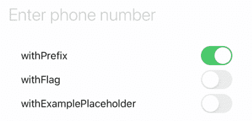
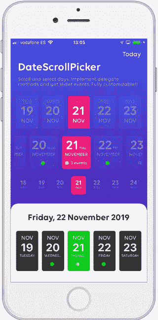

# 在你的下一个应用中使用的 5 个 iOS 库

> 原文：<https://betterprogramming.pub/5-ios-libraries-to-use-on-your-next-app-5510659afcdb>

## 电话号码解析器、日期选择器、邮政编码验证器等等


照片由[克里斯蒂娜@ wocintechchat.com](https://unsplash.com/@wocintechchat?utm_source=medium&utm_medium=referral)在 [Unsplash](https://unsplash.com?utm_source=medium&utm_medium=referral) 上拍摄

# 1.电话号码套件



今天，我们将从[**phone number kit**](https://github.com/marmelroy/PhoneNumberKit)开始，这是一个完全由 Swift 5.0 构建的轻量级 iOS 库，用于解析、格式化和验证国际电话号码。

它真的很容易使用——您只需要下面几行代码就可以让它工作:

```
import PhoneNumberKit
let phoneNumberKit = PhoneNumberKit()do {
    let phoneNumber = try phoneNumberKit.parse("+39 3 12 542644")
    let phoneNumberCustomDefaultRegion = try phoneNumberKit.parse("+39 23 2245 23442", withRegion: "IT", ignoreType: true)
}
catch {
    print("Generic parser error")
}
```

这个库还包括一个漂亮的`PhoneNumberTextField`，可以通过以下方式定制:

*   `withFlag`将显示`currentRegion`的国旗。该标志将显示在文本字段的左侧视图中。
*   `withExamplePlaceholder`将使用`attributedPlaceholder`来显示`currentRegion`的示例编号。

[](https://github.com/marmelroy/PhoneNumberKit) [## marmelroy/PhoneNumberKit

### 用于解析、格式化和验证国际电话号码的 Swift 5.0 框架。受谷歌的启发…

github.com](https://github.com/marmelroy/PhoneNumberKit) 

# 2.DateScrollPicker



[**DateScrollPicker**](https://github.com/alberdev/DateScrollPicker)**作者[阿尔伯德夫](https://github.com/alberdev)是一个完全可定制的日期视图，具有用 Swift 5 编写的 Picker 特性。**

**这个日历有一个无限日期单元格和动画选择的集合，您可以用自己的字体和颜色进行自定义。**

**例如，您可以轻松定制显示的天数、标注日期格式、更改字体、更改颜色以及调整许多其他参数。**

**[](https://github.com/alberdev/DateScrollPicker) [## alberdev/DateScrollPicker

### 您可以将 DateScrollPicker 用作带有滚动日期视图的日历。此集合有无限个日期单元格，包含…

github.com](https://github.com/alberdev/DateScrollPicker)** 

# **3.后真空验证器**

****

**照片由[塔里克·伊斯梅尔](https://unsplash.com/@tareqismail?utm_source=medium&utm_medium=referral)在 [Unsplash](https://unsplash.com?utm_source=medium&utm_medium=referral) 上拍摄**

**[**postal code validator**](https://github.com/FormatterKit/PostalCodeValidator)**是一个支持 200 多个地区的邮政编码验证器。****

****您只需要几行代码就可以让它工作:****

```
**import Foundation
import PostalCodeValidator

if let validator = PostalCodeValidator(locale: .current) { // United States (IT)
    validator.validate(postalCode: "43100")) // true

    validator.validate(postalCode: "123456789")) // false
}**
```

 ****[## 格式化工具包/后期验证器

### 一个支持 200 多个地区的邮政编码验证器。注意:只有区域设置的地区用于确定…

github.com](https://github.com/FormatterKit/PostalCodeValidator)**** 

# ****4.液体刷****

********

****[**liquid-swipe**](https://github.com/Cuberto/liquid-swipe) 是一个易于使用的滑动容器控件，您可以在您的应用程序中使用，例如，用于首次跑步教程或入职培训。****

****要使用它，您需要从故事板或代码中实例化`LiquidSwipeContainerController`类，然后设置一个符合`LiquidSwipeContainerDataSource`类的数据源。****

****[](https://github.com/Cuberto/liquid-swipe) [## cuberto/液体擦拭

### Cuberto 是一家领先的数字机构，拥有扎实的设计和开发专业知识。我们为…打造移动和网络产品

github.com](https://github.com/Cuberto/liquid-swipe)**** 

# ****5.浮动面板****

****************

****最后，[**floating panel**](https://github.com/SCENEE/FloatingPanel)是一个干净轻便的 iOS 应用浮动面板 UI，就像苹果地图一样。****

****该库提供了许多可以自定义的设计属性，例如，抓取手柄、抓取手柄的布局、内容填充以及表面边缘和手势的边距。还可以为详图创建附加的浮动面板。****

****有关如何实现它的更多信息，请查看官方自述文件[这里](https://github.com/SCENEE/FloatingPanel#usage)。****

****[](https://github.com/SCENEE/FloatingPanel) [## 场景/浮动面板

### FloatingPanel 是一个简单易用的 UI 组件，用于苹果地图、快捷方式和…

github.com](https://github.com/SCENEE/FloatingPanel)**** ****[](https://www.buymeacoffee.com/nicolidomenico)****

# ****阅读更多****

****不要错过之前的版本！****

*   ****[“5 个 iOS 库让你的应用界面更好](https://medium.com/better-programming/5-ios-libraries-to-make-your-app-interface-better-fcbb2292e0e8)”****
*   ****[“5 个 iOS 库让你的应用 UI 真正流行](/better-programming/5-ios-libraries-to-make-your-app-s-ui-really-pop-7037998772af)”****
*   ****[“5 个 iOS 库提升你的 App](/better-programming/5-ios-libraries-to-improve-your-app-d88ffa3cc676) ”****