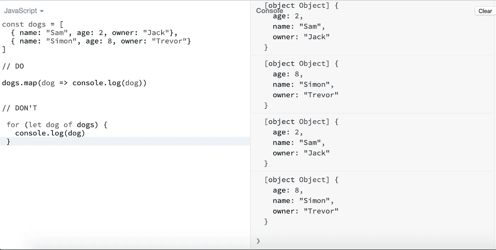

# 让你成为更好的程序员的 5 个 JavaScript 技巧

> 原文：<https://betterprogramming.pub/5-javascript-tips-to-make-you-a-better-coder-f5de38cf782b>

## 使用这些代码提示让您的 JavaScript 更具可读性

[Artem Sapegin](https://unsplash.com/@sapegin?utm_source=medium&utm_medium=referral) 在 [Unsplash](https://unsplash.com?utm_source=medium&utm_medium=referral) 上拍照

伟大的程序员为人类写代码，而不是为计算机。一个很好的经验法则是遵循它来对待你的代码库，就好像下一个接手项目的人是一个知道你住在哪里的疯子。如果这是真的，你肯定会想一丝不苟地保持简洁，写出高质量的代码。

有很多方法可以优化我们的 JavaScript 代码。这篇文章将揭示常见的陷阱，以及如何通过编写更容易理解的代码来避免它们。

以下是编写更好的 JavaScript 的五个技巧。不要全信，因为观点可能会有所不同，但是这些是团队普遍认同的最佳实践。

# 1.使用。地图或者。forEach 而不是 for 循环

每个复杂的应用程序都需要大量的数据集循环，通常是数组或对象。有了循环，代码很快变得不可读，难以理解。

例如，看看下面的代码，告诉我你更喜欢哪一个。

在数组上循环

上面的代码遍历数字数组，并将每个数字打印到控制台。

但是如果我们有更复杂的数组，比如对象数组呢？使用`map`、`filter`、`reduce`进行迭代。

最后，这是打印到控制台的内容。结果是一样的，但是使用函数式编程方法，代码要干净得多。

在数组上循环

使用`for`循环的唯一例外是当我们迭代对象时。这是因为`forEach`、`map`、`reduce`和`filter`是我们只能对数组调用的方法。

错误:" TypeError: dogs.map 不是函数"

在对象循环的情况下，我们可以使用`for...in`循环。

在循环中用**循环狗**

迭代对象的更好方法是使用以下方法:

*   `Object.keys` —返回给定对象自己的可枚举属性**名称**的数组，按照与普通循环相同的顺序迭代
*   `Object.values` —返回给定对象自己的可枚举属性**值**的数组，顺序与`for...in`循环提供的顺序相同
*   `Object.entries` —返回给定对象的**自己的可枚举字符串键属性** `[key, value]`对的数组，顺序与`for...in`循环提供的顺序相同。

上述方法从对象中获取键或值，将它们放入一个数组中，并返回该数组作为结果。

将 dogs 对象转换为包含 Object.values()的数组

现在我们有了一个数组，我们可以迭代这些值，用`map`或`forEach`来获取这些值。

这里有几种不同的方法来迭代不同目标的对象。

遍历对象的多种方式

# 2.默认情况下使用常量

`const`和`let`的区别很简单。`const`是不可变的，而`let`允许我们重新分配变量。

let vs. const

默认情况下使用`const`，认知负荷会减少，因为我们不需要追逐和猜测每个变量代表什么。每当我们改变变量时就使用`let`。

以下面的例子为例。我们可能会更早地宣布我们的名字，并多次改变它。我们可能会遇到一些使用`const`可以避免的意外错误。

变异变量

支持默认使用`const`的理由如下:

*   它避免了由非自愿重新分配引起的副作用。
*   它提供了更好的开发者体验，因为它消除了不确定性。看到`const`变量的开发人员可以相信它不会被重新分配。
*   `const`更符合函数式编程和不可变状态。

# 3.避免嵌套闭包

理解 JavaScript 中的闭包是最重要的。我们每天都在使用闭包。花点时间找出下面代码中的闭包。

将所有名称格式化为小写

你找到结尾了吗？这里有一个提示:闭包位于第 4 行。记住，闭包从外部函数捕获变量。

现在我们已经确定了闭包是什么，问题是我们如何改进代码。这是一段相对简单的代码，它将数组中的所有名称格式化为小写。

提示:避免嵌套闭包。

这里有一个避免嵌套闭包的简单例子。

避免嵌套闭包

注意我们把闭包放在了一个函数表达式中。这样我们的代码更容易理解和推理。以下面的代码为例。

计算平均分数

上面的代码遍历对象数组，然后将分数和舍入值相加得到一个整数。虽然这是可以理解的，但我们仍然可以改进代码。总有改进的空间。

下面是如何通过简单地将分数求和逻辑提取到它自己的函数表达式中来改进代码。

如果你想更深入地了解为什么避免嵌套闭包是一个好主意，请阅读 Kent C. Dodds 的文章。

# 4.避免嵌套的 if

嵌套语句是迄今为止最大的代码味道。嵌套 if 语句很容易导致不可维护的代码库。帮你自己和你的团队一个忙，避免嵌套`if`语句。

当通过嵌套`if`语句来检查条件时，这是一种幼稚的方法。

嵌套的 if 语句

花一点时间想想如何改进这段代码。这是我想到的。

避免嵌套的 if 语句

我们从七行代码减少到三行。这是一个巨大的进步。因为这三个条件都必须被评估为`true`，所以我们可以使用`&&`操作符。`&&`代表`and`。另一种选择是使用双管操作器`||`，代表`or`。`&&`和`||`的区别在于所有的`&&`条件都必须满足，而`||`只需要满足一个条件就可以执行`if`语句。

使用管道 **||** 运算符

# 5.用变量代替复杂的 if 子句；

可能有一段时间，我们会发现自己处于有多个复杂的`if`语句的情况下。看一看下面的详细代码。

详细的 if 语句

这种代码产生的认知负荷很大。我强烈提倡尽可能最好的开发者体验。你会如何改进代码？这是我想到的。

通过将比较放在单独的变量中，代码更容易理解和推理。这需要额外的几秒钟，但是通过在整个代码库中利用最佳实践，从长远来看，我们提高了开发人员的生产力。

# 结论

感谢阅读，希望这篇文章对你有用。把你的代码当成艺术。你要尽可能清晰地表达自己——不要给误解留下空间。

了解我最新内容的最好方式是通过我的[简讯](https://wholesomedev.substack.com/welcome)。成为第一个得到通知的人。

我的[简讯](https://wholesomedev.substack.com/welcome)。成为第一个得到通知的人。