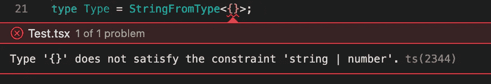

# 5 种 JavaScript 实用程序类型——以及如何创建自己的实用程序

> 原文：<https://betterprogramming.pub/5-javascript-utility-types-and-how-to-create-your-own-39e6bcd5a3bd>

## 高级打字稿:从零到英雄


由[劳塔罗·安德烈亚尼](https://unsplash.com/@lautaroandreani?utm_source=medium&utm_medium=referral)在 [Unsplash](https://unsplash.com?utm_source=medium&utm_medium=referral) 上拍摄

TypeScript 有一堆有用的[实用程序类型](https://www.typescriptlang.org/docs/handbook/utility-types.html)。但是你知道如何自己创造它们吗？我相信如果您重新创建了它们中的每一个，您将会非常了解高级 TypeScript 特性。如果这仍然是一个问题，你有空间来提高你的技能。

*我鼓励你遵循内置的实用程序类型列表，并尝试自己重新创建它们。它有助于揭示您的 TypeScript 知识中的一些空白，并且涵盖了所有高级 TypeScript 功能。*

让我们讨论一下我将如何推荐阅读这篇文章以获得更多的好处。首先，我将提供一些关于特定 TypeScript 特性的基础知识，然后，提供一些我们需要自己实现的实用程序类型的相关示例。在你看答案之前，花些时间去实现它。

这里的主要目的是提供允许我们从头开始重新实现每个实用程序类型所需的所有必要信息。

在我们走得太远之前，本文假设您已经了解了泛型。如果你对它感到不舒服，不要担心，你可以看看[这篇文章](https://javascript.plainenglish.io/typescript-generics-explained-with-practical-examples-ff9865bc8f4a)。

# 1.映射类型

映射类型建立在用于声明属性类型的索引签名的语法之上。假设我们需要为一个只包含布尔属性的对象创建一个类型，您可以在下面的示例中看到这一点:

```
type OnlyBooleanProperties = {
   [Key: string]: boolean
}
```

索引签名类型经常与关键字`keyof`和`in` 一起使用。假设我们有一个对象，我们想创建一个具有相同属性的新对象，但是每个属性都包含布尔类型的值，如下所示:

```
type OptionsFlags<Type> = {
   [Key in keyof Type]: boolean
}
```

在这个例子中，`OptionsFlags`将从类型`Type`中获取所有属性，并将它们的值改为布尔值。

## 示例 1

我们来看看实用类型`Record<Keys, Type>`(链接[此处](https://www.typescriptlang.org/docs/handbook/utility-types.html#recordkeys-type))。它构建了一个对象类型，其属性键为`Keys`，属性值为`Type`。如果没有这样的效用，我们怎么自己创造呢？你已经获得了如何完成它的必要知识，因此，花些时间自己完成它。之后，查看下面的答案:

```
type Record<Keys extends keyof any, Type> = {
   [Key in Keys]: Type
}
```

## 示例 2

我们来看看实用类型`Pick<Type, Keys>`(链接[此处](https://www.typescriptlang.org/docs/handbook/utility-types.html#picktype-keys))。它通过从`Type`中选取一组属性`Keys`来构建一个类型。代码如下:

```
type Pick<Type, Keys extends keyof Type> = {
   [Key in Keys]: Type[Key]
}
```

# 2.映射类型的映射修饰符

在映射期间可以应用两个额外的修饰符:`readonly`和`?`，它们分别影响可变性和可选性。

为了看到这一点，让我们看看`Partial<Type>`(链接[此处](https://www.typescriptlang.org/docs/handbook/utility-types.html#partialtype))。它构建了一个类型，将`Type`的所有属性设置为可选，如下所示:

```
type Partial<Type> = {
   [Key in keyof Type]?: Type[Key];
};
```

您可以通过添加前缀`-`来删除修饰符`readonly`和`?`。

这是另一个例子。它使用`Required<Type>`(链接[这里是](https://www.typescriptlang.org/docs/handbook/utility-types.html#requiredtype))并构建一个由设置为 required 的`Type`的所有属性组成的类型。代码如下:

```
type Required<Type> = {
   [Key in keyof Type]-?:Type[Key]
}
```

## 示例 3

在前面的例子中，我们用一个`?`修饰符涵盖了所有的实用程序类型。为了得到更多的练习，你需要实现`Readonly<Type>`来使用一个`readonly`修饰符(链接[在这里](https://www.typescriptlang.org/docs/handbook/utility-types.html#readonlytype))。它构造一个类型，将`Type`的所有属性设置为`readonly`。

```
type Readonly<Type> = {
   readonly [K in keyof Type]: Type[K]
}
```

# 3.条件类型和从不类型

我们都知道 JS 代码中的三元条件，事实证明我们可以使用相同的语法来定义类型。这里的主要区别是，我们将使用带有关键字`extends`的表达式来表示条件部分的 TS 三元组。这个条件看起来像`T extend K`。代码如下:

```
SomeType extends OtherType ? TrueType : FalseType;
```

当`extends`左边的类型被赋值给右边的类型时，你将得到第一个分支中的类型(“真”分支)；否则，您将获得后一个分支中的类型(“假”分支)。举个例子，

```
10 extends number ? 'YES' : 'NO'
    => 'YES'  // since 10 extends number === true10 extends string ? 'YES' : 'NO'
    => 'NO'   // since 10 extends string === false
```

让我们来看另一个例子:

```
type StringFromType<T> = T extends string ? 'string' : never;type Type1 = StringFromType<"text">;  // string
type Type2 = StringFromType<10>;      // never
```

这里需要给一些关于`never`型的话。它的字面意思是“没有价值”，它被视为空集`∅`。通常，`never`用于逻辑上不应该发生的情况和控制流。你会经常看到它被用作一个死胡同类型，就像上面的例子。

另外，我想强调一下`never`在一个像`string | never`这样的联合类型中的行为，因为`never`意味着一个空集(`∅`)。因此任何集合与空集的[并集](https://www.thoughtco.com/what-is-the-union-3126595)就是我们开始的集合— `*X* U ∅ = *X*` *。*它的意思如下:

```
string | never     => string;
number | never     => number;
<AnyType> | never  => AnyType;
```

我们还可以像在 JavaScript 中嵌套三元运算符一样链接更多的条件，如下所示:

```
type StringFromType<T> = 
    T extends string
       ? 'string'
       : T extends number
          ? 'number'
          : never;type Type1 = StringFromType<"text">;  // string
type Type2 = StringFromType<10>;      // number
type Type3 = StringFromType<{}>;      // never
```

在大多数情况下，你不会喜欢到达一个死胡同类型`never`。实际上，最好使用`extend`关键字对泛型`T`进行约束，并仅列出允许的类型，如下所示:

```
type StringFromType<T extends string | number> = 
    T extends string
       ? 'string'
       : T extends number
          ? 'number'
          : never;
```

在这种情况下，TypeScript 甚至不允许您将该类型与除`number`或`string`之外的类型一起使用，因此，没有办法到达`never`。它看起来像下面这样:



# 4.分配条件类型

在将联合作为约束进行扩展的情况下，TypeScript 将对联合的每个成员进行循环，并返回自己的联合。这是什么意思？假设我们有以下条件类型:

```
type NonNullable<Type> 
     =  Type extends null | undefined ? never : Type;
```

如果我们传递一个泛型类型而不是具有以下形状的联合类型，TypeScript 如何计算它`string | null | undefined`。如上所述，它在每个成员上循环，可以这样重写:

```
type ReturnedType = NonNullable<string | null | undefined>
     =   (string extends null | undefined ? never : string)
       | (null extends null | undefined ? never : null)
       | (undefined extends null | undefined ? never : undefine)
     = string | never | never
     = string
```

顺便说一下，我们已经实现了另一个内置的`NonNullable<Type>`(链接[这里](https://www.typescriptlang.org/docs/handbook/utility-types.html#nonnullabletype))并且我们已经知道它是如何工作的。恭喜你。

## 实例 4

我们来看看实用类型`Exclude<UnionType, ExcludedMembers>`(链接[此处](https://www.typescriptlang.org/docs/handbook/utility-types.html#excludeuniontype-excludedmembers))。它通过从所有可分配给`ExcludedMembers`的工会成员中排除`UnionType`来创建一个新类型。

```
type Exclude<UnionType, ExcludedMembers> 
     = UnionType extends ExcludedMembers ? never : UnionType
```

老实说，对我来说，这并不容易理解。因此，让我们像 TypeScript transpiler 那样遍历每个联合类型成员，并为每个成员计算一个条件。

```
type NewType = Exclude<'a' | 'b' | 'c', 'a'>
    =    ('a' extends 'a' ? never : 'a')
       | ('b' extends 'a' ? never : 'b')
       | ('c' extends 'a' ? never : 'c')
    = never | 'b' | 'c' 
    = 'b' | 'c'
```

## 实例 5

哇，如果例子 4 对你来说很清楚，我相信你会整理出下一个实用程序类型:`Extract<UnionType, ExtractedMembers>`(链接[此处](https://www.typescriptlang.org/docs/handbook/utility-types.html#extracttype-union))。它通过从`UnionType`中提取所有可分配给`ExtractedMembers`的联合成员来创建一个类型。

```
type Extract<UnionType, ExtractedMembers>
     = UnionType extends ExcludedMembers ? UnionType: never
```

我们只是在三元运算中交换了左右操作数。让我们根据这个例子来考虑一下 TypeScript transpiler 在钩子下是如何工作的:

```
type NewType = Extract<'a' | 'b' | 'c', 'a' | 'c'>
    =    ('a' extends 'a' | 'c' ? 'a' : never)
       | ('b' extends 'a' | 'c' ? 'b' : never)
       | ('c' extends 'a' | 'c' ? 'c' : never)
    = 'a' | never | 'c'
    = 'a' | 'c'
```

## 实例 6

这个例子与分布式条件类型主题无关，但是它建立在我们已经实现的`Exclude<UnionType, ExcludedMember>`类型之上(例子 4)。这是一个回忆的绝佳机会。嗯，它是`Omit<Type, OmittedKeys>`(链接[这里是](https://www.typescriptlang.org/docs/handbook/utility-types.html#omittype-keys))，它通过从`Type`中选取所有属性，然后移除`OmittedKeys`来创建一个类型。

```
type Omit<Type, OmmitedKeys extends keyof Type> = {
   [Key in Exclude<keyof Type, OmmitedKeys>]: Type[Key]
}
```

我希望它做得很好，并且我们没有忘记我们在第一部分中讨论的映射类型主题。

# 5.条件类型推理

条件类型最有趣的部分可能是，我们可以从条件语句的一部分中推断出新的类型，该语句可能会在“真”或“假”分支中的条件类型中使用。不要害怕；这听起来很吓人，直到我们没有看到一个特定的例子。所以让我们来看一个:

```
type IdType<T> = T extends { id: infer ID} ? ID: never;
```

在这个例子中，我们从类型`T`的`id`字段中推断出类型`ID`。如果`T`有`id`属性，TypeScript 推断该属性的类型为`ID`，我们可以在“真”或“假”分支中使用它。

## 例 7

我们来看一下`ReturnType<Type>`(链接[这里是](https://www.typescriptlang.org/docs/handbook/utility-types.html#returntypetype))构造一个由函数的返回类型组成的类型。

```
type ReturnType<T extends (...args: any) => any> 
     = T extends (...args: any) => infer R ? R : any;
```

## 实施例 8

它不包含在 TypeScript 实用程序类型中，但有时它可能非常方便，特别是当您试图从 3d party 库中扩展任何不扩展属性类型的 React 组件时。

在大多数情况下，我们坚持使用函数式方法，React 组件被表示为一个函数，其中第一个参数是组件 props。我们需要推断出一种类型的`Component` 道具。

```
const Component = (props: { prop1: string }) => null;// should extract type of props: {prop1: string}
type T0 = ComponentProps<typeof Component>
```

花一些时间自己实现它，但是方法类似于示例 7 中的方法。

```
type ComponentProps<T extends (arg: any) => any> 
    = T extends (arg: infer Props) => any ? Props : never;
```

与示例 7 的不同之处在于我们在函数声明中推断类型的地方。顺便说一句，这个类型已经在`react`中实现了，名称相同，但是他们的类型考虑到了函数和类`Components`。代码如下:

```
import { ComponentType } from 'react'
```

感谢阅读！

我希望你喜欢阅读这篇文章。