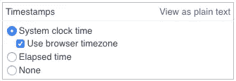
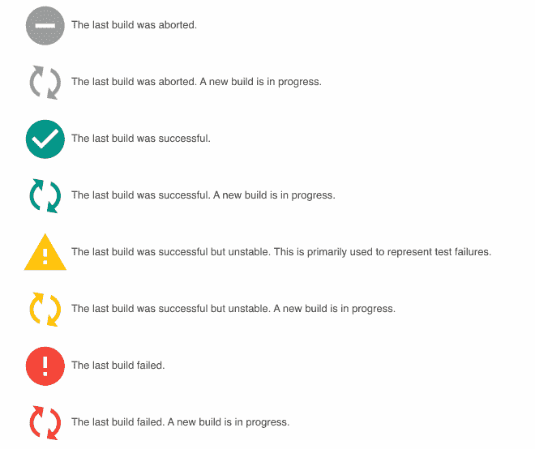
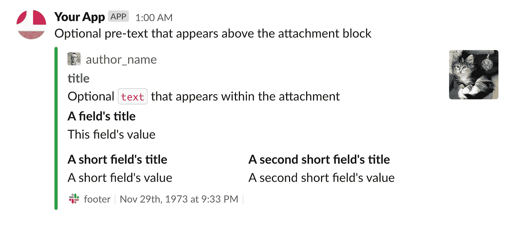

# 你应该使用的 5 个 Jenkins 插件

> 原文：<https://betterprogramming.pub/5-jenkins-plugins-you-should-use-867e39fbf532>

## 为你的 CI/CD 生活提供物质享受

[鬼鬼祟祟的肘子](https://unsplash.com/@sneakyelbow?utm_source=unsplash&utm_medium=referral&utm_content=creditCopyText)在 [Unsplash](https://unsplash.com/s/photos/plug?utm_source=unsplash&utm_medium=referral&utm_content=creditCopyText) 上拍照。

如果您正在开发任何现代应用程序，很可能会使用某种形式的 CI/CD。最受欢迎的可用平台之一是 [Jenkins](https://jenkins.io/) 。Jenkins 具有很大的灵活性，相对容易设置和使用，最重要的是，它完全免费。

像 Jenkins 这样的开源应用程序如此灵活的一个缺点是，它们没有人们期望的开箱即用的所有功能。詹金斯从一些小调整中受益匪浅，使事情变得更加友好。

在家庭和专业使用 Jenkins 多年后，我列出了一些我最喜欢的插件和配置。大多数都是简单的插件安装，但是它们极大地提高了效率和美观性。让我们看一看。

# 打开时间戳

首先，我们有一个超级简单的调整来帮助故障排除和性能测试。如果没有任何时间戳来显示每个操作花了多长时间，查看控制台会很痛苦。

用这个简单的插件打开时间戳可以让你更快地识别缓慢的操作。您还可以调整时间戳在已完成作业中的动态显示方式。这意味着即使在工作完成后，他们也会在控制台内部进行更新。

控制台页面上的时间戳插件设置。

# 打开彩色控制台输出

这是另一个极其简单的调整。颜色！使用 [AnsiColor 插件](https://plugins.jenkins.io/ansicolor/)，你将能够轻松配置不同的控制台颜色图。使用这样的颜色插件使得阅读大量的控制台调试输出更加容易。

您需要在日志记录上花费一些时间，以确保它根据严重性以不同的颜色输出，但是这是一种“设置一次就完成”的事情。如果你已经在使用一个向控制台输出彩色文本的程序，那么你应该准备好使用`xterm`彩色地图了。

# 调整主题

我不知道你是怎么想的，但是我已经厌倦了看着詹金斯那单调、陈旧的主题。幸运的是，你可以用简单的主题插件很容易地改变主题，将事物带入现代。一旦安装完毕，你所要做的就是提供一个你想要使用的主题的 URL。

个人推荐[阿丰索](https://github.com/afonsof)的[詹金斯素材主题](http://afonsof.com/jenkins-material-theme/)。这个主题是轻、平、现代的。如果你以前使用过任何其他类似材料的主题，你会有宾至如归的感觉。以下是一些图标的示例:

啊。这样不是更好吗？

# 与松弛时间集成

如果 Jenkins 可以在您的构建完成时通知您，这不是很好吗？可以的！

安装[松弛通知插件](https://plugins.jenkins.io/slack/)，你将可以使用各种配置和附件来构建发送松弛消息的步骤。这个插件确实需要在 Slack 端进行一些简单的设置，以便连接和发布消息。

消息格式可能会变得非常复杂，您可以对嵌入在每个消息中的数据做一些非常巧妙的事情。请查看 Slack API 参考中关于消息附件的一个很好的例子:

资料来源:api.slack.com 参考。

测试结果、新版本通知或作业状态消息是最常使用松弛消息的。很容易将消息嵌入到管道作业的末尾，如下所示:

# 与 GitHub 拉请求集成

这只有在你实际使用 GitHub 作为工作流程的一部分时才有意义。将 Jenkins 与 Git 和 GitHub 集成在一起可能会很棘手，因为有太多不同的设置方式。根据您的环境，这种测试 PRs 的方法可能不起作用，但是我发现这是对新的 PRs 运行测试的最直接和最实用的方法。

安装[这个插件](https://plugins.jenkins.io/ghprb/)并确保密切关注安装说明，因为每个步骤都可能非常详细。如果你发现自己陷入了困境，我建议你通读一下[Minh Reigen](https://medium.com/@mreigen/integrate-jenkins-builds-into-github-pull-requests-33bc053d6210)的这篇关于设置插件的精彩文章。

您需要确保从 GitHub 发出的 Webhooks 能够到达您的 Jenkins 实例。每次打开一个 PR，GitHub 都会触发一个新的钩子，一旦 Jenkins 收到钩子，它就会运行相关的作业。有关设置 Webhooks 的更多信息，请查看 GitHub 文档。

# 结论

我希望你喜欢我列出的一些最好的 Jenkins 插件。如果你遇到困难或者对有用的 Jenkins 插件有自己的想法，不要犹豫。