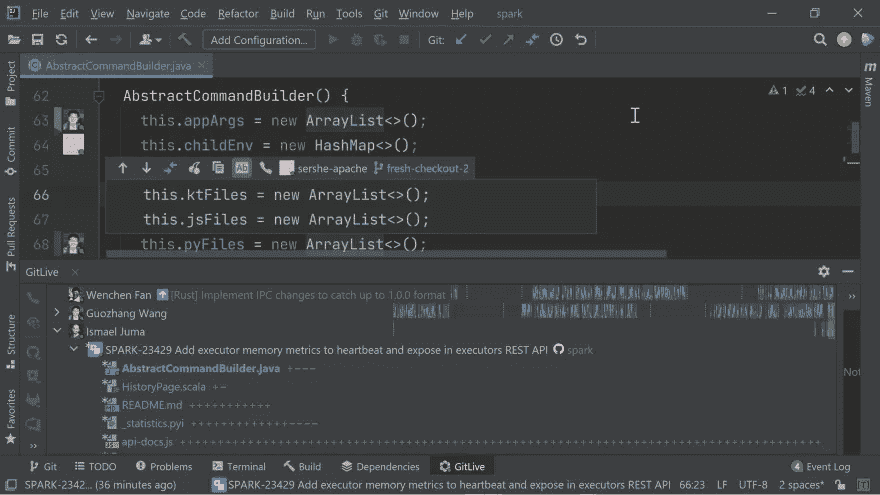
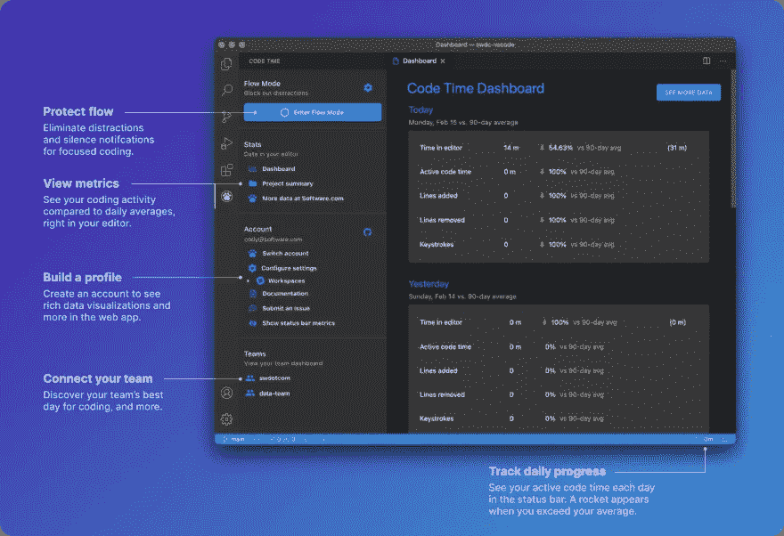
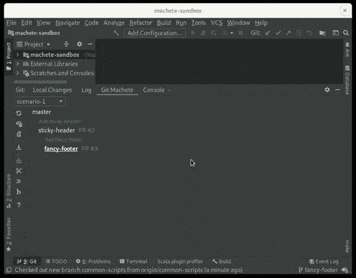
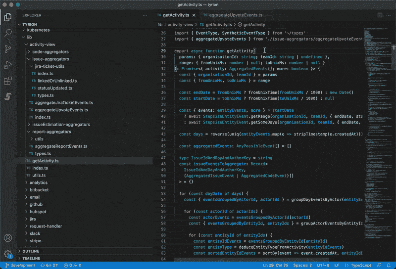
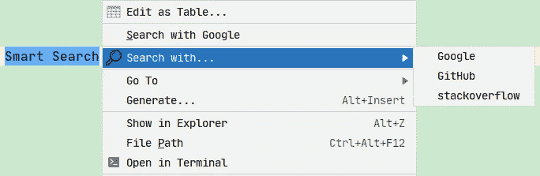

# 5 个 JetBrains 插件来提高您的工作效率！

> 原文：<https://betterprogramming.pub/5-jetbrains-plugins-to-boost-your-productivity-ecf5461ad642>

## 当您编码、搜索和协作时

作者图片

如果你和我一样，你肯定喜欢跟上市场上的最新技术。我一直在寻找用很酷的插件升级我的 IDE 的方法，这些插件可以帮助我和我的团队变得更有效率。

你可能已经熟悉了像 Tabnine 或 SonarLint 这样的伟大工具，所以今天我想和你分享那些你可能还没有听说过，但绝对应该尝试的不太为人知的插件！

# [GitLive](https://plugins.jetbrains.com/plugin/11955-gitlive)

GitLive 是我最喜欢的插件之一，它增强了 IDE 的内置 Git 功能。我已经使用它有一段时间了，我很高兴看到他们最近发布了一个重大更新，所以我想我应该用这个出色的工具开始我的列表。

JetBrains IDEs 已经有了一个很好的 Git 集成，可以很容易地看到你正在做的更改(通过沟中的指示器和[更改列表](https://www.jetbrains.com/help/idea/managing-changelists.html))或更改的历史(通过带有 Git 责备的注释和[显示选择的历史](https://www.jetbrains.com/help/idea/viewing-changes-information.html#changes_history))。

但是要看到队友做出的改变就没那么容易了。这是 GitLive 擅长的地方。它添加了一个[工具窗口](https://blog.git.live/gitlive-15.0-offline-merge-conflict-detection-across-all-branches-for-any-git-repository#see-all-work-in-progress-in-a-single-view),显示了来自您的存储库的协作者以及他们所有的活动分支，在这里您可以很容易地查看文件变更的不同之处。

它还增加了[装订线指示器](https://blog.git.live/gitlive-11.0-Real-time-merge-conflict-detection#gutter-indicators-for-teammates-changes)，显示你的队友相对于你的文件本地版本的变化(包括任何潜在的合并冲突，这是该插件最好的特性之一)。

该插件可以与任何 Git 存储库离线工作，并且只使用来自本地克隆的数据。还有一种在线模式，需要你用 GitHub、GitLab、Bitbucket 或者 Azure Dev Ops 登录。然后，您可以看到您的团队中还有谁在线，他们正在处理什么问题和分支，甚至可以查看他们未提交的更改—所有这些都是实时更新的，而不是推/拉更新的。

GitLive

# [代码时间](https://plugins.jetbrains.com/plugin/10687-code-time)

我非常喜欢数据可视化，这有助于我理解我是如何花时间编码的。我觉得分析图表有助于我改善时间管理，更好地组织工作。这就是为什么我喜欢时间跟踪工具，我把它们用于我的个人项目，并鼓励我的团队也使用一个。最近我们一直在试验代码时间。

Code Time 是一个用于自动编程度量和时间跟踪的开源插件。它的高级功能可以为您提供关于您工作效率的详细反馈(这是巧妙设计的一大优势！).

例如，它有许多很酷的功能，可以帮助你最大限度地减少分心，找出你一天中最有效率的时间，并分解你的编码统计数据(按项目、代码行和按键划分的编码时间)。)

代码时间

# [饭桶弯刀](https://plugins.jetbrains.com/plugin/14221-git-machete)

产生小的 pr 肯定是一个好的实践，但是很容易迷失在多个分支和堆叠的 pr 中。Git Machete 是一个有用的插件，它可以帮助你跟踪所有的分支、它们之间的关系以及与远程存储库的关系。

它还致力于 git 动作的自动化，并使 rebase/push/pull 变得简单(只需点击一下按钮！)，尤其是在有大量分支和 pr 的情况下。

这个插件自动发现分支布局并创建一个树形分支图(如果有任何变化或不准确，您也可以在中手动修改它。git/machete 文本文件)。该图提供了有关分支的有用信息:同步到父状态、同步到远程状态和自定义注释。还有一个选项可以切换分支的唯一提交。

右键单击图中选择的分支后，您可以在该分支上执行 git 操作，如 rebase/push/pull，而不需要从当前分支切换，这非常方便！

这是插件的 GIF 图:

饭桶弯刀

# [步长](https://plugins.jetbrains.com/plugin/14515-issue-tracker-in-ide)

维护您的代码库的健康需要整个团队的努力，Stepsize 就是一个工具的例子，它可以节省您花费在跟踪和解决潜在问题上的时间。它是编辑器中的一个问题跟踪器，用于管理技术债务和维护问题。

有时候，在编码时，我们会遇到需要解决的问题，但是没有时间马上解决。多亏了这个方便的插件，你可以直接在 IDE 中标记代码和创建待办事项，而不会影响你的工作流程！

下面是一张 GIF:

步长

# [智能搜索](https://plugins.jetbrains.com/plugin/14615-smart-search)

这个很酷的小插件在你编码时需要谷歌一些东西时会派上用场。像 WebStorm 这样的 JetBrains IDEs 有一个内置的 Google action 搜索，但是智能搜索提供了更多有用的选项，比如 Stack Overflow、GitHub 或 Google Translate。

智能搜索

感谢阅读！我希望我上面总结的工具能让你的工作变得更容易，并帮助你变得更有效率。

黑客快乐！