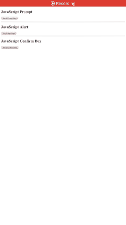

# WKWebView 的 5 个鲜为人知的功能

> 原文：<https://betterprogramming.pub/5-lesser-known-features-of-wkwebview-f20c94998c11>

## 在您的 iOS 应用程序中运行 JavaScript，拦截 URL，等等


照片由 [Sai Kiran Anagani](https://unsplash.com/@_imkiran?utm_source=medium&utm_medium=referral) 在 [Unsplash](https://unsplash.com?utm_source=medium&utm_medium=referral) 上拍摄

iOS 和 Web 历史悠久。他们的历史可以分为两个时代:摇摇欲坠的统治`UIWebView`之后是救世主`WKWebView`。`UIWebView`从 iOS 12 开始就被弃用了。如果有一点点痕迹，苹果甚至不会接受应用程序提交。当它的继任者表现更好的时候，他们为什么要这样做呢？

`WKWebView`是`WebKit`框架的一部分，在应用程序的主线程之外运行，因此有助于其稳定性和卓越的性能。

对于初学者来说，要加载内容，比如说在一个`WKWebView`中加载一个 URL 字符串，我们只需执行以下操作:

```
guard let url = URL(string: string) else { return }
let request = URLRequest(url: url)
webView?.load(request)
```

除了内容加载和 CSS 样式，你还可以做更多的事情。

以下部分是`WKWebView`相对较少为人所知的特性的清单。

# 1.拦截 Web URL

通过实现`WKNavigationDelegate`协议的`decidePolicyFor`功能，我们可以在导航过程中拦截中间 URL。下面的代码片段展示了这是如何实现的:

```
func webView(_ webView: WKWebView, decidePolicyFor navigationAction: WKNavigationAction, decisionHandler: @escaping (WKNavigationActionPolicy) -> Void) { let urlString = navigationAction.request.url?.absoluteString ?? ""
  let pattern = "interceptSomeUrlPattern"
  if urlString.contains(pattern){ var splitPath = urlString.components(separatedBy: pattern) }
}
```

# 2.JavaScript 警报

默认情况下，来自 JavaScript 的提示不会出现在`WKWebView`中，因为它不是 UIKit 的一部分。因此，我们需要实现`WKUIDelegate`协议，以便在提示中显示警告、确认或文本输入。

以下是每个不同警报或行动表的方法:

```
func webView(_ webView: WKWebView, runJavaScriptConfirmPanelWithMessage message: String, initiatedByFrame frame: WKFrameInfo, completionHandler: @escaping (Bool) -> Void)

func webView(_ webView: WKWebView, runJavaScriptAlertPanelWithMessage message: String, initiatedByFrame frame: WKFrameInfo, completionHandler: @escaping () -> Void) 

func webView(_ webView: WKWebView, runJavaScriptTextInputPanelWithPrompt prompt: String, defaultText: String?, initiatedByFrame frame: WKFrameInfo, completionHandler: @escaping (String?) -> Void) {

        let alertController = UIAlertController(title: nil, message: prompt, preferredStyle: .alert)

        alertController.addTextField { (textField) in
            textField.text = defaultText
        }
        alertController.addAction(UIAlertAction(title: "Ok", style: .default, handler: { (action) in
            if let text = alertController.textFields?.first?.text {
                completionHandler(text)
            } else {
                completionHandler(defaultText)
            }
        }))

        self.present(alertController, animated: true, completion: nil)
 }
```



WKWebView 中的 JavaScript 提醒

# 3.配置 URL 操作

使用`decidePolicyFor`功能，您不仅可以通过呼叫、facetime 和邮件等操作控制外部导航，还可以选择限制某些 URL 的打开。下面这段代码展示了每一种情况。

```
func webView(_ webView: WKWebView, decidePolicyFor navigationAction: WKNavigationAction, decisionHandler: @escaping (WKNavigationActionPolicy) -> Void) {

guard let url = navigationAction.request.url else {
            decisionHandler(.allow)
            return
        }

 if ["tel", "sms", "mailto"].contains(url.scheme) && UIApplication.shared.canOpenURL(url) {
            UIApplication.shared.open(url, options: [:], completionHandler: nil)
            decisionHandler(.cancel)
        } else {
            if let host = navigationAction.request.url?.host {
               if host == "www.notsafeforwork.com" {
                  decisionHandler(.cancel)
               }
               else{
                   decisionHandler(.allow)
               }
            }
        }        
  }
}
```

# 4.使用 WKWebView 验证

当您在`WKWebView`中的 URL 需要用户授权时，您需要实现以下方法:

```
func webView(_ webView: WKWebView, didReceive challenge: URLAuthenticationChallenge, completionHandler: @escaping (URLSession.AuthChallengeDisposition, URLCredential?) -> Void) {

        let authenticationMethod = challenge.protectionSpace.authenticationMethod
        if authenticationMethod == NSURLAuthenticationMethodDefault || authenticationMethod == NSURLAuthenticationMethodHTTPBasic || authenticationMethod == NSURLAuthenticationMethodHTTPDigest {
            //Do you stuff  
        }
        completionHandler(NSURLSessionAuthChallengeDisposition.UseCredential, credential)
}
```

收到身份验证质询后，您可以确定它需要的身份验证类型(用户凭据或证书),并相应地使用提示或预定义的凭据来处理条件

# 5.跨 WKWebViews 共享 Cookies

`WKWebView`的每个实例都有自己的 cookie 存储。为了跨多个`WKWebView`实例共享 cookies，我们需要使用如下所示的`WKHTTPCookieStore`:

```
let cookies = HTTPCookieStorage.shared.cookies ?? []
for (cookie) in cookies {
   webView.configuration.websiteDataStore.httpCookieStore.setCookie(cookie)
}
```

WKWebView 的其他功能，如显示正在加载的 URL 的进度更新，这些天来相当普遍。

`ProgressViews`可以通过监听`estimatedProgress`的`keyPath` 值来更新，方法如下:

```
override func observeValue(forKeyPath keyPath: String?, of object: Any?, change: [NSKeyValueChangeKey : Any]?, context: UnsafeMutableRawPointer?)
```

这就结束了。我希望你喜欢读它。