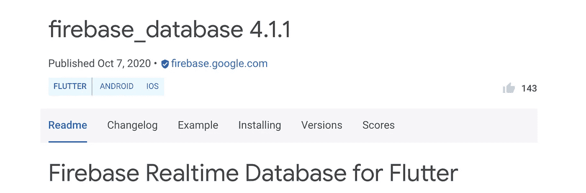

# 我从用 Flutter 构建 Web 应用程序中学到的 5 个教训

> 原文：<https://betterprogramming.pub/5-lessons-i-learned-from-building-a-web-app-with-flutter-3be03b2206ac>

## 如果你用 Flutter 构建一个 web 应用，需要记住的事情

作者照片。

本文的目的是给所有开发人员一个提示，让他们能够构建和规划更好的 web 应用程序，为成功做好准备，并帮助避免我遇到的一些尴尬问题。

*注意:截至 2020 年 11 月，web 的 Flutter 仍处于测试阶段。在玩了一些概念验证后，我觉得它适合我的应用程序需求，所以我继续将其用于生产。*

*我最初想使用 Firebase 实时数据库，但令人惊讶的是谷歌还没有为 Flutter web 构建插件。因此，我别无选择，只能使用 Firestore，它运行得相当好。*

# 该项目

最近，我得到了一个机会，在有限的时间和资源下，从头开始开发一个应用程序。在考虑了实时应用程序的需求和约束后，我选择了 Flutter + Firebase。

Firebase 实时数据库插件目前还不支持 Flutter web

当我在 Firebase (Firestore 和实时数据库)中查看数据库选项时，我意识到只有 Firestore 支持 Flutter web，所以我真的没有任何其他选项。

# 1.检查和规划插件支持

尽管 Flutter 非常强大，并且附带了应用程序的许多基本组件(如路由、状态管理等)。)，当处理更大的应用程序时，您将依赖于插件。在使用您的技术之前，请考虑您希望使用的插件及其支持。

非常感谢令人敬畏的 Flutter 社区，因为他们已经做了一些非常了不起的工作来构建各种各样的插件——甚至是为 Flutter web。这让我对 Flutter web 在未来只会变得更有能力充满信心。

开发者体验一如既往的流畅。在开发的时候，我一直使用 iPad 模拟器来使用热加载功能，因为 Flutter web **没有这个功能。**

因此，我一直在使用 iOS 模拟器进行主动开发，以提高开发的便捷性和速度，这就引出了第二课。

# 2.颤振腹板的不一致结果

是的，Flutter web 仍处于测试阶段，我不是来抱怨这个的。我只是想给其他开发人员提个醒，让他们意识到这一点，并相应地进行缓解。

在这个项目之前，我已经在 Flutter 上开发了一段时间的 Android 和 iOS 应用程序，从来没有遇到过这两个平台上的应用程序性能一致的问题。

Android 和 iOS 应用程序的运行和预期的一样，我假设 Flutter web 也是如此。不幸的是，事实并非如此。

在浏览器上运行 Flutter web 应用的 Android 用户遇到了以下问题:

*   表情符号不显示/不受支持。 [GitHub 问题](https://github.com/flutter/flutter/issues/45947)。
*   最尴尬和最奇怪的问题是，文本的某些部分只是随机地在应用程序中变得不可见，这个问题完全是随机的。它大部分时间工作正常，但偶尔会出现。 [GitHub 问题](https://github.com/flutter/flutter/issues/64904)。

iOS 和桌面用户在他们的浏览器上运行 Flutter web 时没有出现任何问题，这很好，但也把我们带到了第三课。

# 3.对所有浏览器和平台进行彻底的测试

这是我们正在谈论的一个 web 应用程序，作为一名移动应用程序开发人员，我很幸运没有像我的 web 开发同行那样费力，他们必须对运行在不同屏幕尺寸上的不同浏览器进行严格的测试。

用 Flutter 移动到 web 把我拖进了那个危险却令人兴奋的领域。

我使用 iOS 模拟器进行开发(利用热重新加载来提高开发速度)，与 iOS 应用相比，web 应用的行为有点不同。

因此，一旦您完成了开发工作的某个里程碑，就要花时间在多种设备、操作系统和浏览器上运行和测试您的应用程序。

由于 Flutter 正在从稳定的 Android 和 iOS 发展，并在未来转移到 web 和其他平台，我们作为开发人员的力量也在增加——伴随着强大的力量而来的是巨大的责任。

做一个负责任的开发人员，让一个自动化测试套件陪着你，给你比手工测试更多的信心，让你的项目在长期跨所有这些平台部署应用时保持可维护性。

说到不同的屏幕尺寸，这让我想起了第四课。

# 4.投入时间建立一个框架来构建响应性布局

我从下面的视频中学到了如何构建响应式布局，然后我创建了一个 [Flutter-Starter 样板代码](https://github.com/devDeejay/FlutterStarterProject)项目，我用它来设置我的 Flutter 项目。它包含了我的响应式布局的框架以及路由逻辑。

这样，每当我开始新的 Flutter 项目时，我不必记住所有这些代码，只需在样板代码项目的基础上构建即可。

# 5.路线规划

在开发移动应用程序时，我从来没有担心过这个问题。几乎满足了我所有的需求，热重装在开发时很好地保存了我的应用程序的状态。

但是有两样东西是网络应用用户随时可以得到的，而手机应用用户永远得不到的:

*   刷新按钮-用户可以随时点击它，它会带他们回到你的应用程序的开始屏幕。为了维护刷新页面的状态，您必须在用户点击刷新按钮之前保存页面状态，按下适当的路线，并推回保存的状态。
*   可见的 URL 他们可以看到它更新，并可以操纵自己干扰你的应用程序的路由逻辑。Flutter 项目中的默认路线并不真正更新 URL，应用程序感觉像一个单页应用程序。

因此，为了保持良好的用户体验，路由成为一个需要关注的重要领域。 [Flutter-Starter 样板代码](https://github.com/devDeejay/FlutterStarterProject) 也负责设置命名路由。这是一些基本的样板代码，你不必记住。

要了解更多关于路由的信息，[请观看此视频](https://www.youtube.com/watch?v=YXDFlpdpp3g)。

感谢阅读！