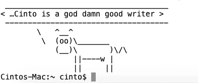
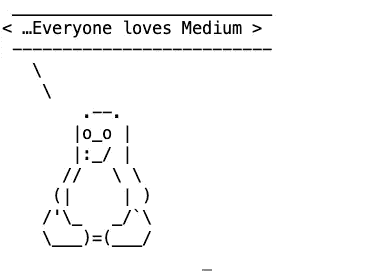

# 5 个可以让你惊叹的 Linux 命令

> 原文：<https://betterprogramming.pub/5-linux-commands-that-can-make-you-go-wow-6f3b811642d5>

## 一边编码一边享受乐趣！


照片由[帕特里克·福尔](https://unsplash.com/@patrickian4?utm_source=medium&utm_medium=referral)在 [Unsplash](https://unsplash.com?utm_source=medium&utm_medium=referral) 拍摄

做一名程序员是艰难的。花在监视器后面调试丢失的分号的时间，为十行代码编写 1000 行自述文件的眼睛疲劳，意外删除整个 git repo 时的精神创伤，与经理和同事无休止的争论。这个清单还在继续。

所以，偶尔休息一下，沉溺于一些有趣的事情是可以的。对于普通人来说，这可能包括观看一个有趣的 YouTube 视频，或者嘲笑脸书发布的一条狗追逐一个孩子的帖子，或者在 Twitter 上争论你最喜欢的足球俱乐部。

但是对于 Linux 爱好者来说，它可能会把你的显示器变成一个话匣子或者一个幸运饼干发生器。或者看着你的显示器在房间里飞来飞去。好了，太多了！

这里有一些 Linux 命令会让你心情变得轻松。

# 谁把牛放出来了

想过如果奶牛开始说话会发生什么吗？别担心，Linux 会让它实现的。

```
brew install cowsay
```

现在，让牛说。

```
cowsay …Cinto is a god damn good writer
```



图片由作者提供。牛吐出赤裸裸的事实

或者，如果你想让 Linux 吉祥物说出来:

```
cowsay -f tux …Everyone loves Medium
```



图片由作者提供。

要查找其他选项，请键入以下内容:

```
cowsay -lbeavis.zen blowfish bong bud-frogs bunny cheese cower daemon default dragon dragon-and-cow elephant elephant-in-snake eyes flaming-sheep ghostbusters head-in hellokitty kiss kitty koala kosh luke-koala meow milk moofasa moose mutilated ren satanic sheep skeleton small stegosaurus stimpy supermilker surgery three-eyes turkey turtle tux udder vader vader-koala www
```

# 幸运饼干

当我们去中国餐馆时，我们不需要幸运饼干。一顿丰盛的午餐后，我们吃饱了，高兴了，心满意足了。

当我们的代码停止工作时，我们需要它，即使在重新运行这个过程 11 次，重新启动我们的机器 173 次之后。即使我们不知道我们的命运是否会改变，这也会让我们忘记这个问题。

所以，这就是 Linux 将如何提供帮助。

```
brew install fortune
...==> **Pouring fortune--9708.catalina.bottle.4.tar.gz**🍺  /usr/local/Cellar/fortune/9708: 82 files, 2.5MB
```

现在，对于我们的随机消息:

```
They can’t stop us… we’re on a mission from God!
— The Blues Brothers
```

为了让它更有趣，你可以把 fortune 和 Cowsay 结合起来，就像这样:

```
fortune | cowsay -f ghostbusters
```


作者图片

# 让终端和你说话

如果你的终端能说出你的想法，那不是很好吗？嗯，有了 Linux 就可以了。

```
brew install espeak
...==> **Pouring espeak--1.48.04_1.catalina.bottle.1.tar.gz**🍺  /usr/local/Cellar/espeak/1.48.04_1: 296 files, 3MB
```

让它说话

```
espeak "What a wonderful article"
```

你甚至可以控制单词之间的间隙

```
espeak -g 20ms "What a wonderful article"
```

和你的机器聊天愉快。让你的家人认为你疯了。谁在乎！

# 蒸汽机

厌倦了你的黑白终端。想让一个蒸汽机车引擎匆匆驶过你的码头。

Linux——“你的愿望就是我的命令。”

```
brew install sl
```

欢乐时光

```
sl
```

[gif](https://media.giphy.com/media/F9QecAyxu4W4oBtkWb/giphy.gif) 作者

将该命令添加到您的 *~/中。bashrc* ，或者说 *~/。配置文件*，并在每次打开新终端时观察它的运行。

# 旗帜

想要一个横幅在你的普通终端上。不要再说了！

```
brew install figlet
```

你希望横幅上写什么？使用下面的代码:

```
figlet Linux Rocks!
```


作者图片

如前所述，将其添加到 *~/中。bashrc* ，或者~ */。配置*并在每次打开新终端时将其设为默认值。

Linux 很酷。看你是怎么忘记那个困扰你大脑的虫子的。但是乐趣已经结束了。编码快乐！！

我用 brew 安装了其中的一些命令。如果你用的是 Linux 机器，用 apt-get 或者类似的。