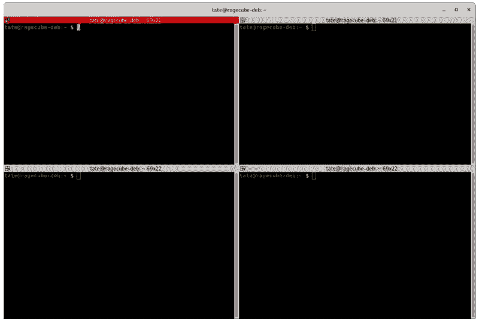
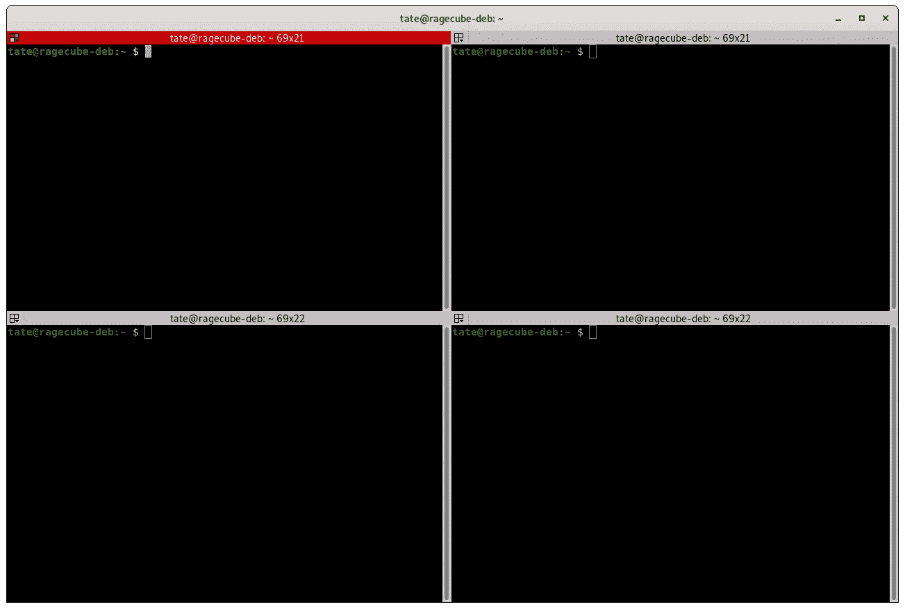
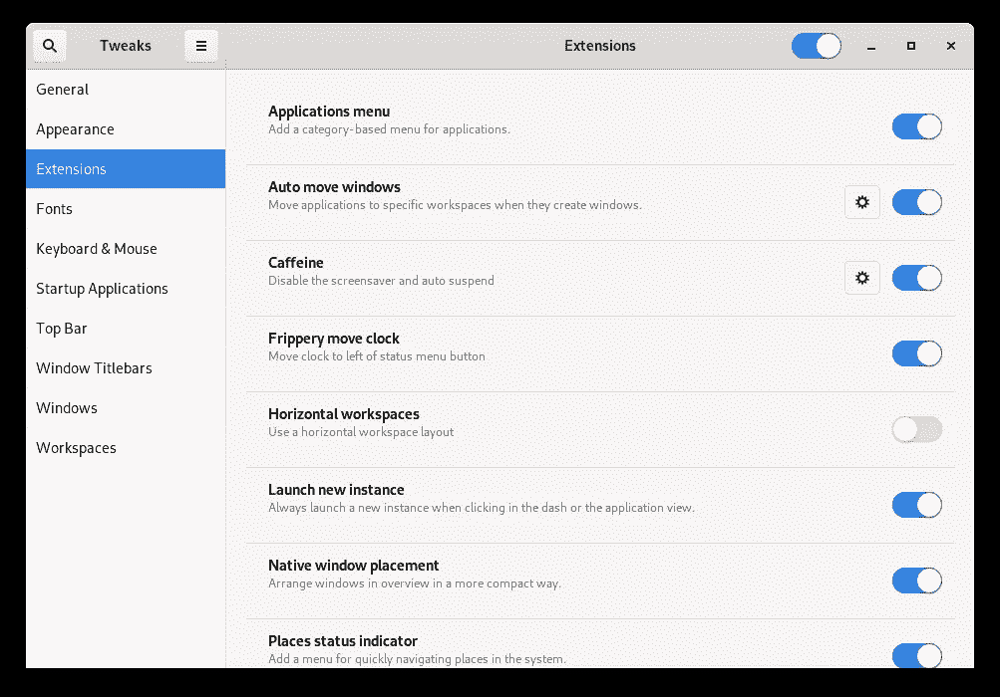

# 面向开发人员的 5 个 Linux 桌面调整

> 原文：<https://betterprogramming.pub/5-linux-desktop-tweaks-for-developers-ff0acd234664>

## 在 Linux 上开发得更好



[终结者](https://gnometerminator.blogspot.com/p/introduction.html)

一旦我开始在家工作，我决定是时候对桌面进行一次彻底检查了。在办公室，我通常使用我的 MacBook Pro，它连接到一个超宽显示器和一些外围设备，如键盘、鼠标、硬盘等。在家。我有一台台式电脑，到目前为止，大部分时间都闲置着。

我偶尔玩游戏(现在更多的是*)，但在大多数情况下，我的台式机对我来说并不是一台真正的生产力机器。我会在周末用它来回复邮件、浏览网页或玩游戏。*

*在 Linux 上工作了几年后，我决定最终转向 Debian 作为我桌面上的日常驱动操作系统。我希望坐在桌面上(而不是坐在沙发上拿着笔记本电脑)能让我在家里保持专注和高效。我会一直安装 Windows 10 和双启动系统，以防我需要偶尔玩玩游戏或运行一些 Windows 专用软件。*

*在运行 Debian 近一个月之后，我想为开发人员提供一些最佳调整的评论。这些调整改进了工作流程和效率，并为 Debian 带来了更愉快的编程体验。*

***注意:** GNOME 3.34.2 被用作主窗口管理器。*

# *垂直桌面交换*

*如果你使用超宽显示器，这是一个游戏改变者。垂直桌面切换可以让你设置热键来浏览不同的桌面，上面有不同的应用程序打开——但是是垂直的*。**

**这听起来可能与 Mac 上的 Spaces 或 Windows 上的桌面切换没有什么不同，但在如此宽的显示器上上下移动桌面感觉更自然。**

**你不用把整个视图向左或向右甩，而是让一个新的视图快速上下滑动，移动更短的距离，使变化不那么刺耳。**

**在每个桌面之间切换的默认热键是:**

```
**<SUPER> + PgUp
<SUPER> + PgDn**
```

**查看 [GNOME workspaces](https://help.gnome.org/users/gnome-help/stable/shell-windows.html.en#working-with-workspaces) 上的文档了解更多信息。**

# **终结者**

**如果您使用 GNOME 这样的 GUI，那么您需要一个优秀的终端模拟器。使用内置的终端应用程序是好的，但是你会很快陷入生产率陷阱，比如能够垂直分割、堆叠或分组窗口。**

****

**终结者:多么令人满意的四分裂**

**可用的最有效和最容易使用的终端之一是[终端](https://gnometerminator.blogspot.com/p/introduction.html)。Terminator 提供了极快的性能、简单的定制和超酷的特性——比如广播输入(类似于 iTerm2)。如果你习惯在 Mac 上工作并使用 iTerm2，那么 Terminator 是第二个，应该可以很好地填补空白。**

# **GNOME 调整**

**GNOME Tweaks 是一个工具，它做的和它听起来一样——调整 GNOME 的外观和性能。有了这个工具，你就可以开始使用 GUI 设置，并做出一些重大的生产力改变。**

**你可以通过禁用花哨的动画，安装新的主题，甚至移动按钮的位置来加快你在较慢的机器上的体验。**

**Tweaks 工具还为您提供了一个方便的地方来管理桌面环境的其他扩展。您可以切换现有的扩展并管理它们各自的设置。**

****

**GNOME 中的微调控制面板**

**如果您运行的是最近的桌面发行版，很可能已经安装了该软件，但是如果没有，您可以运行:**

```
**sudo apt install gnome-tweaks**
```

# **移动时钟**

**我知道你在想什么:**

> **"移动时钟到底是如何提高生产率的？"**

**听我说完。如果你像我一样，你习惯于在 Mac 或 Windows 机器上工作。那上面的钟在哪里？**

**在右边…**

**GNOME 中时钟默认位于哪里？**

**在中间…**

**现在，你一直在哪里寻找时间？没错。错误的地方。这可能看起来不多，但相信我，过一会儿就会开始增加。*为什么我一直盯着时钟应该在的地方——哦，对了，它在中间。***

**只要把该死的时钟拨到右边，就可以避免这场噩梦。**

****

**在你把钟移回到它该在的地方后**

**这里有一个 GNOME 插件可以执行这个功能。**

# **让它看起来像 Windows/Mac**

**如果你仍然觉得整个桌面外观的变化不和谐，让你渴望你的 Windows 或 Mac 界面的日子，那么不要害怕。有一些解决方案可以把你的 Linux 桌面伪装成它的一个更商业化的兄弟。**

**[](https://github.com/vmavromatis/gnome-layout-manager) [## vmavromatis/gnome 布局管理器

### 批量安装和调整 GNOME 扩展以及 GTK/Shell 主题的 bash 脚本。目前有三个…

github.com](https://github.com/vmavromatis/gnome-layout-manager) 

GNOME 布局管理器就是这样一个工具，它可以让你轻松地将整个桌面作为 Mac 或 Windows 环境来使用。虽然这个扩展已经存在了一段时间，但是如果换肤是您所追求的，它仍然可以完成工作。

请记住，不是所有的东西都在同一个地方。你还是在 Linux 上运行 GNOME，会有区别。就个人而言，我认为这样的扩展更像是一种新奇的东西，而不是面向生产力的东西，但是如果这促进了 Linux 的采用，我完全支持。** 

# **结论**

**定制您的 Linux 桌面体验是有趣的，也是令人难以置信的回报。你不仅会获得亲自动手的满足感，还会收获生产率的好处。**

**这绝不是一个包罗万象或复杂的调整列表，因为 GNOME 和其他桌面环境有太多的方式可以定制。我强烈建议你在 GNOME 的网站[上查看更多的扩展。](https://extensions.gnome.org/)**

**如果你对 Linux 上的其他桌面环境感兴趣，或者想要深入的比较， [Linode](https://medium.com/u/348844fdc537?source=post_page-----ff0acd234664--------------------------------) 有一篇精彩的文章[在这里](https://medium.com/linode-cube/linux-options-choosing-a-desktop-environment-for-home-or-work-3f987fb487ec)。**

**感谢阅读！希望这些调整能改善你自己在 Linux 上的桌面工作流程。**