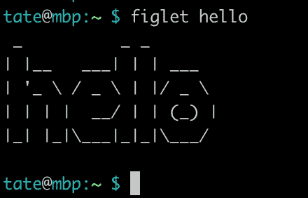
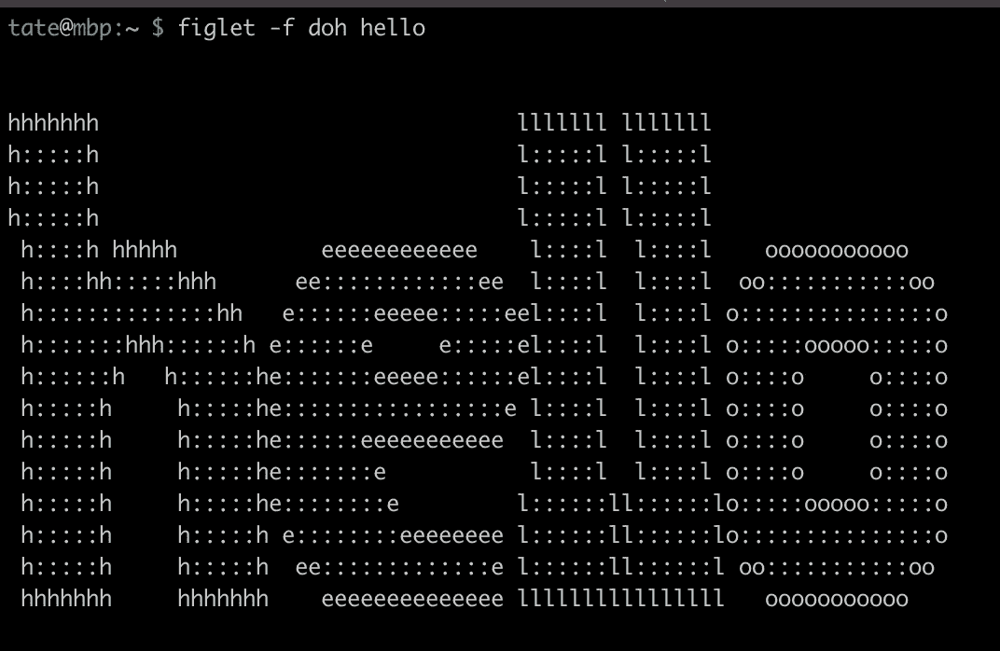
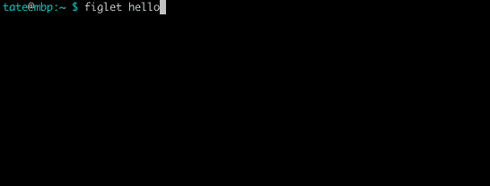

# 5 个让你会心一笑的 Linux 工具

> 原文：<https://betterprogramming.pub/5-linux-utilities-that-will-make-you-smile-b582684b3090>

## 有趣的小宝石添加到您的曲目


由[布鲁克·卡吉尔](https://unsplash.com/@brookecagle?utm_source=unsplash&utm_medium=referral&utm_content=creditCopyText)在 [Unsplash](https://unsplash.com/s/photos/laugh-computer?utm_source=unsplash&utm_medium=referral&utm_content=creditCopyText) 拍摄的照片

Linux 不全是娱乐和游戏，好吗？这是严肃的事情。系统管理绝不能幽默…开个玩笑。

当你不得不挖掘系统日志，编译看起来只会出错的应用程序，或者恢复丢失的文件时，你肯定会时不时地需要一点点变化(可能很多)。

为什么不在你的工作流程中加入一点轻松的元素呢？在这篇文章中，我们将看看一些给日常的计算工作带来一点乐趣的 Linux 程序。

让我们看一看。

# 1.他妈的


当你忘记了“回声”中的“h”时。

你以前输错过命令吗？错过了敲击键盘上一个关键字符的机会，只剩下可怕的:

```
-bash: <insert_mistake_here>: command not found
```

这个名副其实的实用程序不会让所有这些麻烦完全消失，但它会让你以一种更加丰富多彩的方式来纠正它们。

下一次当您错误地键入一个常用命令时，只需在其后键入以下命令:

```
fuck
```

其中一个内置别名将尝试为您纠正错误。如果没有可用的更正，您也可以添加自己的自定义别名。尽管名字很俗，但这个实用程序真的很有帮助，可以减少您重新输入命令的时间。

您可以使用下面的命令开始安装，或者查看[库](https://github.com/nvbn/thefuck)以获得更多详细的构建选项:

```
# macOS
brew install thefuck# Debian
sudo apt update
sudo apt install python3-dev python3-pip python3-setuptools
pip3 install thefuck --user
```

# 2.页面浏览量（page view）


回应“你好”,但让我们慢下来，好吗？

简单地一次输出一整行文本很无聊。让我们慢慢来，用`[pv](https://www.man7.org/linux/man-pages/man1/pv.1.html)`为我们的文本重新创建一个冗长的打字模拟。尽管这个实用程序最初是用来测量 Bash 管道上的数据吞吐量的，但是它也可以用于类似这样的新奇事物。

为什么要这么做？除了“它很简洁”这个显而易见的答案之外，您还可以通过它来传输一个简单脚本的所有输出，以便模仿像 [VT100](https://en.wikipedia.org/wiki/VT100) 这样的老式终端。通过将`-L 37`参数传递给`pv`，可以获得接近 300 的波特率。

您可以使用以下命令安装`pv`:

```
# macOS
brew install pv# Debian
sudo apt install pv
```

# 3.菲戈莱特



ASCII 艺术在瞬间。

无聊的登录横幅？平淡无奇的帮助文本？头脑麻木的脚本输出？一定有更好的办法。对吗？有。把 ASCII 艺术加到所有东西上(大概)。

使用`[figlet](http://www.figlet.org/)`你可以轻松地动态生成 ASCII 艺术，而不必使用那些烦人的在线生成器。这使您能够自定义艺术的生成方式，将它传输到其他命令，或者在脚本中自动生成片段。

您可以通过使用`-f`参数选择不同的字体文件来更改字体样式。看看下面的例子:



使用带有“doh”字体的 figlet。

如果你真的想找点乐子，你可以通过管道`figlet`连接到我们之前讨论过的`pv`实用程序，来降低它的速度:



结合 figlet 和 pv 慢慢画 ASCII 艺术。

# 4.Espeak


[espeak.sourceforge.net](http://espeak.sourceforge.net/)

你的电脑在和你说话。它试图告诉你一些事情。想告诉你你想要的一切，真的。借助 eSpeak 的文本到语音转换功能，您可以让您的计算机说出您想要的任何内容。我是说任何事…

```
espeak "Shall we play a game?"
```

你不觉得这听起来很奇怪吗，很像战争游戏里的[约书亚？](https://www.youtube.com/watch?v=-1F7vaNP9w0)

eSpeak 的用途是无穷无尽的。你可以让一个长时间运行的工作在完成时口头告诉你。让你的电脑告诉你时间。让它给你讲笑话。给你读一本小说。给你读一下 Reddit 的文字版。

发挥你的想象力。

使用以下命令安装 [eSpeak](http://espeak.sourceforge.net/) 或访问他们的网站获取更多选项:

```
# macOS
brew install espeak# Debian
sudo apt install espeak
```

# 5.发动机的旋转


一定是反转了还是怎么的？

向前文本很酷，但是向后文本更酷。有了这个工具，你所有的文本反转梦想都可以实现。您可以使用`rev`对字符串进行模糊处理，修复命令输出中出现的严重错误，或者简单地将一句胡言乱语输入到 eSpeak 中，如下所示:

```
echo "this is going to sound really weird" | rev | espeak
```

默认情况下，macOS 和大多数 Linux 发行版都附带了`rev`实用程序，所以你可能已经有能力破坏完美的句子了。

感谢阅读！尽量不要把事情看得太严重，尝试一下这些有趣的程序。如果你正在寻找一些更加刻板、注重效率的程序，看看我的另一个故事:[你应该知道的另外 6 个终端命令](/6-more-terminal-commands-you-should-know-3606cecdf8b6)。