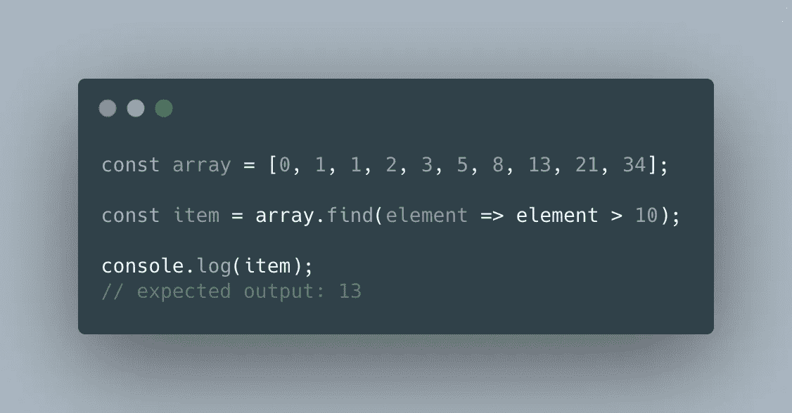
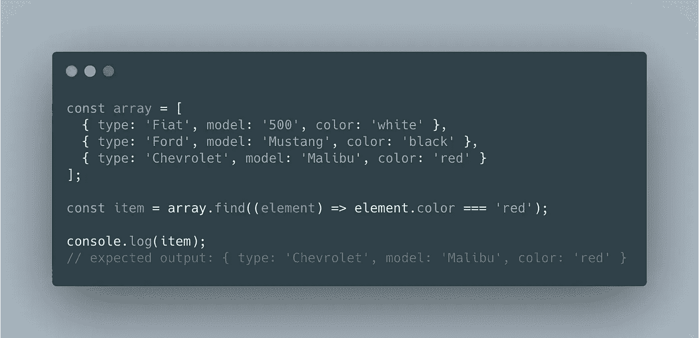
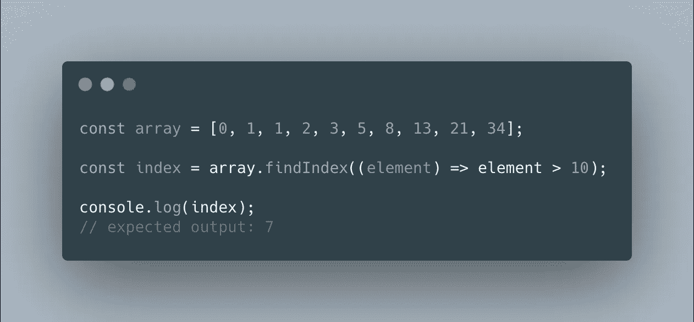
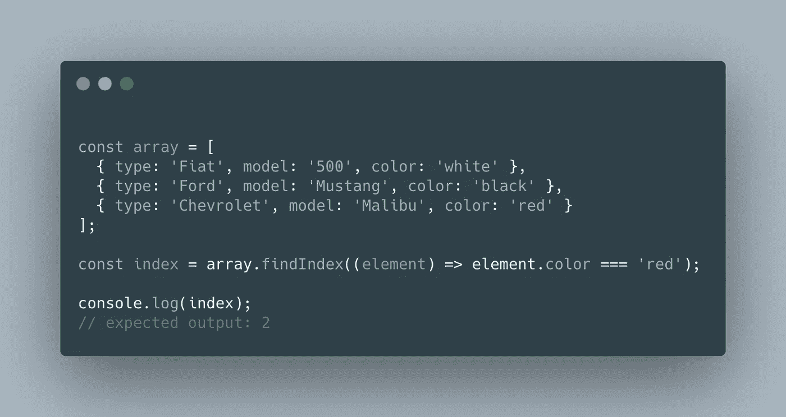
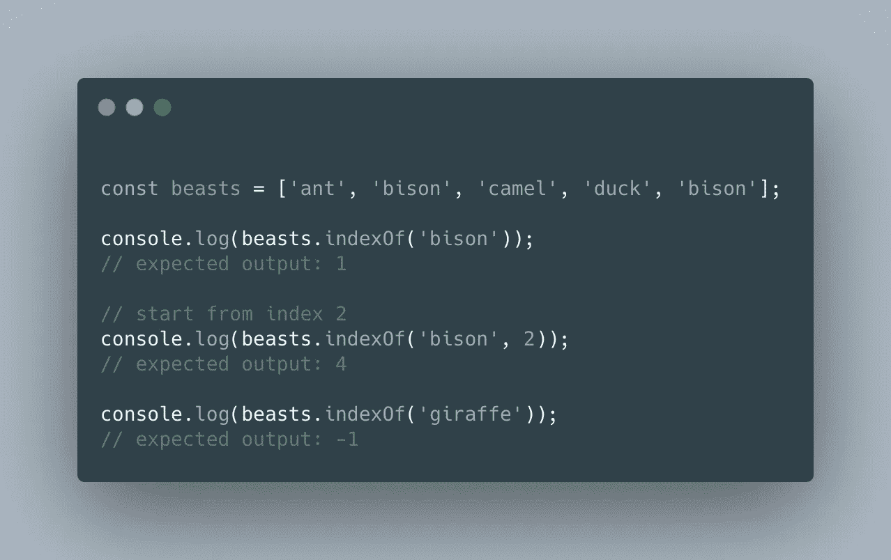
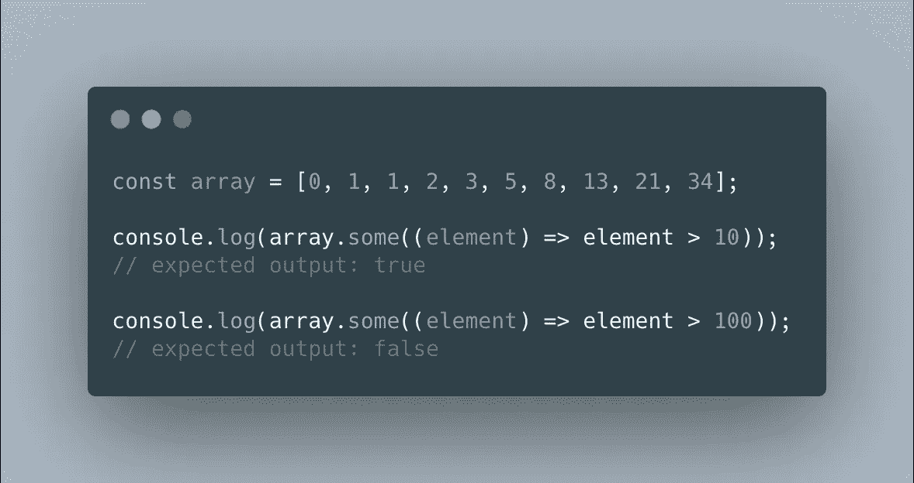
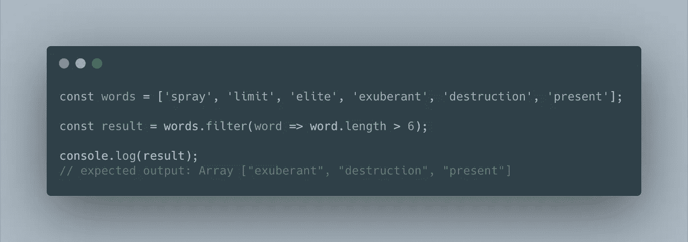

# 在 JavaScript 数组中搜索项目的 5 种方法

> 原文：<https://betterprogramming.pub/5-methods-to-search-items-in-javascript-arrays-8e04cdd4448d>

## 没有麻烦，内置的普通 JavaScript 数组方法可以找到元素

图片来源:作者

在列表或数组中定位元素是软件开发中的一项常见任务。目标是找到给定元素的位置，或者确定该元素不完全是集合的一部分。

JavaScript 的早期版本提供了一组有限的数组搜索方法。通常在这些版本中，当执行搜索时，`for`循环将是遍历元素并逐个检查它们的主要资源。

我们的好老`for`循环没有任何问题。这是一种非常有效的迭代条目集合的方法，也是许多编程语言的主要特点。

然而，JavaScript 的最新版本引入了对在[数组](https://developer.mozilla.org/en-US/docs/Web/JavaScript/Reference/Global_Objects/Array)中搜索的更好支持。ECMAScript 5 (ES5)增加了方法`indexOf`和`lastIndexOf`，而 [ECMAScript 2015](https://github.com/lukehoban/es6features) (ES6)带来了`find`、`findIndex`和许多其他对语言的巧妙改进。这些方法提高了易用性，也使您的代码更具可读性。

您可能会问自己，为什么有这么多方法来执行相同的任务。答案是这些方法并不相同——每种方法都有自己的用例。有时，您需要确定数组中是否存在某个元素。在其他情况下，您需要从数组中检索项目本身。无论您的用例是什么，JavaScript 都会支持您！

我们将在本文中讨论的五种方法是:

*   `find`
*   `findIndex`
*   `indexOf`
*   `includes`
*   `some`

# **Array.prototype.find()**

**`find`方法返回数组中满足回调函数中确定的搜索条件的第一项，如果没有找到则返回`undefined`。**

**在所有索引中顺序调用回调函数，直到返回一个[真值](https://developer.mozilla.org/en-US/docs/Glossary/truthy)为止。如果发生这种情况，将返回存储在该特定索引处的元素，搜索将停止。否则，将遍历整个数组而不满足搜索标准，并将返回一个`undefined`值。**

****

**`find`也可用于查找对象数组中的元素。**

****

# **Array.prototype.findIndex()**

**这种方法与`find`非常相似。它还接受一个回调函数来应用您的搜索标准。但是，它返回元素在数组中所处的索引，而不是它的元素。**

**当没有找到元素时，`findIndex`返回`-1`。**

****

**同样，我们也可以搜索对象索引。**

****

# **Array.prototype.indexOf()**

**`indexOf`返回数组中提供的元素的第一个索引。和`findIndex`一样，如果没有找到元素，它会返回`-1`。**

**该方法使用[严格相等](https://developer.mozilla.org/en-US/docs/Web/JavaScript/Reference/Operators/Strict_equality)将提供的搜索元素与数组元素进行比较。因此，例如，如果您试图查找值`3`所在的索引，但是您向该方法提供了`'3'`，那么将找不到该元素，并且该方法将返回`-1`。**

**您还可以为此方法提供一个可选的第二个参数，以表示您希望从哪个索引开始搜索。**

****

***注意:JavaScript 数组也提供了一个类似的方法叫做* `*lastIndexOf*` *。它具有与* `*indexOf*` *相同的签名，但不同之处在于它将返回找到某项的最后一个索引，而不是第一个索引。***

# **Array.prototype.includes()**

**`includes`方法返回一个布尔值，如果一个给定的项目在数组中，它将是`true`,否则是`false`。类似于`indexOf`，它还允许第二个可选参数来指定开始的索引。**

**该方法使用[同值零相等](https://developer.mozilla.org/en-US/docs/Web/JavaScript/Equality_comparisons_and_sameness#Same-value-zero_equality)算法来确定数组中是否存在元素。这个算法类似于在`indexOf`中使用的严格等式，但是它也支持`NaN`比较。**

****

# **Array.prototype.some()**

**此方法检查是否至少有一个数组项匹配回调函数中确定的搜索条件。如果是，该方法将返回`true`，否则将返回`false`。**

****

# **Bonus: Array.prototype.filter()**

**在某些情况下，您可以使用方法`filter`来搜索整个数组中的元素。`filter`和`find`一样，会使用回调函数来测试数组内的元素。**

**这里的不同之处在于，这个方法将返回一个新数组，其中包含通过回调函数实现的测试的所有项目。**

**可以将这种方法用作搜索工具的一个例子是，查找符合给定搜索条件的所有元素，并在一个单独的集合中提供它们。**

****

# **摘要**

**JavaScript 是一种出色的语言，内置的数据结构中包含了丰富的方法。JavaScript 数组包含了大量的好方法；在本文中，您已经学习了一些在搜索代码中使用的方法。**

**使用哪种方法取决于您的具体用例以及您的偏好:**

*   **你需要知道给定项目的索引吗？`indexOf`、`lastIndexOf`、*、*还是`findIndex`？**
*   **您需要从数组中检索项目吗？`find`还是`filter`(针对一项或多项)？**
*   **您需要确定数组中是否存在某个项目吗？`includes`还是`some`？**

**我希望你喜欢这篇文章，希望它对你有所帮助！**