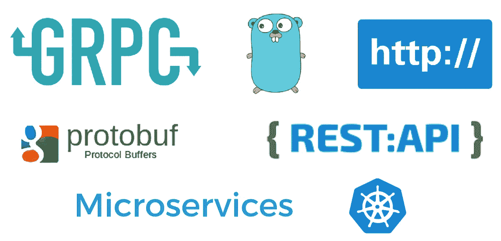

# 在 5 分钟内为您的 GRPC 服务添加 RESTful APIs

> 原文：<https://betterprogramming.pub/5-minutes-to-add-restful-apis-for-your-grpc-services-14673c7cd01f>

## 带 HTTP 接口的 gRPC 服务？



虽然 go-zero 给开发者带来了优秀的 RESTful 和 gRPC 服务开发体验，但更多的期望也随之而来。比如:

*   我只想写一次代码
*   我想要 gRPC 和 HTTP 接口

有道理！你看用户怎么说。

> *用户 A:一套逻辑，HTTP 和 gRPC 一起。*
> 
> 用户 B:如果 go-zero 可以简化这个步骤，我觉得它将成为有史以来最好的微服务框架。

于是我陷入了深思:用户永远不会错，但我们要不要提供？

文章来了。

# 让我们先编写 gRPC 服务

我们对这项服务太熟悉了。创建一个新目录，姑且称之为`grpc-restufl`，放一个`sum.proto`文件在里面

```
syntax = "proto3";package sum;
option go_package="./pb";message SumRequest {
    int64 a = 1;
    int64 b = 2;
}message SumResponse {
    int64 result = 1;
}service Sum {
    rpc Add(SumRequest) returns (SumResponse) {}
}
```

一键生成，你懂的。

```
$ goctl rpc protoc --go_out=. --go-grpc_out=. --zrpc_out=. sum.proto
```

看看你得到了什么

```
.
├── etc
│ └── sum.yaml
├── go.mod
├── internal
│ ├── config
│ │ └── config.go
│ ├── logic
│ │ └── addlogic.go
│ ├── server
│ │ └── sumserver.go
│ └── svc
│ └── servicecontext.go
├─ pb
│ ├── sum.pb.go
│ └── sum_grpc.pb.go
├─ sum
│ └── sum.go
├── sum.go
└── sum.proto
```

为了实现业务逻辑，修改`internal/logic/addlogic.go`中的`Add`方法如下。

```
**func** (l *AddLogic) **Add**(in *pb.SumRequest) (*pb.SumResponse, error) {
    **return** &pb.SumResponse{
        Result: in.A+in.B,
    }, **nil**
}
```

您可以运行它，业务逻辑就在那里(尽管它非常简单，用于演示目的。)

```
$ go mod tidy && go run sum.go
Starting rpc server at 127.0.0.1:8080...
```

对于熟悉 go-zero 的人来说，这里没有什么亮点(新知识)，继续吧~

# 提供 HTTP 接口

# 更新归零

首先，让我们将 go-zero 更新到`v1.4.0`版本，

```
$ go get -u github.com/zeromicro/go-zero@latest
```

# 修改原型文件

修改`sum.proto`，我新建了一个`sum-api.proto`，如下图

```
syntax = "proto3";package sum;
option go_package="./pb";import "google/api/annotations.proto";message SumRequest {
    int64 a = 1;
    int64 b = 2;
}message SumResponse {
    int64 result = 1;
}service Sum {
    rpc Add(SumRequest) returns (SumResponse) {
        option (google.api.http) = {
            post: "/v1/sum"
            body: "*"
        };
    }
}
```

# 生成原型描述符文件

```
protoc --include_imports --proto_path=. --descriptor_set_out=sum.pb sum-api.proto
```

# 修改配置文件

修改后的`internal/config/config.go`看起来是这样的(部分)

```
**type** Config **struct** {
    zrpc.RpcServerConf
    Gateway gateway.GatewayConf
Gateway.GatewayConf }
```

修改后的`etc/sum.yaml`如下

```
Gateway:
  Name: gateway
  Port: 8081
  Upstreams:
    - Grpc:
        Endpoints:
          - localhost:8080
      ProtoSets:
        - sum.pb
```

# 修改主功能

创建`gateway`并使用`ServiceGroup`管理`gRPC server`和`gateway server`，部分代码如下。

```
gw := gateway.MustNewServer(c.Gateway)
    group := service.NewServiceGroup()
    group.Add(s)
    group.Add(gw)
    **defer** group.Stop() fmt.Printf("Starting rpc server at %s... \n", c.ListenOn)
    fmt.Printf("Starting gateway at %s:%d... \n", c.Gateway.Host, c.Gateway.Port)
    group.Start()
```

# 干得好！

让我们开始服务吧

```
$ go run sum.go
Starting rpc server at 127.0.0.1:8080...
Starting gateway at 0.0.0.0:8081...
```

用`curl`测试

```
$ curl -i -H "Content-Type: application/json" -d '{"a":2, "b":3}' localhost:8081/v1/sum
HTTP/1.1 200 OK
Content-Type: application/json; charset=utf-8
Traceparent: 00-ad5b7df7a834a1c05ee64999e3310811-195ba1f4f9956cc4-00
Date: Mon, 18 Jul 2022 14:33:11 GMT
Content-Length: 20{
  "result": "5"
}
```

看看我们的`gateway`和`gRPC`日志中的链接信息，它们对应于客户端收到的内容，太棒了！

```
{"@timestamp": "2022-07-18T22:33:11.437+08:00", "caller": "serverinterceptors/statinterceptor.go:76", "content": "127.0.0.1:61635 - /sum. Sum/Add - {\"a\":2,\"b\":3}", "duration": "0.0ms", "level": "info", "span": "b3c85cd32a76f8c9", "trace":" ad5b7df7a834a1c05ee64999e3310811"}
{"@timestamp": "2022-07-18T22:33:11.438+08:00", "caller": "handler/loghandler.go:197", "content":"[HTTP] 200 - POST /v1/sum - 127.0.0.1: 61662 - curl/7.79.1", "duration": "0.7ms", "level": "info", "span": "195ba1f4f9956cc4", "trace": "ad5b7df7a834a1c05ee64999e3310811"}
```

# 结论

你看，给我们的`gRPC`服务添加`HTTP`接口非常容易？不是吗？

还有，不要小看这个简单的`gateway`，配置如果对接到后面找到的`gRPC`服务就会自动负载均衡，你也可以自定义中间件随心所欲的控制它。

顺便说一下，这个例子的完整代码在。

[https://github.com/kevwan/grpc-restful**T4**](https://github.com/kevwan/grpc-restful)

# 项目地址

[**https://github.com/zeromicro/go-zero**](https://github.com/zeromicro/go-zero)

放心用`go-zero`和**明星**来支持我们吧！