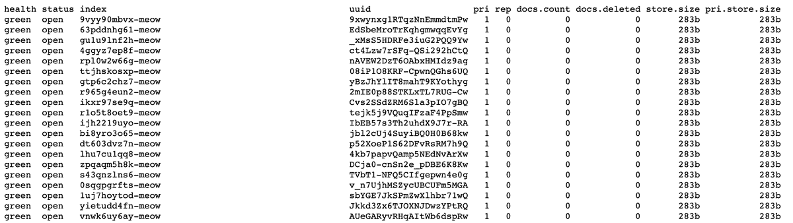
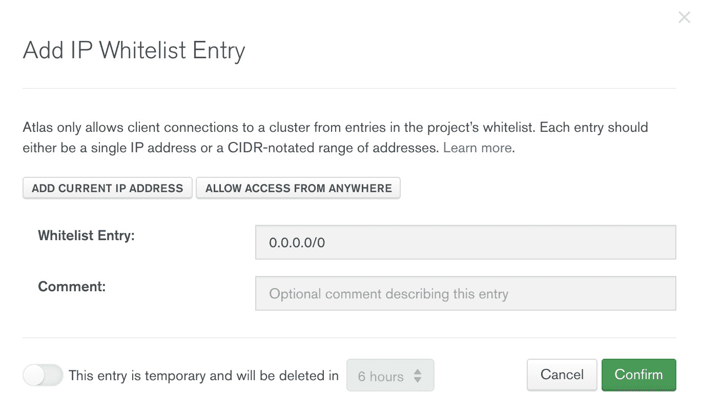

# 5 个 MongoDB 安全提示帮助远离猫咪

> 原文：<https://betterprogramming.pub/5-mongodb-security-tips-364a44f32977>

## 防止您的 MongoDB(或 MongoDB Atlas)实例被黑客攻击


在 [Unsplash](https://studio3t.com/knowledge-base/articles/mongodb-security-best-practices/%22https://unsplash.com/images/animals/cat) 上 [Tatyana Eremina](https://unsplash.com/@artyana) 拍摄的照片。

最近喵攻击不安全的 [MongoDB](https://www.mongodb.com/) 和 Elasticsearch 实例再次提醒我们需要妥善保护我们的数据库。

不像以前 MongoDB 攻击中的那些人，喵黑客不会留下任何赎金要求或便条。他们的脚本简单地删除所有数据，首先删除所有的集合，然后用指示性的`meow`字符串创建新的集合。



来源: [@MayhemDayOne](https://twitter.com/MayhemDayOne/status/1285303164116389890/photo/1)

据鲍勃·迪亚琴科称，截至 7 月 24 日，已经有 1779 个 Elasticsearch 和 701 个 MongoDB 实例被喵了。

到 7 月 25 日，这个数字已经上升到[将近 4，000 个数据库](https://www.bleepingcomputer.com/news/security/new-meow-attack-has-deleted-almost-4-000-unsecured-databases/)，其中还包括 Redis、Cassandra、CouchDB、Redis、Hadoop、Jenkins 和开放文件系统实例。

黑客攻击声称津巴布韦领先的在线支付平台和一个著名的开源 VPN 是受害者，并且[似乎有可能继续](https://www.bleepingcomputer.com/news/security/new-meow-attack-has-deleted-almost-4-000-unsecured-databases/)。

# MongoDB 安全性必须是主动的，而不是被动的

在 Studio 3T，我们偶尔会收到数据库遭到黑客攻击的客户的支持票，询问我们是否存储了他们数据的备份(我们从来没有这样做过——[我们是 MongoDB GUI](https://studio3t.com/) )。

MongoDB 安全性有两个级别:

1.  有一个数据库，您可以通过实施用户和角色访问控制、使用正确的身份验证、限制网络暴露来保护它，这些都是常见的疑点。
2.  还有客户端，对实际数据的处理，您可以通过在连接或集合级别启用只读模式、使用您自己的加密密钥存储来加密密码等等来保护这些数据。

没有人希望被黑，但预防需要行动。现在，通过在数据库和客户端采取这五个简单的步骤来证明您的 MongoDB(或 MongoDB Atlas)实例。

# 1.停止将 0.0.0.0 列入白名单，并限制受信任 IP 地址的网络暴露

这对于 MongoDB Atlas 集群来说尤其重要，它要求您在设置期间[将您的 IP 地址列入白名单。](https://studio3t.com/knowledge-base/articles/mongodb-atlas-tutorial/#set-up-a-mongodb-atlas-free-tier-cluster)

大多数用户可能首先将他们当前的 IP 地址列入白名单，但是 IP 地址通常会随着时间的推移而改变。在某些时候，您可能会遇到这样的错误:

```
Could not connect to any servers in your MongoDB Atlas cluster. Make sure your current IP address is on your Atlas cluster's IP whitelist.
```

MongoDB Atlas 有一个默认的“允许从任何地方访问”选项，将所有 IP 地址列入白名单(0.0.0.0)。这是一个不安全的选项，它向网络上的每个人授予访问权限。*不要*用这个。



MongoDB 图集截图

更安全的选择是[将一系列 IP 地址](https://studio3t.com/knowledge-base/articles/mongodb-atlas-login-ip-whitelisting/#whitelist-a-range-of-ip-addresses)、[列入多个 IP 地址](https://studio3t.com/knowledge-base/articles/mongodb-atlas-login-ip-whitelisting/#whitelist-multiple-or-additional-ip-addresses)(比如你的工作和家庭 IP 地址)，或者[定期将你当前的 IP 地址列入白名单](https://studio3t.com/knowledge-base/articles/mongodb-atlas-login-ip-whitelisting/#whitelist-your-current-ip-address)。

# 2.启用访问控制，仅授予用户他们需要的角色

如果您没有自托管 MongoDB 服务器，那么您的 MongoDB 实例已经使用 SCRAM 作为默认的身份验证机制。

有了它，用户需要首先提供登录名和密码来读取或修改数据。但是一个没有人来验证的机制有什么用呢？

如果您是用户管理员，那么通过[在您的数据库](https://studio3t.com/knowledge-base/articles/user-manager/#create-mongodb-user)中创建额外的用户，并且仅[授予他们需要的角色](https://studio3t.com/knowledge-base/articles/user-manager/#grant-mongodb-roles-to-a-user)，来使用这种先发制人的安全措施。这是传递连接字符串的更安全的替代方法。

# 3.强制进行身份验证—请记住您有多种选择

如果您自托管您的 MongoDB 服务器，那么[您必须首先启用认证](https://docs.mongodb.com/manual/tutorial/enable-authentication/)。

否则，MongoDB 会默认将`bindIp`设置为 localhost 这是 MongoDB 3.6 中引入的一个增强安全性的特性——这意味着只有您可以访问您的数据。

正如我们在第一篇技巧文章中了解到的，不要轻信将`bindIp`设置为 0.0.0.0 的简单变通方法。

对于需要比 SCRAM 更健壮的认证机制的用户，MongoDB 还支持 [x.509、LDAP 和 Kerberos](https://docs.mongodb.com/manual/core/authentication/) 。

前三点应该已经足够防喵了，但是这里有两个额外的安全措施你也可以在客户端采取。

# 4.在连接或集合级别启用只读模式

GUI 或客户端中的只读模式不能取代正确实现的访问控制。

但是，如果您不想搞砸任何事情(例如，您被合法授权访问的生产数据)，启用它仍然是一个方便的选项。

Studio 3T 允许您[在 MongoDB 集合和连接](https://studio3t.com/knowledge-base/articles/mongodb-read-only-mode/)上启用只读模式，因此您可以安心地查询集合和探索结果，不会有任何错误编辑。

# 5.使用您自己的加密密钥库加密 MongoDB 密码

MongoDB 提供了[静态加密](https://docs.mongodb.com/manual/core/security-encryption-at-rest/)，它允许数据库对数据文件进行加密，只有使用正确的解密密钥的用户才能对这些文件进行解码和访问。但只有 MongoDB Enterprise 才有。

另一种方法是使用第三方 GUI，该 GUI 支持使用您自己的密钥库进行密码加密[。与现有的默认机制相比，这是一种更安全的密码处理方式。](https://studio3t.com/knowledge-base/articles/mongodb-password-encryption/)