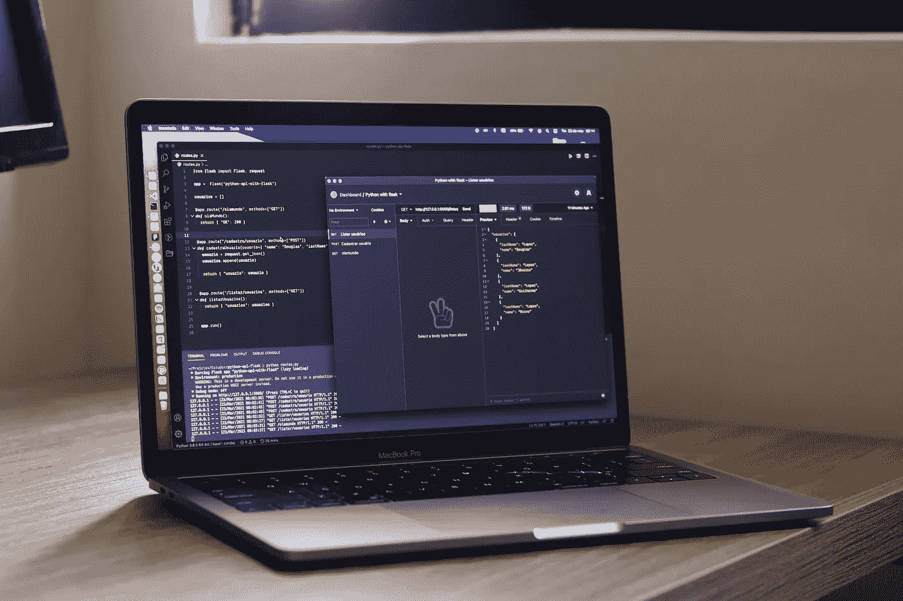
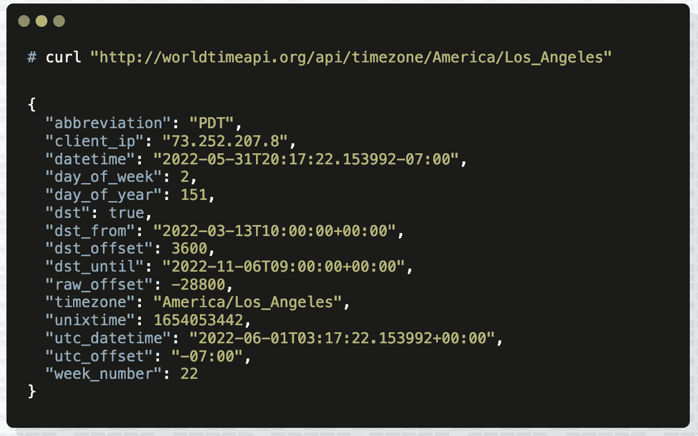

# 5 个你应该尝试的免费公共 API

> 原文：<https://betterprogramming.pub/5-more-free-public-apis-you-should-try-4e701aaf80d>

## 为你的下一个应用创意挖掘数据世界



由[道格拉斯·洛佩斯](https://unsplash.com/@douglasamarelo?utm_source=unsplash&utm_medium=referral&utm_content=creditCopyText)在 [Unsplash](https://unsplash.com/s/photos/api?utm_source=unsplash&utm_medium=referral&utm_content=creditCopyText) 拍摄

无论你是在修补一个玩具应用程序，还是在创造下一个大的 SaaS 产品，使用公共 API 都是一个常见的构建模块。你可能需要金融信息，体育统计，甚至只是天气。利用您可以支配的大量信息，可以省去重新发明轮子的麻烦。

在本文中，我们将探索一些公共的、免费的 API，它们是简单和优雅的例子。它们提供易于使用的界面，让您可以访问您需要的信息，最重要的是，不会妨碍您构建愿景。

## 1.雅虎！财务 API ( [yfinance](https://github.com/ranaroussi/yfinance) )

如果你在大多数应用商店中寻找，你会发现成堆成堆的金融应用。从股票行情插件到成熟的图表程序，一切尽在您的指尖。但是所有这些应用程序从哪里获得数据呢？

除非是有自己内部货源的大型券商平台，否则很可能用的是第三方。手机的“实时”股票行情稍有延迟并不是世界末日。所以不要让它过于复杂，使用已经存在的东西。

尽管最初的 Yahoo Finance API 在几年前就被弃用了，但是从 Yahoo Finance 获取更新数据的能力仍然存在。Python 中有一个奇妙的 API 包装器，叫做`yfinance`。这个模块可以让你在几乎没有时间的情况下开始使用雅虎财经。你甚至不需要一个账号或者 API 密匙。

以下是获取 TSLA 当前投标价格的快速示例:

```
import yfinancetsla = yfinance.Ticker('TSLA')print(tsla.info['bid'])
```

请记住，这个 API 是非官方的，一些方法只是简单地抓取雅虎财经页面。这使得库更加脆弱，所以要留意频繁的更新。查看下面的官方 GitHub:

[](https://github.com/ranaroussi/yfinance) [## GitHub - ranaroussi/yfinance:从雅虎下载市场数据！财务的 API

### 重要法律免责声明*** yfinance 不隶属于 Yahoo，Inc .,也不受其认可或审查。它是一个开源工具…

github.com](https://github.com/ranaroussi/yfinance) 

如果你正在寻找更多的金融数据应用编程接口，看看[来源](https://medium.com/u/56e17c2e870d#game-roster)。

它们还提供了一个交互式 API 工具，允许您轻松地测试它们的一些端点，并感受一下应该如何构造请求。

API 为每项运动提供了令人眼花缭乱的终点数量。你甚至可以获得 NHL 中每个镜头的实时定位统计数据。细节的程度是惊人的。虽然这个 API 在技术上不是免费的，但他们确实提供了 90 天的试用密钥。

点击这里查看官方文档。

## 3.[开放图书馆图书 API](https://openlibrary.org/dev/docs/api/books)

谁不爱一本好书？也许您正在构建一个提供书籍推荐或跟踪读书俱乐部阅读进度的应用程序。拥有一个打包数据的 API 来获取书名的细节或通过 ISBN 查找一本书，为这样的应用程序提供了一个坚实的基础。


[来源](https://openlibrary.org/static/images/openlibrary-logo-tighter.svg)。

Open Library 的 Books API 提供了一个免费的、可公开访问的接口，可以获取你最喜欢的书籍的所有精彩细节。它使用起来非常简单。如果您想获得*麦田里的守望者*的详细信息，您所要做的就是从 works API 端点抓取 JSON，如下所示:

```
curl [https://openlibrary.org/works/OL3335292W.json](https://openlibrary.org/works/OL3335292W.json)
```

你可以使用[开放图书馆搜索引擎](https://openlibrary.org/)在这个 URL 中查找 OLID。如果您已经知道这本书的 ISBN、OCLC、LCCN 或 OLID，您可以使用 Book API 并将其作为参数传递。这更加灵活，允许您使用不同的标识符来获取图书详细信息:

```
https://openlibrary.org/api/books?bibkeys=ISBN:0123456789
```

查看[文档](https://openlibrary.org/dev/docs/api/books)，获取更多关于使用其他可用端点的示例和指南。

## 4. [NHTSA 汽车 API](https://vpic.nhtsa.dot.gov/api/)

如果你能得到一份特定车型的所有品牌和型号的清单会怎么样？汽车的设备和零件号呢？如果你有一个庞大的 API，比如 NHTSA 提供的免费 API，那么建立一个定制的车辆数据目录就更容易了。


[来源](https://vpic.nhtsa.dot.gov/api/)。

使用 NHTSA 汽车应用编程接口，你可以查找大量关于汽车的信息。如果你想知道一辆 1999 年的丰田卡罗拉的 VIN 号码中的每个位置意味着什么，你可以得到它。具体的本田零件号列表呢？*搞定*。

下面是一个查询示例，它返回在 NHTSA 注册的所有车辆品牌:

```
curl [https://vpic.nhtsa.dot.gov/api/vehicles/getallmakes?format=json](https://vpic.nhtsa.dot.gov/api/vehicles/getallmakes?format=json)
```

它们还提供了另一个独特的端点，返回给定品牌和车型年份的所有车辆型号。例如，如果您想查找 1999 年发布的所有丰田车型，您可以执行:

```
curl [https://vpic.nhtsa.dot.gov/api/vehicles/getmodelsformakeyear/make/toyota/modelyear/1999?format=json](https://vpic.nhtsa.dot.gov/api/vehicles/getmodelsformakeyear/make/honda/modelyear/2015?format=json)
```

查看 NHTSA API 官方文档[，此处](https://vpic.nhtsa.dot.gov/api/)。

## 5.[世界时间 API](http://worldtimeapi.org/)

如果有一件事总是让开发者头疼，那就是*时间*。我们永远不会满足。不仅如此，转换和考虑时区和时间变化也是一项繁重的工作。这就是为什么你应该把你的时间需求外包给像 [WorldTimeAPI](http://worldtimeapi.org) 这样的第三方 API。



WorldTimeAPI 结果。[来源](http://worldtimeapi.org/)。

使用 WorldTimeAPI，你可以得到一个时区列表，得到一个时区的当前时间，甚至得到一个已知的公共 IP 地址的当前时间。这个 API 也是完全免费的，不需要帐户或注册。

如果你想知道洛杉矶的当前时间，你只需点击:

```
curl [http://worldtimeapi.org/api/timezone/America/Los_Angeles](http://worldtimeapi.org/api/timezone/America/Los_Angeles)
```

如果您想获得自己 IP 的当前时间，您可以:

```
curl http://worldtimeapi.org/api/ip
```

查看[官方文档](http://worldtimeapi.org/pages/examples)和[常见问题](http://worldtimeapi.org/pages/faqs)了解使用细节。

感谢阅读！如果您错过了本系列的第一部分，请查看:

*   [*9 个免费公共 API 和数据库你应该试试*](/10-free-public-apis-and-databases-you-should-try-acab88bdbfee)