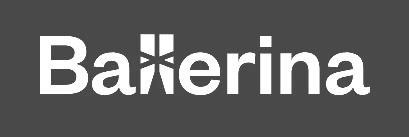

# 你忽略的 5 种更具创新性的编程语言

> 原文：<https://betterprogramming.pub/5-more-innovative-programming-languages-you-overlooked-6dd0f1730e35>

## 百合、水银等等


沙敏·哈基在 [Unsplash](https://unsplash.com/s/photos/programming?utm_source=unsplash&utm_medium=referral&utm_content=creditCopyText) 上拍摄的照片

在计算机编程历史的进程中，有无数种为各种特殊目的而创造的语言。有用于建立网站、创建桌面软件、运行服务器和许多其他任务的编程语言。当一种语言不能为某事提供足够的灵活性时，另一种语言就出现了，试图克服它的不足。

有些语言经受住了时间的考验。Java、C++、Python、JavaScript 和其他一些语言已经经历了几代的更新和增强，成为拥有巨大支持社区的单一语言。

那些错过了这些受欢迎机会的人呢？

有专门贡献者构建独特东西的小型语言呢？

在本文中，我们将揭示编程语言世界中昏暗的角落。我们将研究一些语言，它们是软件开发中创新和无限可能性的极好例子。

## 1.[水星](https://mercurylang.org/)


[来源](https://mercurylang.org/)。

Mercury 是一种函数式的、静态的、强类型化的语言，其起源可以追溯到 1995 年的澳大利亚。这种语言类似于 Prolog 和 Haskell，但在副作用等方面似乎更严格。

Mercury 声称速度非常快，效率也非常高:

> " Mercury 是一种纯逻辑编程语言，旨在创建大型、快速、可靠的程序."
> 
> — [水星官网](https://mercurylang.org/about.html)

Mercury 文档列出了这种有趣语言的几个好处:

*   *“Mercury 是纯声明性的:Mercury 中的谓词和函数没有非逻辑的副作用。”*
*   “Mercury 是一种强类型语言。”
*   “水星是一种强烈模式化的语言。”
*   *“水星有很强的决定论体系。”*
*   *“水星有一个模块系统。”*
*   “Mercury 支持高阶编程，有闭包、currying 和 lambda 表达式。”
*   *水银的效率很高。*”

Mercury 是一种非常固执己见的语言(就像 Haskell 一样)，而且相当严格。然而，这种刚性是速度、效率和精度的折衷。如果您正在构建一个大型应用程序，并且需要高度的速度和准确性，那么 Mercury 可能是一个不错的选择。

查看官方 [Mercury GitHub](https://github.com/Mercury-Language/mercury) 了解更多详情。

## 2.[松鼠](http://squirrel-lang.org/)


[来源](http://squirrel-lang.org/)。

多可爱啊，一种以我最喜欢的动物之一命名的语言。在可爱的名字背后，实际上是一种非常健壮的面向对象的脚本语言。这种雄心勃勃的编程语言的目标是提供更轻量级的内存，以便在视频游戏应用程序的限制下更好地执行。

松鼠语言从 C、C++、Java、Python 和 Lua 中获得灵感。相当强大的语言组合。一旦你看了代码，就开始理解灵感是如何融合在一起的:[http://squirrel-lang.org/#look](http://squirrel-lang.org/#look)。

语法看起来像是 C 语言，但又有 Python 的灵活性。

这些流行的 Valve 视频游戏中有几个使用了 Squirrel，主要是因为实现了 [VScript](https://developer.valvesoftware.com/wiki/VScript) :

*   *左 4 死 2*
*   *顶点图例*
*   *传送门 2*

## 3.[瓦拉](https://wiki.gnome.org/Projects/Vala)


[来源](https://wiki.gnome.org/Projects/Vala)。

Vala 是作为一种更灵活的语言开发的，用于构建 GNOME T21 应用程序。目的是减少对许多外部运行时和库的依赖，其他语言需要这些来完成类似的任务。

Vala(最终编译成 C)的语法非常简单，省略了 C 等传统语言中的许多样板要求:

```
void main () {
	print ("hello\n");
}
```

如果您正在构建 GTK 应用程序，Vala 也是一个不错的选择。GTK 官方网站有[一个很好的示例项目，可以从](https://www.gtk.org/docs/language-bindings/vala/)开始，展示在 GTK 上使用 Vala 是多么容易。

Vala 似乎拥有强大的社区支持，并且仍然定期发布。查看官方 [Vala 文档](https://www.vala-project.org/doc/vala/)了解使用细节，并访问 [Vala subreddit](https://www.reddit.com/r/vala/) 参与社区。

## 4.[芭蕾舞演员](https://ballerina.io/)



[来源](https://ballerina.io/)。

这是一种非常有趣的面向云应用的语言。虽然它不是很老(最初在 2015 年设计，并在 2017 年宣布)，但这个概念现在如此相关和重要，令人震惊的是，它没有更早地存在。该语言旨在使构建和维护云应用程序变得简单快捷。

在 Java 或 Python 等传统语言中，网络和应用服务组件必须从零开始构建(禁止使用其他第三方库)。在芭蕾舞中，这些外部成分已经成为语言本身的一部分。

构建 HTTP 服务器和并发应用程序现在是设计的基本部分。

在下面的例子中([列在芭蕾舞演员官方网站](https://ballerina.io/learn/getting-started-with-ballerina/))，它展示了创建一个简单的 REST API 是多么的简洁:

```
import ballerina/http;

listener http:Listener httpListener = new (8080);

service / on httpListener {
    resource function get greeting() returns string { 
        return "Hello, World!"; 
    }

    resource function get greeting/[string name]() returns string { 
        return "Hello " + name; 
    }
}
```

由于这种新的编程语言还很年轻，所以它会定期发布并最终获得更广泛的采用也就不足为奇了。

前往[官方芭蕾舞演员 GitHub](https://github.com/ballerina-platform/ballerina-lang) 开始。

## 5. [LilyPond](https://lilypond.org/)


[来源](https://lilypond.org/)。

虽然不是真正独立的编程语言，但 LilyPond 应用程序的配置语言非常有趣。这种语言的建立是为了促进最高质量的音乐配乐。使用 LilyPond，你可以通过内置的类似于 [TeX](https://en.wikipedia.org/wiki/TeX) 的语言创建乐谱，这比其他无菌应用程序更具美感。

> “LilyPond 是在两位音乐家想要超越电脑打印的无灵魂乐谱时产生的。音乐家更喜欢阅读优美的音乐，那么为什么程序员不能编写软件来生产优雅的打印零件呢？”
> 
> — [LilyPond 官网](http://lilypond.org/introduction.html)

LilyPond 语言本身看起来有点难，但是您可以使用这段代码生成一个乐谱的事实真的很酷。有许多与 LilyPond 的集成，你甚至可以将制作的乐谱的声音剪辑嵌入到 MediaWiki 页面中。

点击这里查看语言语法分类。

感谢您的阅读！如果你想学习更酷的编程语言，请查看:

*   [*4 种你可能不知道的奇怪编程语言*](https://levelup.gitconnected.com/4-strange-programming-languages-you-probably-didnt-know-about-c01381fcc29)