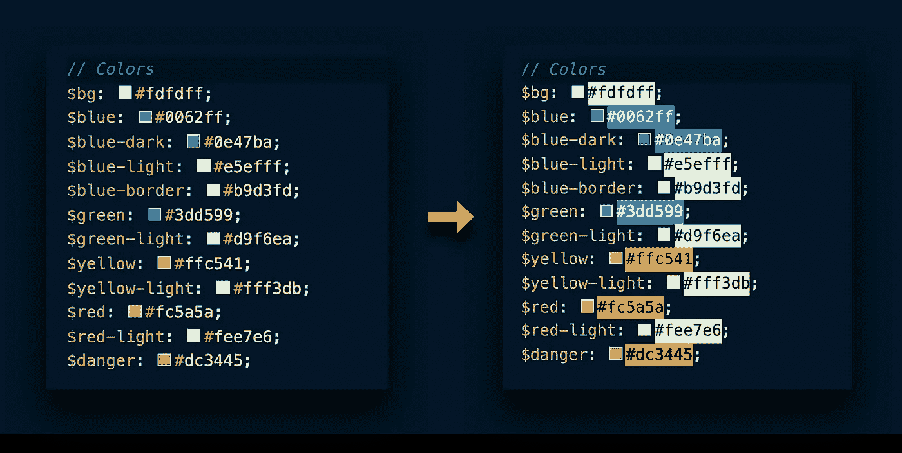
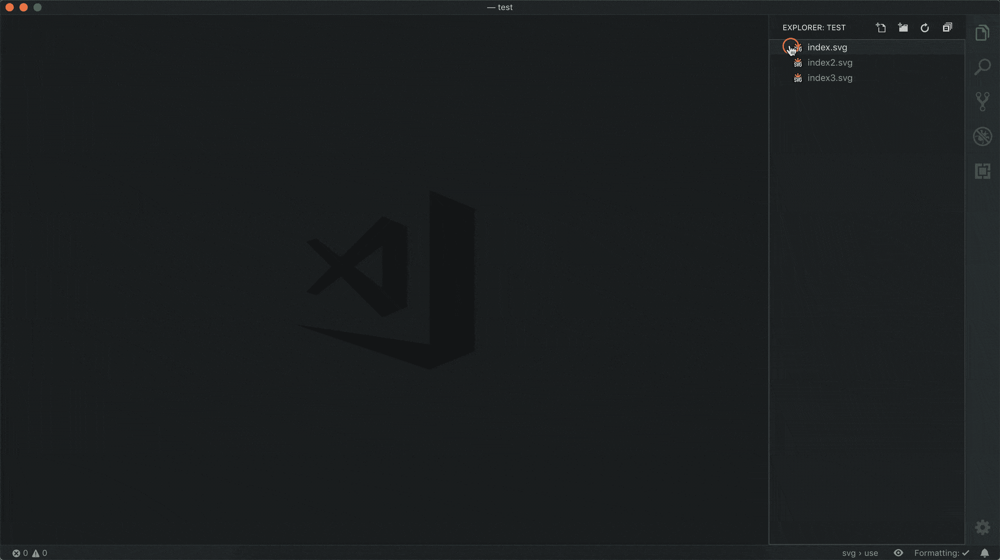
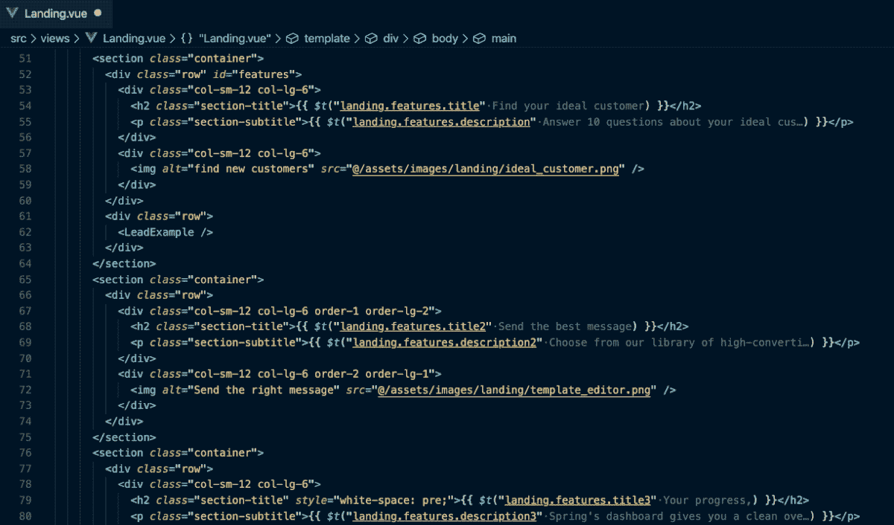
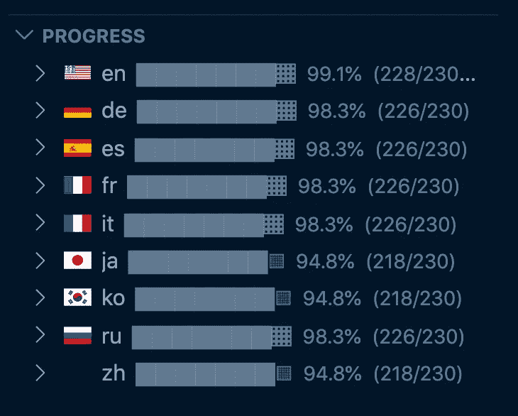
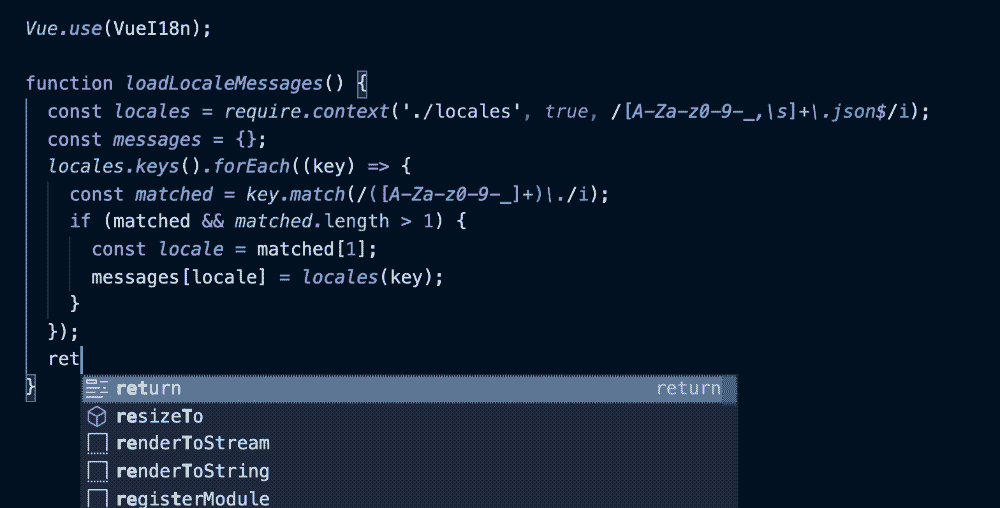
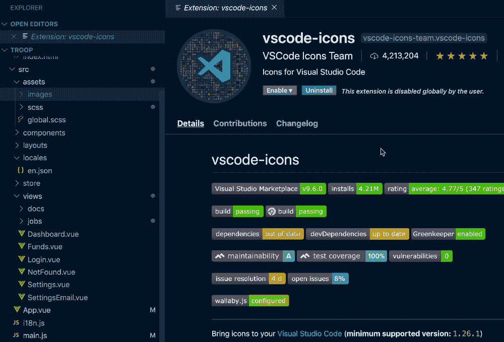

# 5 个 VS 代码扩展将改变您的开发生活

> 原文：<https://betterprogramming.pub/5-more-vs-code-extensions-thatll-change-your-dev-life-16da5d563dbc>

## 节省的时间越多，做的工作就越多

由[比尔](https://beeple-crap.com)

错过了我的前五个策划 VS 代码扩展？[看到这里](https://medium.com/better-programming/5-vs-code-extensions-thatll-change-your-dev-life-9786756a8121)。

# 1.彩色高光

谁能记住所有那些十六进制代码？不是我。

VS 代码给了我们一个小的颜色框作为参考，但是它不够大，不足以衡量相似颜色之间的差异。颜色高亮通过用颜色包裹每个十六进制代码给我们一个更大的预览。

拿到这里:[颜色高亮](https://marketplace.visualstudio.com/items?itemName=naumovs.color-highlight)。

[颜色高亮](https://marketplace.visualstudio.com/items?itemName=naumovs.color-highlight)

# 2.SVG 预览

VS 代码有一个内置的图像预览窗口，但是当你点击一个`.svg`文件时，它只是显示代码。

使用 SVG 预览，您可以获得一个额外的侧窗口来预览您的图像，甚至在您对 SVG 代码进行更改时进行更新。

忘记打开 Sketch 或 Illustrator 来编辑 SVG。现在，您可以直接在 VS 代码中进行所有的更改。

拿到这里: [SVG 预览](https://marketplace.visualstudio.com/items?itemName=SimonSiefke.svg-preview)。

[**SVG 预览**](https://marketplace.visualstudio.com/items?itemName=SimonSiefke.svg-preview)

# 3.国际联盟

几个月前我开始使用 i18n，我不得不说，它使我的 web 应用程序本地化成多种语言变得非常容易。

唯一的困难是你不能在你正在处理的文件中编辑翻译。

相反，你必须打开你的`locales/language.json`文件，向下滚动到正确的位置，然后在那里编辑你的文本(到那时你已经忘了你在找什么)。

i18n Ally 为您提供了基本语言文本的内嵌预览，允许您直接从模板内部创建新的键、查看现有的键以及编辑它们。

拿到这里: [i18n 盟友](https://marketplace.visualstudio.com/items?itemName=antfu.i18n-ally)。

[i18n 盟友](https://marketplace.visualstudio.com/items?itemName=antfu.i18n-ally)

i18n Ally 还附带了这个漂亮的侧边栏显示(见上图),向您展示您离完成项目的本地化还有多远。

# 4.代码拼写检查器

你总是看到它。像`mesages`和`defalt costants`这样拼写错误的代码。

不要成为那些开发者中的一员。获得代码拼写检查，让你和你的同事生活更轻松。它还可扩展支持荷兰语、加泰罗尼亚语、捷克语、法语、德语、俄语、西班牙语、瑞典语和医学术语词典。

在这里获得:[代码拼写检查器](https://marketplace.visualstudio.com/items?itemName=streetsidesoftware.code-spell-checker)。

[代码拼写检查器](https://marketplace.visualstudio.com/items?itemName=streetsidesoftware.code-spell-checker)

# 5.JavaScript 加速器

还记得你在 JS 中做的那些重复的、令人麻木的任务吗？

现在，只需点击一下鼠标就可以实现自动化。每当你看到灯泡出现在左边，只需按下它(或使用自定义热键)来学习如何转换光标下的代码。它甚至支持 TypeScript！

拿到这里: [JavaScript Booster](https://marketplace.visualstudio.com/items?itemName=sburg.vscode-javascript-booster) 。

[JavaScript 助推器](https://marketplace.visualstudio.com/items?itemName=sburg.vscode-javascript-booster)

还有一个额外的必备扩展！

# VS 代码图标

目前有超过 400 万的用户，你可能已经在使用它了，这就是为什么它在这个列表上是一个额外的奖励。

如果你不是，现在就安装它，让你在长长的文件和文件夹列表中找到你想要的东西的速度快十倍。

它为每种文件类型添加了独特的图标，使文件搜索成为一个直观而简单的过程。我有没有提到有大量的图标主题可供选择？

拿到这里: [VS 代码图标](https://marketplace.visualstudio.com/items?itemName=vscode-icons-team.vscode-icons)。

[VS 代码图标](https://marketplace.visualstudio.com/items?itemName=vscode-icons-team.vscode-icons)

这篇文章是我上一篇文章 [5 VS 代码扩展将改变你的开发生活](https://medium.com/better-programming/5-vs-code-extensions-thatll-change-your-dev-life-9786756a8121)的续篇。

感谢阅读！