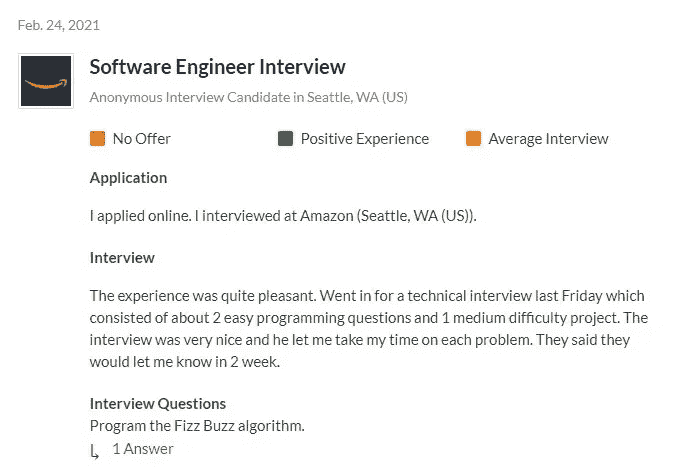

# 亚马逊软件工程师面试中最常被问到的 5 个问题

> 原文：<https://betterprogramming.pub/5-most-commonly-asked-questions-during-the-amazon-software-engineer-interview-c3c03a42a6e3>

## 分析了超过 1300 个经历过这个过程的人的个人经历

由[邪恶星期一](https://unsplash.com/@wickedmonday?utm_source=medium&utm_medium=referral)在 [Unsplash](https://unsplash.com/?utm_source=medium&utm_medium=referral) 拍摄的照片。

在之前的一篇文章中，我分析了超过 300 份个人采访，这些采访来自那些在脸书完成[数据科学家采访的人。现在，我回到第 2 部分，来讨论科技界最抢手的职位之一:亚马逊的软件工程师。这一次，我能够查看 1300 多条经验。](https://medium.com/analytics-vidhya/5-most-asked-questions-during-a-data-scientist-interview-at-facebook-755995f83e09)

你可能想知道，我是如何找到 1300 人亲自参加亚马逊软件工程师面试的。

这都要感谢玻璃门。

# 玻璃门

Glassdoor 是一个网站，现在和以前的员工可以匿名评论公司。更进一步，这些员工可以讨论面试过程和他们被问到的问题。

通过分析近 1300 个这样的讨论，我找到了在亚马逊软件工程师面试中最常被问到的五个问题。

# 1.二叉树

看起来亚马逊非常重视了解二叉树的来龙去脉，因为这是我看到的最常见的问题。大多数(如果不是全部的话)问题都与遍历、操作、阅读或逐层构建二叉树有关。

最常见的逐字逐句的二叉树问题是“写一个函数来检查二叉树是否是二叉查找树”

其他二叉树问题的例子有:

*   给定根节点和二叉查找树中任意两个节点的值，返回包含这两个节点的最小子树作为`TreeNode`
*   给定两组树，忽略节点的内容，描述定义这两棵树是否等效的规则
*   "给定一个二叉查找树，计算树中所有节点的总和."
*   给定一棵树，将其序列化为一个字符串，该字符串可以在以后被解析并用于重建原始树

Todd Quackenbush[在](https://unsplash.com/photos/XBxQZLNBM0Q) [Unsplash](https://unsplash.com/) 上拍摄的照片。

对于类似的二叉树面试问题，请查看以下来源:

*   [二叉树—面试问题和练习题](https://medium.com/techie-delight/binary-tree-interview-questions-and-practice-problems-439df7e5ea1f)
*   [程序员 40 大二叉树编码面试问题](https://www.java67.com/2020/02/top-40-binary-tree-interview-questions.html)
*   [27 个二叉树面试问题(用代码解决)Devs 必须知道的](https://www.fullstack.cafe/blog/binary-tree-interview-questions)

# 2.系统设计

问任何人，他们都会告诉你系统设计或软件设计问题是任何面试不可或缺的一部分。而要想做好，就要准备好这些题。

系统设计问题是亚马逊面试中第二常见的问题。问题范围从设计推荐播放器到设计新闻网站。

被问到的系统设计问题的一些例子是:

*   "设计一个两像素游戏的实现——特别是如何在一个益智游戏中实现移动盒子."
*   "你将如何设计描述数学表达式的面向对象类？"
*   "你将如何开始为电梯系统设计软件？"
*   "你将如何为亚马逊设计一个‘最近浏览的商品列表’类型的功能？"

[UX 店](https://unsplash.com/photos/jJT2r2n7lYA)在 [Unsplash](https://unsplash.com/) 上拍照。

对于类似的系统设计面试问题，请查看以下来源:

*   [25 个软件设计面试问题，破解任何编程和技术面试](https://medium.com/javarevisited/25-software-design-interview-questions-to-crack-any-programming-and-technical-interviews-4b8237942db0)
*   [6 个常见系统设计面试问题(附示例答案)](https://www.indeed.com/career-advice/interviewing/system-design-interview-questions)
*   [十大系统设计面试问答](https://www.geeksforgeeks.org/top-10-system-design-interview-questions-and-answers/)

# 3.数组编码问题

在整个访谈过程中，涉及阵列的技术问题非常常见。没必要担心，因为大多数问题都不复杂。它们更像是你会在大学二年级或三年级看到的问题。

问题的范围从索引、操作和子集化数组到连接或合并两个不同的数组。

提问的一些阵列问题示例如下:

*   “如果我给你一个由 N 个整数组成的数组，找出产生最大乘积的三个最大的数字。”
*   给定一个整数数组，它们首先按严格递增的顺序排列，然后在某一点之后按严格递减的顺序排列，求该数组中的最大值。比如 *[3，6，8，13，20，35，33，30，21，17，14，2，1，-2] : 35* 就是这个数组中的最大值。”
*   给定两个整数列表，编写一个函数，如果数组中有两个数字，并且它们的和是给定的数字，则该函数返回`true`
*   “你和一个对手轮流选择数字——或者是未排序数组中的第一个或者是最后一个元素——所有的数字都用完了。获胜者将是一个谁有一个更大的累计总数挑选的数字。对算法进行编码，让 1 号玩家成为赢家。”

[大卫·克洛德](https://unsplash.com/photos/HaxrCVb1FEE)在 [Unsplash](https://unsplash.com/) 上的照片。

对于包含数组问题的类似面试问题，请查看以下来源:

*   [面试 50 大数组编码问题](https://www.geeksforgeeks.org/top-50-array-coding-problems-for-interviews/)
*   [程序员前 30 名数组面试问答](https://javarevisited.blogspot.com/2015/06/top-20-array-interview-questions-and-answers.html#axzz6o231hjXw)
*   [20+数组编码问题和编程访谈提问](https://medium.com/javarevisited/20-array-coding-problems-and-questions-from-programming-interviews-869b475b9121)

# 4.个人项目

任何面试的主要内容都是询问与过去的经历和项目相关的问题。我获得的数据证实了这一点，因为与一个人过去做过的项目有关的问题是第四大最常见的问题。

出现的项目问题更多的是表层和基础的，而不是需要深入和高层次的解释。

所提问题的一些例子是:

*   “有一次你在自己的项目中冒了风险，结果如何？”
*   "描述一个项目中最困难的部分，以及你是如何解决的."
*   “当你的项目临近截止日期，但你仍有许多部分未完成时，你有经验吗？你是怎么处理的？”
*   “描述一个你做过的具有挑战性的项目或工作。这个项目最大的收获是什么？”

由 [Sigmund](https://unsplash.com/photos/4UGmm3WRUoQ) 拍摄的 Unsplash 照片。

对于类似的项目面试问题，请查看以下来源:

*   软件开发人员在工作面试中应该想到的 10 个问题
*   [问软件工程师的 17 个顶级面试问题(2021)](https://www.apollotechnical.com/interview-questions-to-ask-software-engineer/)
*   [软件工程师面试问题雇佣合适的开发人员](https://www.codementor.io/blog/software-engineer-interview-questions-3ey7wme14h)

# 5.链表编码问题

> 链表是数据元素的线性集合，其顺序不是由它们在内存中的物理位置给出的。相反，每个元素都指向下一个。”— [维基百科](https://en.wikipedia.org/wiki/Linked_list)

与链表相关的问题围绕着不同链表的迭代、反转、排序和操作。

被问到的链表问题的一些例子是:

*   "你如何找到一个链表的中间元素？"
*   "递归和迭代地反转一个链表."
*   "在一个链表上实现深度复制，其中的节点也有一个指向随机的其他节点的指针."
*   "在链表中找到倒数第*个*元素."

来自 Unsplash 的照片由 [Tamanna Rumee](https://unsplash.com/photos/vn4dC0yFtg8) 拍摄。

对于类似的链表面试问题，请查看以下来源:

*   [20 强链表面试问题](https://www.geeksforgeeks.org/top-20-linked-list-interview-question/)
*   [17 大链表面试问题&答案](https://career.guru99.com/top-17-linked-list-interview-questions/)
*   [10 个必知链表面试问题](https://www.journaldev.com/43951/linked-list-interview-questions)

# 感谢阅读！

我希望这篇文章能帮助任何想成为亚马逊或其他大型科技公司软件工程师的人。

请在下面写下你希望我接下来在哪个职位和哪个公司工作，因为在不久的将来我会写第三部分。

# 访问用于查找 5 个问题的代码

如果你有兴趣使用我用来为自己找到 5 个最常问的问题的代码，你可以加入我的群**“Clean Code Z”**，加入你将获得我在所有文章和视频中使用的代码的完整评论版本。

感受感受加入这里: [**洁码 Z**](http://wondrous-originator-2391.ck.page/cleancodez)