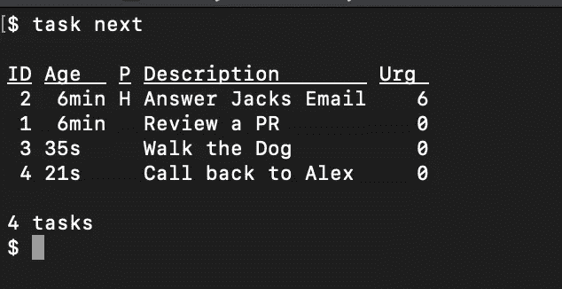
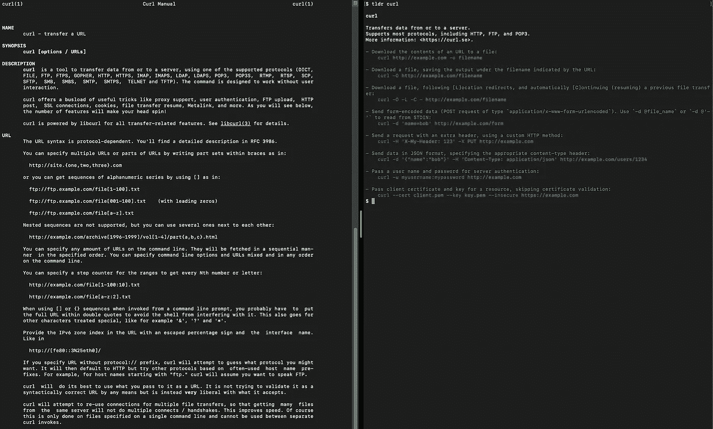
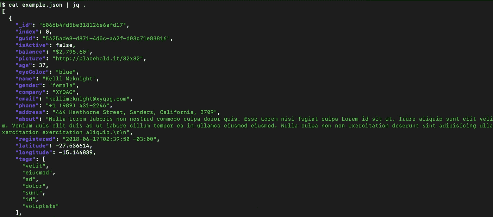
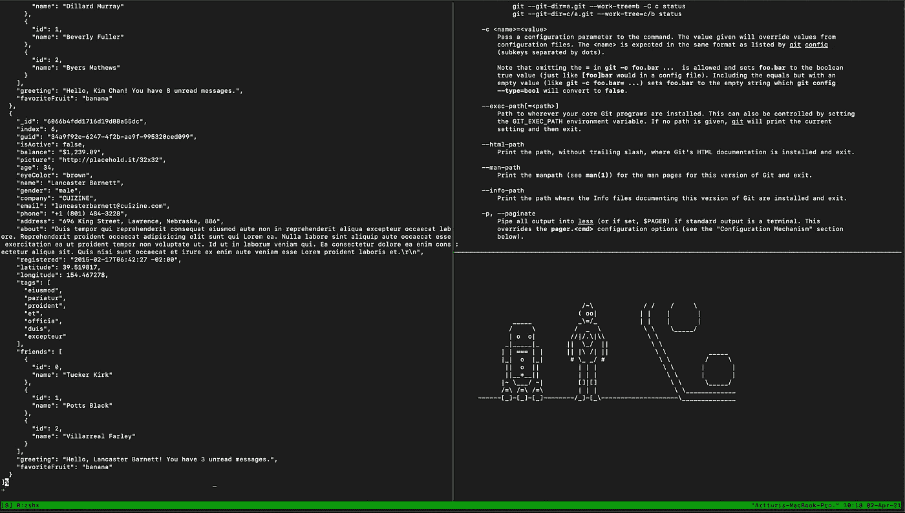

# 命令行爱好者必备的 5 个自制软件包

> 原文：<https://betterprogramming.pub/5-must-have-homebrew-packages-for-command-line-lovers-d3d18c48199a>

## 使用这些神奇的命令行工具，让您的编码生活更加轻松


[Troy 陈](https://unsplash.com/@cbben?utm_source=medium&utm_medium=referral)在 [Unsplash](https://unsplash.com?utm_source=medium&utm_medium=referral) 上的照片。

# 1.任务战士

提供了一个方便的命令行待办事项管理器



用 taskwarrior 构建的待办事项列表示例。

## 装置

```
brew install task
```

## 用法示例

一旦安装了`taskwarrior`，打开一个终端窗口，将两个示例任务添加到您的待办事项列表中:

```
task add Review a PR
task add priority:H Answer Jacks Email
```

查看下一个任务:

```
task next
```

将第二个任务标记为`done`，删除第一个任务:

```
task 2 done
task 1 delete
```

# 2.tldr

如您所知，Unix 手册页通常包含大量您从不需要的冗长说明。幸运的是，有一个名为`[tldr](https://tldr.sh/)`的社区驱动的命令行工具，它只过滤与你最相关的东西。



左边是 cURL 的普通 Unix 手册页，右边是 TLDR 版本。你会选哪一个？

## 装置

```
brew install tldr
```

## 用法示例

通过键入`tldr`和需要帮助的命令来使用`tldr`。例如:

```
tldr curl
```

# 3.htop

`[htop](https://htop.dev/)`是一个彩色编码的命令行系统监视器、进程查看器和进程管理器。它显示了计算机上运行的进程列表，按 CPU 使用率排序。


颜色编码的 [htop](https://htop.dev/images/htop-2.0.png) 流程视图

## 装置

```
brew install htop
```

## 用法示例

要启动并运行`htop`，打开一个终端窗口并运行:

```
htop
```

在`htop`视图底部提供的简单说明的帮助下，您可以尝试使用`htop`。

比如过滤任务，按`F4`键，输入一个标准，过滤掉不必要的你不感兴趣的任务。

# 4.japan quarterly 日本季刊

`[jq](https://stedolan.github.io/jq/)`是一个轻量级、灵活的命令行 JSON 处理器。对于熟悉 sed 的人来说，`jq`就像是处理 JSON 数据的 sed。通过过滤、映射、切片等，可以很容易地转换 JSON 数据。



用 jq 检查一个示例 JSON 文件。

## 装置

```
brew install jq
```

## 用法示例

假设您有一个名为`example.json`的文件，您想使用`jq`查看它的格式:

```
cat example.json | jq '.'
```

现在，假设您只想查看 JSON 数据的第一个元素:

```
cat example.json | jq '.[0]'
```

或者访问第一个对象中名为`greeting`的字段:

```
cat example.json | jq '.[0]["greeting"]'
```

# 5.tmux

`[tmux](https://github.com/tmux/tmux/wiki)`是终端复用器。它允许您在一个终端视图中打开多个终端会话。



一个分成三部分的终端窗口。

是的，有现代的终端应用程序，如 iTerm2 for Mac，可以做完全相同的事情。但是如果你不在 Mac 上或者你在服务器上，iTerm2 可能不适合你。因此，安装`tmux`会很有用。

## 装置

```
brew install tmux
```

## 用法示例

使用以下命令在终端中启动`tmux`会话:

```
tmux
```

首先用`control + B`激活`tmux`，然后键入`%`，垂直分割屏幕(在 Mac 上)。

首先用`control+B`激活`tmux`，然后输入`"`，水平分割屏幕(在 Mac 上)。

首先用`control + B`激活`tmux`，然后按箭头键，导航分屏(在 Mac 上)。

退出与以下用户的会话:

```
exit
```

# 结论

感谢阅读。

希望你觉得有用。请随意发表评论，让人们了解你个人最喜欢的工具。

附注:一定要把我的新帖子收进你的收件箱。 [***在这里做***](https://artturi-jalli.medium.com/subscribe) *！还有，在 Medium 上阅读更多世界级的故事，可以考虑* [***成为会员***](https://artturi-jalli.medium.com/membership) *。每月只需 5 美元。此外，你的写作也能赚钱。当我开始做* ***的时候，我用编程文章在前 6 个月赚了 5000 美元*** *。通过注册* [***这个链接***](https://artturi-jalli.medium.com/membership) *，你可以用你的一部分费用来支持我，不需要你额外付费。如果你这样做了，非常感谢！*

# 你可能会感兴趣

[](https://medium.com/swlh/10-awesome-terminal-tips-tricks-for-mac-users-1d6698ac43a2) [## 给 Mac 用户的 10 个非常棒的终端提示和技巧

### 学习这 10 个你不知道的超级有用的终端命令。

medium.com](https://medium.com/swlh/10-awesome-terminal-tips-tricks-for-mac-users-1d6698ac43a2)