# 你可能不知道的 5 个必须知道的 JavaScript 特性

> 原文：<https://betterprogramming.pub/5-must-know-javascript-features-that-you-might-not-know-cc957f7293fc>

## 让我们来学习一些很酷的 JavaScript 技巧，让你的代码看起来和运行起来更好


Nubelson Fernandes 在 [Unsplash](https://unsplash.com?utm_source=medium&utm_medium=referral) 上拍摄的照片。

你有没有被一个开发人员使用一些你从未见过的很酷的 JavaScript 特性而感到惊讶？嗯，我经常遇到这种事。由于编程就是不断学习，我相信你在某个时候也有同样的感觉。

在本文中，我将分享我经常使用的五个 JavaScript 特性，它们帮助我的代码看起来更整洁。让我们开始吧。

# **1。零化合并算子(？？)**

这是来自 MDN 网络文档的官方定义:

> **无效合并运算符(** `**??**` **)** 是一个逻辑运算符，当其左侧操作数为`null`或`undefined`时，返回其右侧操作数，否则返回其左侧操作数

为了理解这个运算符，我们举个例子。

假设我们有一个简单的 JavaScript 函数，它接受三个参数(`price`、`taxes`和`description`)，并在控制台中简单地打印一件商品的含税总价。大概是这样的:

```
function calculatePrice(*price*, *taxes*, *description*) { const total = *price* * (1 + *taxes*) console.log(`${*description*} with tax : ${total}`);}calculatePrice(10, 0.5, 'My Item');
```

如果我们执行上面的代码，它将在浏览器控制台中打印这些值，如下所示:

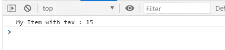

很简单，对吧？

现在让我们假设我们想要在我们的`calculatePrice()`函数中设置这些参数的默认值。如果我们用`undefined`或者`null`的值调用这个函数呢？它将什么也做不了，我们的逻辑可能会崩溃。让我们试试这个:

```
calculatePrice(undefined, null, undefined);
```

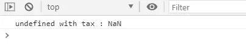

所以它无法执行逻辑，我们没有得到预期的值，这在现实世界的应用程序中肯定是不可接受的。

为了应对这一挑战，开发人员通常使用`*||*`操作符，如下所示:

如果我们执行代码，它将按预期工作:

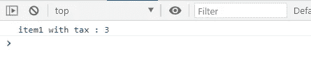

所以基本上，如果左边的值是`null`或`undefined`，那么`*||*`操作符就使用右边的值。这很好。

但是,`*||*`的问题是它也认为`0`和一个空白字符串是`undefined`。让我们尝试在函数中传递`0`和一个空字符串:

```
calculatePrice(0, null, ‘’);
```


为了解决这个问题，我们可以使用 nullish 合并操作符(`??`)，它的工作方式类似于`*||*`操作符，但是它不会将`0`和空白字符串视为`null`或`undefined`。

现在让我们用`??`运行之前的代码:

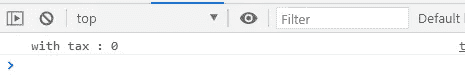

它按预期打印值。因此，如果你曾经面临类似的情况，请使用`??`。

# 2.使用%c 将 CSS 应用到控制台

开发者知道浏览器控制台有多重要。每当我们必须检查代码中的任何内容时，我们只需在控制台中打印它的值。

但是你有没有想过我们是否可以设计我们的游戏机？除了看到纯文本，如果我们能让它变得有点花哨呢？

是的，这听起来很疯狂，但这是非常可能的。在`%c`的帮助下，我们可以在控制台上实现任何 CSS 属性。我们只需要这样做:

```
console.log(`%c This is red text`, ‘color: red’);
```

这是我们控制台的输出:

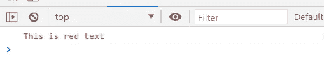

我们只需将`%c`放在我们想要设置样式的文本之前，并在控制台的下一个参数中传递所需的 CSS。

我们可以在控制台中使用不止一个`%c`来设计不同文本的样式。例如:

```
console.log(`%c This is red text %c This text is Green and Bold`, ‘color: red’, ‘color: green; font-weight: bold’);
```

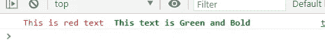

我们可以使用任何 CSS 来改变我们的控制台输出，这是非常有用的。

# 3.可选链接(？。)

为了理解这个运算符，我们再举一个例子。我们有一个带有一些细节的`person`对象:

如果我们执行这段代码，它将简单地在控制台中打印出`street`值:

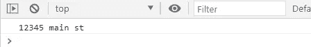

非常简单。但是如果`address`属性在`person`对象中不存在呢？在这种情况下，我们的代码将失败并生成一个错误:

```
let person = { ‘name’: ‘Gourav’, ‘hobbies’: [‘Sleeping’, ‘Do nothing’]}console.log(person.address.street);
```

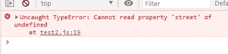

这是几乎每个开发人员在其职业生涯中都面临的一个非常常见的场景。如果我们不处理这个问题，我们现实应用中的一些代码将无法工作。这又是一个谁都不想面对的情况。

您可能会通过使用`*&&*`操作符检查每个属性是否都存在于我们的对象中来处理这个问题:

```
console.log(person && person.address && person.address.street);
```

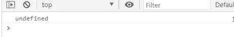

这种用`*&&*`条件检查每个房产的方式太烂了。幸运的是，JavaScript 提供了处理这种情况的更好方法:

> **可选链接**操作符(`**?.**`)允许读取位于连接对象链深处的属性值，而不必明确验证链中的每个引用是否有效。`?.`操作符的功能类似于`.`链接操作符，除了如果引用是 nullish ( `null`或`undefined`)时不会导致错误，表达式会用返回值`undefined`短路。当与函数调用一起使用时，如果给定的函数不存在，它将返回`undefined`。— [MDN 网络文档](https://developer.mozilla.org/en-US/docs/Web/JavaScript/Reference/Operators/Optional_chaining)

所以我们可以用更好的方式编写代码:

```
console.log(person?.address?.street);
```

它会输出同样的东西:


幸运的是，除了检查对象的属性之外，还可以使用可选链接。它也可以用在函数上。

假设我们调用了代码中不存在的名为`printTaxes()`的函数。在这种情况下，我们会在浏览器的控制台中看到一个错误，说明该函数未定义。

如果不确定某个函数是否存在，我们可以使用可选链接:

```
printTaxes?.();
```

它将检查`printTaxes()`是否不仅存在于我们的代码中，而且它是否也是一个函数。

我们甚至可以对数组使用可选的链接。

例如，如果我们想要打印一个数组的第一个元素，但是我们甚至不确定这个数组是否存在，那么我们可以使用这样的代码:

```
console.log(array?.[0]);
```

# 4.使用与对象键和值相同的名称

让我们再举一个例子来理解我想要解释的东西。在做任何事情之前，让我们先看看下面的代码:

我们只有两个变量(`name`和`profession`)和一个具有两种属性的对象。如果我们执行这段代码，它将简单地在浏览器的控制台中打印出`details`对象的值:

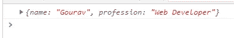

那都很好。但是如果你注意到了，对象的键和我们设置的变量的名字是完全一样的。

我们可以简单地将它们组合起来，而不是编写相同的键和值变量名:

```
const details = { name, profession}
```

它将完全像以前一样工作:


这是一个简单的技巧，可以为您节省大量空间，并使您的代码看起来更整洁。

# 5.延迟属性

你还记得你最初的一堂 web 开发课吗？那时你学会了在你的 HTML 代码末尾加载你所有的脚本。

这是显而易见的，也是正确的。这样做有两个主要原因。在 HTML 页面的末尾加载你的脚本将会节省你很多加载网页的时间。其次，如果您在脚本中访问任何 HTML 元素，那么在 HTML 代码执行之后再执行脚本会更有意义。

但是要在 HTML 之后执行您的脚本，您并不总是需要将您的`<script>`标签放在`<body>`之后/之中。您可以简单地将您的`<script>`包含在`<head>`中，并在您的`<script>`标签上使用`defer`属性。

> “ **defer** 是一个布尔值，用于指示在文档被解析后执行脚本。它仅适用于外部脚本(即，仅当我们在<脚本>标签中指定 **src** 属性时适用)。它声明脚本不会创建任何内容。因此，浏览器可以继续解析页面的其余部分。具有 **defer** 属性的<脚本>不会阻塞页面。—[Java point](https://www.javatpoint.com/javascript-defer)

下图详细阐述了这一定义:

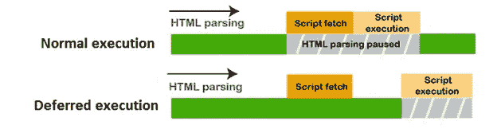

因此，如果您在浏览器中执行以下代码:

一旦浏览器开始执行这段代码，它将首先解析初始的`<HTML>`标记，当它到达`<script>`标记时，它将简单地下载 JS 文件，但不会预先执行它。它会像`<body>`一样继续解析下一个 HTML 标签，浏览器一解析完所有的 HTML，就会执行下载的 JS 脚本。

这是几乎每个 web 开发人员都喜欢使用的东西，因为它使编写 JavaScript 变得更加容易，我强烈建议您也这样做。

# 结论

JavaScript 包含了大量的技巧和概念，总能让我们大吃一惊。JavaScript 世界中肯定有很多我不知道的技巧和窍门，但是我推荐在您的代码中使用这些概念。让我知道哪一个是你最喜欢的，如果你有什么要在评论中分享的话。

我希望这篇文章是有帮助的。感谢阅读！