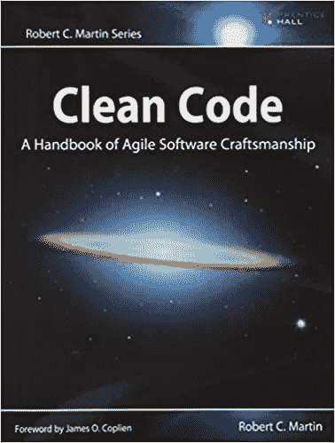
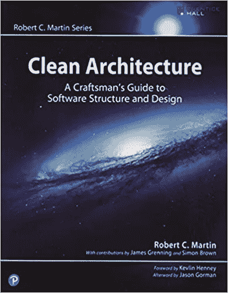
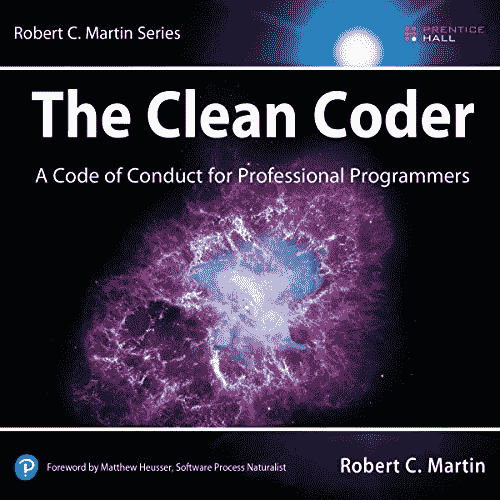
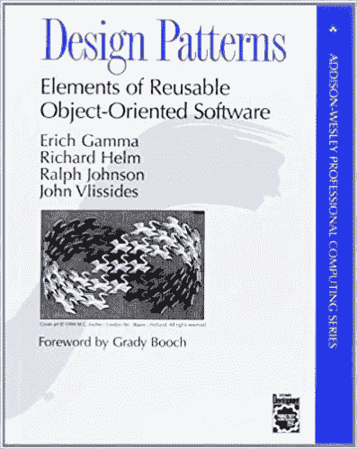
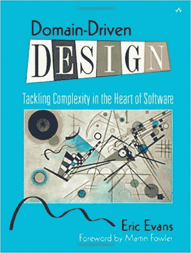

# 每个软件工程师必读的 5 本书

> 原文：<https://betterprogramming.pub/5-must-read-books-for-every-software-engineer-57f6fc433e79>

## 如果你真的想提高编程水平，你需要读读这些书

[丹尼尔](https://unsplash.com/@setbydaniel?utm_source=medium&utm_medium=referral)在 [Unsplash](https://unsplash.com?utm_source=medium&utm_medium=referral) 上的照片

无论你的编程生涯是一个月还是十年，你现在一定已经意识到编程是很难的。你有一堆语言、设计模式、框架在这里和那里出现，你需要使用所有这些来满足某种业务需求以构建一个产品。

你偶然遇到一个挑战，一些你从未见过的东西。考虑了一下，试了几次，你决定谷歌一下，找一个栈溢出线程。这个帖子有 20 个答案来回答你的问题。你选择一个，测试它，看看它是否有效，然后去做你的下一个任务。

如今，互联网上有一堆免费资源。每个问题都有一万种不同的解决方法。教程赋予每个人编码的能力。这是一件好事，因为它有助于编程和软件社区的发展，但问题是越来越多的初级人员完全不考虑代码质量和实际的软件工程技能，充斥着市场。

这里有一个书单，我相信每个软件工程师(或任何只想更好地编程的人)都应该阅读。有些书给出了 Java 或 C 语言的例子，但是这些概念适用于任何编程语言，它们确实能帮助你成为更好的开发人员。

## [1。干净的代码:敏捷软件技术手册](https://www.amazon.com/Clean-Code-Handbook-Software-Craftsmanship/dp/0132350882/ref=sr_1_1?dchild=1&keywords=clean+code&qid=1626766347&sr=8-1)

罗伯特·马丁的《干净的代码》

如果你有一本书要读，这是一本。毫无疑问，它是每个开发人员的必备工具。它首先阐述了为什么干净的代码是重要的，以及它将如何影响您的业务。

然后给出了简单事情的指南:从注释、命名变量、构建代码到进行 TDD 或重构难以理解的部分。它非常容易阅读，如果你从未听说过什么是干净的代码，它将打开新的视角。如果你确实应用了本书中的任何内容，你的团队和同事都会感谢你。

## [2。干净的架构:软件结构和设计的工匠指南](https://www.amazon.com/Clean-Architecture-Craftsmans-Software-Structure/dp/0134494164/ref=sr_1_1?dchild=1&keywords=clean+architecture&qid=1626786577&sr=8-1)

罗伯特·c·马丁的《清洁建筑》

“干净”系列的第二本书。现在的应用程序非常复杂，它们通常由几个组件组成。这本书给出了关于[坚实的原则](https://www.baeldung.com/solid-principles)以及如何应用它们的提示。它还谈到了面向对象和函数式编程。我喜欢这本书的地方在于它给出了所有真实生活中的用例，并附有大量图表来帮助理解。阅读这本书不会有什么坏处，但我相信它更适合有经验的高级开发人员，因为它非常适合于架构。然而，任何认真对待自己职业的人都会从阅读这篇文章中受益。

## [3。干净的程序员:职业程序员的行为准则](https://www.amazon.com/Clean-Coder-Conduct-Professional-Programmers/dp/B08X7MNTCX/ref=sr_1_1?dchild=1&keywords=Clean+coder&qid=1626786226&s=books&sr=1-1)

罗伯特·c·马丁的《干净的编码者》

“干净”系列的最后一本书。这本书更多的是关于每个开发者都应该知道的软技能。它给出了许多测试的技巧和策略，如何成为团队成员，时间估计(一旦你开始在企业/为客户工作，这是一个真正的话题)，处理压力，等等。整件事可以在 6-8 小时内作为一连串的小趣闻阅读。

## [4。设计模式:可重用面向对象软件的元素](https://www.amazon.com/Design-Patterns-Elements-Reusable-Object-Oriented/dp/0201633612)

Erich Gamma、Richard Helm、Ralph Johnson 和 John Vlissides 的设计模式

这本书是四人组(伽马、赫尔姆、约翰逊、维里塞德斯)写的，是一座真正的金矿。它是 23 个设计模式的目录，分为三组(创建、结构和行为)。对于每个模式，它给出了意图、一些用例、优缺点和一些实现细节。它也给出了可以替代使用的相关模式。这是一本很棒的书，当你在项目中工作并认识到你可以为你的业务案例实现的一些模式时，每天都可以作为参考。

## [5。领域驱动设计:解决软件核心的复杂性](https://www.amazon.com/Domain-Driven-Design-Tackling-Complexity-Software/dp/0321125215/ref=sr_1_1?crid=W81WV8KD13D0&dchild=1&keywords=domain+driven+design&qid=1626800408&sprefix=domain+driv%2Caps%2C266&sr=8-1)

Eric Evans 的**领域驱动设计**

对于一些人来说，DDD 是构建可维护和可伸缩软件的巅峰。总而言之，DDD 说，在设计软件时，业务规则必须是你设计的中心，在谈论需求时，整个公司必须说一种共同的语言(无处不在的语言)。

DDD 很难。它需要大量的技术知识，并且实际上使用了一些设计模式。一般来说，你还需要很多架构和设计软件的知识。

我不认为每个软件都应该按照 DDD 的方式来设计，因为这对于简单的项目来说可能有些矫枉过正。

如果你不知道它是什么，并且对学习 DDD 感兴趣，这本书是一个很好的起点。

# 结论

感谢您的阅读。对于那些已经读过这些书的人，我希望你同意它们应该是必读的。

请分享你的任何建议，这样我就可以把它们添加到我的阅读清单中！

 [## 通过我的推荐链接加入 Medium-sevrin Chea

### 阅读 Sevrain Chea(以及媒体上成千上万的其他作家)的每一个故事。您的会员费直接支持…

sevrain-chea.medium.com](https://sevrain-chea.medium.com/membership)