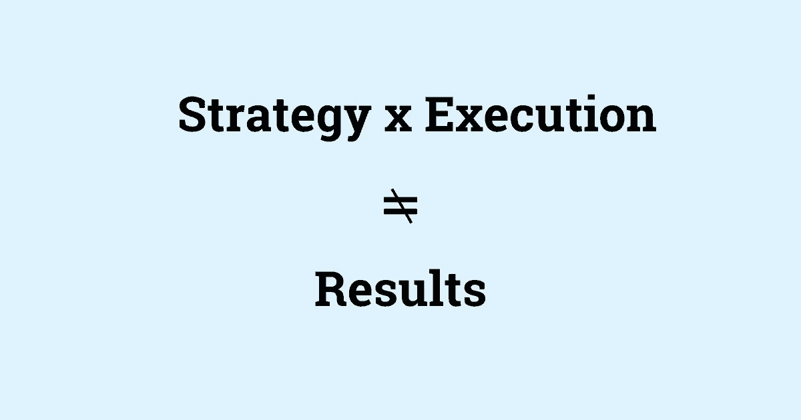

# 《更好的编程》中的 5 个必读故事(2021 年 7 月 17 日至 8 月 6 日)

> 原文：<https://betterprogramming.pub/5-must-read-stories-from-better-programming-jul-17-aug-6-2021-2abb72a73230>

## 过去几周我最喜欢的精选

嘿，更好的编程读者们，

我希望八月对你们来说是一个好的开始。在本期《更好的编程》周刊中，我们从过去的几周里获得了一些有趣的故事。从数据实践到软件评估，有很多编程建议。让我们开始吧。

图片来源:作者

## [作为领导者建立信任的 4 种有效方法](/4-effective-ways-to-build-trust-as-a-leader-67ab9a9e98b8)作者 [Palantir](https://medium.com/u/b892e7626234#5 </a>由<a class=)*   [Pinterest Engineering](https://medium.com/pinterest-engineering/the-machine-learning-behind-delivering-relevant-ads-8987fc5ba1c0)[投放相关广告](https://medium.com/u/ef81ef829bcb?source=post_page-----2abb72a73230--------------------------------)背后的机器学习*   [远程工程不应该仅仅指工程](https://medium.com/facet-engineering/remote-engineering-should-not-mean-engineering-alone-b826e1ae3bc4)作者[娜塔莉·康克林](https://medium.com/u/dee1474dc22c?source=post_page-----2abb72a73230--------------------------------)

## 工作

*   [不，女性开发者不需要通过](https://code.likeagirl.io/no-female-developers-dont-need-to-toughen-up-571dc5fa5f0a) [Iris Winter](https://medium.com/u/bd9d3c296648?source=post_page-----2abb72a73230--------------------------------) 来强化
*   [开发职业真的会在 35 岁死去吗？](https://medium.com/madhash/do-dev-careers-really-die-at-35-7a694ddc208b)由 [Aphinya Dechalert](https://medium.com/u/3ac3fb3f09e0?source=post_page-----2abb72a73230--------------------------------)
*   [效率极低的远程工作者的 5 个习惯](/5-habits-of-highly-ineffective-remote-workers-a9f5f87f3118)作者[丹尼尔·耶费特](https://medium.com/u/c2fe33292f69?source=post_page-----2abb72a73230--------------------------------)
*   成为优秀老板的 7 个日常习惯

这就是本周的时事通讯！查看 [betterprogramming.pub](https://betterprogramming.pub/) 了解更多有趣的故事。

感谢阅读。直到下一次，

Anupam 和更好的编程团队