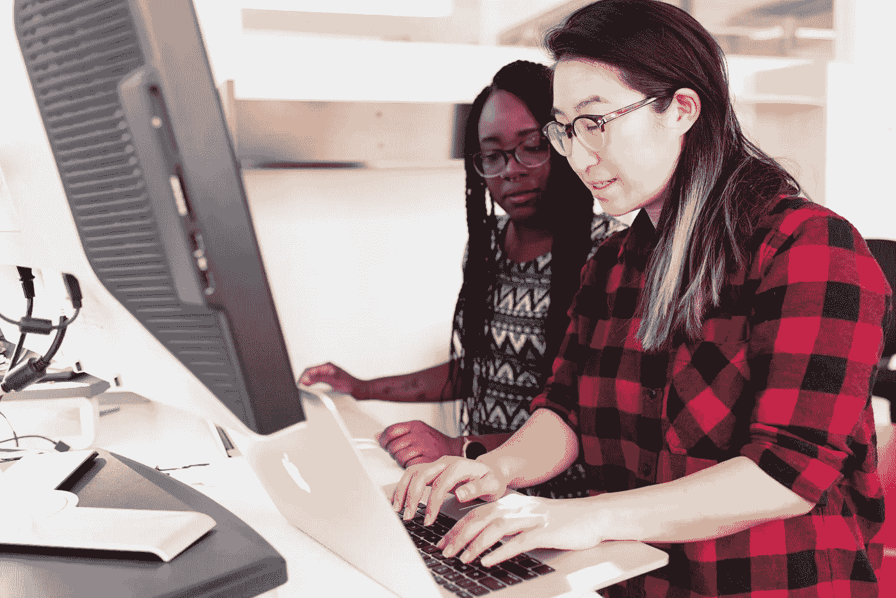
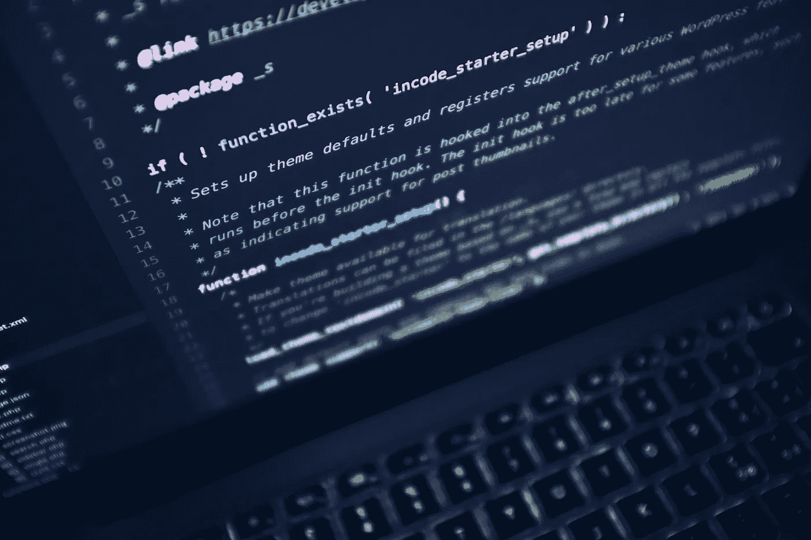
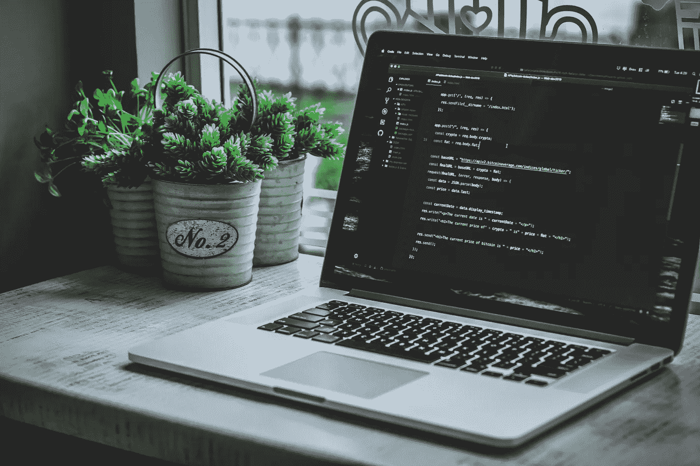
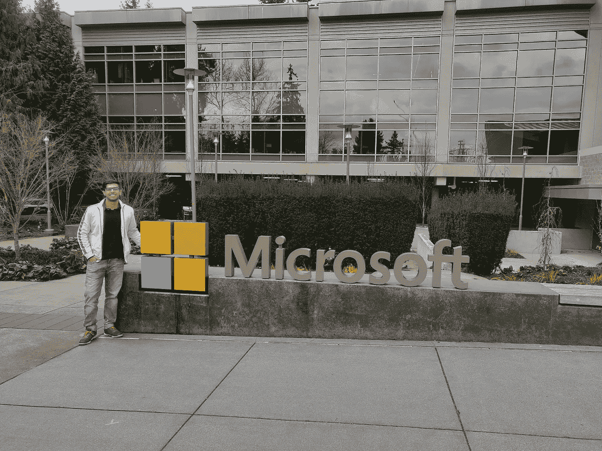

# 《更好的编程》中的 4 个必读故事(2021 年 5 月 24 日至 6 月 4 日)

> 原文：<https://betterprogramming.pub/5-must-read-stories-from-better-programming-may-24-june-4-2021-44d86d379199>

## 过去两周我最喜欢的精选

嘿，更好的编程读者们，

我希望你的六月有一个好的开始。上周，Better Programming 的联合创始人兼出版商蔻驰·托尼进行了一项快速调查，以评估程序员订阅 Medium 的价值。[的结果出来了](/what-better-programming-readers-think-about-mediums-subscription-5bf0fecc79fd)，对于媒体上的读者和作者来说都很有见地。

既然我们已经发布了这些令人兴奋的公告，让我们来浏览一下本周发表在《更好的编程》上的我最喜欢的四篇文章(加上一些来自 Medium 的额外编程好东西)。

# 📸特色文章

照片由[克里斯蒂娜·莫里洛](https://www.pexels.com/photo/woman-wearing-black-and-red-gingham-sport-shirt-1181471/)在[像素](https://www.pexels.com/)上拍摄

## [如果你的公司不做结对编程，把](/if-your-company-doesnt-do-pair-programming-leave-204335c25a54)留给[克里斯本人](https://medium.com/u/d67bf018ae6d?source=post_page-----44d86d379199--------------------------------)

首先，Chris 分享了他对结对编程的价值的看法。他谈到了它是如何被误解的，以及怎样做才能减轻压力。

[卢卡·布拉沃](https://unsplash.com/@lucabravo?utm_source=unsplash&utm_medium=referral&utm_content=creditCopyText)在 [Unsplash](https://unsplash.com/s/photos/code?utm_source=unsplash&utm_medium=referral&utm_content=creditCopyText) 上拍摄的照片

## [成为更好的开发人员的一个习惯](/one-habit-to-be-a-better-developer-a64e02b04cec)作者[梅格娜·巴韦](https://medium.com/u/aa12f3a5ed91?source=post_page-----44d86d379199--------------------------------)

在《更好的编程》的第一篇文章中，Meghna 谈到了帮助开发人员变得更好的一项技能。我来透露一下剧透:这是关于阅读代码的。但是我相信您会希望充分阅读这篇文章，因为她分享了宝贵的编程建议。

萨法尔·萨法罗夫在 [Unsplash](https://unsplash.com/?utm_source=medium&utm_medium=referral) 上拍摄的照片

## [10 个塑造你编程技能的编码游戏](/10-coding-games-to-shape-your-programming-skills-618253d592fe)

我总是发现游戏化是学习新事物的最好方式。约翰记下了十个你可能想用来玩游戏和写代码的网站。[帝国的代号](https://empireofcode.com/)是一。看看剩下的九个故事。

微软雷德蒙办公室作者

## [我在微软做了两年软件工程师后学到的 5 件事](/5-things-i-learned-after-two-years-as-a-software-engineer-at-microsoft-65e7124651c7)作者 [Ojasvin Sood](https://medium.com/u/8a1cdb7b9ddc?source=post_page-----44d86d379199--------------------------------)

在他的《更好的编程》处女作中，Ojasvin 回顾了他在微软做软件工程师的两年。事故管理、团队协作和研究的价值是作者在这篇文章中思考的五个经验中的三个。

# ✍·莫尔来自 Medium️

## [走向数据科学](https://towardsdatascience.com/)

1.  [数据科学不会在 10 年内灭绝，你的技能可能](https://towardsdatascience.com/data-science-is-not-becoming-extinct-in-10-years-your-skills-might-aed618dd0c91)由 [Ahmar Shah 博士(牛津)](https://medium.com/u/58425acb757a?source=post_page-----44d86d379199--------------------------------)
2.  [我对在游戏](https://towardsdatascience.com/my-advice-to-machine-learning-newbies-after-3-years-in-the-game-6eef381f540)中 3 年的机器学习新手的建议

## [简单英语的 JavaScript](https://javascript.plainenglish.io/)

1.  [为什么我们应该抛弃 React，重拾 Angular](https://javascript.plainenglish.io/throw-out-react-and-pick-up-angular-8b578bb7cabc) 作者[萨姆·雷德蒙](https://medium.com/u/1ad04cf98807?source=post_page-----44d86d379199--------------------------------)
2.  [JavaScript 2021:新特性](https://javascript.plainenglish.io/javascript-2021-new-features-429bc050f4e8)作者[蒂洛坎·阿罗拉](https://medium.com/u/ddf8e361e057?source=post_page-----44d86d379199--------------------------------)

好了，这就是本周的时事通讯。查看 [betterprogramming.pub](https://betterprogramming.pub/) 了解更多有趣的故事。

感谢阅读。直到下一次，

Anupam 和更好的编程团队