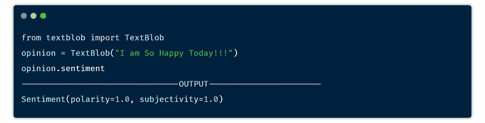

# 自然语言处理的 5 个必试 Python 库

> 原文：<https://betterprogramming.pub/5-must-try-python-libraries-for-natural-language-processing-91b37142ea5f>

## 帮助您轻松预处理数据的库


[梁杰森](https://unsplash.com/@ninjason?utm_source=medium&utm_medium=referral)在 [Unsplash](https://unsplash.com/?utm_source=medium&utm_medium=referral) 上的照片

全世界有超过 70 亿人，几乎 70-80%的人使用互联网。每天都有大量新的数据和信息添加到互联网上。互联网上有海量的数据，这些数据大部分是文本数据，也就是所谓的自然语言。

自然语言是指我们人类相互交流的语言，自然语言处理是一种以可理解的形式预处理数据以便计算机可以理解的方法。简单来说，NLP(自然语言处理)就是帮助计算机用人类自己的语言与人类交流的过程。

NLP 是最广泛的研究领域之一。许多大公司都在这个领域投入巨资。NLP 为公司创造了机会，让他们能够根据消费者的情绪和文本来很好地理解他们的消费者。NLP 的一些最佳用例是检测假电子邮件、分类假新闻、情感分析、预测你的下一个单词、自动更正、聊天机器人、个人助理等等。

# 解决任何 NLP 任务之前要知道的 7 件事

## **1。标记化**

它是将整个文本分成小记号的过程。占卜是基于两个基础完成的——句子和单词。

```
text = "Hello there, how are you doing today? The weather is great today. python is awsome"**##sentece tokenize *(Separated by sentence)***
['Hello there, how are you doing today?', 'The weather is great today.', 'python is awsome']
**##word tokenizer (*Separated by words)*** ['Hello', 'there', ',', 'how', 'are', 'you', 'doing', 'today', '?', 'The', 'weather', 'is', 'great', 'today', '.','python', 'is', 'awsome']
```

## **2。停用词**

一般来说，这些单词不会给句子增加太多的意思。在 NLP 中，我们删除了所有的停用词，因为它们对于分析数据并不重要。英语中总共有 179 个停用词。

一些停用词:“我”、“我”、“我的”、“我自己”、“我们”、“我们的”、“我们的”

## **3。** **词干**

它是通过去掉后缀和前缀将一个单词简化为其词根的过程。

爱过→爱，学习→学习

## **4。词汇化**

它的工作原理与词干提取相同，但主要区别在于它返回一个有意义的单词。主要是在开发聊天机器人、问答机器人、文本预测等方面。

**举例:** *词干* **历史→** 历史
*词条化*
**历史** →历史

## **5。WordNet**

它是一个词汇数据库或词典，包含英语名词、动词、形容词和副词，这些词汇被分组为专门为自然语言处理而设计的集合。

## 6.词性标注

它是将句子转换成元组列表的过程。每个元组都有一种形式(单词、标签)。这里的标签表示这个单词是名词、形容词还是动词等等。

```
text = 'An sincerity so extremity he additions.'
--------------------------------
('An', 'DT'), ('sincerity', 'NN'), ('so', 'RB'), ('extremity', 'NN'), ('he', 'PRP'), ('additions', 'VBZ')]
```

## 7.一袋单词

这是一个将文本转换成某种数字表示的过程。比如一键表示法等等。

```
sent1 = he is a good boy
sent2 = she is a good girl
            |
            |
        girl good boy   
sent1    0    1    1     
sent2    1    0    1
```

现在，让我们回到我们的主题，看看可以帮助您轻松预处理数据的库。

# 1.NLTK

毫无疑问，它是自然语言处理中最好和最常用的库之一。NLTK 代表自然语言工具包。该库是由史蒂文·伯德和爱德华·洛珀开发的。它带有许多用于标记化、词汇化、词干分析、语法分析、组块和词性标注的内置模块。它提供了超过 50 个语料库和词汇资源。

**安装** : `pip install nltk`

让我们使用 NLTK 对给定的文本执行预处理

使用 NLTK 预处理文本—作者使用[碳](http://carbon.now.sh)的代码块

# 2.文本 Blob

Textblob 是一个简化的文本处理库。它提供了一个简单的 API 来执行常见的自然语言处理任务，比如词性标注、情感分析、分类、翻译等等。

**安装** : `pip install textblob`

让我们使用库 Textblob 来执行情感分析:



使用文本块的情感分析—作者使用[碳](http://carbon.now.sh)的代码块图像

# 3.宽大的

这是 python 中最先进的自然语言处理库之一，它是用 cpython 编写的。它附带了一些预训练的统计模型，并支持多达 49+种语言进行标记化。它采用卷积神经网络进行标记、解析和命名实体识别。

**安装** : `pip install spacy`

使用空间标记化文本

# 4.根西姆

它是一个 Python 库，专门识别两个文档之间的语义相似性。它使用向量空间建模和主题建模工具包来寻找文档之间的相似之处。它旨在借助算法处理大型文本语料库。

**安装** : `pip install gensim`

> [***Github***](https://github.com/RaRe-Technologies/gensim)*[***教程***](https://www.machinelearningplus.com/nlp/gensim-tutorial/)*

# *5.CoreNLP*

*斯坦福 CoreNLP 包括一套人类语言技术工具。该库的目标是简化对一段文本应用不同语言工具的过程。该库速度非常快，在开发中运行良好。*

***安装** : `pip install stanford-corenlp`*

> *[官方回购](https://github.com/stanfordnlp/CoreNLP)举例*

*感谢阅读！*