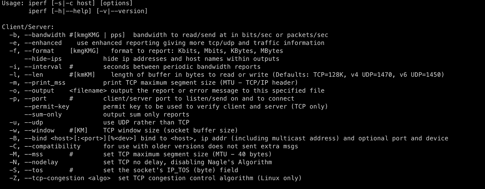
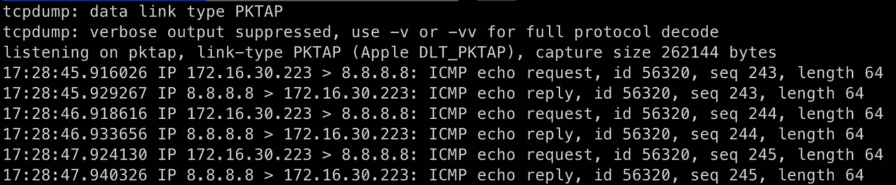
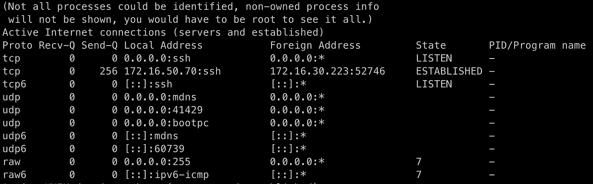

# 5 用于 Linux 的网络性能和分析工具

> 原文：<https://betterprogramming.pub/5-network-performance-analysis-tools-for-linux-f420c35fb8bd>

## 使用这些免费实用程序对您的网络进行诊断、故障排除和基准测试


照片由[对比纤维](https://unsplash.com/@comparefibre?utm_source=unsplash&utm_medium=referral&utm_content=creditCopyText)在 [Unsplash](https://unsplash.com/s/photos/network?utm_source=unsplash&utm_medium=referral&utm_content=creditCopyText)

您可以拥有最新、最棒的服务器、最快的处理器、装满内存的自动倾卸卡车和几天的磁盘空间，而一个简单的网络问题可能会让一切嘎然而止。

服务器依靠坚如磐石的网络连接来真正利用所有的计算能力。无论是下载工作负载信息还是满足客户的 web 请求，您都需要确保您的网络能够处理这些信息。

诊断麻烦的网络路径并获得准确的链路性能基准并不总是容易的。幸运的是，在 Linux 世界中，我们可以使用大量的工具来帮助解决这些困难的任务。

在本文中，我将介绍一些内置的和第三方的 Linux 实用程序，它们使诊断网络问题和制定解决方案变得轻而易举。

# 1.iPerf

没有 iPerf，网络工程师的工具包就不完整。这个非常有用的网络实用程序允许您执行端到端的吞吐量和延迟测试。使用 iPerf 的最大好处是您可以控制连接的两端。你不会简单地发送流量并等待它的回报，你将可以访问两端的统计数据。



iperf 计划。

为了正确使用 iPerf，您必须设置客户端和服务器实例。服务器实例运行在您现有的服务器上，客户端实例可以从您希望测试的任何地方启动。

客户端将在特定的端口上连接到服务器，然后能够执行一系列详细的测试。

通过运行以下命令启动简单的 iPerf 服务器:

```
iperf -s
```

这将运行 iPerf 并自动监听端口`5001`。现在，连接一个客户端，通过发出以下命令开始默认带宽测试:

```
iperf -c <host_ip_running_iperf_server>
```

在以下示例中，iPerf 测试是在本地主机上的同一台计算机上执行的:

```
------------------------------------------------------------
Client connecting to 127.0.0.1, TCP port 5001
TCP window size:  144 KByte (default)
------------------------------------------------------------
[  1] local 127.0.0.1 port 52340 connected with 127.0.0.1 port 5001
[ ID] Interval       Transfer     Bandwidth
[  1] 0.00-10.00 sec   141 GBytes   121 Gbits/sec
```

显然，对于该测试，带宽相当高，因为流量从未离开主机。如果您正在诊断慢速链接、主机或其他中间设备，那么当部署在整个网络中时，它的用处就显而易见了。

查看以下 iPerf 官方网站了解更多信息:

[](https://iperf.fr/) [## iPerf-TCP、UDP 和 SCTP 网络带宽测量工具

### iPerf3 是一个工具，用于主动测量 IP 网络上可实现的最大带宽。它支持…的调谐

iperf.fr](https://iperf.fr/) 

# 2.tcpdump

这绝对是网络诊断领域的一匹骏马。使用`tcpdump`你可以捕捉通过主机的网络流量，并使用它来重放或重写数据包。使用`tcpdump`您可以保存数据包捕获文件，这些文件可以以纯文本格式读取，也可以通过臭名昭著的 [Wireshark](https://www.wireshark.org/) 实用程序读取


Tcpdump 徽标。[来源](https://www.tcpdump.org/)。

`tcpdump`最大的优点是它的灵活性。它可以像你希望的那样简单，也可以像你希望的那样先进。例如，让我们看看如何捕获去往谷歌公共 DNS 解析器`8.8.8.8`的流量:

```
sudo tcpdump host 8.8.8.8
```

这个命令告诉`tcpdump`只过滤来自或去往 IP 地址为`8.8.8.8`的主机的流量。您应该会看到类似如下的输出:



tcpdump 命令行捕获。

在这个例子中，我们清楚地看到从我们的主机(`172.16.30.223`)到 Google 和返回的双向流量。使用`tcpdump`你可以快速轻松地找出网络上的特定流量是从哪里听到的。

*   更多信息请访问官方`tcpdump`网站[这里](https://www.tcpdump.org/)。
*   Red Hat 博客有一篇关于使用`tcpdump`滤镜[的很棒的入门文章，可以在这里找到](https://www.redhat.com/sysadmin/filtering-tcpdump)。

# 3.平

这就像打了兴奋剂的 ping。使用 hping，您可以执行一整套普通 ping 无法执行的附加任务。虽然它最初是作为安全工具开发的，但它也提供了有用的日常网络测试功能。


[来源](http://hping.org/)。

在 hping 中，你可以欺骗网络地址，发送大量数据包，甚至运行复杂的端口扫描。与 hping 的 TCP/UDP 部分的功能相比，这些仅仅是玩具。

使用 hping，您可以设置大量不同的标志，并通过精确创建您需要的流量来执行详细的 TCP/UDP 应用程序测试:

```
UDP/TCP
  -s  --baseport   base source port             (default random)
  -p  --destport   [+][+]<port> destination port(default 0) ctrl+z inc/dec
  -k  --keep       keep still source port
  -w  --win        winsize (default 64)
  -O  --tcpoff     set fake tcp data offset     (instead of tcphdrlen / 4)
  -Q  --seqnum     shows only tcp sequence number
  -b  --badcksum   (try to) send packets with a bad IP checksum
                   many systems will fix the IP checksum sending the packet
                   so you'll get bad UDP/TCP checksum instead.
  -M  --setseq     set TCP sequence number
  -L  --setack     set TCP ack
  -F  --fin        set FIN flag
  -S  --syn        set SYN flag
  -R  --rst        set RST flag
  -P  --push       set PUSH flag
  -A  --ack        set ACK flag
  -U  --urg        set URG flag
```

如果您正在对一个特别古怪的网络应用程序进行故障排除，并且想要尝试和复制它的一些流量模式，那么这些就非常方便。

hping 官方网站如下:

[](http://hping.org/) [## Hping -主动网络安全工具

### Home hping 是一个面向命令行的 TCP/IP 包组装器/分析器。该界面受 ping(8) unix 的启发…

hping.org](http://hping.org/) 

# 4.Netstat

想知道谁在和主持人说话？正在使用哪些端口？应用程序处于什么状态？Netstat 在解决这些问题上创造了奇迹。

这个工具已经存在了将近四十年。这是有充分理由的。Netstat 向您展示了您需要了解的关于谁与您有联系的确切信息。

Netstat 最常见的用途是显示机器的开放端口。使用以下命令可以看到这些信息:

```
netstat -ap
```

您应该会看到类似如下的输出:



覆盆子 Pi 上的 Netstat 输出。

在上面的信息中，我们可以清楚地看到，该主机正在端口`22`上监听传入的 SSH 连接。为了方便起见，Netstat 还将著名的端口替换为它们的服务名。

如果您试图确定某个特定端口是否打开并在监听，那么使用 Netstat 是一个不错的选择。

# 5.Scapy


[来源](https://github.com/secdev/scapy)。

我们把最好的留到了最后。这是一个大的。

如果前面列出的工具是工具箱中的工具，那么 Scapy 就是整个该死的车库。这个应用程序让你从头开始一次一层地构建完整的包。如果你有时间和耐心，你几乎可以在 Scapy 中创建任何你想要的网络流量。

虽然从技术上来说 Scapy 是一个 Python 模块，但是它可以像任何其他命令行程序一样容易地安装和运行。好处是因为它是内置的 Python，所以您可以用直观的语言创建复杂的 Scapy 设置，而不必使用 Bash 或其他烦人的配置文件。

Scapy 还提供了一个命令行解释器，用于交互式地构建包和其他数据。他们声称它包含如此多的功能:

> “它可以轻松处理大多数经典任务，如扫描、跟踪路由、探测、单元测试、攻击或网络发现(它可以替代 hping、85%的 nmap、arpspoof、arp-sk、arping、tcpdump、tshark、p0f 等。)."
> 
> —[Scapy 官方网站](https://scapy.net/)

就整个网络堆栈而言，这是一个真正的发电站。如果你真的想了解每一层是如何工作的，这个库会给你所有你需要的工具。

查看以下 Scapy 官方网站，了解更多使用和安装信息:

[](https://scapy.net/) [## Scapy

### Scapy 是一个功能强大的交互式数据包处理程序。它能够伪造或解码大量的数据包…

scapy.net](https://scapy.net/) 

感谢阅读！如果你喜欢这篇文章，请随意查看我的其他帖子:

*   [*用 Python 和 TShark 捕获网络流量*](https://tateg.medium.com/capturing-network-traffic-with-python-and-tshark-19599d39dbce)
*   [*如何排除 Linux 服务器运行缓慢的故障*](/how-to-troubleshoot-slow-linux-servers-20a4e2843131)