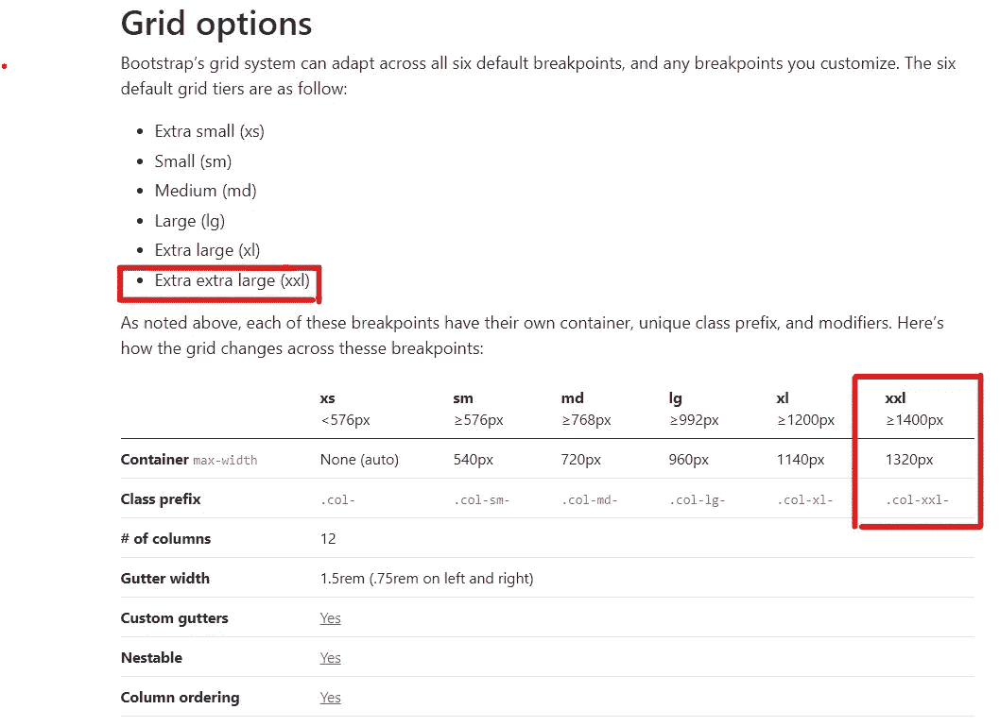
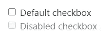
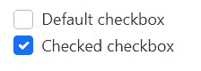
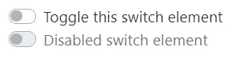
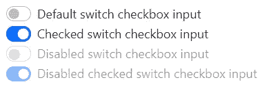
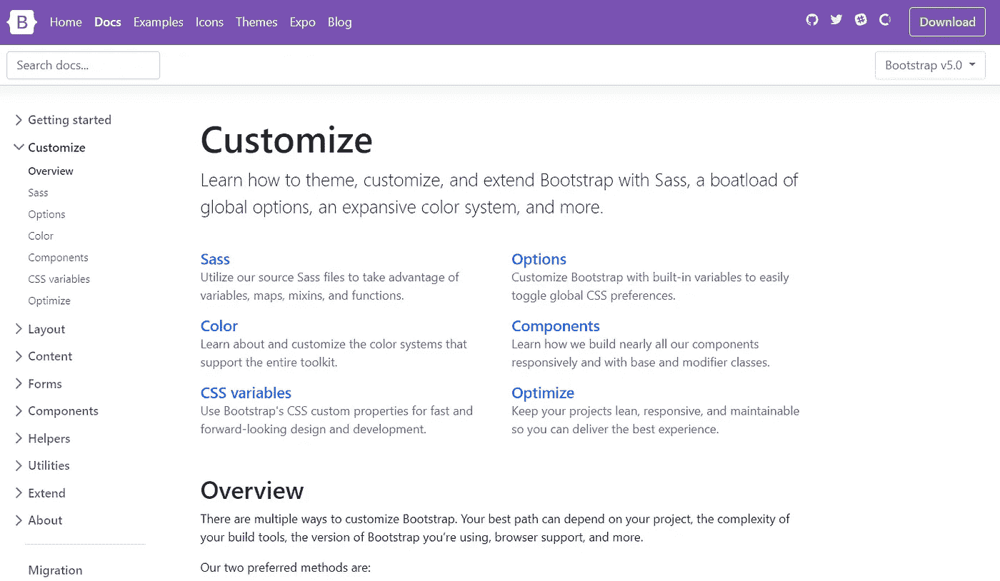
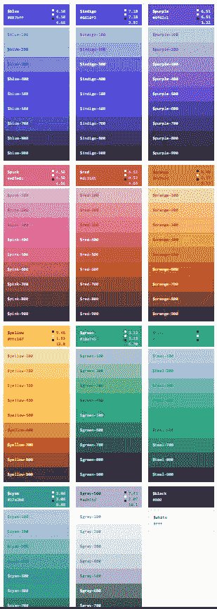

# Bootstrap 5 中的 5 项新功能

> 原文：<https://betterprogramming.pub/5-new-features-in-bootstrap-5-e122ad2386dc>

## 让我们探索一下 Bootstrap 的最新版本


照片由 [Pierre Bamin](https://unsplash.com/@bamin?utm_source=medium&utm_medium=referral) 在 [Unsplash](https://unsplash.com?utm_source=medium&utm_medium=referral) 拍摄

很长一段时间以来，Bootstrap 一直是响应式 web 和移动开发中最流行的 CSS 框架。正如 [W3Schools](https://www.w3schools.com/bootstrap4/bootstrap_get_started.asp) 所指出的，“Bootstrap 包括基于 HTML 和 CSS 的设计模板，用于排版、表单、按钮、表格、导航、模态、图像传送带等。”我们可以看到最近基于 Bootstrap 构建的许多其他库。

我相信，在作为软件开发人员的旅程中，你们每一个人一定都使用过 Bootstrap，现在是时候探索最新版本了。Bootstrap 5 的 alpha 版本最近发布了，本文将讨论它的五个主要特性。

# 改进的网格系统

Bootstrap 网格系统是该框架的主要吸引力之一，随着最新版本的发布，Bootstrap 团队增加了它的网格系统功能。

*   添加了一个新的特大(xxl)网格层。



作者截图

*   `.gutter`类已被替换为`.g*`实用程序:

```
<div class="row g-5">
  <div class="col">...</div>
  <div class="col">...</div>
  <div class="col">...</div>
</div>
```

*   添加了垂直间距类别。
*   默认情况下不再列`position: relative`。
*   新的网格系统取代了表单布局选项。

# 更新的表格

在 Bootstrap 5 中，表单部分已经从组件中移出，并作为一个单独的部分呈现。 [Bootstrap 写道](https://blog.getbootstrap.com/2020/06/16/bootstrap-5-alpha/)此举的目的是给表单样式“应有的重视”

这不是他们所做的唯一改变。他们重新设计了所有表单控件，并对其进行了重复数据删除。在以前的版本中，除了每个浏览器提供的默认控件之外，还有一套广泛的自定义表单控件。有了 Bootstrap 5，他们已经完全定制化了。

*   复选框:



v4 复选框



v5 复选框

*   开关:



v4 开关



v5 开关

类似地，单选按钮也有变化。每个复选框、单选、选择、文件、范围等。包括一个自定义外观，用于跨操作系统和浏览器统一表单控件的样式和行为。这些新的表单控件都是建立在完全语义化的标准表单控件之上的。没有多余的标记，只有表单控件和标签。你可以在[文档](https://v5.getbootstrap.com/docs/5.0/forms/overview/)中找到这些新的变化。

# 自定义文档

正如我在开头提到的，大量的库是通过扩展 Bootstrap 创建的。在第 5 版中，Bootstrap 已经准备好通过新的[定制部分](https://v5.getbootstrap.com/docs/5.0/customize/overview/)支持比以往更多的扩展 Bootstrap。



作者截图

这个新的部分是从 Bootstrap 4 主题化页面扩展而来的，包括更多的代码片段和内容，用于构建 Bootstrap 的源 Sass 文件。他们还为你提供了一个 [npm 启动项目](https://github.com/twbs/bootstrap-npm-starter)。



扩展调色板

# CSS 自定义属性

在以前的版本中，CSS 自定义属性只包含在有限的颜色和字体根变量集中。但是在版本 5 中，它们在组件和布局选项中也是可用的。让我们考虑他们在文档中提供的示例:

在这个例子中，用几个局部变量修改了`.table`组件，使条纹、悬浮和活动表格样式变得更容易。您可以在文档第[页的表格中找到详细说明。](https://v5.getbootstrap.com/docs/5.0/content/tables/#how-do-the-variants-and-accented-tables-work)

# 不再有 jQuery

jQuery 是我一直不喜欢的东西，但是它和 Bootstrap 一起存在了很长一段时间。最后，他们放弃了 jQuery:

> “jQuery 为数百万(数十亿)人带来了前所未有的对复杂 JavaScript 行为的访问？)在过去的十五年里。就我个人而言，我永远感激它给我的授权和支持，让我继续编写前端代码，学习新东西，并接受来自社区的插件。也许最重要的是，它永远改变了 JavaScript 本身，这本身就是 jQuery 成功的一座丰碑。感谢每一位 jQuery 贡献者和维护者，是他们让我这样的人成为可能。”— [引导文档](https://mdbootstrap.com/docs/standard/bootstrap-5/?source=techstories.org)

他们说这是他们对框架所做的最大改变之一。因此，项目大小将比 v4 项目更小。除此之外，框架的 JavaScript 方面也有一些变化，以提高质量并缩小 v4 和 v5 之间的差距。JS 相关变化的完整列表可以在他们的 GitHub 上找到。

# 结论

除了这些变化之外，还有一些其他功能和变化:

*   全新的外观和感觉。
*   放弃对 Internet Explorer 10 和 11 的支持。
*   改进的文档。
*   新的响应字体。
*   新的工具和助手。

Bootstrap 5 仍处于其 alpha 版本，并不完全稳定，所以我建议您等到他们发布稳定版本后，再用 v5 更新您现有的项目。但是如果你喜欢尝试新事物，你是最受欢迎的。从 v4 迁移到 v5 显然非常容易。