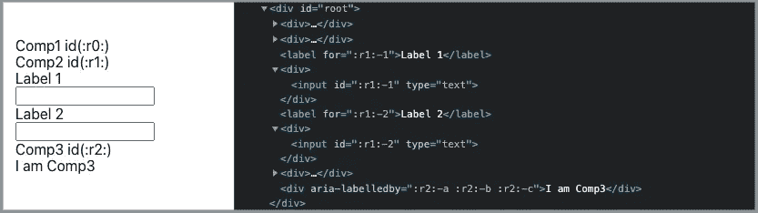
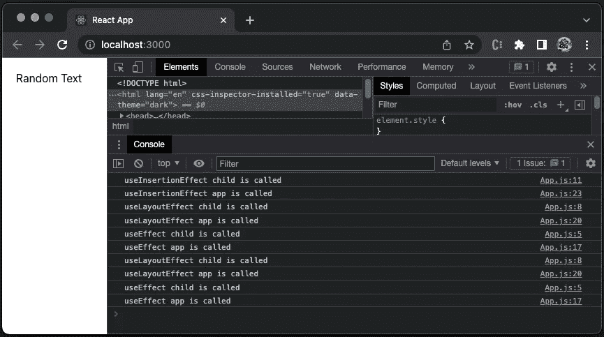
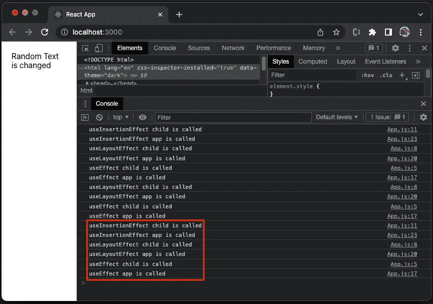

# React 18 中的 5 个新挂钩

> 原文：<https://betterprogramming.pub/5-new-hooks-in-react-18-300aa713cefe>

## 探索 useTransition、useDeferredValue、useId、useSyncExternalStore、useInsertionEffect 和 useEffect 双重挂载


照片由[赞·李](https://unsplash.com/@zane404?utm_source=medium&utm_medium=referral)在 [Unsplash](https://unsplash.com?utm_source=medium&utm_medium=referral) 拍摄

[React 18 于 2022 年 3 月 29 日上映](/the-complete-guide-to-react-18-dd8763430345)。它在版本中引入了 5 个新的挂钩:

*   `useTransition`
*   `useDeferredValue`
*   `useId`
*   `useSyncExternalStore`
*   `useInsertionEffect`

在本文中，我们将详细探讨这些挂钩。

# 在 Create React 应用程序中设置工作环境

我们使用 [Create React App](/an-in-depth-guide-for-create-react-app-5-cra-5-b94b03c233f2) 作为基础来探索这些新的钩子。以下命令创建一个 React 项目:

```
npx create-react-app react-release-18
cd react-release-18
```

React 版本自动指向 React 18。目前，它仍然使用遗留的根 API。如果您执行 npm start，将会出现一条警告消息:

```
react-dom.development.js:86 Warning: ReactDOM.render is no longer supported in React 18\. Use createRoot instead. Until you switch to the new API, your app will behave as if it's running React 17\. Learn more: [https://reactjs.org/link/switch-to-createroot](https://reactjs.org/link/switch-to-createroot)
```

新的根 API 由`createRoot`调用，它增加了 React 18 的所有改进，并支持并发特性。下面的`src/index.js`被修改为具有新的根 API:

第 2 行从`'react-dom/client'`导入`createRoot`。

第 8 行调用`createRoot`来生成`root`。

工作环境已经准备好让我们去探索了。

# 使用过渡

`useTransition()`是一个用于过渡的钩子。它返回转换状态和启动转换的函数。

```
const [isPending, startTransition] = useTransition();
```

反应状态更新分为两类:

*   紧急更新——它们反映了直接的交互，如打字、点击、按压、拖动等。
*   转换更新—它们将用户界面从一个视图转换到另一个视图。

转换中的更新让位于更紧急的更新。这里有一个`useTransition`的例子，放在`src/App.js`里:

上面的应用程序由两个组件组成(第 25–32 行):

*   `button`(第 25 行):这是一个简单的按钮。显示号码由第 14 行的`value`控制。点击按钮增加`value`(第 19 行，急快更新)`value2`(第 20 行，过渡慢更新)。
*   `SlowUI`(第 26–32 行):组件在第 3–11 行定义，生成由第 15 行`value2`控制的`100000+` `span`元素。更新这么多元素需要更长的时间。第 16 行的`useTransition`返回转换状态`isPending`，以及启动转换的功能`startTransition`。当`startTransition`在第 20 行被调用时，`isPending`变成`true`，并且`SlowUI`半不透明(浅色)并带有陈旧数据(第 28 行)。当转换完成时，`isPending`变为`false`，并且`SlowUI`变为完全不透明(纯色),数据更新。

通过`npm start`执行代码。下面的视频显示，UI 增加了按钮数量，并且`SlowUI`变为半不透明，数据陈旧。经过一段时间后，`SlowUI`会因为更新的数据而变得不透明。

作者提供的视频

尝试移除第 20 行的`startTransition`以直接调用`setValue2(value2 + 1)`。您可以看到，在这么多更新同时发生的情况下，UI 不再起作用。

`useTransition`吊钩返回`isPending`和`startTransition`。如果您不需要显示`isPending`的特殊用户界面，请删除第 16 行，并在代码顶部添加以下行。

```
import { startTransition } from 'react';
```

# useDeferredValue

`useDeferredValue(value)`是一个钩子，它接受一个值并返回该值的一个新副本，该副本将服从更紧急的更新。在紧急更新完成之前，会保留先前的值。然后，呈现新值。这个钩子类似于[使用去抖动或节流来延迟更新](/lodash-create-react-apps-built-in-library-for-debounce-and-throttle-with-hooks-3418087f44d8)。

这里有一个`useDeferredValue`的例子，放在`src/App.js`里:

上面的应用程序由三个组件组成(第 23–27 行):

*   (第 23 行):这是一个简单的按钮。显示号码由第 14 行的`value`控制。点击按钮增加`value`(第 18 行，加急快速更新)。
*   `div`(第 24 行):显示`deferredValue`。
*   `SlowUI`(第 25–27 行):组件在第 3–11 行定义，生成`50000`固定数量的`span`元素。虽然组件没有道具，视觉上也不更新，但是更新这么多元素需要很长时间。

通过`npm start`执行代码。下面的视频显示，UI 首先增加按钮数量，延迟值在一段时间后更新。

作者提供的视频

`useDeferredValue`可与`startTransition`和`useTransition`配合使用。

# useId

在 Web 应用程序中，有些情况下需要唯一的 id，例如:

*   `<label for="ID">`，其中`for`属性必须等于相关元素的`id`属性，才能将它们绑定在一起。
*   `aria-labelledby`，其中`aria-labelledby`属性可以接受多个 id。

`useId()`是一个生成唯一 id 的钩子:

*   这个 id 在服务器和客户端都是稳定的，这避免了[服务器端渲染](https://javascript.plainenglish.io/a-hands-on-guide-for-a-server-side-rendering-react-app-dd1efa3ec0d8)的水合不匹配。
*   这个 id 对于整个应用程序来说是唯一的。在多根应用程序的情况下，`createRoot` / `hydrateRoot`有一个可选的属性`identifierPrefix`，它可以用来添加一个前缀以防止冲突。
*   该 id 可以附加前缀和/或后缀，以生成在组件中使用的多个唯一 id。看似琐碎。但是，`useId`是从`useOpaqueIdentifier`进化而来的，它会产生一个不透明的 id，不能被操作。

下面是一个`useId`的例子，放在`src/App.js`里:

上面的应用程序由三部分组成(第 38–40 行):

*   `Comp1`:在第 3-6 行定义，生成并显示一个 id`:r0:`。
*   `Comp2`:在第 8-23 行定义，生成一个 id，`:r1:`。从这个 id 中，它派生出两个唯一的 id，`:r1:-1`(用于`Label 1` +输入字段)和`:r1:-2`(用于`Label 2` +输入字段)。
*   `Comp3`:在第 25–33 行定义，生成并显示一个 id`:r2:`。从他的一个 id 中，它为属性`aria-labelledby`派生出三个唯一的 id`:r1:-a`、`:r1:-b`和`:r1:-c`。

通过`npm start`执行代码。我们看到下面的 UI，以及 Chrome DevTools 中生成的 HTML 元素。



作者图片

# useSyncExternalStore

`useSyncExternalStore`是一个钩子，推荐用于从外部数据源(存储)读取和订阅。

下面是钩子的签名:

```
const state = useSyncExternalStore(subscribe, getSnapshot[, getServerSnapshot]);
```

该方法接受三个参数:

*   `subscribe`:这是一个注册回调的函数，只要商店发生变化就会调用这个函数。
*   `getSnapshot`:返回商店当前值的函数。
*   `getServerSnapshot`:返回服务器渲染时使用的快照的函数。这是一个可选参数。

这个方法返回商店的值，`state`。

我们创建一个`useSyncExternalStore`的例子，它读取当前的浏览器窗口宽度并显示在屏幕上。

使用以下代码替换现有的`src/App.js`:

上面的应用程序调用`useSyncExternalStore`:

*   `subscribe`(第 5–10 行):它为窗口`resize`事件监听器注册一个回调。
*   `getSnapshot`(第 11 行):返回当前浏览器窗口宽度。
*   `getServerSnapshot`(第 12 行):是用于服务器渲染的，这里不需要，或者简单返回`-1`。

通过`npm start`执行代码。下面的视频显示了用户界面在调整大小时显示浏览器窗口的宽度。

作者提供的视频

# useInsertionEffect

接受包含命令性的、可能有效的代码的函数，这些代码是突变、订阅、定时器、日志和其他副作用。默认情况下，效果在每次完成渲染后运行，但是调用可以用数组的第二个参数来控制。

`useLayoutEffect`与`useEffect`具有相同的签名，但是它在所有 DOM 突变后同步触发。即在`useEffect`之前启动。它用于从 DOM 中读取布局并同步重新渲染。在浏览器有机会画图之前，`useLayoutEffect`内部安排的更新将被同步刷新。

`useInsertionEffect`在 React 18 中引入。它与`useEffect`具有相同的签名，但是它在所有 DOM 突变之前同步触发。即它在`useLayoutEffect`之前被激发。它用于在读取布局之前将样式注入 DOM。

`useInsertionEffect`是针对 CSS-in-JS 库的，比如`[styled-components](/build-advanced-react-input-fields-using-styled-components-and-storybook-js-a231b9b2438#e765-bf98276875df)`。由于这个钩子的作用域有限，所以它不能访问 [refs](/most-things-you-want-to-know-about-react-refs-29901ebf28c6) ，也不能调度更新。

下面的例子放在`src/App.js`中，比较`useEffect`、`useLayoutEffect`和`useInsertionEffect`:

上面的应用程序有一个`App`(第 15–31 行)和一个`Child`组件(第 3–13 行)。两个都叫`useEffect`、`useLayoutEffect`、`useInsertionEffect`。

通过`npm start`执行代码，我们会看到显示的文本和控制台输出。



作者图片

这些效果按以下顺序调用:

*   `useInsertionEffect`孩子叫。
*   `useInsertionEffect` app 叫。
*   `useLayoutEffect`孩子叫。
*   `useLayoutEffect` app 叫。
*   `useEffect`子叫。
*   `useEffect` app 叫。

这是预期的顺序。

但是，为什么他们被叫两次？

随着 React 18 的发布，`StrictMode`获得了一个称为严格效果模式的附加行为。当严格效果被启用时，React 故意在开发模式中为新安装的组件*双调用效果(`mount`->-`unmount`->-`mount`)。有趣的是，`useInsertionEffect`并不是叫两次。*

执行`npm run build`和`serve -s build`。我们可以验证在 [*生产模式*](https://javascript.plainenglish.io/a-hands-on-guide-for-creating-a-production-ready-react-app-864ad98e7497) 下，这个 app 只挂载一次。

让我们回到开发模式。在`npm start`之后，将文本修改为`Random Text is changed`，并保存`src/App.js`。额外的控制台日志显示了这些效果是如何在更改时调用的。



作者图片

`useInsertionEffect`如果我们想让钩子在所有 DOM 突变之前触发，就使用这个钩子。然而，`useInsertionEffect`是为 CSS-in-JS 库设计的。对于普通的应用开发者来说，`useEffect`或者`useLayoutEffect`更常用。

# 结论

我们已经解释了 React 18 中的 5 个新钩子，并举例说明了它们的用法。

是时候让你尝试一下了吗？

感谢阅读。我希望这有所帮助。如果你有兴趣，可以看看我的其他媒体文章。