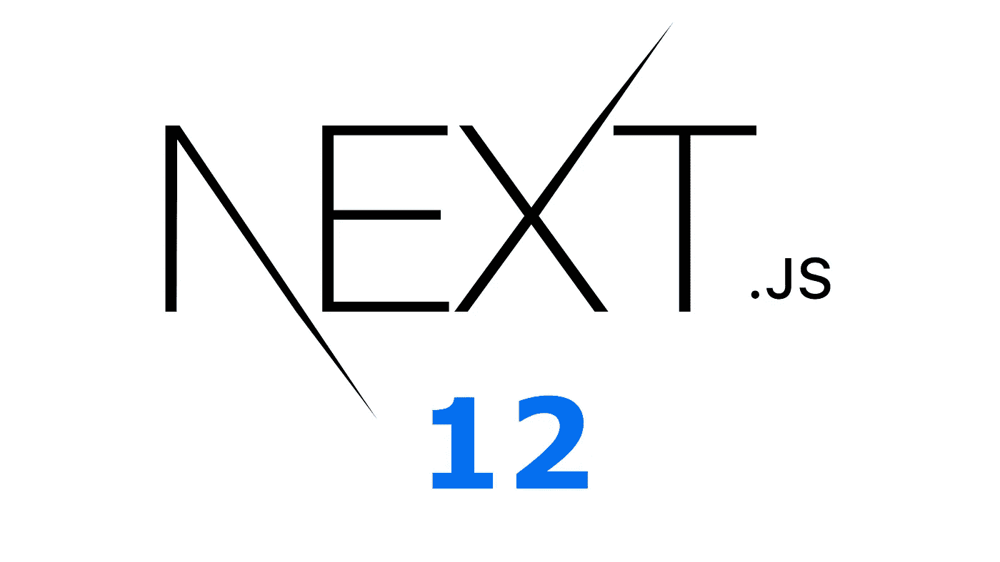
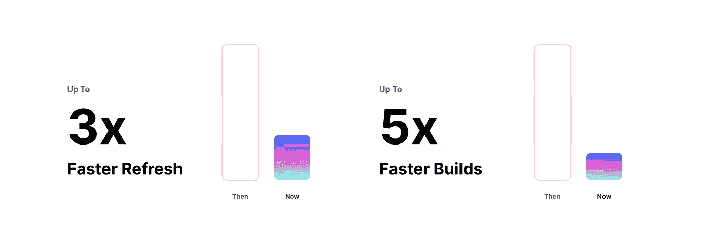
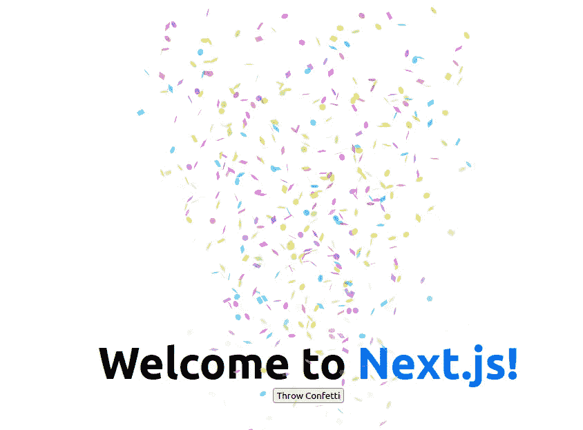
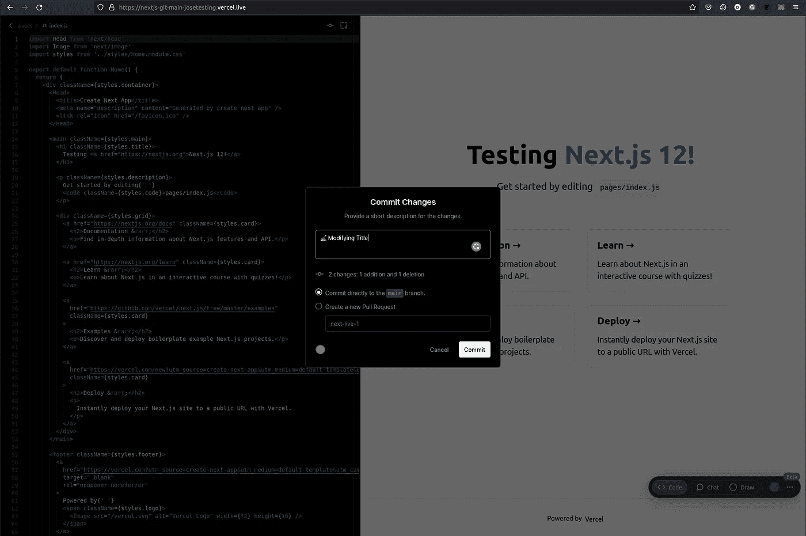

# Next.js 12 的 5 个新黑仔功能

> 原文：<https://betterprogramming.pub/5-new-killer-features-of-next-js-12-dfd1d766b539>

## 一个改变游戏规则的版本的主要亮点



作者捕获

Next.js 框架由 Vercel 于 2016 年创建。它最初是一个以服务器端渲染为中心的框架。后来逐渐演变。现在，它是一个完整的套件，可以构建反应极快的应用程序。它对开发人员友好，使用直观。以下是它最强大的功能:

*   基于页面的路由
*   混合页面
*   环境变量
*   静态文件服务
*   图像优化
*   分析学
*   国际化
*   出色的文档

他们给自己贴上了“生产反应框架”的标签。起初，这是一个雄心勃勃的口号，但随着时间的推移，它变得越来越难以争辩。它的最新版本推出了许多令人惊叹的功能，提高了它的性能。这些足以让它成为一个反应框架吗？会不会成为 React 的角？

在这篇文章中，我们将检查它的最新功能，看看这些功能是否足以让你改变。

# 1.更快的构建

新的 Next.js 12 附带了一个新的 Rust 编译器。这个编译器利用了本机编译。这意味着更快的构建和更快的刷新时间。



从 nextjs.org 俘获

这是怎么回事？编译器建立在代表`Speedy Web Compiler`的 SWC 之上。它确实消耗 Typescript/Javascript，并发出可以在旧浏览器上执行的 Javascript 代码。这是一个通天塔替代品。它在单线程上比 babel 快 20 倍，在四核基准测试上快 70 倍。

除了 Next.js，目前还有谁在用 SWC？


从 nextjs.org 俘获

这个 Rust 编译器现在默认启用。Vercel.com 版本的改进大约快 50%;从 3 分 41 秒降到了 1 分 58 秒。

它仍然不是完美的，因为它可能缺乏一些与解析流行库如`styled-components`或`emotion`的兼容性，但这种支持将很快出现。

您也可以使用它来缩小文件，只需在配置中启用它。代码如下:

```
***// next.config.js*** module.exports = {
  **swcMinify: true**
}
```

# 2.中间件

这是最令人兴奋的特性之一。目前，当构建更快的应用时，我们必须在 CDN 或服务器端渲染之间做出选择。当我们构建想要缓存的动态页面时，我们可能会使用后者。

Vercel 的新边缘功能使这成为可能。它提供了静态缓存的好处和动态执行的能力。现在，我们可以在 CDN 请求完成之前运行动态功能，即中间件。所有这些都没有冷启动。

Cloudflare 和 Amazon 基础设施不久前也实现了类似的功能。它被称为`edge computing`或`Lamdba@Edge`。Next.js 版本有什么特别之处？它在框架中简单友好的集成。

怎么用？通过在我们的 pages 目录中创建一个`_middleware`函数并部署它。在那里，我们可以在 CDN 级别进行动态检查。这些中间件功能可以划分范围和组合。

```
**# Execution order for middleware composition**
- /pages
  index.tsx
  - /profile
 **_middleware.ts # will run first**
    profile.tsx
    - /settings
      **_middleware.ts # will run second**
      _settings.tsx
```

一个`_middleware.ts`文件是什么样子的？让我们通过一个创建虚拟身份验证中间件的例子来看看这一点。

在上面的代码中，我们可以检查请求是否包含有效的 JWT，否则返回错误响应。

使用中间件最常见的用例是什么？

*   用户认证
*   Bot 保护
*   重定向和重写
*   处理不支持的浏览器
*   服务端分析
*   高级 18n 路由
*   记录

# 3.URL 导入

Next.js 团队已经为支持 ES 模块工作了一段时间。在以前的版本中，它被标记为实验性的。在这个新版本中，它们得到了本机支持。

这是什么意思？URL 导入可以建立在这些之上。

为什么这个功能很酷？我们现在可以直接从 CDN 导入工具，而不需要任何额外的构建或安装。我们将能够从网络中导入它们，而不必在本地构建它们。

你现在可以在你的 Next.js 应用中使用很酷的 CDN 项目，比如 **Skypack** 。这是一个基于 CDN 的包裹递送网络。它创建了现成的生产工具，没有编译和捆绑它们的麻烦。它扫描 NPM 并建立可执行的`ES`模块包，你可以从你的浏览器导入。

如何启用该功能？URL 必须在`next.config.js`文件中指定。您只需要启用您信任的域。

```
module.exports = {
  experimental: {
    **urlImports: ['https://cdn.skypack.dev'],**
  },
}
```

正如您从配置中看到的，这个 URL 导入功能仍处于试验阶段。

Next.js 工作流程是什么样子的？

*   在`next dev`上，将修改下载并将文件添加到`next.lock`文件中
*   在`next build`上，引擎将查找生成的`next.lock`文件。

让我们来看看一些实际的代码:

让我们来看看结果:



作者捕获

# 4.在服务器端支持 React 18

React 18 版本即将推出，在 React 17 发布后，它主要关注并发性。

Next.js 框架很早就跳了出来，并预测了 React 最期待的一些特性。很自然，所有这些新特性都将处于试验性配置状态。

## **HTML 服务器端流**

React 的 18 个特性中最酷的一个是内置了对服务器端悬念和 React 应用程序 HTML 部分流的支持。您不再需要加载全部或什么都不加载。您可以逐步将 HTML 传送到浏览器。

Next.js 框架支持这一点，并提供了所有这些机制的抽象。对于动态导入模块，您可以使用它的`next/dynamic`实用程序。

## React 服务器端组件

新的 React 服务器组件特性确实简化了 SSR 开发和逻辑。它们总是在服务器中呈现，并流式传输到客户端。这减少了处理不同渲染场景的需要。不再需要使用`getServerSideProps`和`getStaticProps`。将计算从客户端转移到服务器。

这些都是很大的进步。然而，它们仍然有一些限制:

*   他们没有国籍。
*   他们不能使用像`useState`或`useEffect`这样的生命周期方法。
*   他们不能使用浏览器专用的 API。

## 使用

你如何选择加入所有这些新的 React 18 产品？

**1。**首先，你需要使用以下代码安装 React 的 18 Alpha 版本:

```
npm install next@latest react@**alpha** react-dom@**alpha**
```

**2。**在 Next.js 配置中启用实验并发特性，如下图所示:

```
*// next.config.js*
module.exports = {
  experimental: {
    **concurrentFeatures: true,
    serverComponents: true,**
  },
}
```

这样，你就可以走了。

# 5.协作实时编码

向远程工作的转变意味着你需要更多的协作工具来更好地团队合作。在 Next.js 12 中，这被带到了下一个级别。现在，您可以在浏览器中即时编码、共享、绘图和编辑。

`https://vercel.com/live`平台将满足您的所有需求。您的应用程序将托管在 Vercel.com，并通过您选择的 git 供应商进行集成。

部署完成后，您可以在几秒钟内获得一个实时 URL，并开始一个结对编程会话或产品评论会话。最相关的特征是:

*   浏览器内编辑
*   几秒钟内准备好
*   邀请任何团队成员
*   只需要您最喜欢的浏览器

你可以玩你的应用程序，而不必先向回购协议提交任何东西。完成后，您可以通过使用 git 供应商来推送您的更改。



作者捕获

# 包裹

这一令人难以置信的发布使 Next.js 框架在竞争中脱颖而出。这是一个着眼于开发友好性和性能的框架。

作为开发人员，我们将看到我们的工作流程得到改进，并获得更多的工具供我们使用。与任何框架一样，它固执己见，但具有足够的灵活性，仍然可以掌控方向盘。它最有争议的话题一直是它的路由实现。

要知道 Next.js 项目是吸引客户到他们的 Vercel 平台的一种方式。因为它们是紧密耦合的，所以用它们来托管应用程序有很多好处和特性。您并没有将自己锁定在他们的基础架构上，但是如果您决定改变它，就会失去一些基础架构。为了通过选择 Vercel 作为托管平台来支持您的工作流，这是您必须做出的权衡。

不是中等会员？支持我[成为这里的](http://dioxmio.medium.com/membership)。

# 有关系的

[](/next-js-vs-remix-analyzing-key-aspects-and-differences-8674beaba695) [## Next.js vs. Remix:分析关键方面和差异

### 通过比较 Remix 和 Next.js 的最新版本，知道哪一个适合你

better 编程. pub](/next-js-vs-remix-analyzing-key-aspects-and-differences-8674beaba695) [](/react-18-is-here-what-is-new-e72e1efd57d6) [## React 18 来了！什么是新的？

### 自动批处理、startTransition、SSR 改造等等

better 编程. pub](/react-18-is-here-what-is-new-e72e1efd57d6)