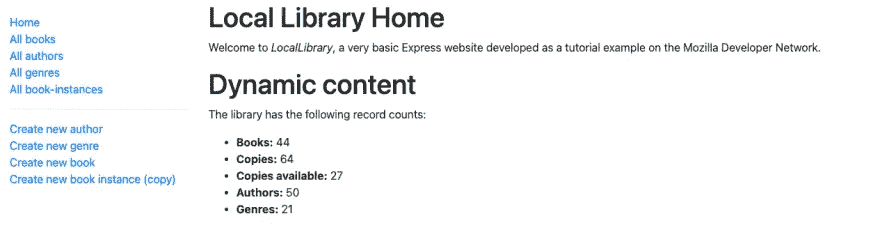
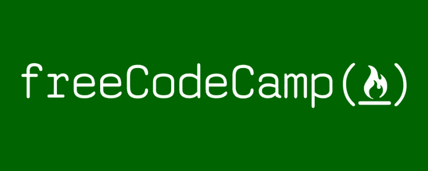
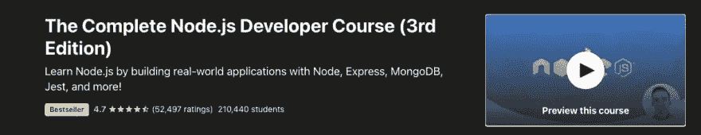
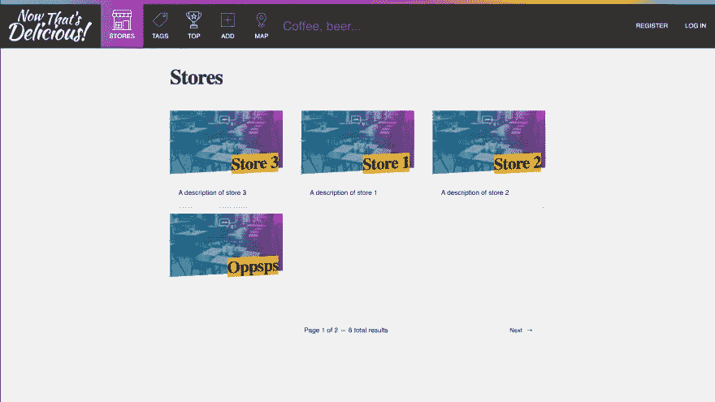
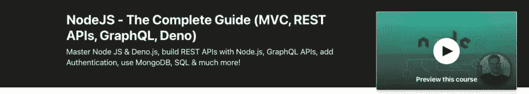

# 从初学者到专家的 5 个 Node.js/Express 教程

> 原文：<https://betterprogramming.pub/5-node-js-express-tutorials-to-go-from-beginner-to-expert-f658b9331402>

## 在 Node 和 Express 上做得更好

潘卡杰·帕特尔在 [Unsplash](https://unsplash.com?utm_source=medium&utm_medium=referral) 上的照片。

我主要使用 Node.js 和 Express 构建我的应用程序的后端。于是乎，我做了很多关于这个话题的课程。在这篇文章中，我想向你介绍我最喜欢的学习 Node 和 Express 的课程。

它们的难度不同。另外，每门课程都有其特殊性。例如，有些教你会话，有些不教。因此，它们是互补的，尽管它们之间有一些重叠。

也就是说，记住没有什么比你自己构建项目更能帮助你了。跟着课程走，然后学以致用！此外，需要注意的是，这些课程没有特定的顺序。事不宜迟，让我们开始吧。

# 1.Mozilla MDN Node.js/Express 教程

Mozilla MDN 是一个优秀的网站，有很多教程，包括一个关于 Node 和 Express 的教程。在本教程中，您将通过构建一个在线图书馆来学习这些概念。该应用程序允许用户添加书籍、作者和流派。它还显示每个作者写了哪些书，以及它们属于什么类型。

那么你在这个教程中学到了什么呢？你学会了:

*   关于 Node 和 Express —它们是什么，它们是如何工作的，它们的好处是什么。
*   如何设置节点(Express)开发环境？
*   如何执行 CRUD 操作。
*   如何创建数据之间的关系(如作者和书籍)。
*   MVC 模式——控制器、视图、模型、路线。
*   如何将 MongoDB 和 Mongoose 与 Node 和 Express 一起使用？
*   使用 Pug 为您的应用程序创建一个前端。
*   如何将应用程序部署到生产环境中。

不要被应用程序的简单外观所迷惑，因为本教程不是设计/前端教程。本教程提供了许多关于构建可以部署到生产环境中的后端应用程序的宝贵信息。

判决结果？我强烈推荐这个教程，你可以在 [MDN 的网站](https://developer.mozilla.org/en-US/docs/Learn/Server-side/Express_Nodejs)上查看。

# 2.freeCodeCamp 教程

[图](https://upload.wikimedia.org/wikipedia/commons/archive/3/39/20191220141125%21FreeCodeCamp_logo.png)BY[raised dead](https://commons.wikimedia.org/wiki/User:Raisedadead)/[CC BY-SA 4.0](https://creativecommons.org/licenses/by-sa/4.0/deed.en)。

另一个关于 Node 和 Express 的优秀教程是来自 [freeCodeCamp](https://www.freecodecamp.org/learn) 的教程。与 Mozilla MDN 类似，本教程将带您从对该主题一无所知到了解诸如身份验证之类的高级概念。除此之外，您将构建多个应用程序，而不仅仅是一个。因此，有很多机会实践你所学的东西。

让我们看看你在 freeCodeCamp 的课程中学到了什么:

*   Node 和 Express 介绍。
*   了解如何提供 HTML 文件和静态资产(图像、CSS、JavaScript 等)。
*   实现中间件。
*   了解查询/路径参数。
*   从 POST 请求中获取并解析数据。
*   使用 MongoDB 和 Mongoose 在数据库中存储数据并对其进行操作。
*   使用 Passport 设置身份验证和授权。
*   实现 CRUD 操作。

我提取了最重要的主题，但课程涵盖了更多。freeCodeCamp 是开始使用 Node 和 Express 的好方法。但是，您需要使用其他资源来完成这些材料，以获得高级概念和最佳实践。

总之，freeCodeCamp 是最好的资源之一，因为你不需要设置你的环境。这意味着你可以专注于编码而不是其他事情。除此之外，这些信息很有价值，你可以免费学到很多东西。

# 3.Andrew Mead 的完整 Node.js 开发者

本课程是向您介绍 Node 和 Express 世界的最佳课程之一。在本课程中，您将构建四个 web 应用程序。每个应用程序都有一个目的，并教给你一些概念。因此，通过构建这四个项目，您可以学到很多东西。

您在本课程中学到的一些概念包括:

*   了解 Node.js 包管理器(NPM)。
*   设计一个 REST API。
*   用 Git 进行版本控制。
*   上传文件和图像。
*   发送电子邮件。
*   您还将了解 ES6 和 ES7。
*   如何用 JWT (JSON Web Token)认证用户。
*   开玩笑的测试。
*   用 VS 代码和谷歌 Chrome 调试。

像往常一样，我强调了你在课程中学到的最重要的概念。但是，你学到的概念更多。这门课程是经过深思熟虑的，你可以用它从节点和表达开始，或者填补你知识中的空白。本课程的突出之处在于，讲师对每个概念都进行了详细讲解。这些解释并不仓促，这样更容易理解并学得更好。

我推荐这门课程吗？是的，我学了两次这门课程，怎么推荐都不为过。无论你是初学者还是中级开发人员，该课程都是合适的。

# 4.Wes Bos 学习节点

你将要构建的最好看的应用程序来自 Wes Bos 的课程。应用程序的设计引人注目、美观且专业。

然而，我想提一下，当我没有节点知识时，我在开始时很难跟上课程。我不得不推迟它，跟随另一门课程学习基础知识。课程感觉很高级，还有其他更适合完全初学者的课程。请记住，这只是我的经验，可能并不适用于你。

现在，让我们看看本课程涵盖的内容:

*   如何实现 CRUD 操作？
*   如何实现 REST API 点？
*   如何在应用程序中使用 MVC 模式？
*   如何添加路由和分页？
*   如何实现文件上传？
*   如何像 Pug 一样设置模板引擎？
*   如何在各种提供者上部署到生产环境。
*   如何给用户发邮件？
*   在 MongoDB 数据库中存储数据并操作这些数据。
*   如何实现认证和授权？

与其他课程一样，这些只是部分主题。本课程涵盖了更多的主题，您可以在[学习节点](https://learnnode.com/)上找到。

我推荐这门课程吗？是的。这是一门很棒的课程，通过构建现实世界的应用程序，你可以学到很多概念。唯一的缺点可能是这是一门付费课程。否则就是一门全能的伟大课程。

# 5.NodeJS——Maximilian Schwarzüller 的完全指南

本节点课程略有不同，因为它涵盖的主题不仅仅是节点和 Express。尽管重点是这两项技术，但您也可以学习其他技术。例如，它教打字稿和 Deno，这是额外的收获。你得到的比你付出的要多。

除了其他课程中教授的常用节点和表达式概念之外，您还将学习:

*   普通 JavaScript 和 ES6 概念。
*   在 Node 和 Express 中使用 SQL。
*   高级认证和测试。
*   GraphQL 是什么，怎么用。
*   如何添加条纹支付？

像往常一样，这些不是唯一的主题。然而，这些概念将本课程与其他课程区分开来。您可以获得关于 Node 和 Express 的所有常规信息，以及这些其他概念和技术。

判决结果？这个球场物有所值。它远远超出了 Node 和 Express 的范畴，它向您传授了其他很酷很有用的概念和技术。你可以在 Udemy 上查看[的课程。](https://www.udemy.com/course/nodejs-the-complete-guide/)

# 结论

以上是我推荐的五大节点/速成课程。他们可以把你从一无所知带到一个高级水平。当然，不得不提的还有这些。此外，根据我的经验，他们是前五名。

我推荐这篇文章中的所有课程，因为它们都不会错。然而，如果你有更多的建议，请在评论中留下。我想看到更多好的课程。

*如果对 JavaScript 教程感兴趣，我推荐* [*前端高手*](https://catalins.tech/frontend-masters-membership-is-it-worth-it) *！*

*如果你想用技术写作赚钱，就去查查* [*那些付钱让你写*](https://catalins.tech/websites-that-pay-you-to-write-technical-articles) *技术文章的网站吧！*

*如果你想学习 JavaScript，我推荐这些* [*5 资源作为初学者学习 JavaScript*](https://catalins.tech/5-best-resources-to-learn-javascript-as-a-beginner)*！*

*谈判你的工资是必不可少的——学习* [*作为一名开发者如何谈判你的工资*](https://catalins.tech/how-to-negotiate-your-salary-as-a-developer) *！*

*用* [*Git 别名*](https://catalins.tech/git-aliases-what-are-they-and-how-to-use-them) *加速你的开发。*

*如果你想* [*以开发者身份开博客*](https://catalins.tech/how-to-start-your-blog-as-a-developer) *，我推荐你阅读《* [*如何以开发者身份开博客*](https://catalins.tech/how-to-start-your-blog-as-a-developer) *》一文！*

你是否很难跟上科技领域的最新消息？参见 [*作为开发者保持最新状态的一种方法*](https://catalins.tech/one-way-to-stay-up-to-date-as-developer) *！*

*学习* [*如何在 JavaScript*](https://catalins.tech/how-to-use-asyncawait-in-javascript) *中使用 Async/Await！*

GitHub 简介目前风靡一时。了解 [*如何创建 GitHub 个人资料页面*](https://catalins.tech/how-to-create-a-kickass-github-profile-page) *！*

*查看这 7 个* [*资源，帮你通过求职面试*](https://catalins.tech/7-github-repositories-to-help-you-crush-your-job-interviews) *！*

*查看即将到来的新功能*[*JavaScript ECMAScript 2021 es 2021*](https://catalins.tech/javascript-es2021-you-need-to-see-these-ecmascript-2021-features)*！*

*你是初学程序员吗？查看这些* [*编程项目思路适合初学者*](https://catalins.tech/10-programming-project-ideas-for-beginners) *！*

*你是在学习编码还是打算去做？查看* [*免费学习编程的最佳地点*](https://catalins.tech/20-best-places-to-learn-programming-for-free) *！*

[*用这 9 个浏览器扩展提高你的开发者生产力*](https://catalins.tech/my-9-must-have-browser-extensions-for-increased-developer-productivity) *！*

*如果你是 Node.js 的开发者，我建议你查看 Node.js* *中的这些* [*4 个创意设计模式！*](https://catalins.tech/the-4-creational-design-patterns-in-nodejs-you-should-know)

*查看这些惊人的*[*JavaScript ECMAScript 2020 特性*](https://catalins.tech/javascript-es2020-the-features-you-should-know) *！*