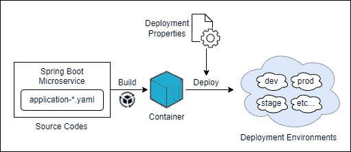
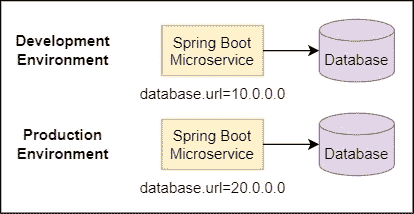
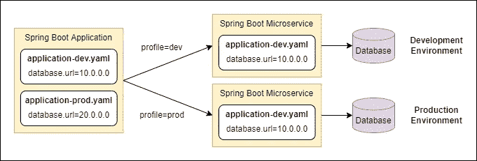
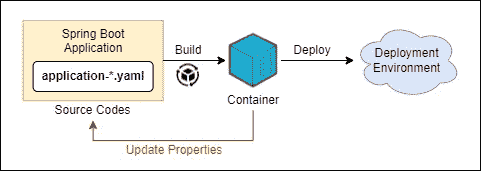
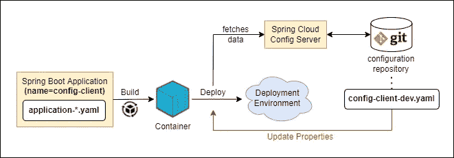
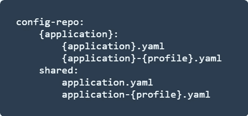
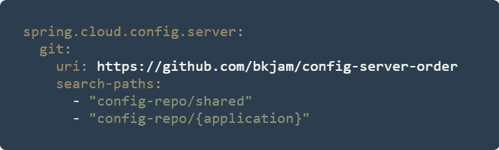
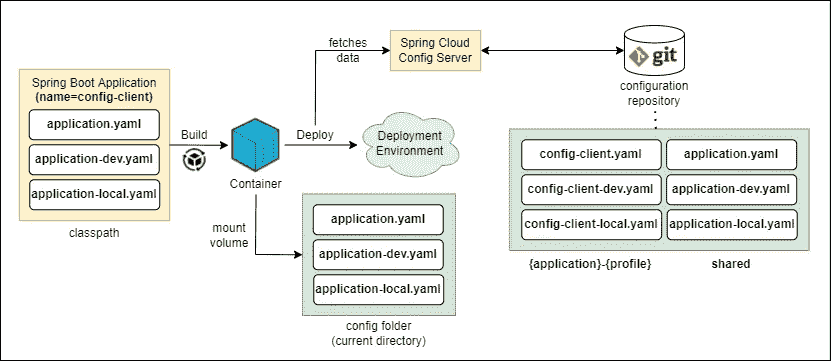

# 关于 Spring Cloud 配置的属性文件的 Spring Boot 加载优先级的 5 个观察

> 原文：<https://betterprogramming.pub/5-observations-on-spring-boots-loading-precedence-for-properties-files-with-spring-cloud-config-331d1af9052e>

## 分享我在使用 Spring Cloud Config 和 Spring Profiles 时，关于 Spring Boot 应用程序中属性文件优先顺序的经验


照片由[布雷特·乔丹](https://unsplash.com/@brett_jordan?utm_source=medium&utm_medium=referral) 在 [Unsplash](https://unsplash.com?utm_source=medium&utm_medium=referral)

您是否使用 Spring Cloud Config Server 将您的配置具体化和集中化？您是否使用 Spring 概要文件来管理不同部署环境的配置？当您部署 Spring Boot 应用程序时，您是否对其中哪些配置具有更高的优先级感到困惑？我也是！

在这篇文章中，我将分享我在 Spring Boot 应用程序中使用 Spring Cloud Config 的经验，以及在运行 Spring Boot 应用程序时属性文件的优先顺序。

***注意*** *:本文不会详细介绍如何实现 Spring Cloud Config Server，需要一些部署 Spring Boot 应用程序的知识。在撰写本文时，Spring Boot 版本= 2.7.0，Spring Cloud 版本= 2021 . 0 . 3-快照，Spring Cloud 配置版本= 3 . 1 . 3-快照。*

[](https://github.com/bkjam/config-server-order) [## GitHub-bkjam/config-server-order:了解 Spring boot 的优先顺序…

### 此时您不能执行该操作。您已使用另一个标签页或窗口登录。您已在另一个选项卡中注销，或者…

github.com](https://github.com/bkjam/config-server-order) 

# 背景上下文

在开始之前，让我们先了解一下 Spring Boot 应用程序中配置的概念，以及 Spring Cloud Config 和 Spring Profiles 是如何发挥作用的。



集装箱化和部署 Spring Boot 微服务的流程

上图简要概述了我们如何将 Spring Boot 应用容器化，并将其部署为微服务。正如您已经注意到的，在部署 Spring Boot 应用程序时，您可以传入属性来改变应用程序在不同部署环境中的行为。

这些属性通常在属性文件(`application.yaml`或`application.properties`)中定义，它们可以被环境变量覆盖。例如，在开发和生产环境中连接到不同的数据库实例，如下图所示。



基于部署环境自定义数据库 URL

然而，管理不同部署环境的属性可能会很繁琐。因此，我们使用弹簧剖面来帮助我们。

## **与弹簧轮廓整合**

Spring Profiles 允许我们定义按“概要”分类的属性文件。当您部署您的 Spring Boot 应用程序时，您将使用环境变量来定义活动的 Spring 概要文件，以加载特定于概要文件的属性(也称为部署环境特定的属性)。下面是一个使用 docker 命令的例子。

```
docker run --env SPRING_PROFILES_ACTIVE='dev' spring-boot-app
```

下面是如何使用弹簧轮廓加载属性的简单说明:



使用弹簧轮廓加载特性

此外，Spring Profiles 允许我们加载多个属性文件。如果您要按如下方式设置配置文件:

*   `spring.profiles.active="dev"` →这将加载`application.yaml`和`application-dev.yaml`属性文件。
*   `spring.profiles.active="dev, local"` →这将加载`application.yaml`、`application-dev.yaml`和`application-local.yaml`属性文件。

## **使用 Spring Cloud 配置的外部化配置**

内部配置是您在`classpath` **中的 Spring Boot 应用程序中存储属性文件的地方。**这些属性文件打包在应用程序中，因此我们也可以称之为打包文件。

> `*classpath*` *是指存储资源文件的位置，在 Maven 项目中，存储应用程序资源的标准位置是在* `*src/main/resources*` *文件夹中。*

内部配置的一个问题是，每次需要更改配置时，您都必须重新构建容器并重新部署应用程序，如下所示。



内部配置方法

使用外部化配置可以简化这个问题，在外部化配置中，我们使用 Java 系统属性、环境变量、命令行参数或外部属性文件来覆盖属性。

Spring Cloud Config 是一种允许您在外部存储属性文件并在 Spring Boot 应用程序启动时检索它们的方法。因此，我们只需要重新部署应用程序来反映配置更改，如下所示。



使用 Spring Cloud 配置的外部配置方法

至此，我们已经介绍了 Spring Boot 属性、Spring 配置文件和 Spring Cloud 配置的基本背景，让我们更深入地理解从不同来源加载的属性文件的优先顺序。

# 如何配置我的 Spring 云配置服务器？

我使用 Git 来存储我的配置数据。下图是我的配置数据的文件夹结构，其中`{application}`是一个占位符，表示可通过属性`spring.application.name`配置的 Spring Boot 应用程序的名称。



远程存储库中我的配置数据的文件夹结构

Spring Cloud Config Server 被配置为连接到一个存储库，配置数据存储在`config-repo`文件夹中。此外，`config-repo`文件夹中有 2 个搜索路径(子文件夹)。



Spring Cloud 配置服务器配置(部分)

`shared`子文件夹是存储所有 Spring Boot 应用程序共享的所有通用配置的地方，每个 Spring Boot 应用程序都有自己的`{application}`子文件夹。

# 查看优先顺序

我们开始吧！你可以参考 [Spring Boot 文档](https://docs.spring.io/spring-boot/docs/current/reference/html/features.html#features.external-config)中外部化配置的优先顺序。在这里，我将尝试演示在 Spring Boot 配置外部化配置的常见场景。

为了构建演示的上下文，我将有一个带有 2 个 Spring 概要文件(dev，local)的 Spring Boot 应用程序(config-client)、一个 Spring Cloud 配置服务器和几个属性文件，如下所述。



演示设置概述

我配置的属性文件有 3 个主要位置。

*   `classpath`根— `src/main/resources` **(内部)**
*   Spring Cloud 配置服务器**(外部)**
*   一个`/config`文件夹**(外部)**

Spring Boot 应用程序将从这些位置加载属性，并将它们添加到 Spring 环境中。

## **带弹簧轮廓的正常部署**

使用演示设置的部署场景，让我们使用下面的命令部署带有 Spring 概要文件`dev`和`local`的 Spring Boot 应用程序。

```
docker run \ 
   --env SPRING_PROFILES_ACTIVE='dev, local' \
   --env SPRING_CONFIG_ADDITIONAL_LOCATION='/config/' \
   --volume <path_to_config_folder>:/config \
   config-client
```

当 Spring Boot 应用程序启动时，它将按照以下优先级顺序(从高到低)加载属性文件:

*   配置目录:`config/application-local.yaml`(特定于配置文件)
*   配置目录:`config/application-dev.yaml`(特定于配置文件)
*   配置目录:`config/application.yaml`(默认)
*   配置服务器:`config-client/config-client-local.yaml`(特定于配置文件)
*   配置服务器:`shared/application-local.yaml`(共享的，特定于配置文件的)
*   配置服务器:`config-client/config-client-dev.yaml`(特定于概要文件)
*   配置服务器:`shared/application-dev.yaml`(共享，特定于配置文件)
*   类路径:`resources/application-local.yaml`(特定于概要文件)
*   类路径:`resources/application-dev.yaml`(特定于概要文件)
*   配置服务器:`config-client/config-client.yaml`(默认)
*   配置服务器:`shared/application.yaml`(共享，默认)
*   类路径:`resources/application.yaml`(默认)

## 关于优先顺序的主要观察结果是什么？

根据前面的例子和我在文档中的发现，我确定了 5 个关键的观察点。

## **1 —属性 vs Yaml 文件**

正如 Spring 文档中提到的,`.properties`文件比`.yaml`文件具有更高的优先级。也强烈建议坚持单一的文件格式。

## **2 —弹簧轮廓**

特定于配置文件的属性文件总是覆盖非特定的属性文件。`application-{profile}.yaml > application.yaml`例。

在**多个 Spring 概要文件**的情况下，应用一个最后胜出的策略，其中属性文件的优先顺序从`the right to the left`开始。例如`application-local.yaml > application-dev.yaml`用于弹簧型材`spring.profiles.active=”dev, local”`。

## **3 —配置服务器搜索路径配置**

Spring Cloud Config Server ( `spring.cloud.config.server.git.search-paths`)中的搜索路径配置应用了一种最后取胜的策略。这意味着后一个文件夹中的属性将具有更高的优先级。使用我在上面的配置[，属性文件的优先级将是这样的`config-repo/{application} > config-repo/shared`。](#612c)

## 4 —配置客户端如何从 Spring Cloud 配置服务器加载属性

从 Spring Boot 2.4 开始， [Spring Cloud Config 客户端文档](https://docs.spring.io/spring-cloud-config/docs/current/reference/html/#config-data-import)推荐通过`spring.config.import`属性从 Spring Cloud Config 服务器导入配置。如果我们看一看 [Spring Boot 在 Spring 2.4](https://spring.io/blog/2020/08/14/config-file-processing-in-spring-boot-2-4) 中关于配置文件处理的博客更新，你会发现下面的声明:

> 导入可以被认为是插入到声明它们的文档下面的附加文档。它们遵循与常规多文档文件相同的自上而下的顺序:无论声明多少次，导入都只导入一次。

这意味着来自 Spring Cloud Config Server 的属性文件被解析并优先于与声明它们的“文档”在同一位置组中的属性文件。此外，由于导入的方式，来自 Spring Cloud Config Server 的属性文件将比“文档”具有更高的优先级。

在上面的例子中，我们在 Spring Boot 应用程序的`classpath` ( `resources/application.yaml`)中声明了属性`spring.config.import: <Config Server URL>`。因此，来自 Spring Cloud Config Server 和`classpath`的所有属性文件将按照以下顺序(从高到低)在同一个位置组下进行优先排序和解析:

*   特定于配置文件的属性文件(`config-server`
*   特定于配置文件的属性文件(`classpath`
*   默认属性文件(`config-server`)
*   默认属性文件(`classpath`)

然而，奇怪的是，**所有通过`spring.config.import`导入的**特定于概要文件的属性文件(在 config-server 中)比`classpath`中的特定于概要文件的属性文件具有更高的优先级。我相信这是外部导入文件的预期行为。

## 5-外部化的属性文件

参考 [Spring Boot 的配置数据迁移指南](https://github.com/spring-projects/spring-boot/wiki/Spring-Boot-Config-Data-Migration-Guide#profile-specific-external-configuration)，外部文件总是覆盖打包文件(无论是否特定于配置文件)。因此，您会注意到新的变化，其中属性`spring.config.location`定义了下面的默认位置组，后者具有更高的优先级。

```
optional:classpath:/;optional:classpath:/config/optional:file:./;optional:file:./config/;optional:file:./config/*/
```

在上面的例子中，与 Spring Cloud Config Server 或`classpath`相比，`/config`外部文件夹中的所有属性文件都有更高的优先级。属性文件在每个位置组中按以下顺序(从高到低)排列优先级并进行解析

*   `/config`文件夹**(外部)→** `spring.config.additional.location`
*   Spring Cloud 配置服务器**(外部)** > `classpath` **(内部)** →与上面第 4 点中解释的位置组相同

> 另外，如果在外部文件夹`/config/application.yaml`中定义了 Spring Cloud Config Server 的`spring.config.import`属性，那么优先顺序将会改变，因为`/config`和 Spring Cloud Config Server 将会在同一个位置组中。

# 摘要

就是这样！这是我在使用 Spring Boot 和 Spring Cloud Config 时发现的 5 个关键观察点。根据您将 Spring Cloud Config Server 绑定到 Spring Config Client 的方式，优先顺序可能会改变，但是概念应该保持不变。

请注意，我使用的是一个非常基本的设置，带有多个特定于概要文件的属性文件。

您还可以使用许多其他方法，如 Spring Boot 2.4 中引入的多文档属性文件、配置文件组、配置文件激活或 Kubernetes 配置映射。

至于 Spring Cloud Config Server，您也可以将其配置为从多个 git 存储库或 Vault 加载。一定要自己去看看这些很酷的功能。

最后，我不认为这篇文章对熟悉 Spring Boot 和 Spring Cloud Config 的人来说是什么新鲜事，但我希望它对不熟悉 Spring Cloud Config 的人有用:)

感谢阅读。如果你喜欢这篇文章，请关注我！