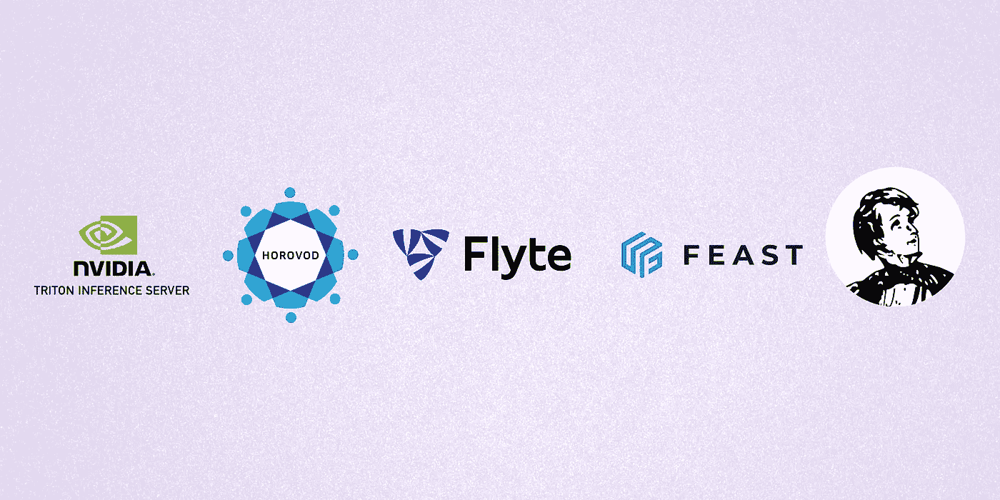
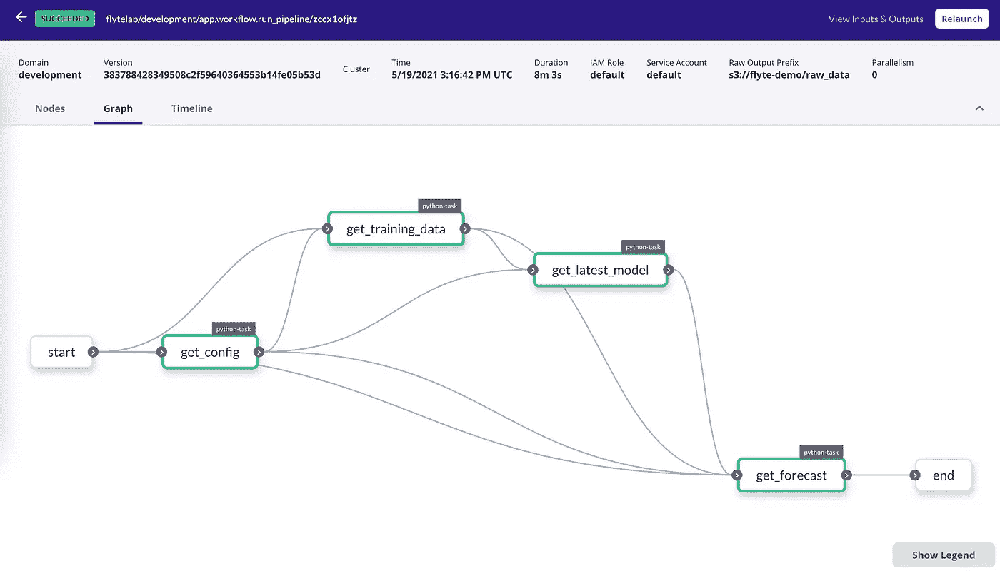
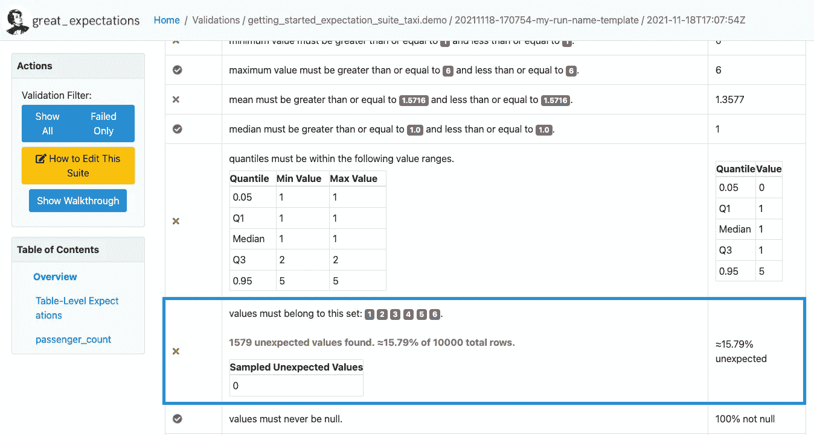
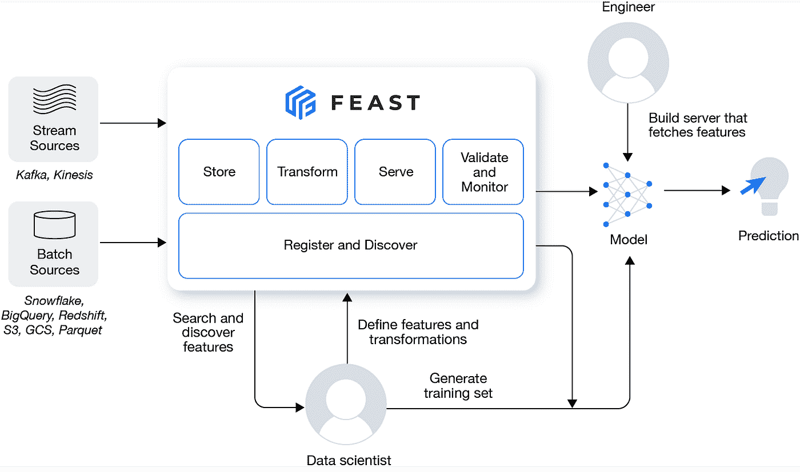
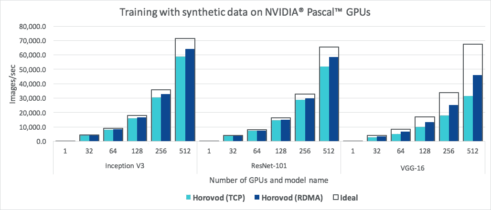
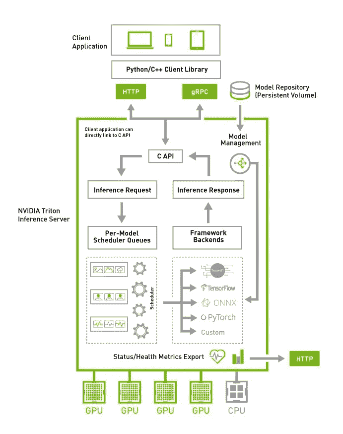

# 5 个开源工具，可以帮助您轻松构建 ML 管道

> 原文：<https://betterprogramming.pub/5-open-source-tools-that-can-help-you-build-ml-pipelines-with-ease-46eb5d4c3488>

## 所有生产友好型

作者图片

ML 不仅仅是在 Jupyter 笔记本上训练虹膜数据的 K-means 分类器。你可能希望*在*高端基础设施*存在的情况下，使用*复杂的 ML 模型*训练成吨的数据*。现在，这不能用单一的工具来完成。我们需要收集它们！

随着对构建生产就绪的端到端 ML 管道的兴趣激增，使用可更快扩展的正确工具集的需求不断增长，并且正在积极开发中。

在本文中，我将讨论我遇到并使用过的 5 个开源工具，它们可以在构建 ML 管道的多个阶段为您提供帮助。

## [弗莱特](https://flyte.org/)

[GitHub](https://github.com/flyteorg/flyte) 。[单据](https://docs.flyte.org/en/latest/index.html)。[社区](https://slack.flyte.org/)

*当前部署:Spotify、Lyft、Freenome、GoJek 等。*

为了部署具有高开发速度的生产级 ML *和没有基础设施*麻烦的*，我们需要一个平台来帮助解决 *ML* 的*操作*方面。确切地说，我们需要一个平台来促进团队之间的协作，在不耗尽资源的情况下处理代码的重复运行，支持不喜欢干预基础架构方面的数据科学家，可扩展且值得信赖，这样的例子还可以继续。*

 [## 争吵

### Flyte 使得为机器学习和数据创建并发的、可扩展的和可维护的工作流变得容易…

flyte.org](https://flyte.org) 

Flyte 是一个工作流自动化平台，有助于自动化关键的 ML 和数据管道。它使分布式培训变得容易，没有单点故障，提供了数据沿袭，并简化了引导基础设施的过程。有了 Flyte，你再也不用担心处理 *ML* 的 *Ops* 了。

来自 blog.flyte.org[的 FlyteConsole 屏幕截图](https://blog.flyte.org/from-incubation-to-graduation-and-beyond#heading-enter-the-world-of-ml-aware-orchestration)

开始使用 Flyte 非常简单；安装 Docker、Python、Git，运行几个命令，就可以开始了！

**如何部署？**所有部署指南和最佳实践都汇编在文档的[部署部分。一些部署可能需要 Kubernetes 及其相关工具方面的专业知识。](https://docs.flyte.org/en/latest/deployment/index.html)

## [远大前程](https://greatexpectations.io/)

[GitHub](https://github.com/great-expectations/great_expectations) 。[单据](https://docs.greatexpectations.io/docs/)。[社区](https://greatexpectations.io/slack)

*当前部署:GitHub、Calm、Agero、Civis 等。*

数据并不总是我们期望的那样。数据验证始终是至关重要的，以确保数据看起来像我们想要的那样。高期望值有助于实现完全相同的目标—在实际流程开始之前确保数据质量，无论是建模还是分析。

[远大期望](https://greatexpectations.io/)通过“*期望*”来实现，是对数据的断言。在这些套件中，我们必须描述我们对数据的预期。或者，可以使用“*数据分析器*”生成预期。我还没有彻底测试过这个特性，但是它看起来很有前途！

在定义了所需的配置和期望之后，Great Expectations 会进行数据验证并给出结果。为了美化数据验证结果，远大前程提供了“*数据文档*”——一个用户友好的用户界面来查看哪里出了问题。

数据文件截屏来自[docs . great expectations . io](https://docs.greatexpectations.io/docs/tutorials/getting_started/tutorial_validate_data)

**如何部署？** [部署指南](https://docs.greatexpectations.io/docs/deployment_patterns/how_to_instantiate_a_data_context_hosted_environments#)包含在文档中。它有一些集成已经启动并运行；然而，独立部署应该不会太难。

## [盛宴](https://feast.dev/)

[GitHub](https://github.com/feast-dev/feast) 。[单据](https://docs.feast.dev/)。[社区](https://slack.feast.dev/)

*当前部署:GoJek、Shopify、Salesforce、IBM 等。*

[宴](https://feast.dev/)是一种 *fea* 真 *st* 矿石。在 ML 中，如果数据集很大，可能会有很多要素。功能存储有助于管理和生产功能，实现培训和服务数据之间的一致性，以及跟踪功能版本和沿袭。Feast 发表了一篇名为[什么是特色店的综合文章？如果你想深入了解特色商店的概念。](https://feast.dev/blog/what-is-a-feature-store/)

盛宴建筑([来源](https://docs.feast.dev/))

人们主要在训练和推理期间与特征库进行交互。首先，需要定义和注册特征定义，可以使用特征存储生成训练数据，需要将特征从离线存储具体化到在线存储，最后，可以使用在线存储的最新特征进行推理。

**如何部署？**有有[详细指导](https://docs.feast.dev/how-to-guides/running-feast-in-production)部署盛宴生产。部署需要自动化，以简化后续的使用。

## [Horovod](https://horovod.ai/)

GitHub 。[文档](https://horovod.readthedocs.io/en/stable/)

如果深度学习(DL)模型在使用单个 GPU 进行训练的过程中表现不佳，我们可能需要许多模型来分配工作负载，以加快过程。Horovod 是一个用于 TensorFlow、Keras、PyTorch 和 Apache MXNet 的分布式培训框架。即使代码是单 GPU 兼容的(当然，代码必须使用 Horovod APIs)，也很容易扩展到数千个 GPU。

Horovod 的主要优势是它可以与多个 DL 库一起工作——选择 DL 框架，调用正确的 API，瞧！结果应该在更短的时间内产生。

Horovod 基准([来源](https://horovod.readthedocs.io/en/stable/summary_include.html))

**如何部署？**[安装指南](https://horovod.readthedocs.io/en/stable/summary_include.html#id7)应该有助于设置环境。如果有 docker 文件，仔细插入所有安装说明，无论是 MPI、NCCL 还是相关的环境变量。

## [Triton 推理服务器](https://developer.nvidia.com/nvidia-triton-inference-server)

[GitHub](https://github.com/triton-inference-server/server) 。[文档](https://github.com/triton-inference-server/server/tree/r22.01#documentation)

推理是 ML 的一个重要方面。因为它是面向用户的，所以我们不能只考虑速度，它必须又快又准。当你打开网飞时，你会得到即时的电影推荐。想象一下生成预测的速度，以及可能同时访问网飞的用户数量！这可能是一个相当大的数字，不是吗？

NVIDIA 的 [Triton](https://developer.nvidia.com/nvidia-triton-inference-server) “推理”服务器可以简化属于各种框架的各种型号的部署，并轻松扩展。它可以在多个 GPU 上并发运行，并提供许多功能。

海卫一是什么做的？([来源](https://developer.nvidia.com/nvidia-triton-inference-server))

要运行 Triton，提取一个预先存在的 Docker 映像，并启动容器，然后启动服务器。

**如何部署？**使用 Kubernetes 和 Helm 部署 Triton，有 [GCP](https://github.com/triton-inference-server/server/blob/main/deploy/gcp/README.md) 、 [AWS](https://github.com/triton-inference-server/server/blob/main/deploy/aws/README.md) 和 [NVIDIA FleetCommand](https://github.com/triton-inference-server/server/blob/main/deploy/fleetcommand/README.md) 指南。一个名为 [transformer-deploy](https://els-rd.github.io/transformer-deploy/) 的开源项目提供了一个现成的基于 NVIDIA Triton 的 CPU/GPU 推理服务器，用于拥抱 Face transformer 模型，以简化部署过程。

 [## 变压器-由 Lefebvre Dalloz 部署

### 高效、可扩展的企业级 CPU/ GPU 推理服务器，适用于 Lefebvre 的人脸变形模型

els-rd.github.io](https://els-rd.github.io/transformer-deploy/) 

感谢阅读！让我知道你用来建立 ML 管道的工具。