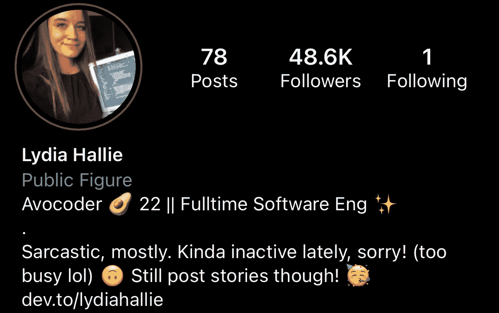
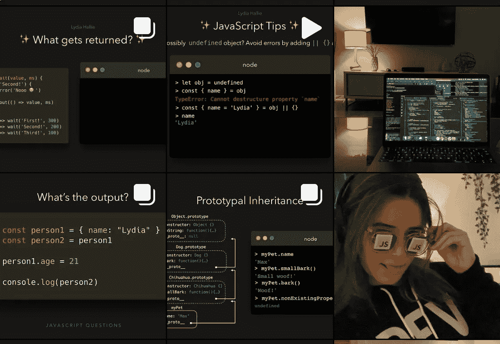

# 给有抱负的软件工程师的 5 条建议

> 原文：<https://betterprogramming.pub/5-pieces-of-advice-i-wish-i-had-known-when-i-was-starting-out-as-a-software-engineer-4ab7d3f0b0f>

## 从与其他人合作开始

[女同胞](https://unsplash.com/@cowomen?utm_source=medium&utm_medium=referral)在 [Unsplash](https://unsplash.com?utm_source=medium&utm_medium=referral) 上拍照。

随着技术的不断发展，“软件工程师”已经成为 21 世纪最受欢迎的工作之一，平均年薪为 111，190 美元。

成为软件工程师或软件开发员是世界上最好的工作之一。在你的电脑上输入一行行代码并获得丰厚报酬的行为是非常令人满意的。这也带来了更好的职业机会，比如有时间做副业或创办自己的公司。

然而，旅程并不总是沿着一条直线，我在职业生涯中遇到了如此多的挑战，我仍然在面对和学习。这些挑战中的一些，如果不是全部，给了我宝贵的教训，我希望我在开始时就知道。我现在想把它们教给初学者。

因此，我写下了五条我认为会改变我职业生涯游戏规则的建议。我希望你和我一样觉得它们有用。

意识到这些，更重要的是，能够运用它们不仅会给你带来更好的职业机会、不可动摇的自尊和更高的薪水，而且最终会让你的职业生涯蒸蒸日上。

# 1.在线分享您的旅程

让我们从几年后我必须学会的最重要的一课开始:在线记录和分享你的旅程。

为什么要记录你的旅程？

作为一名软件工程师，你通常会花时间独自呆在房间里，将自己与疯狂的社会隔离开来，这是可以接受的，也是可以接受的。

然而，大多数软件工程师都有一个共同的特点，那就是他们在社交场合很笨拙。事实证明，花太多时间在电脑上，而不是其他人身上，会在某种程度上影响你与他们交流和互动的能力。

这导致一种不舒服的感觉，不知道在公共场合的某些互动中如何表现。

分享你的旅程意味着在 Instagram、YouTube 或 Twitter 上分享你目前正在做的事情和你目前所处的位置。这可能是你正在学习的一门编程语言，你正在做的一个项目，甚至是你自己的创业。

## 展示你的进步和结果。

为什么要记录和分享？

嗯，你可以建立一个品牌，并与世界各地的其他人建立联系，这些人也可以是软件工程师或设计师。如果你不在网上记录你的旅程，这可能会让你错过一些机会。

不管你大多数时候怎么想，如果你只是分享，人们会喜欢你做的事情。此外，你的旅程也将帮助其他人的旅程，也许会激励一些人开始像你一样的职业生涯。

我在 Instagram 上最喜欢的一个是莉迪亚·哈利(又名“theavocoder”):

来源: [Instagram](https://www.instagram.com/theavocoder/?hl=en)

来源: [Instagram](https://www.instagram.com/theavocoder/?hl=en)

这个想法在推特上也被称为“公共建筑”。许多推特用户通过记录分享他们的在线旅程:

1.  进步
2.  结果(甚至失败)
3.  成就或里程碑
4.  事件
5.  你学到的教训

讲个故事。这样做可以让你在网上建立声誉，从长远来看，当你想追求其他职业定义的机会时，这是有益的。Twitter 上的人都这么做，我也是！

当然，你也可以在 YouTube 或 Instagram 上这样做，就像成千上万的人在职业生涯中所做的那样。这个想法并不新鲜。当你写日记的时候，你可能已经这样做了。你所要做的就是在线写作。

所以，上市，上线。记录你的旅程，讲述你的故事。

# 2.磨练你的社交技能

按[上行](https://upjourney.com/why-are-social-skills-important):

> “社交技能很重要，因为它们是你与他人、你的伙伴、朋友以及你的事业建立积极关系的基础。”

此外:

> “社交技能能让你在生活中重要的层面上与他人联系，这样你就能与他人建立更深入的关系。”

社交技能可能意味着非常成功的软件工程师和不成功的软件工程师之间的区别。大多数时候，你的软技能可以让你进入高级管理职位。

如果你想被提升为产品经理或开发主管，你需要提高你的社交技能。

以下是一些重要的社交技能:

*   清晰地交流
*   日志
*   批判性思维
*   积极倾听

他们看起来简单容易，对不对？嗯，需要练习才能变得更好。所以，坚持练习。这是小事情很重要的地方。一旦你利用了这些社交技巧，你的工作环境肯定会改变。

## 当你在一个团队中工作时，任何给定项目的最大问题之一就是沟通不畅或批评。

为什么？因为你要和其他软件工程师、产品经理、利益相关者，甚至客户沟通。你必须提出你的团队承诺的新想法、新特性和新对策。

提高你的沟通技巧并不一定很难。从比平时更多地与人交谈开始。但是告诉他们什么是与环境相关的——而不是完全不必要的。

作为一个聪明的软件工程师，你应该知道自己的优势和劣势。努力克服这些弱点，不断磨练它们，直到它们成为你的第二天性。

不要忽视你的社交能力。

# 3.投资自己

> “科技行业是当今变化最快的行业之一——如果不是最快的话。有时，很难跟踪不断发展的软件开发生态系统，尤其是在 web 开发方面。但为了保持相关性，每个工程师都必须不断学习新技术、编程语言、框架、技术、最佳实践、技能等。”— [智能编码器](https://thesmartcoder.dev/7-pieces-of-advice-to-be-a-successful-software-engineer/)

这是我必须学习的最重要的课程之一——我花了大约五年时间才意识到这一点。

投资自己。

## **但是如何？**

> “做一名软件工程师的好处是，大部分时间可以在家里或办公室学习，你可以从各种来源中选择，如书籍、电子书、博客帖子、在线课程、培训、播客等。
> 
> 然而，当学习新的东西时，你需要投入金钱和时间。不同格式的价格差异很大，质量也是如此。但是对我们大多数人来说最重要的是时间。时间宝贵，时间稀缺。许多工程师有全职工作，学习发生在工作之前或之后，或者周末和假期。所以它几乎总是成为家庭、自己的自由时间和学习之间的权衡。”——[智能编码器](https://thesmartcoder.dev/7-pieces-of-advice-to-be-a-successful-software-engineer/)

然而，要想不仅仅成为一名软件工程师，你需要思考软件工程师之外的事情。这就是为什么你应该投资于其他技能和机会。

你可以投资什么:

1.  激发你创造力的书籍
2.  让你深思的播客
3.  心理健康会议
4.  浓缩咖啡机

我也推荐听乔·罗根的播客。相信我。

不要犹豫投资那些能让你更有效、更强壮、思维更清晰的资源。当然，不要过度投资，保持预算。

投资自己。你不是一台机器。你的电脑是。

# 4.开始一场侧推

作为一名软件工程师，你能做的最好的事情之一就是建立一个侧面的骗局。有些人不仅仅是为了钱。大多数人这样做是为了扩大他们的知识面，满足他们的好奇心。

虽然我喜欢编码，但它可能很乏味。我渴望尝试其他东西，比如写作——就像我现在正在做的，分享来自我自己软件工程经验的一些建议。

驱使我在这里写作的不是钱，尽管钱也是一个正当的理由。让我留在这里的是以多种不同方式帮助人们的能力。

## 侧推可能是你的万无一失。

你现在正在读这篇文章，这意味着当你看到标题时你变得很好奇，现在你想向我学习，这样你就不会犯和我一样的错误。

真是超级聪明。毕竟，这就是我们阅读个人发展书籍的原因:向他人学习。所以，我们在比赛前就想好了，知道怎么做才能让自己变得更好。

从长远来看，旁门左道对你的职业生涯有好处，因为你正在为自己打开通往新机会的大门。

副业驯服你的头脑，满足你的好奇心。

# 5.与其他软件工程师协作

这可能是我在这篇文章中最喜欢的建议。

协作增强批判性思维和分析性思维，从而提高学习效果。我经常在自己和他人身上发现的一点是，我们一起学习比单独学习要快。

软件工程当然比市场营销或设计等其他学科有更高的学习曲线，所以如果不与其他人合作，很难在短时间内将一些概念融入你的头脑。

## 协作可以促进学习。

无论您是刚刚开始软件开发职业生涯，还是已经有五年以上的经验，如果您不合作，您将在整个职业生涯中面临许多挑战。

记住，不是每个人都知道所有的事情，所以你不知道的事情很有可能是别人的专长。因此，与其他软件工程师、设计师、营销人员甚至商务人士交流和合作。

如果你这样做了，你很可能会学到一些东西。

# 二等奖；荣誉奖；H 奖

## 明智地选择你的工作环境

正如我们现在所知，有很多公司已经建立了有毒的环境。有一个不支持你的老板对你、你的自信或你的职业生涯都没有好处。

当你找一份软件工程师的工作时，你应该考虑的几个因素是公司是否有很高的员工保留率，以及公司是否为你的身心健康提供额外津贴。

乍一看，这可能不重要，但从长远来看，它会影响你。

我建议对那些将员工视为资源或机器人的公司三思。这已经是一个危险信号了。寻找公司内外都重视人性的公司。

# 结论

这些是我从我的软件工程生涯中学到的主要东西，我希望我从一开始就知道。希望你能把它们运用到自己的职业生涯中。