# 数据科学家的 5 个强大的 Python 和 R 技巧

> 原文：<https://betterprogramming.pub/5-powerful-python-and-r-tricks-for-data-scientists-e35dd9050750>

## R 和 Python 中有用的代码片段


由 [Nastuh Abootalebi](https://unsplash.com/@sunday_digital?utm_source=unsplash&utm_medium=referral&utm_content=creditCopyText) 在 [Unsplash](https://unsplash.com/s/photos/fridge?utm_source=unsplash&utm_medium=referral&utm_content=creditCopyText) 上拍摄的照片。

[](https://jorgepit-14189.medium.com/membership) [## 用我的推荐链接加入媒体-乔治皮皮斯

### 阅读乔治·皮皮斯(以及媒体上成千上万的其他作家)的每一个故事。您的会员费直接支持…

jorgepit-14189.medium.com](https://jorgepit-14189.medium.com/membership) 

我们已经开始为数据科学家撰写一系列关于技巧和诀窍的文章(主要用 Python 和 R 语言)。如果您错过了前几期:

第一卷:

[](/10tips-and-tricks-for-data-scientists-vol-1-a870455325da) [## 数据科学家的 10 个技巧和诀窍

### R 和 Python 中有用的代码片段

better 编程. pub](/10tips-and-tricks-for-data-scientists-vol-1-a870455325da) 

第二卷:

[](/10-tips-and-tricks-for-data-scientists-vol-2-5640ccd1aa5e) [## 数据科学家的 10 个惊人技巧和诀窍

### 一些更有用的 R 和 Python 代码片段

better 编程. pub](/10-tips-and-tricks-for-data-scientists-vol-2-5640ccd1aa5e) 

第三卷:

[](/10-tips-and-tricks-for-data-scientists-part-3-52ffbddcba26) [## 数据科学家会喜欢的 10 个真实世界的提示和技巧

### Python、R 等语言中一些更有用的代码片段

better 编程. pub](/10-tips-and-tricks-for-data-scientists-part-3-52ffbddcba26) 

第 4 卷:

[](/10-tips-and-tricks-for-data-scientists-vol-4-76b0b732a94f) [## 数据科学家的 10 个 Python 和 R 技巧

### 在 Pandas 中输入缺失值，用 mode 替换分类变量，等等

better 编程. pub](/10-tips-and-tricks-for-data-scientists-vol-4-76b0b732a94f) 

第 5 卷:

[](/10-tips-and-tricks-for-data-scientists-vol-5-ef86aea08b6c) [## 数据科学家的 10 个更多提示和技巧(第 5 卷)

### 对日常任务有用的代码片段

better 编程. pub](/10-tips-and-tricks-for-data-scientists-vol-5-ef86aea08b6c) 

# 计算机编程语言

## 1.如何从列表中获取模式

假设我们有以下列表:

```
mylist = [1,1,1,2,2,3,3]
```

并且我们想要得到模式(即最频繁的元素)。我们可以使用下面的技巧，使用`max`和λ键:

```
max(mylist, key = mylist.count)
```

我们得到了`1`,因为这是我们列表中的模式。如果在模式中有一个抽奖，并且您想要获得最小或最大数量，您可以按如下方式对列表进行排序:

```
mylist = [1,1,1,2,2,3,3,3] max(sorted(mylist), key = mylist.count)
```

我们得到`1`:

```
mylist = [1,1,1,2,2,3,3,3] max(sorted(mylist, reverse=True), key = mylist.count)
```

我们得到了`3`。

在上面的例子中，我们有两种模式:`1`和`3`。通过添加`sorted`函数，我们能够分别获得最小值和最大值。最后，这种方法也适用于字符串元素:

```
mylist = ['a','a','b','b','b'] max(mylist, key = mylist.count)
```

我们得到了`‘b’`。

## 2.如何禁用所有警告

通过运行以下代码块，可以禁用所有 Python 警告:

```
import sys
if not sys.warnoptions:
    import warnings
    warnings.simplefilter("ignore")
```

## 3.如何复制数据并粘贴到熊猫数据框中

首先，我们需要复制类似于`DataFrame`的数据:

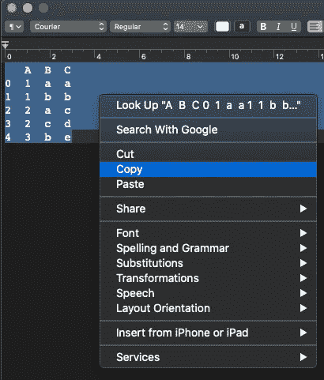

然后，运行以下命令:

```
import pandas as pd
pd.read_clipboard()
```

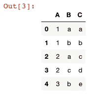

## 4.如何将熊猫数据帧保存为图像

您可以使用[数据帧-图像](https://pypi.org/project/dataframe-image/)库将熊猫`DataFrames`保存为图像。然后你可以运行:

```
import pandas as pd
import dataframe_image as dfi

df = pd.DataFrame({'A': [1,2,3,4],
                   'B':['A','B','C','D']})

dfi.export(df, 'dataframe.png')
```

运行上面的命令将创建一个 PNG 图像文件，其中的`DataFrame`如下图所示:

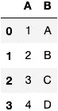

## 5.如何在熊猫应用中添加进度条

当我们将一个函数应用到一个大的`DataFrame`时，我们看不到函数的进度，也看不到对整个数据集应用该函数还需要多长时间的估计。我们可以通过使用 tqdm 库来解决这个问题。

```
import pandas as pd
import numpy as np
from tqdm.notebook import tqdm
tqdm.pandas()#dummy data
df=pd.DataFrame({"Value":np.random.normal(size=1500000)})
```

让我们对我们的数据应用一个简单的函数，但是不使用`apply`，我们将使用`progress_apply`函数:

```
df['Value'].progress_apply(lambda x: x**2)
```

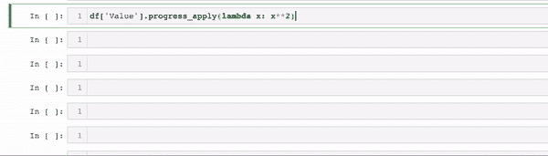

# 稀有

## 6.避免在大型数据集中使用 apply()函数

当我们处理大型数据集时，需要计算一些值，如`row`/`column min`/`max`/`rank`/`mean`/等。，我们应该避免使用`apply`函数，因为它需要很多时间。相反，我们可以使用 [matrixStats](https://cran.r-project.org/web/packages/matrixStats/matrixStats.pdf) 包及其相应的函数。下面提供一些对比。

假设我们想从一个`500 x 500`矩阵中得到每一行的最小值。让我们比较一下`base`封装的`apply`函数和`matrixStats`封装的`rowMins`函数的性能:

我们得到了:

```
Unit: milliseconds
             expr      min         lq       mean    median        uq       max neval
 apply(x, 1, min) 981.6283 1034.98050 1078.04485 1065.4163 1107.9962 1327.9284   100
       rowMins(x)  42.1838   43.80065   46.55752   45.2255   47.6249   81.3097   100
```

从上面的输出可以看出，`apply`功能比`rowMins`慢 23 倍。下面，我们代表小提琴的情节:

```
autoplot(tm)
```

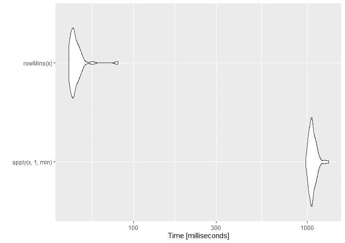

## 7.读写文件的最快方法

当我们处理大型数据集时，我们需要编写许多 CSV 文件，或者当我们必须读取的 CSV 文件很大时，那么`read`和`write`命令的速度就很重要。我们将在以下情况下比较读写文件所需的时间。

为了比较写入时间，我们将使用一个大约 180MB 的 100 万行 10 列的 CSV 文件。让我们创建样本数据框并将其写入硬盘。我们将从正态分布中生成 1000 万个观察值。

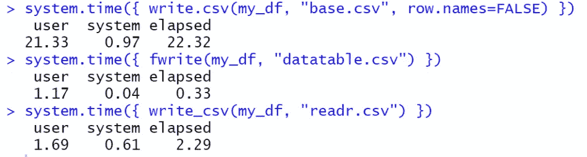

从运行时间可以看出，`data.table`的`fwrite`比基础包的~70 倍，比`readr`大约快 7 倍。

让我们也比较一下使用`microbenchmark`包的读取时间:

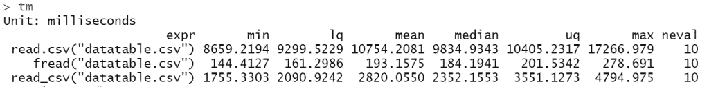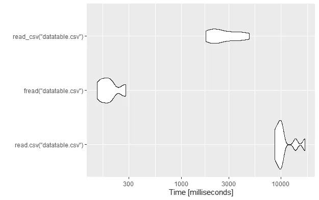

正如我们所见，`data.table`封装的`fread`比基本封装快 40 倍，比`readr`封装的`read_csv`快 8.5 倍。所以如果想快速读写文件，应该选择`data.table`包。

## 8.如何比较对象

2020 年，Hadley Wickham 构建了一个名为 [waldo](https://cran.r-project.org/web/packages/waldo/waldo.pdf) 的新包，用于比较复杂的 R 对象，并使其易于检测关键差异。你可以在 Tidyverse 和 GitHub 上找到详细的例子。让我们通过用 waldo 比较 R 中的两个数据帧来提供一个简单的例子。

让我们创建新的数据框:

```
library(waldo)

df1<-data.frame(X=c(1,2,3), Y=c("a","b","c"), A=c(3,4,5))
df2<-data.frame(X=c(1,2,3,4), Y=c("A","b","c","d"), Z=c("k","l","m","n"), A=c("3","4","5","6"))
```

df1:

```
X Y A
1 1 a 3
2 2 b 4
3 3 c 5
```

和 df2:

```
X Y Z A
1 1 A k 3
2 2 b l 4
3 3 c m 5
4 4 d n 6
```

让我们来比较一下:

```
waldo::compare(df1,df2)
```

我们得到了:

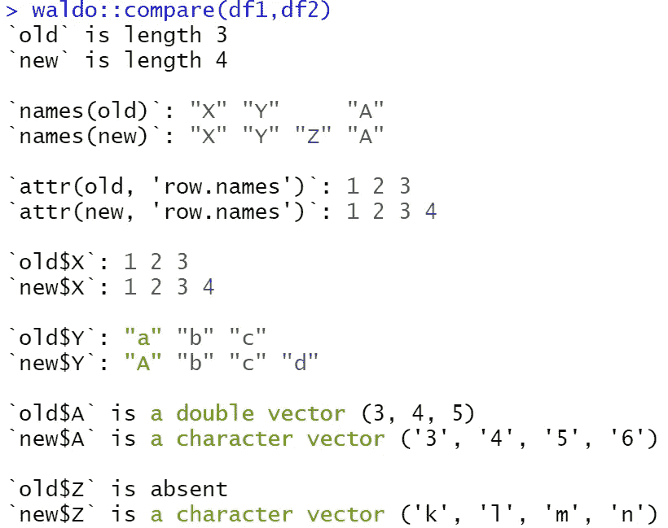

正如我们所看到的，它捕捉了所有的差异，输出是一种友好的格式，根据不同的颜色不同。更具体地说，它表明:

*   df1 有三行，而 df2 有两行。
*   df2 有一个额外的列名，它显示顺序中的不同之处。
*   它显示了行的名称和差异。
*   它比较每一列(X，Y，A，Z)。
*   它检测到 a 列数据类型的不同，第一个是*双*，第二个是*字符*。
*   它返回有一个名为 z 的新列。

## 9.如何动态安装和加载软件包

当我们与其他人共享一个 R 脚本文件时，我们假设他们已经安装了所需的 R 包。然而，情况并非总是如此，因此，我强烈建议将这段代码添加到每个需要包的共享 R 脚本中。我们假设你的代码需要以下三个包:`“readxl”`、`“dplyr”`、`“multcomp”`。

下面的脚本检查这个包是否存在，如果不存在，它就安装它，最后把它加载到 R:

## 10.如何将所有字符变量转换为因子

假设我们想要将所有字符变量转换为因子，并且我们正在处理一个包含许多列的大型数据框架。这意味着逐个转换它们是不实际的。因此，我们的方法是检测`char` 变量并将它们转换成因子。

让我们提供一个玩具示例:

```
df<-data.frame(Gender = c("F", "F", "M","M","F"), 
               Score  = c(80, 70, 65, 85, 95),
               Type = c("A","B","C","B","B"))
```

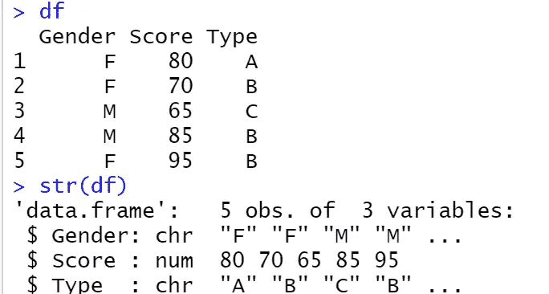

我们可以看到，`Gender`和`Type`是`char`变量。让我们将它们转换成因子:

```
df[sapply(df, is.character)] <- lapply(df[sapply(df, is.character)], as.factor)
```

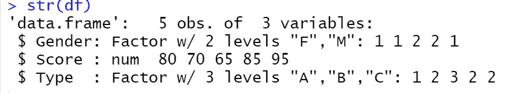

如我们所见，我们成功地转换了它们。现在，你也可以[重命名和重新分级因子](https://predictivehacks.com/rename-and-relevel-factors-in-r/)。注意，我们可以反过来将因子转换成字符。一般来说，我们可以改变不同的数据类型。

*原载于 2021 年 4 月 26 日 https://predictivehacks.com**的* [*。*](https://predictivehacks.com/10-tips-and-tricks-for-data-scientists-vol-6/)