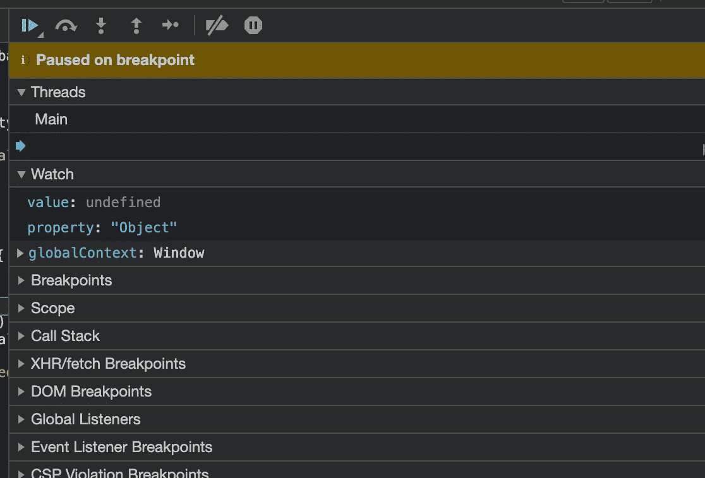
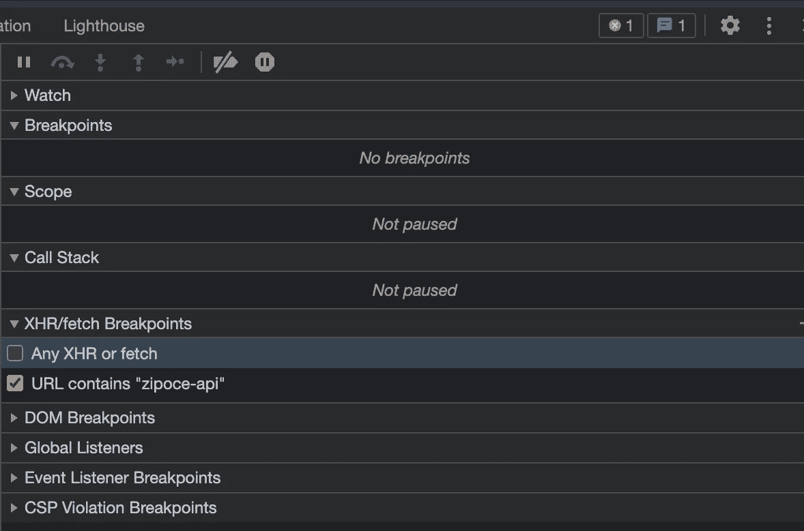

# 5 种强大的技术让你像专家一样调试

> 原文：<https://betterprogramming.pub/5-powerful-techniques-to-let-you-debug-like-a-pro-25cb087afd3c>

## 如何咬紧牙关调试


[Zan](https://unsplash.com/@zanilic?utm_source=medium&utm_medium=referral) 在 [Unsplash](https://unsplash.com?utm_source=medium&utm_medium=referral) 上的照片

作为一名开发人员，在聚会上向陌生人解释你的工作已经够难的了。因此，当被问及我们的职业时，我们经常会提到我们最近开发的一个闪亮的功能或我们正在试验的一项新技术。我们很少提到我们工作中最乏味、最令人沮丧但同样重要的部分:*调试。*

人为错误是必然的。由于代码是由人类编写的，解决这些错误是我们工作不可或缺的一部分。因为调试被认为是一种必要的罪恶，所以它经常被轻率地、不加思索地完成。但是，当您掌握了完成这项工作的工具时，调试实际上是有趣和有益的。

以结构化和有效的方式解决问题和开发新功能一样有价值。所以，为了让你在下次生日聚会上吹嘘你的调试技巧，这里有 5 个技巧可以帮助你像专家一样解决 bug。

# 1.使用"`debugger"`语句

所有现代浏览器都包含高质量的调试工具。因此，如果您遇到客户端错误，在浏览器的调试器中放置断点通常是一个好主意。

但是在调试器中找到正确的文件和行号可能很繁琐。请看`debugger`声明！该语句将在可用的调试工具中充当断点，因此您可以直接在正确的位置开始调试。

```
function potentiallyBuggyCode() {
    debugger;
    // do potentially buggy stuff to examine, step through, etc.
}
```

## 2.检查堆栈跟踪

错误往往只是冰山一角。导致错误的代码路径隐藏在表面之下。因此，错误通常很难孤立地理解。错误的[堆栈](https://developer.mozilla.org/en-US/docs/Web/JavaScript/Reference/Global_Objects/Error/Stack)揭示了最终导致错误的函数调用路径。后续调用的文件名和行号会显示出来，这有助于您更好地理解错误。

下面的代码片段是三个函数的痕迹:`trace`、`b`和`a`。错误源于随后调用第 19 行的函数`a`，第 16 行的函数`b`，最后第 17 行的函数`trace`。看到实际的代码路径，使调试更加容易。

```
trace@file:///C:/example.html:9:17
b@file:///C:/example.html:16:13
a@file:///C:/example.html:19:13
@file:///C:/example.html:21:9
```

`stack`是 Javascript 运行时`Error`对象的属性，这意味着可以使用`error.stack`简单地访问它。大多数调试工具会为您做这件事，直接公开堆栈。

## 3.观察变量

很多时候，错误可能是由具有意外值的变量发现的。但是，这些值可能会随着时间的推移而改变。`Watch`使跟踪变量的当前值变得非常简单:只需将感兴趣的变量添加到调试工具的“监视”部分。每当被监视变量的值改变时，新值将被突出显示。



## **4。观看外部请求**

现代应用程序——自从 [Jamstack](https://jamstack.org/) 的出现以来更是如此——充斥着 HTTP 请求。为了简化外部请求的调试，您可以使用调试工具的`XHR/Fetch`部分。您可以在所有请求上设置断点，也可以基于目标 url 中的文本片段进行过滤。因此，在下面的示例中，当向包含“zipcode-api”的目标(例如 https://www.zipcode-api.com)发出请求时，断点被激活。



## 5.在您的 IDE 中使用调试器

虽然错误起源于源代码，但其结果往往在网站和移动应用程序等最终产品中变得显而易见。这就是为什么解决一个 bug 经常需要在源代码和浏览器之间疯狂切换。

为了消除这种干扰，您可以使用 IDE 的内置调试器。最受欢迎的 IDE Visual Studio Code 具有针对 Chrome、Edge 和 Node.js 的内置调试器。这些内置调试器为您的 IDE 添加了所有重要的调试功能，如断点、堆栈跟踪和监视变量。你再也不用切换屏幕了。

就是这样:支持您调试的 5 种强大技术。我希望你在这个过程中学到了一些东西。对 Javascript 的更多内容感兴趣，请查看下面的文章:

[](https://javascript.plainenglish.io/7-little-known-techniques-to-improve-your-javascript-20a9e870a5fe) [## 提高 JavaScript 的 7 个鲜为人知的技巧

### 世界上最著名的编码语言的隐藏宝石

javascript.plainenglish.io](https://javascript.plainenglish.io/7-little-known-techniques-to-improve-your-javascript-20a9e870a5fe) 

# **资源**

*   [调试器](https://developer.mozilla.org/en-US/docs/Web/JavaScript/Reference/Statements/debugger)
*   [堆栈](https://developer.mozilla.org/en-US/docs/Web/JavaScript/Reference/Global_Objects/Error/Stack)
*   [Jamstack](https://jamstack.org/)