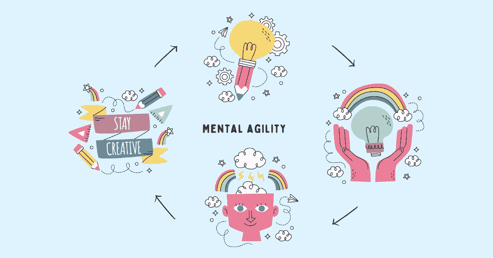

# 培养思维敏捷并在不确定性中茁壮成长的 5 种做法

> 原文：<https://betterprogramming.pub/5-practices-to-cultivate-mental-agility-and-thrive-in-uncertainty-ff2a3dd5b8be>

## 你不能预测所有可能发生在你身上的事情。然而，你可以学会灵活思考



鸣谢:作者

你如何处理不确定性？你如何处理突发事件？你对变化有什么反应？你是否感到恐慌并回避处理这种情况，还是带着好奇心看待这种情况，探索前进的替代方式，并在必要时转向？

工作中创造力的关键是快速思考和通过在不同想法之间快速转换来解决问题的能力。当其他人被不可预测或不可预见的情况吓了一跳，不知道如何处理时，思维敏捷让你自信地站出来解决难题。思维敏捷是创新、拥抱变化和在不确定性中茁壮成长的必要条件。

建立思维敏捷需要从根本上转变你的思维，以提高速度和准确性。它包括通过提出有意义的问题、获得洞察力和用更清晰的思维分析情况来进行更聪明的推理。

你不可能把你脑海中的每一个场景都演出来，并为之做好计划。你不能预测所有可能发生在你身上的事情。然而，你可以学会灵活思考——接受变化，找到下一个最佳行动方案，快速前进，而不是困在一个地方。

> “生存下来的不是最强壮或最聪明的人，而是那些最能驾驭变化的人。”――史蒂夫·马格斯，“跑步的科学”

许多人把思维敏捷误认为有害的积极——否认自己的情绪，不管遇到什么都勇往直前。思维敏捷不是有害的积极；这是乐观与现实的融合。

你对抗和抵制变化的默认方式让一个意想不到的情况感觉像是一种威胁。除非你有意识地抵制屈服于自己情绪的冲动，否则这种情况往往会引发的无助感会让你精神僵化，停止思考。

如果你想满足不断变化的工作场所的需求，并在不确定性中茁壮成长，遵循以下五个关键实践来实现绩效提升，培养更大的专注度，并增强思维。

# 建立思维敏捷的 5 个练习

## 1.有目的地走出你的舒适区

当你做你一直做的事情或者那些让你舒服的事情时，你给了你的大脑有限的成长机会。

你的大脑学会了将确定性与安全以及任何不确定的威胁联系起来。坐在你的舒适区的范围内使思维敏捷变得不可能——当你的头脑被恐惧、焦虑和担忧吞没时，你如何能在不可预知的情况下快速思考？

强迫自己去做新的事情或让你不舒服的事情会让你的大脑接受不舒服是生活的一部分——你不再把变化视为威胁，变得更加开放，接受不同的想法，并学会驾驭复杂性，而不是回避它。当你的大脑没有被强烈的情绪淹没时，它可以清晰地思考。你可以在不同的想法之间快速转换，灵活应对事件。

走出你的舒适区:

1.  挑战自己解决难题。寻找那些需要你解决你从未解决过的问题的机会。
2.  学习新的东西。甚至不一定要和工作有关。你一直推迟的钢琴课、网球课、掌握法语或烹饪课怎么办？
3.  给自己设定一个困难的目标，并坚持不懈地为之努力。比如，推动自己坚持锻炼 30 天，不休息。

> “真正的改变开始时很难，但最终会很精彩。当你鼓起勇气走出舒适区时，改变就开始了；改变始于你舒适区的尽头。”―罗伊·t·贝内特

你的大脑喜欢挑战，经常挑战会让它保持思维敏捷。

## 2.练习寻找多个答案

当找到一个问题的解决方案时，我们大多数人会满足于想到的第一个最好的主意。我们很少主动探索替代方案或考虑其他观点。以某种方式思考或对自己的选择僵化会限制你大脑创造性思维的潜力——如果你的大脑被训练在一个盒子里思考太久，它就无法想象无限的可能性。

思维敏捷需要培养好奇心，寻求问题的多种解决方案，权衡利弊，确定最佳方案，采取行动，继续前进。对你经常面临的问题这样做可以让这个过程自动进行——它变成了一种习惯。你的大脑学会快速吸收新信息，在想法之间建立联系，并找到前进的最佳行动。

要养成为一个问题寻找多个答案的习惯:

1.  挑战自己，总是想出一个以上的解决问题的方法。
2.  鼓励、邀请并表现出好奇心去倾听他人的观点。
3.  不要仅仅因为某个方法看起来违反直觉或者与你的方法不同就拒绝它。
4.  使用倒置思维模式来思考你所寻求的事物的反面。它将帮助你发现你以前没有考虑到的问题。
5.  从匮乏到富足心态的转变。丰富的心态通过用无限的可能性来看待这个世界，打开你的思维去迎接新的机遇。当你不再局限于自己的局限和约束之内时，你就不再把这个世界看作一个有限的馅饼，而是把它看作一个无边无际的海洋，每个人都有足够的食物。

为了建立思维敏捷，提醒自己一个问题总有不止一个解决方案。不要安定下来，直到你锻炼了足够多的大脑肌肉，思考了这个问题。

## 3.发展创造性思维技能

还记得你小时候的好奇心吗？当你问了太多问题“为什么我必须去上学？”时，你的老师和父母都很恼火“你可以睡到很晚才醒，为什么我要早睡？”“为什么我不能玩电子游戏？”“为什么我必须完成作业？”

好奇心和建设性地表达这种好奇心的能力是一项非常重要的技能，即使你已经成年。它让你以不同的方式看待事物，并提出解决问题的新方法。如果没有好奇心，你会接受现状，认为事情只以某种方式运行。如果你隐藏你的好奇心，并且不能释放它，你就不可能精神敏捷。

要培养创造性思维技能，唤醒你的好奇心，并付诸实践:

1.  挑战和质疑假设。
2.  通过获取当前工作范围之外的知识来扩大你的能力范围。它将使你能够以新的和新颖的方式在你的头脑中组合各种类型的信息。例如，与组织内的其他职能部门会面，了解他们如何运作，他们面临的挑战是什么，以及他们如何做出决策。
3.  为新想法的产生创造思维空间。将思考时间纳入你的日程表。

> “创造力不是一个打开或关闭的开关；这是一种观察、参与和回应周围世界的方式。”――罗德·贾金斯，“创造性思维的艺术”

好奇心没有杀死猫。如果你想思维敏捷，就要有好奇心。

## 4.有意识地花费精神能量

你最近有没有注意到你是如何消耗你的精神能量的？你会花更多的时间去思考[你无法控制的事情](https://www.techtello.com/how-to-take-control-of-your-life/)还是你能做些什么让事情变得更好？专注于你无法控制的事件、环境和条件会让你感到无力和无助——你的大脑忙于纠结问题，而没有考虑到可能性。

当遇到不可预测的情况时，将你的能量导向你无法控制的事情是很容易的——你不需要努力，因为你的大脑已经擅长于此。默认情况下，它会选择最省力的方法，也就是将责任归咎于某人或某事，并免除自己的责任。将你的默认反应转变为建设性的行动需要有意识的努力。

> "与其担心你不能控制的事情，不如把你的精力转移到你能创造的事情上."―罗伊·t·贝内特《心中之光》

富有成效地使用精神能量:

1.  从承担责任开始。
2.  确定什么在你的控制范围内——即使在最困难的情况下，你也总有可以做的事情。
3.  朝着它的方向迈出一小步。
4.  从你的行动中学习，改变，适应和重复。

当你意识到如何花费你的精神能量，并调整它以适应更积极的习惯时，你就不再浪费时间沉思，并转向行动。你建立了思维敏捷。

## 5.建立成长心态

一个经常阻碍建立思维敏捷的信念是心态，“这就是我。”“我是这么想的。”“我好不到哪里去了。”

当你相信你的个性是固定的，再多的努力也无法改变它时，你已经接受了失败。斯坦福大学心理学家卡罗尔·德韦克称之为固定思维模式。正如我在我的书《[提升你的心态](https://www.techtello.com/upgrade-your-mindset/)》中解释的那样，一个心态固定的人认为，人天生就有特殊的才能，每个人都有不同的能力和智力，这些能力和智力不会随着时间、努力和决心而变得更好。

另一方面，一个有成长心态的人明白，某些人有特殊的天赋，智力因人而异，但它也是可以通过努力和勤奋来发展和提高的。

你的个性只不过是这种心态的结果。固定的思维模式让你相信你不能随着时间的推移而改变，从而阻止你发挥潜力。另一方面，[成长心态](https://www.techtello.com/fixed-mindset-vs-growth-mindset/)，通过给你力量把自己塑造成你想成为的人，让你不断学习和成长。

卡罗尔·德韦克(Carol Dweck)和其他多名心理学家的研究表明，即使我们最深层的心理特征也会随着时间的推移而改变，只要有意识的干预。有了努力和毅力，你不再被你是谁所限制；你可以成长为你想成为的人。

思维敏捷就是适应不确定性，这首先需要你相信自己可以学习、成长和发展。

要建立成长心态:

1.  转向鼓励你行动的授权语言。
2.  设定学习目标，而不是绩效目标。绩效目标侧重于自我验证:表现出色证明你擅长你所做的事情。展示你的聪明、才华和能力，或者超越他人。学习目标侧重于自我提高:进步、成长和掌握。尽你所能成为最优秀、最有能力的人，而不是证明你已经是了。
3.  利用你的失败。把它们当作变得更好的一种手段，而不是认为它们是你能力的限制。
4.  选择“金发女孩”任务——既不太容易也不太难的活动，只是稍微超出你目前的能力。它们提供了一个绝佳的机会，可以走出你的舒适区，而不会引起焦虑。

# 摘要

1.  当处理一个不可预测的情况，一个意想不到的变化，或不确定性时，你需要确定什么是前进的最佳方式？思维敏捷。
2.  思维敏捷使你能够在不同的想法之间快速转换，并对事件做出灵活的反应。
3.  为了建立思维敏捷，有目的地走出你的舒适区。这会让你的大脑接受不适是生活的一部分，而不是回避它。
4.  不要把你的思维局限于想到的第一个解决方案，挑战你的大脑去寻求多个答案。
5.  通过挑战假设、获取你领域之外的知识以及为新想法的产生创造思维空间来扩展你的创造性思维技能。
6.  有意识地将你的精神能量转移到你能控制的事情上。它停止沉思，并导致行动。
7.  最后，如果你不相信自己改变的能力，这一切都是不可能的。相信成长心态的力量，并实践实现它的策略。

```
**Want to Connect?**Follow me here and on [Twitter](https://twitter.com/techtello) for more stories.
```

*这个故事最初发表于*[*【https://www.techtello.com】*](https://www.techtello.com/how-to-cultivate-mental-agility/)*。*