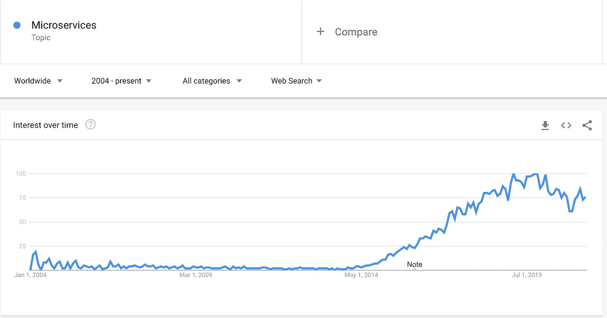
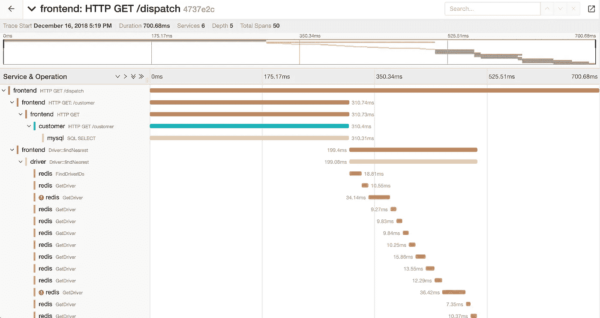
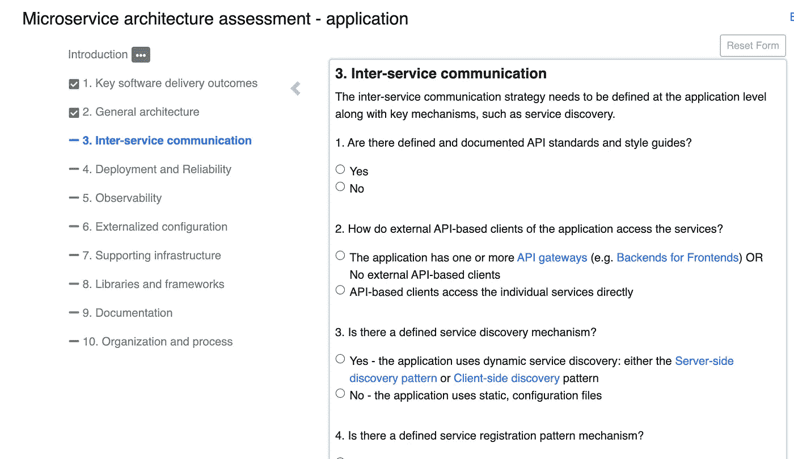
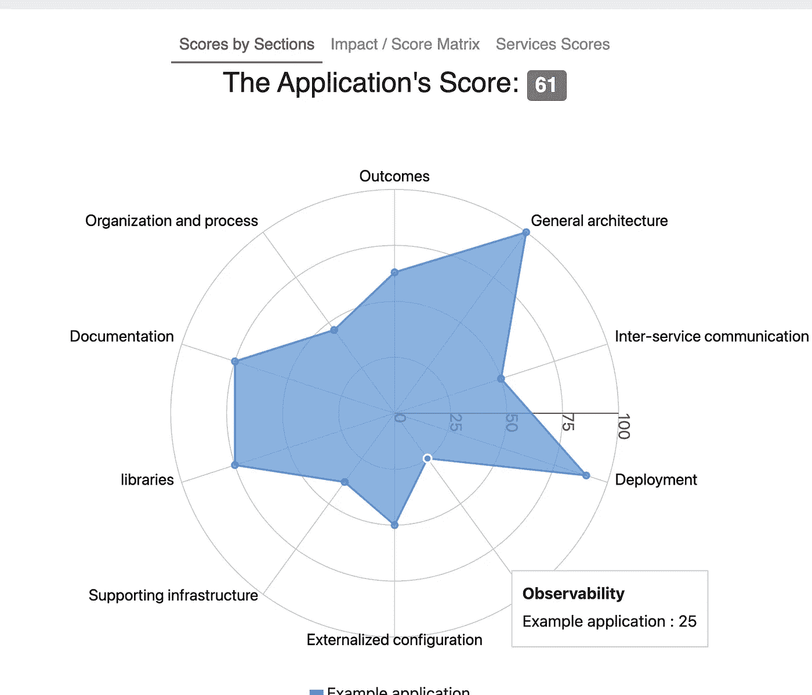

# 采用微服务前需要了解的 5 个先决条件

> 原文：<https://betterprogramming.pub/5-prerequisites-to-know-before-adopting-microservices-a1ce08e1a605>

## 在路障出现之前要有所警觉和准备


[亚历山大·波波夫](https://unsplash.com/@5tep5?utm_source=medium&utm_medium=referral)在 [Unsplash](https://unsplash.com?utm_source=medium&utm_medium=referral) 上拍照。

微服务是构建高度可伸缩分布式应用程序最常见架构模式之一。该模式描述了通过小型的、独立的可发布服务来交付系统。服务通过网络提供功能(通常通过 API)。

下面的谷歌趋势清楚地表明，在过去的 5-6 年里，人们对这个话题的兴趣越来越大:



谷歌趋势-微服务。作者截图。

我见过许多团队在没有真正理解利弊的情况下就投入微服务迁移。

在本文中，我将讨论一些在开始使用微服务之前应该注意的常见陷阱。

# 构建微服务的优势

你们中的许多人可能已经阅读了许多关于微服务优势的文章和书籍，并亲身经历了其中的许多内容。以下是为什么要构建微服务的快速回顾:

*   微服务易于部署。
*   您可以为每项服务自由选择最合适的技术组合。它不会强迫你坚持使用特定的技术，即使它并不适合你。
*   多个开发人员/团队可以独立工作，促进更快的并行开发。
*   它们促进了服务之间的松散耦合，因为服务通常通过网络/HTTP 相互交互。

现在让我们在登上微服务航班之前先看看飞行前检查清单。

# 失败不可避免

当您构建一个由微服务组成的系统时，请记住网络会很慢/有故障。不同的服务可能在不同的时间开启/关闭。因此，您需要在构建服务时考虑到失败。

幸运的是，有像*断路器*这样的模式可以帮助克服这些故障，让系统在降级模式下工作。

请确保您知道可以帮助解决此类问题的库。

*注意:在参考资料部分，我留下了一篇文章的链接，这篇文章详细描述了断路器模式和在这个场景中使用的库。*

# 你需要的不仅仅是基本的监控

如前所述，分布式系统的设计应该考虑到故障。使用 monolith 更容易调试和排除故障，因为您可能会在单台机器上查看日志。微服务可能就不是这样了。

您将需要一个非常可靠的*日志聚合系统*，它可以将来自不同机器的日志放在一个系统中。在开始微服务开发之前，请确保您已经启动并运行了系统。

有许多工具和平台提供日志聚合功能，即。ElasticSearch-Logstash-Kibana(麋鹿)，Splunk 等。

当 monolith 应用程序中出现故障时，不同的模块相互交互，它们只需要调用同一个实例中的方法。在微服务中，这些调用发生在网络上。如果没有合适的工具，这些网络调用中的调试失败是非常痛苦的。如今，人们更喜欢使用一种叫做*分布式跟踪*的技术来克服这些挑战。

在分布式跟踪中，每个外部请求都被分配一个唯一的 ID。然后，这个唯一的 ID 被传递给参与该请求的每一个微服务。这个唯一的 ID 也会在日志记录过程中使用。它还捕获开始时间和结束时间等信息，以更好地了解不同微服务之间的请求跨度。

像 Jaeger 这样的开源工具/平台可以帮助解决这些问题。确保你以前想过使用这些工具。



使用 Jaeger 的分布式跟踪。来源:[耶格文件](https://www.jaegertracing.io/docs/1.22/frontend-ui/)

大多数云提供商支持内置的监控解决方案，如 Google StackDriver、Azure Insights、AWS CloudWatch 等。

# 运营开销

在微服务的世界里，与整体应用相比，你必须构建、部署、运行和监控大量的服务。这些服务中的许多将需要故障转移和弹性，因此将需要部署这些服务的多个实例，添加负载平衡器和消息队列，并且您的生态系统将开始变得庞大。

要部署这个庞大的生态系统，您需要健壮的部署和发布管道。您将需要高质量的监控和基础设施来支持这种快速的开发和部署。

有很多解决方案可以帮助解决这些问题。

GitLab、Azure DevOps 和 GitHub 等平台支持所需的发布和构建管道。

您的团队应该拥有丰富的 DevSecOps 技能来使发布和部署健壮，所以请明智地计划。

在投身微服务之前，请确保您已经考虑过这些工具/平台。

# 开发者体验

如今，大多数公司都在尝试衡量和改善他们组织中的开发者体验。如果提供了正确的工具，高开发效率可以实现快速开发。

许多团队更喜欢使用容器来部署服务。当开发人员需要尝试这些东西时，他们可能必须在他们的工作机器上运行几个容器。

因此，您需要确保您已经清楚地定义了服务将如何被开发，它们应该如何以及在哪里被测试，以及如何运行集成测试。

您将需要确保您的团队很好地配备了这些工具，并能舒适地使用它们。

# 微服务架构评估平台

在为这篇文章做研究时，我遇到了一个非常酷的[评估平台](https://platform.microservices.io/)，它可以帮助评估你的准备情况。该工具会询问您关于当前成熟度的各种问题，如:

*   军种间通信
*   部署和可靠性
*   可观察性
*   外部配置
*   下文
*   证明文件
*   等等。



微服务架构评估。来源:[微服务架构评估平台](https://platform.microservices.io/)

然后它会向你展示结果。我强烈建议你试试这个。



示例应用程序记分卡。来源:[微服务架构评估平台](https://platform.microservices.io/)

# 结论

毫无疑问，微服务架构是这个互联网规模世界的幸事。大多数障碍都有适当的解决方案。因此，在涉足微服务之前，您需要充分了解并做好充分准备！

# 参考

1.  断路器模式—[https://better programming . pub/modern-day-architecture-design-patterns-for-software-professionals-9056 ee1ed 977 # 4c 75](/modern-day-architecture-design-patterns-for-software-professionals-9056ee1ed977#4c75)
2.  麋鹿—[https://www.elastic.co/log-monitoring](https://www.elastic.co/log-monitoring)
3.  [http://high scalability . com/blog/2014/4/8/micro services-not-a-free-lunch . html](http://highscalability.com/blog/2014/4/8/microservices-not-a-free-lunch.html)
4.  [https://Martin fowler . com/bliki/microservice prerequisites . html](https://martinfowler.com/bliki/MicroservicePrerequisites.html)

```
Hey, if you enjoyed this story, check out [Medium Membership](https://deshpandetanmay.medium.com/membership)! Just $5/month!*Your membership fee directly supports me and other writers you read. You’ll also get full access to every story on Medium.*
```