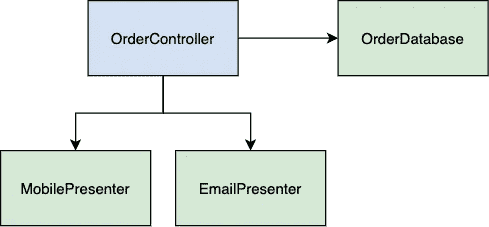
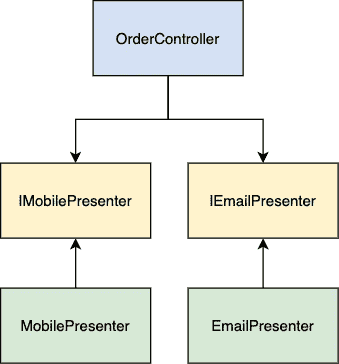
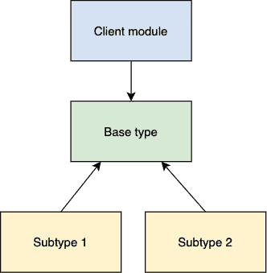
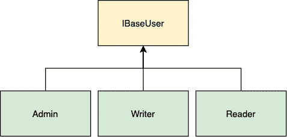
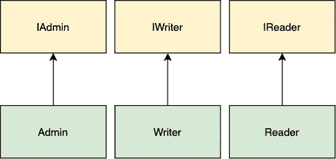
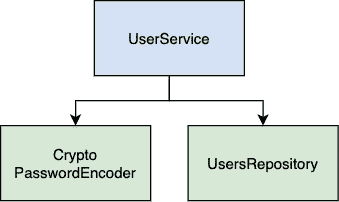
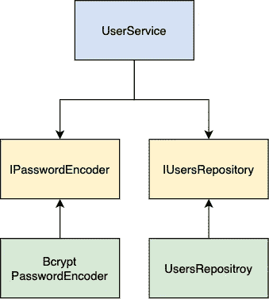

# 使用可靠设计原则时面临的 5 个问题——以及如何解决它们

> 原文：<https://betterprogramming.pub/5-problems-faced-when-using-solid-design-principles-and-how-to-fix-them-df6dbf3699fb>

## 知道如何正确使用设计模式

照片由[萨贾德·艾哈迈迪](https://unsplash.com/@sajjadahmadi?utm_source=medium&utm_medium=referral)在 [Unsplash](https://unsplash.com?utm_source=medium&utm_medium=referral) 上拍摄

在本文中，我们将探讨软件开发人员为什么以及何时应该使用可靠的原则。

首先，我们将从探索为什么我们在设计软件时应该考虑它们的原因开始。然后，我们将概述每个原则以及问题和解决方案。

请注意，本文中的示例是经过简化的。他们的目的只是为了说明当这些原则被违反时会出现的问题。

# 介绍

SOLID 是 Robert C. Martin 的五个软件设计原则的首字母缩写。我强烈推荐阅读他的书《清洁建筑》这是一系列原则:

*   单一责任原则
*   开闭原则(OCP)
*   利斯科夫替代原理
*   界面隔离原则
*   从属倒置原则

这些原则的主要目标是使软件对变化有弹性，并且易于扩展和维护。

对软件进行更改需要时间，这是最昂贵的资源。企业必须对市场变化做出快速反应，因此开发时间至关重要。你越快适应你的代码，企业就越容易发展壮大。

# 单一责任原则

## 每个模块都有且只有一个改变的理由

最难理解的原则是 SRP，因为许多开发人员认为它意味着每个模块应该负责一件事情。当我们使用函数时，这一点非常适用。例如，当我们将功能分成更小的功能时，我们确保这些功能只做一件事。

但是 SRP 的本质不一样。为了更清楚起见，我们可以将该原则解释如下:

*每个模块必须对一个——且只能是一个——用户或利益相关者负责。*

软件被改变以满足用户或涉众的需求。所以这些用户和利益相关者就是改变的理由。*模块，本例中的*，是一组内聚的函数和数据结构。

**问题**

在下面的例子中，我们有一个`AdsAccount`类，它违反了 SRP 原则。

这个模块有不止一个改变的理由:

*   营销团队定义了`startCampaign`方法的实施
*   分析团队定义了`calculateCampaignStats`方法的实施
*   开发团队定义了`save`方法的实现

如果我们将这些方法的实现放在一个类中，营销团队的新需求有可能会影响分析团队的业务逻辑。

假设`startCampaign`和`calculateCampaignStats`方法使用公共方法`getCampaignImpressions`。

营销团队改进了印象计算逻辑，他们希望将其应用到新的活动中。

开发人员更新并测试了`startCampaign`和`getCampaignImpressions`方法。

营销团队批准了变更，并部署了新版本。

过了一段时间后，结果发现活动统计数据以一种意想不到的方式计算，分析团队使用了不一致的数据。

**解决方案**

解决方案非常简单。我们只需要将我们的逻辑分成单独的类。

现在我们有三个遵循 SRP 的类:`StatsCalculator`、`CampaignLauncher`和`CampaignSaver`。每个新的类都不依赖于其他类。我们有单独的私人方法来获取活动印象——每种方法都有特定团队所需的逻辑。

`AdsAccount`现在做门面。它负责创建新类和方法调用委托的实例。

# 开闭原则(OCP)

## 每个模块都应该为扩展而打开，为修改而关闭

*Open for a extension*意味着只有通过提供新模块才能为应用程序添加新功能。

*修改关闭*意味着扩展现有模块行为的结果不应该迫使你对依赖它的模块进行修改。

这一原则的目标是使您的系统易于扩展，并免受变化的影响。

如果应用程序逻辑的简单扩展导致了其他模块的一连串变化，那么您可能违反了 OCP。

将这一原则与单一责任和依赖倒置原则结合起来应用，可以防止对一个类的更改也要求您修改所有依赖模块的情况。

让我们深入一下这个例子。

**问题**

想象一下，您正在创建一个食品配送应用程序。您有一个移动应用程序，用户可以在其中创建和查看订单。

流行的解决方案是，您有一个模块(又名*控制器*)从数据库加载模型，将它们转换成 HTTP 响应有效载荷，并将有效载荷发送给客户机。

从模块 1 指向模块 2 的箭头表明模块 1 的源代码使用模块 2。模块 2 的源代码对模块 1 一无所知。

在上图中，我们有`OrderController`，它保存了对`OrderDatabase`和`OrderPresenter`的引用。`OrderDatabase`负责加载和保存订单模型。`OrderPresenter`负责将订单模型映射到响应有效载荷数据结构。

让我们假设利益相关者要求实现通过电子邮件发送订单。我们快速更新控制器代码，以便在创建新订单时向用户发送电子邮件。

让我们看看下面的伪代码:

一段时间后，新的需求被引入。我们需要在电子邮件中显示订单总价。换句话说，我们需要更新订单视图。

需要理解的重要一点是，订单是通过两种不同的视图呈现的:通过手机屏幕和通过电子邮件。对于新的需求，每个视图都以不同的方式显示订单详细信息。

有几种方法可以实现这个解决方案。我们可以用一种新的方法来扩展`OrderPresenter`来创建电子邮件视图。我们可以为电子邮件创建另一个演示者模块。在这两种情况下，我们都必须更新控制器以匹配新的 presenter APIs。

我们看起来是不是违反了 OCP？每次引入新的需求时，我们如何保护我们的控制器和演示者不被改变？

**解决方案**

让我们从将表示逻辑分成两个模块开始。每个模块将负责将订单模型转换为特定视图所需的结构。

那更好。电子邮件演示者中的更改，如添加新字段等，不会影响移动演示者。但是，控制器的问题仍然存在。当演示者 API 改变时，我们如何组织我们的代码以保护控制器？

为了实现这一点，我们需要通过颠倒依赖关系，使控制器独立于演示者。我们的控制器模块应该为演示者定义一个接口。演示者应该实现这个接口。

使用这种架构，控制器不知道任何关于演示者的实际实现。所有的演示者都必须遵循接口中定义的约定。让我们看看更新后的代码示例:

因此，我们关闭了我们的`OrderController`,以便使用接口进行修改。此外，我们可以说，我们的演讲者是开放的扩展。当我们需要添加另一种类型的功能时，我们提供一个新的模块。

这就是 OCP 的工作方式。您拆分应用程序，考虑如何、何时以及为什么需要更改它。之后，将所有东西组织到组件层次结构中。那些需要防止改变的组件定义了频繁改变的组件所使用的接口。

# 利斯科夫替代原理

## 从客户的角度来看，子类应该以不破坏功能的方式覆盖父类方法

换句话说，使用基本类型的软件模块应该能够在不改变代码的情况下使用基本类型的子类型。

如果基本类型可以被两个子类型替换，则这种设计对应于 LSP。

但是什么是基本类型和子类型呢？基本类型可以是子类型作为后继的类。或者基本类型可以是一个接口，子类型作为它的实现。

为了更好地理解 LSP 背后的思想，让我们看看这个例子。

**问题**

假设我们需要实现一个电子钱包应用程序，我们可以将钱从一张卡转移到另一张卡。一个抽象的解决方案可能是这样的:

这里我们有一个使用`BankCard`实例进行传输的`Wallet`实例。

过了一段时间，我们的电子钱包应用程序增加了新的需求。我们的钱包用户必须能够从储蓄卡转账。这些卡是虚拟的。他们不能手工补充，所以他们没有一个`topup`的方法。

现在我们的发送方可以是银行卡，也可以是储蓄卡。

这是可行的，但是每当引入一张新卡时，我们必须向参数中添加一个新的类型和一个新的`if`语句。我们不能用`SavingsCard`代替`BankCard`，所以我们违反了 LSP。

**解决方案**

为了遵循 LSP，我们需要为我们的卡添加一个基本类型来支持它们的可互换性。这种方法保证了我们总是拥有`withdraw`方法。

现在我们可以说上面的解决方案遵循 LSP。我们有一个基础类型:`IWithdrawable`。可以用其子类型`BankCard`和`SavingsCard`代替。我们的方法适用于基本类型，所以我们不需要每次引入新卡时都修改它。对新卡的唯一要求是成为我们基本类型的子类型。

# 界面隔离原则

## 不应该强迫软件模块依赖它们不使用的接口

ISP 声明我们应该编写一系列更小更具体的接口，由类来实现。每个接口提供一种行为。换句话说，许多特定的接口比一个通用接口要好。

当这个原则被违反时，软件模块被迫实现他们不使用的方法。此外，对接口中方法签名的任何更改都会导致依赖类的更改。这是模块之间的开销和不期望的连接级别。

**问题**

例如，你正在创建一个博客。你有不同类型的用户。

`IBaseUser`是我们的通用界面。对于每种后继类型，它都有一套通用的方法。在我们的例子中，`Admin`和`Writer`有一个编辑博客文章的通用方法。但是读者不会，他们只能阅读帖子。此外，只有管理员可以阻止帖子。

`Reader`和`Writer`类必须实现它们不使用的方法——因此，它们违反了 ISP。

当业务增长时，它的功能也会增长。新用户被添加了一组与他们相关的方法。我们的`IBaseUser`界面变得越来越复杂。所有实现`IBaseUser`的类都是相对增长的。那么如何才能解决这个问题呢？

**解决方案**

这个问题可以通过将功能划分成单独的小接口来解决。

如果任何客户端都想要这两种行为，那么他们可以实现这两个接口。让我们看看代码示例:

遵循 ISP 降低了开发和维护应用程序的复杂性。使用的接口越简单、越简约，它在新类中的实现占用的资源就越少。

# 从属倒置原则

## 高层模块不应该依赖低层模块。两者都应该依赖于抽象。抽象不应该依赖于细节。细节应该依赖于抽象。

提供业务逻辑的高级模块应该不受提供实用功能的低级模块的变化的影响。为了实现这一点，我们需要引入一个抽象，比如一个将模块彼此解耦的接口。

倾角是严格遵循开闭原理和利斯科夫替代原理的结果。

**问题**

例如，我们需要创建一个模块来接收用户，对其密码进行编码，然后将其保存在数据库中。让我们看看图表。

`UserService`是我们的高级模块。它包含了业务逻辑。直接依赖于`CryptoPasswordEncoder`和`UsersRepository`，我们的底层模块。

但是这种设计看起来并不灵活。让我们想象一下，在安全审计之后，我们被要求使用一个更安全的库，比如`bcrypt`。

考虑到这一点，我们创建了`BcryptPasswordEncoder`类并更改了`UserService`构造函数方法。如果方法签名也改变了，我们还需要修改所有使用模块的地方。

此外，很难测试`UserService`，因为它与`CryptoPasswordEncoder`和`UsersRepository`高度耦合。

**解决方案**

正如 DIP 所说，我们的模块应该依赖于抽象。提供抽象的一个好方法是添加一个接口。

现在我们的高级模块`UserService`依赖于两个抽象——`IPasswordEncoder`和`IUsersRepository`。我们的`BcryptPasswordEncoder`和`UsersRepository`类实现了这些接口。

我们实现的最重要的事情是依赖性的反转。来自我们底层模块的箭头指向另一个方向。因此，我们将`UserService`与`CryptoPasswordEncoder`和`UsersRepository`解耦。

每当我们需要更改第三方库或修改低级模块中的现有逻辑时，我们只需遵循接口中定义的契约。接口必须由高层模块提供。

除此之外，跟随下降迫使我们注入依赖性。在代码示例中，这是通过`constructor`方法完成的，我们传递了`repository`和`passwordEncoder`参数。这种方法简化了单元测试。

应用 DIP 的结果是保护高级模块不被更改。由于这些模块包含业务逻辑，即我们的应用程序的核心功能，因此避免任何更改对我们是有益的。

# 结论

如您所见，所有这些原则都旨在简化软件支持和扩展。通过提供更细粒度的抽象，我们提高了应用程序的灵活性。

有了灵活性，我们就能成功地处理一个倾向于改变需求的业务。