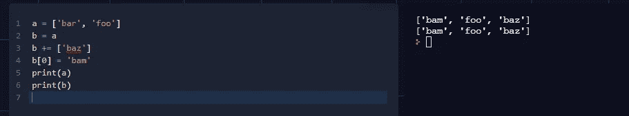
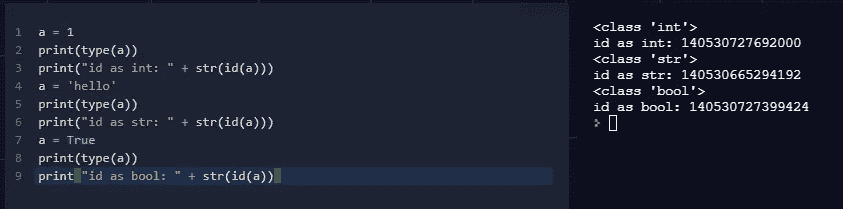
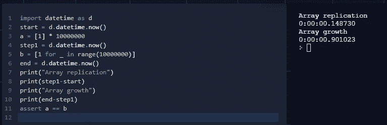

# 被初学者误解的 5 个 Python 概念

> 原文：<https://betterprogramming.pub/5-python-concepts-that-are-misunderstood-by-beginners-dc8347682a24>

## Python 很简单——但是当您开始使用时，它仍然很棘手

照片由 [Siora 摄影](https://unsplash.com/@siora18?utm_source=medium&utm_medium=referral)在 [Unsplash](https://unsplash.com?utm_source=medium&utm_medium=referral) 上拍摄

Python 非常适合中级和有经验的程序员，也非常适合计算机工程师。但是如果你刚刚学习编程或者没有学术背景，可能会有一些棘手的事情没有直观的解释。

**TL；博士** : Python 是一种高级解释语言。许多较低级别的仪表和旋钮是隐藏的，这是有意设计的。不知道引擎盖下发生了什么会导致误解和学习错误的教训。

# 1.分配

赋值是给变量一个值。在分析分配时，有几个方面需要考虑。作为一个变量(内存中的一个空间，其内容代表其值)，实际上，赋值可能是几个操作中的一个。

在[文字](https://en.m.wikipedia.org/wiki/Literal_(computer_programming))的情况下，所发生的是等号右边的值被赋予左边的变量。

在其他情况下，Python 和其他编程语言有很大的区别。基类型的两个变量之间的赋值表示值的副本。因此，字符串、整型、浮点型、布尔型和其他一些类型的值从右边的变量复制到左边的变量。

然而，其他类型是对象，被认为是更复杂和详细的。因此，Python 总是使用引用赋值，而不是递归地深入复制它们的结构。这意味着内存中的空间保持不变，但是从赋值开始，两个变量被存储在同一个位置——就好像它们是内存中同一个实例的别名一样。如果你不知道记忆中发生了什么，这会产生一些有趣的结果。

像 Java 这样的高级编程语言也有相同的策略，而 C 对内存、指针(即内存中的位置)等有明确的管理。它要复杂得多，但它代表了计算机现实的真实形象。

# 2.声明和实例化

声明是要求变量存在的语句。这通常与实例化有关，即在内存中创建空间来保存变量值。此外，这通常是通过声明变量的类型(数字、字符串等)来实现的。).

在 Python 中，不需要显式声明变量。它在赋值时隐式地具有声明和实例化，但没有声明类型。

其中一个后果是，当你试图重新声明一个变量时，你没有证据。看起来变量改变了类型和值，但实际上它是一个完全不同的变量。

函数`id`给出了分配给变量的内存空间的原始标识符的证据。正如你所看到的，这三个声明暗示了三个不同的变量。

继续这个策略的副作用，使用与函数参数同名的变量是允许的。但是，你确定你没有弄乱作为参数的原始变量吗？

最后，没有声明的类型可能导致变量误用(错误的数据或算法错误)。

# 3.打字

类型化指的是内存中保存数据的空间，变量的特征来源于它的类型。在实例化时，程序请求分配一个内存块来保存变量，这样就可以使用信息了。

Python 使用鸭子类型。这意味着一个变量有一个特定的类型，在赋值时被推断出来，但是当使用一个给定的变量时，不需要特定的类型。需要注意的重要一点是，进行的操作是合法的。如果它叫起来像鸭子，走起来像鸭子，那么它很可能就是鸭子 Python 也是这样对待它的。

再加上在赋值时声明，鸭式类型有一个有趣的结果，即重新赋值/重新声明一个变量显然会改变它的类型。不会吧。实际上，不会发生这种情况，内存中的另一个具有相同别名的空间是为存储新值而保留的。所以它是一个全新的变量，只是名字一样。

此外，你可能会弄乱你自己的代码，给它输入错误的类型变量，仅仅因为它*嘎嘎叫*。

# 4.内存管理

正如作业中提到的，Python 有自动的内存管理策略。它们包括隐式内存分配、操作和释放。

正如自动和隐含的事情经常发生的那样，这可能导致可怕的后果。举一个简单(愚蠢)的例子，如果你以不同的方式分配一个 int 数组，你会得到不同的计时。

所以`a`需要 0.14 秒才能产生，而`b`需要 0.90 秒(差不多 10 倍以上)。这种差异(显然不清楚)是由于内存管理:在第一种情况下，整个内存被一次性保留。在第二种情况下，调用`range`的所有结果都存储在内存中，并且(在这些结果上循环)为`b`分配的内存是逐块分配的:这意味着双重开销。

此外，当作用域完成时，垃圾收集器会释放未使用的变量。因此，可能会发生这样的情况，一些无用的变量(可能是非常大的变量)仍然存在于内存中，当实例化一个显然无害的小变量时，您会遇到内存不足的问题。

# 5.循环、迭代器和生成器

不输入`yeld`命令的细节，Python 只有两种类型的循环:`while`和`for ... in`。然而，与其他编程语言相比，它们会产生很大的混乱。与 C 相比，`while`具有相同的行为，它检查一个布尔条件，一旦不匹配就退出。然而，`for`是完全不同的:在 C 语言中，代码块是基于初始条件重复的，每一步执行一个增量，只要满足一个布尔条件；在 Python 中，它对一系列元素执行代码块，当它们结束时退出。

这种差异的后果比你想象的要大。首先，很明显，`for`迭代对象，所以即使提交了一个列表，它也可能包含重复的条目和各种各样的东西。此外，只要给定一个函数，就不需要实际的列表，该函数的调用返回一个有效的“索引”并引发一个异常(当列表元素不存在时使用的异常)。那是一个[生成器](https://wiki.python.org/moin/Generators)，它的使用有很多特性和问题，与 C 风格的循环完全不同，也复杂得多。

# 包扎

作为一名工程学士 C 编程实验室的前助教，我看到过许多由没有经验的程序员犯的错误。指针、循环、分叉、内存管理和作用域方面的困难非常常见。所以，如果你正在学习，并且你选择了 Python，注意它的特性，并使用一个合适的课程作为指导，你可以避免理解低级问题的努力。但是很有可能你以后会付出代价，当你变得更有经验，做更复杂的事情的时候。