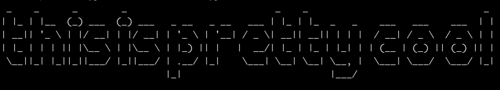
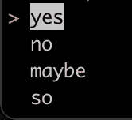
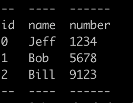

# 5 Python 库提供更好的控制台输出

> 原文：<https://betterprogramming.pub/5-python-libraries-for-better-console-output-b2494b587855>

## 没有人想要一个密集而灰暗的航站楼。用这些伟大的图书馆来活跃气氛


照片由[詹尼斯·布兰德](https://unsplash.com/@jannisbrandt?utm_source=unsplash&utm_medium=referral&utm_content=creditCopyText)在 [Unsplash](https://unsplash.com/s/photos/coding?utm_source=unsplash&utm_medium=referral&utm_content=creditCopyText) 拍摄

无论您构建的是简单的 Python 脚本还是企业级应用程序，优雅的控制台交互都将使您免于日后令人烦恼的故障排除问题。

在测试时，依赖简单的打印语句、基本的日志程序或原始输入就可以了，但在生产中就不行。一旦其他用户开始使用您的应用程序，它应该有一个健壮的方式来处理控制台输入和输出。

在本文中，我们将研究一些库，它们使您能够为 Python 代码构建用户友好、优雅的控制台交互和输出。

利用这些优秀的库将帮助您构建用户喜欢使用的命令行应用程序。让我们开始吧。

# 1.tqdm

```
import tqdm
import timedata = range(100)for _ in tqdm.tqdm(data):
    time.sleep(0.25)
```

第一个模块可以说是你可以添加到代码中的最友好的特性之一。一个进度条！当您不知道在一个长时间运行的过程中已经过了多少时间时，这难道不令人沮丧吗？不要成为那个应用。

如果你曾经使用`pip`安装过一个包，那么你会看到这个模块的运行。干净、易用的`tqdm`包让你可以在你的应用程序中构建各种不同的进度条。

使用 [tqdm](https://pypi.org/project/tqdm/) 模块，您可以向不同类型的数据添加非常简单的进度条。在上面的例子中，我们在一个简单的循环中使用`tqdm`函数包装数据，每次迭代都将进度条向前移动。

# 2.彩色光

```
from colorama import Fore, Styleprint('this is not in color')
print(Fore.GREEN + 'this is in green!')
print(Fore.RED + 'this is red!')
print(Style.RESET_ALL + 'this is grey again :(')
```

谁不喜欢一些五颜六色的主机文字？错误以红色显示，成功的项目以绿色显示。当你不被强迫盯着黑白屏幕时，这个世界一切都是对的。

使用 [colorama](https://pypi.org/project/colorama/) 你可以为任何文本输出着色，并立即使某些单词、短语或行更加突出。

在上面的例子中，我们关注于改变文本的前景色，但是你也可以改变背景色。这可以产生一些非常有趣的颜色组合。

# 3.艺术

```
from art import tprinttprint('this is pretty cool')
```

谁不爱 ASCII 艺术？曾经使用过一个方便的程序，有一个可怕的 ASCII 艺术标志或帮助文本？使用[艺术](https://pypi.org/project/art/)包，你可以用*非常少的*代码在你的应用程序中添加同样有趣的艺术。



使用 tprint from art 打印 ASCII art。

您可以通过传入不同的参数来调整生成的 ASCII 文本，比如让您从其他字体样式中选择的`font`。`art`包还有一个方便的`decor`功能，可以生成有趣的修饰，比如条形码和边框字符串。

# 4.简单术语菜单

```
from simple_term_menu import TerminalMenumenu = TerminalMenu(['yes', 'no', 'maybe', 'so'])
menu.show()
```

有时候，简化一个复杂的应用程序只需要一个菜单。不管你喜不喜欢，命令行菜单可以让用户的生活更轻松。

如果你有很多复杂的决策逻辑，那么以这种方式获得输入可以减少愚蠢的输入错误。这个 [simple_term_menu](https://pypi.org/project/simple-term-menu/) 包就像它听起来的那样:一个添加菜单的简单方法。



简单 _ 术语 _ 菜单截图

在上面的例子中，我们只用了两行代码来构建一个快速的多项选择。

# 5.有平面的

```
import tabulatedata = [
    ['id', 'name', 'number'],
    [0, 'Jeff', 1234],
    [1, 'Bob', 5678],
    [2, 'Bill', 9123]
]
results = tabulate.tabulate(data)
print(results)
```

使用 Python 手工打印表格最令人沮丧。有时标题显示不正确，数据向左或向右移动。可能会很乱。这就是为什么你应该使用[制表](https://pypi.org/project/tabulate/)库。



使用制表软件打印一个简单的表格。

使用`tabulate`可以快速准确地输出表格数据*。不再有混乱的排列或缺失的项目。在这个例子中，我们假设列表中的第一项包含标题名，但是您可以使用`headers`参数来调整它。您甚至可以使用该参数手动指定它们。*

*感谢阅读！我希望您喜欢学习这些伟大的 Python 库。如果你想采取下一步措施，为你的应用程序构建一个全功能的 GUI，请查看下面的文章:*

*[](https://medium.com/swlh/create-a-simple-python-gui-with-these-open-source-projects-7957813a107a) [## 用这些开源项目创建一个简单的 Python GUI

### 给你的新应用程序添加一个图形界面并不一定要感觉像拔牙。

medium.com](https://medium.com/swlh/create-a-simple-python-gui-with-these-open-source-projects-7957813a107a)*