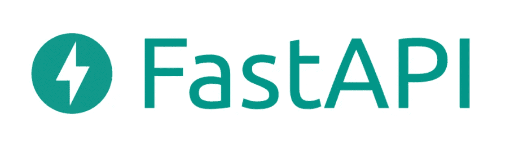
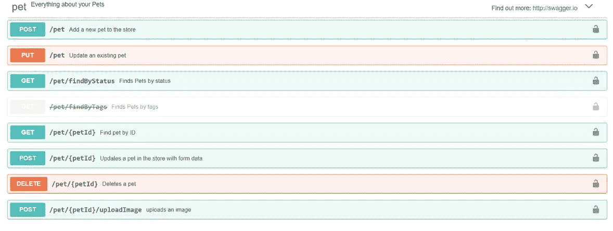

# 5 个 Python 模块，使构建 API 变得更加容易

> 原文：<https://betterprogramming.pub/5-python-modules-that-make-building-apis-easier-a8d39911f6a8>

## 快速测试和交付这些终端


在 [Unsplash](https://unsplash.com/s/photos/development?utm_source=unsplash&utm_medium=referral&utm_content=creditCopyText) 上[的照片](https://unsplash.com/@ffstop?utm_source=unsplash&utm_medium=referral&utm_content=creditCopyText)

API 运行着我们的数字世界。几乎地球上的每个网站都会在某个时候利用 API。无论是从后端获取数据还是执行复杂的计算，API 调用出现在现代网站上的几率几乎是 100%。

由于这些服务位于许多大型产品的核心，您可能会认为构建它们的原型会简单而快速。情况并非总是如此。构建一个健壮的 API 有隐藏的复杂性。幸运的是，使用 Python，您可以随意使用大量久经考验的工具。让您以前所未有的速度开发、测试和发布 API 的工具。最好的部分是你不必浪费时间在一堆样板代码上。

在本文中，我们将探索几个专门用于构建和测试 API 的 Python 模块。这些模块展示了如何快速地将您的 API 想法付诸实践。

# 1.FastAPI



[来源](https://fastapi.tiangolo.com/)。

[FastAPI](https://fastapi.tiangolo.com/) 就是*快*。您可以比许多其他平台更快地构建 API 原型。这是一个用于构建 API 的完整框架，并以定义端点的异常清晰的语法而自豪。只需添加一个装饰器，返回一些数据，就可以开始比赛了。

看看下面这个超级简短的例子。在这个例子中，我们在应用程序的根处用一个`GET`方法定义了一个单一的路由:

```
from fastapi import FastAPI

app = FastAPI()

@app.get("/")
def get_root():
    return {"response": "hello"}
```

这个方法将为任何到达端点的人提供一个简单的 JSON 响应。虽然这是一个基本的例子，但是它显示了构建一个端点需要多么少的代码。

您可以使用`uvicorn`模块通过执行以下命令来运行这个示例:

```
python3 -m uvicorn main:app
```

FastAPI 混淆了所有混乱的请求/响应处理，留给您一个光滑、干净的接口来构建您的 API。它还允许您使用 Python 中的类型提示进行构建，并且默认包含一个用于自动文档的 [Swagger UI](https://github.com/swagger-api/swagger-ui) 。

查看官方 [FastAPI 文档](https://fastapi.tiangolo.com/)了解更多详细信息。

# 2.瓶


[来源](https://flask.palletsprojects.com/en/2.2.x/)。

如果您在 Python 世界中，您可能在某个时候听说过 Flask。毫无疑问，这是使用 Python 构建 API 最流行的方式之一。它很容易上手，有大量的现有支持和更多的第三方插件。

[Flask](https://flask.palletsprojects.com/en/2.2.x/) 为 Python 上的 API 提供了基本的构建模块。如果您正在寻找一个高度可扩展的平台，这就是它。唯一的缺点是它会变得非常复杂。初来乍到的 Flask 用户可能会觉得有点不知所措。

下面是一个提供单一路线的示例 Flask 应用程序:

```
# ./my_app.py

from flask import Flask

app = Flask(__name__)

@app.route("/")
def basic_route():
    return {"response":"hello"}
```

您可以通过运行以下命令轻松启动开发 Flask 服务器:

```
python3 -m flask --app my_app run
```

Flask 与 FastAPI 非常相似，事实上，两个模块都利用了一些相同的底层思想。虽然 Flask 看起来一样，但它是一个更完整的框架，不仅可以构建 API，还可以构建完整的 web 应用程序。如果将来你想要比简单的后端更多的功能，Flask 可能是一个更好的选择。

查看[官方烧瓶文档](https://flask.palletsprojects.com/en/2.2.x/)了解更多实现细节。

# 3.比请求更快


[来源](https://github.com/juancarlospaco/faster-than-requests)。

我们都使用过 Python 中的`requests`库来与网页或 API 交互。但是你注意到图书馆有多慢了吗？如果您必须向外部资源或其他中间端点发出大量请求，那么`requests`库可能会让您陷入困境。

这就是`[faster-than-requests](https://github.com/juancarlospaco/faster-than-requests)`图书馆存在的原因。正是因为它和`requests`库几乎一模一样但是速度更快。比如，*快了很多*。如果参考上面的统计数据，这个库比标准库快 30 多倍。

最好的部分是，你可以用与`requests`相同的名字导入它，并且你不需要显著改变你现有的模块调用。

查看 GitHub 官方页面，了解比请求更快的信息:

[](https://github.com/juancarlospaco/faster-than-requests) [## GitHub-juancarlospaco/比请求更快:Python 3 上更快的请求

### 库速度文件 LOC 依赖关系开发者 WebSockets 多线程 Web Scraper 内置快于请求…

github.com](https://github.com/juancarlospaco/faster-than-requests) 

# 4.VCR.py


[来源](https://vcrpy.readthedocs.io/en/latest/index.html)。

我非常喜欢使用 [VCR](https://vcrpy.readthedocs.io/en/latest/index.html) 库进行 Ruby 测试。自然地，当我得知它被移植到 Python 时，我激动不已。VCR.py 模块是原始 Ruby 版本的端口，它的工作方式也非常好。

这个模块允许您记录真实的 HTTP 响应，然后在以后回放它们。响应存储在“包埋盒”中，您可以为不同的测试装载不同的包埋盒。

假设您有一个来自远程 API 的相当大、复杂的 HTTP 响应，您的一个测试使用了这个响应。这个 API 的响应对于测试的成功至关重要。响应也是巨大的，无法包含在每个测试运行中。它太长或太大，无法在网络上反复运行。这就是录像机拯救世界的地方。

像这样记录来自真实测试端点的响应:

```
import json
import vcr
import urllib

URL = "https://jsonplaceholder.typicode.com/todos/1"

with vcr.use_cassette('fixtures/vcr_cassettes/test.json'):
    http_res = urllib.request.urlopen(URL)
    res = json.loads(http_res.read())
    assert res['id'] == 1
```

上面的代码将对一些测试 JSON 数据执行一个简单的 HTTP 请求。一旦请求完成一次，它将被加载到一个盒子中，然后每次后续运行都将使用这个盒子，而不是实际的 HTTP 请求。现在你甚至不需要在线运行这个测试！

官方文件是[可在这里](https://vcrpy.readthedocs.io/en/latest/index.html)获得。

# 5.Swagger UI


[来源](https://swagger.io/tools/swagger-ui/)。

如果你以前没有用过 [Swagger UI](https://swagger.io/tools/swagger-ui/) ，那你就错过了。这是一种自动可视化 API 的强大方法。您不必在完全独立的 UI 或文档服务上投入大量工作。您只需提供每个端点的基本信息。Swagger 将自动为您构建 API explorer 并生成文档。还有比这更简单的吗？



[来源](https://swagger.io/tools/swagger-ui/)。

Swagger UI 可以集成到很多流行的框架中，比如 Flask。在某些情况下，你所需要做的就是在你的方法上附加一个基本的[文档串](https://pypi.org/project/flask-swagger/)，你很快就会有完整的 API 文档。

不要浪费时间为 API 文档重新发明轮子。使用 Swagger UI，立即获得功能丰富的服务。

查看[官方文件](https://swagger.io/docs/open-source-tools/swagger-ui/usage/installation/)了解更多信息。

感谢您的阅读！喜欢这篇文章吗？下面是我的一些其他帖子:

*   [*用 Python 制作 RPC 的简单方法*](/a-simple-way-to-make-rpcs-with-python-52ad8e9286c1)
*   [*Python 模块，让处理 JSON 更快*](/python-modules-that-make-handling-json-even-faster-f577d8948a5)
*   [*使用 Ansible*](/clean-up-your-kubernetes-deployments-using-ansible-10a000db313b) 清理您的 Kubernetes 部署