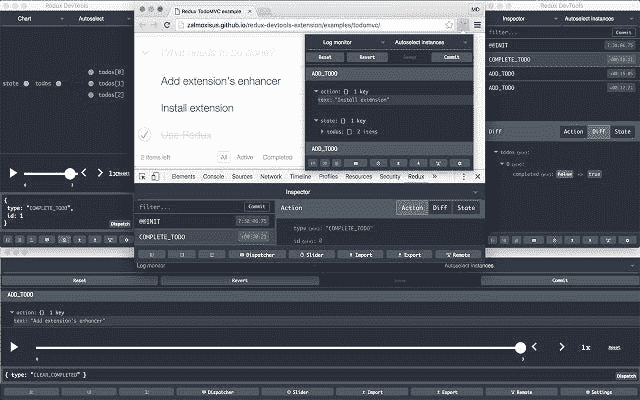
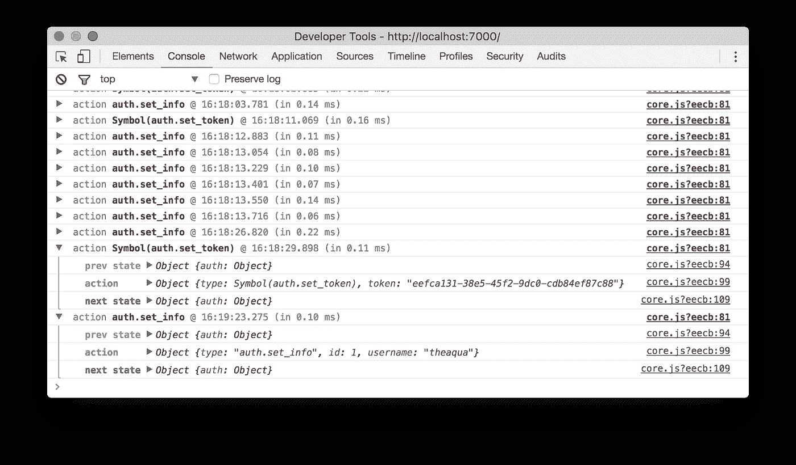
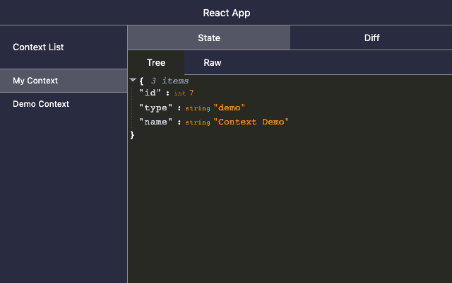

# 在上下文中使用 Redux 的 5 个非常好的理由

> 原文：<https://betterprogramming.pub/5-really-good-reasons-to-use-redux-over-context-ad6cd93de30b>

## 反应上下文不是全局状态管理的好解决方案

由[免费提供的图像-来自](https://pixabay.com/photos/?utm_source=link-attribution&amp;utm_medium=referral&amp;utm_campaign=image&amp;utm_content=828826)[像素](https://pixabay.com/?utm_source=link-attribution&amp;utm_medium=referral&amp;utm_campaign=image&amp;utm_content=828826)的照片

[contact Context](https://reactjs.org/docs/context.html)于前段时间推出，但在[contact hook](https://reactjs.org/docs/hooks-intro.html)推出 React 16.8 后才获得牵引力。虽然 Context 确实解决了它原本要解决的问题，但它不是全局状态管理的通用解决方案，原因如下。

# 很难调试

在上面的截图中，你可以看到 [Redux Devtools](https://chrome.google.com/webstore/detail/redux-devtools/lmhkpmbekcpmknklioeibfkpmmfibljd) 扩展。它允许您详细检查每个动作，提供状态的不同和完整视图，并且可以倒带动作来检查哪里出错了。

这是 Redux Logger，在 Redux DevTools 不够或不适用于您的环境的情况下，这是另一个调试工具。它将记录每个调度的操作，并向您显示应用该操作之前和之后的状态。不过，Redux 记录器不能倒回。但是它仍然可以比任何其他上下文工具做得更多。

这是[反应上下文开发工具](https://dev.to/deeppatel234/debug-reactjs-context-api-with-react-context-devtool-3plb)。它允许您查看上下文状态，仅此而已。也有一个不同的视图，但是不清楚在没有调度操作的情况下如何工作。我会补充说，这是一个在早期阶段的项目，只有两个贡献者在工作。所以，虽然这个工具给人留下了深刻的印象，我也很感谢它的开发人员，但它还没有到非常有用的阶段。

您也可以使用[reactor DevTools](https://chrome.google.com/webstore/detail/react-developer-tools/fmkadmapgofadopljbjfkapdkoienihi?hl=en)，但是它们并不能在所有环境中工作，并且仍然缺乏 Redux DevTools 的大部分功能。还有一种方法[将上下文与 Redux 开发工具](https://medium.com/@erwan.datin/react-context-api-how-to-connect-to-redux-devtools-625a2772b949)联系起来，但是考虑到这个解决方案的复杂性，我将只使用 Redux。

# 它不能被扩展

Redux 最强大的功能之一是增强器。最常用的增强器之一是[中间件](https://redux.js.org/advanced/middleware/)，它允许您覆盖`dispatch`函数。您可能在您的项目中使用过这样的中间件，如 [redux-thunk](https://github.com/reduxjs/redux-thunk) 、 [redux-logger](https://github.com/LogRocket/redux-logger) 、 [redux-saga](https://github.com/redux-saga/redux-saga) 等。您还可以编写定制的中间件来直接在商店中嵌入逻辑，从而减少样板文件和重复。

 [## 通过编写定制中间件来提高您的 Redux 技能

### 在本文中，我将教您编写定制的中间件来扩展 Redux 的功能，并深入了解

medium.com](https://medium.com/javascript-in-plain-english/improve-your-redux-skills-by-writing-custom-middleware-32a70b9dfb25) 

React 上下文不提供这样的接口。您可以选择将这个逻辑嵌入到其他地方(组件/助手),或者使用`useReducer`钩子并手动包装`dispatch`函数。但即使这样，它也无法实现 Redux enhancers 所能实现的一半。

# 它没有把逻辑和表现分开

这是前一个论点的延伸。因为没有办法将自定义行为嵌入到上下文中，所以必须在组件中实现。现在，您开始在相同的实体中混合逻辑和表示。当然，你可以将你的组件分成*容器*组件*和*哑组件*组件*，但是这真的对任何人有用吗？

使用 Redux 和中间件，如 Thunk 或 Saga，您可以在动作创建器和/或定制中间件中描述您的业务逻辑。这让您可以只使用*哑*组件，并且在业务逻辑和表示之间有一个具体的分离。

# 它很慢

是的，就是它。反应上下文[是](https://github.com/reduxjs/react-redux/issues/1177) [慢](https://blog.theodo.com/2019/07/how-i-ruined-my-application-performances-by-using-react-context-instead-of-redux/)，[期](https://medium.com/@leonardobrunolima/react-tips-context-api-performance-considerations-d964f3ad3087)。这是因为没有像 Redux 中那样的选择器机制。这意味着当*上下文中的任何*值改变时，使用该上下文的每个组件都将重新呈现，不管它是否实际使用它。使用 [React.memo](https://everyday.codes/javascript/react-usememo-and-when-you-should-use-it/) 可以部分缓解。

而 Redux 则没有这个问题。无论是使用 HOS 还是 Hooks，您都可以准确地定义您需要什么数据，而且您组件只有在数据发生变化时才会重新呈现。这意味着你不需要不必要的`React.memo`电话。

# 它不是更短或更容易

你经常听到的关于上下文的一个论点是，它比 Redux 更短或更容易。好吧，让我们检查一下。

我给你写出了四个例子:使用 Context，使用 Context + useReducer，Redux，Redux + Redux Toolkit:

组件和状态逻辑应该在不同的文件中，但是为了简单起见，我省略了这一点。你可以看到带有 Redux 的例子并不比上下文中的例子长。此外，您在应用程序中只需要一个 Redux 状态(并使用片来创建子状态)，但是您可能需要多个上下文，这导致了双倍的样板文件。

# 结束语

当然，React 上下文总是有用例的。它非常适合存储主题选项、本地设置和其他不经常改变的属性。但是如果你从上下文开始，并且你的应用程序变得越来越复杂，由于可读性和性能问题，你将不得不花时间将上下文重写为 Redux。

感谢阅读，我希望你喜欢这篇文章。请在评论中告诉我你对上下文和 Redux 二分法的看法！

## 资源

*   [Redux Github 中的原始问题解释了为什么 Redux 不在幕后使用上下文](https://github.com/reduxjs/react-redux/issues/1177)
*   [上下文文档](https://reactjs.org/docs/context.html)