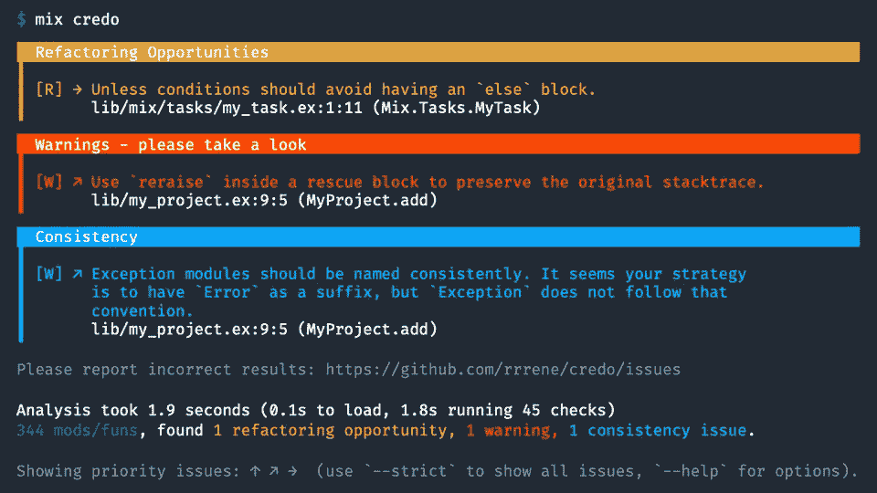

# 爱上仙丹的 5 个理由

> 原文：<https://betterprogramming.pub/5-reasons-to-love-elixir-52dffcf9ccce>

## **热爱仙丹语言和堆栈，如果你还没有**


[简·侯伯](https://unsplash.com/@jan_huber?utm_source=unsplash&utm_medium=referral&utm_content=creditCopyText)在 [Unsplash](https://unsplash.com/?utm_source=unsplash&utm_medium=referral&utm_content=creditCopyText) 上拍照

每当我有一个新的项目想法，需要快速构建一个原型，或者甚至有机会在工作中从头开始构建一些东西，我都会一次又一次地回到 [Elixir](https://publish.obsidian.md/allanmacgregor/Programming+Languages/Elixir/Elixir) 中来。

长生不老药对我有很强的吸引力，这不是没有原因的。语言的创造者们做了出色的工作，不仅创造了一种奇妙的语言，还创造了一个繁荣的生态系统。

以下五个是我坚持回到仙丹的一些原因。

# 混合

Mix 是 Elixir 附带的一个构建工具，它提供了创建、编译、测试、调试、管理依赖项等任务。

如果你分别来自 Ruby 和 PHP 世界，Mix 可以与类似于`rake`或`artisan`的工具相媲美。

## 创建新项目

```
mix new myproject
```

运行该命令将生成我们的新项目，其中包含样板文件结构和必要的文件。输出如下所示:

```
- creating README.md
- creating .formatter.exs
- creating .gitignore
- creating mix.exs
- creating lib
- creating lib/myproject.ex
- creating test
```

生成的最重要的文件是我们的`mix.exs`文件，它包含我们的应用程序、依赖项、环境和当前版本的配置。该文件可能如下所示:

```
defmodule Myexample.Mixfile do
  use Mix.Project def project do
    [
      app: :myexample,
      version: "0.1.0",
      elixir: "~> 1.11",
      start_permanent: Mix.env() == :prod,
      deps: deps()
    ]
  end def application do
    [
      extra_applications: [:logger]
    ]
  end defp deps do
    []
  end
end
```

总的来说，Mix 真的很强大，很容易扩展；这也是 Elixir 对新开发者如此友好的原因之一。

## 额外资源

*   [仙丹派:混](https://elixirschool.com/en/lessons/basics/mix/)
*   [混合介绍](https://elixir-lang.org/getting-started/mix-otp/introduction-to-mix.html)

# 信条和对话



Credo 是一个针对 Elixir 的静态代码分析器，它特别关注教导和构建代码一致性。

**Dialyxir** 是 [Erlang](https://publish.obsidian.md/allanmacgregor/Programming+Languages/Erlang/Erlang) 透析器的混合包装器，是另一个静态代码分析工具。

```
$ mix dialyzer
...
examples.ex:3: Invalid type specification for function 'Elixir.Examples':sum_times/1.
The success typing is (_) -> number()
...
```

虽然这两个工具都是静态分析器，但它们满足了不同的需求，并为我们的代码提供了不同的见解。

**Credo** 更适合于查看我们的代码是否遵循了被社区接受的公共良好代码实践。另一方面，Dialyxir 让我们可以捕捉类型错误和不可及的代码。

## 额外资源

*   [信条](https://github.com/rrrene/credo)
*   [Dialyxir](https://github.com/jeremyjh/dialyxir)

# 处理

Elixir 最大的卖点之一是并发支持以及随之而来的可伸缩性和容错性；在这个并发模型的核心，我们有长生不老的过程。

Elixir 上下文中的进程不同于操作系统进程。相比之下，酏剂工艺的重量轻得令人难以置信，可描述为具有以下特征:

*   彼此隔绝
*   彼此并行运行
*   通过消息传递进行交流
*   在 Erlang VM 内部运行

可以像这样直接创建和派生进程:

```
pid = spawn fn -> 1 + 3 end
```

所有这些只是产生一个进程来执行匿名功能，以用于更复杂的使用消息传递和监督树的用例。建立在这些过程之上的主要抽象之一是任务。

**任务**提供更好的错误报告和内省:

```
iex(1)> Task.start fn -> raise "oops" end
{:ok, #PID<0.55.0>}15:22:33.046 [error] Task #PID<0.55.0> started from #PID<0.53.0> terminating
** (RuntimeError) oops
    (stdlib) erl_eval.erl:668: :erl_eval.do_apply/6
    (elixir) lib/task/supervised.ex:85: Task.Supervised.do_apply/2
    (stdlib) proc_lib.erl:247: :proc_lib.init_p_do_apply/3
Function: #Function<20.99386804/0 in :erl_eval.expr/5>
    Args: []
```

任务非常方便，使我们既可以与`Task.await/1`同步运行工作，也可以与`Task.async/1`异步运行工作。

## 额外资源

*   [流程](https://elixir-lang.org/getting-started/processes.html)
*   [酏剂工艺简介](https://teamgaslight.com/blog/intro-to-processes-in-elixir)

# 语法

Elixir 语法是它的主要吸引力之一，有时你可以清楚地看到 Ruby 在语言中的影响，以及对开发人员快乐和可用性的明确关注。

```
defmodule Article do 
    defp read(:content, [paragraph | article]), do: read({:content, article})
    defp read(:content, []), do: {:done, []} def read_article() do
        {:done, _} = read({:content, get_article()})
        for _ <- 1..10, do: something()
    end
end
```

但是看一下上面的片段就可以清楚地看到，虽然语法可读性很高，但这不是 Ruby。上面的代码中发生了一些事情:

*   内嵌功能和完全扩展功能的混合
*   具有模式匹配的多功能头
*   简单递归
*   函数参数分解

在我看来，Elixir 可以将大量的表达能力打包到非常少量的代码中，并且可读性很高。

## 额外资源

*   [仙丹速成班](https://elixir-lang.org/crash-course.html)
*   [仙丹语法参考](https://hexdocs.pm/elixir/syntax-reference.html)

# 凤凰框架

> “Phoenix 是一个用函数式编程语言 Elixir 编写的 web 开发框架。Phoenix 使用服务器端的模型-视图-控制器模式。它基于插件库，最终基于 Cowboy Erlang 框架，旨在提供高性能和可伸缩的 web 应用程序。”— [维基百科](https://en.wikipedia.org/wiki/Phoenix_(web_framework))

把最好的留到最后，我们有 Phoenix 框架，它经常被拿来和 Laravel 或者 Ruby on rails 比较，但是在我看来，它要好得多。

像 RubyOnRails 和 Laravel 这样的框架有一个致命的缺点:有太多奇怪的自动化。我的意思是，这些框架试图抽象太多，隐藏太多的复杂性，以至于在某些场景中成为更大的障碍。

Phoenix 拥有适当数量的脚手架和抽象，而不会从您的控制中带走任何东西。启动并运行 Phoenix 项目非常简单，如下所示:

```
$ mix archive.install hex phx_new
$ mix phx.new demo --live
```

# 凤凰城实时景观

Phoenix LiveView 是一个令人兴奋的新库，它通过服务器呈现的 HTML 实现丰富的实时用户体验。

LiveView 使开发者能够构建实时互动应用**，而无需**接触任何 JavaScript 都是用服务器端逻辑完成的。

## 额外资源

*   [凤凰总览](https://hexdocs.pm/phoenix/overview.html)
*   [凤凰直播](https://hexdocs.pm/phoenix_live_view/Phoenix.LiveView.html)