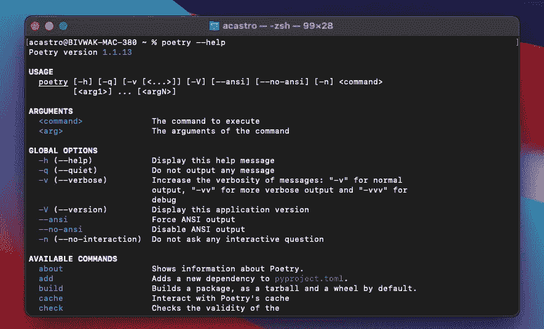
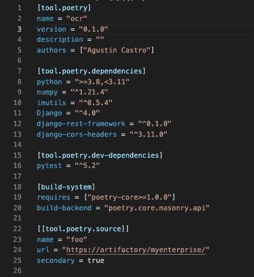

# 诗歌击败 Pip Python 设置的 5 个原因

> 原文：<https://betterprogramming.pub/5-reasons-why-poetry-beats-pip-python-setup-6f6bd3488a04>

## *通过切换到诗歌的依赖性和虚拟环境管理，使你的 python 开发过程现代化*


克里斯·阿布尼摄于 Unsplash

我对 python 项目最长时间的设置如下:

*   用于管理 python 版本的 pyenv 。
*   用于管理虚拟环境的 venv (包含在 python3 中)。
*   **pip** 用于依赖性处理和发布。

作为我的常用堆栈的一部分，我也用 Javascript 或 Java 开发了很多，我总是羡慕我的堆栈中每天使用的其他包管理器和构建工具的大量特性，如 *npm、yarn* 或 *gradle* 与 pip 相比。

> 进入[poem](https://python-poetry.org/)，poem 是 python 中的一个依赖管理和打包工具，它在幕后使用 pip，但是它在上面烘焙了大量的功能。所以这个标题有点误导，因为我们仍然间接使用 pip。

我们通过*自制软件*或*卷曲软件*安装诗歌，一旦完成，我们就可以使用命令行工具。



为了更好地理解诗歌是如何工作的，以及你能做什么，你可以查看文档，因为它真的很全面。我会给你最好的功能，在我的情况下说服我放弃使用画中画直接。

# 更好地了解您的项目依赖关系

poems 使用一个`pyproject.toml`文件来指定项目的配置。还会自动生成一个`lockfile`。配置文件如下所示:



听起来很熟悉？看起来像一个 npm package.json 配置文件。这是因为它包含了许多相同的功能。例如:

**开发依赖:**您可以在您的本地环境中安装所有带有`poetry add --dev pendulum`的测试和开发库

您还希望使用命令`poetry install --no-dev`将它们排除在生产环境之外

**Python 版本:**您可以指定想要使用的 Python 版本，默认情况下，这将在初始化项目时指定，并且取决于您当前激活的虚拟环境

**项目版本:**项目的当前版本也在 toml 文件中指定，这有助于在发布您的包时进行标记。

**仅显示主要依赖项:**仅显示您安装的软件包。解析你的包的依赖关系时安装的二次打包将在`lockfile`中指定，但默认情况下不在项目文件中。我发现这种方式比导出 requirements.txt 文件中的所有内容更简洁。

**外部存储库:**您的企业托管的包的辅助存储库可以在项目文件中指定。当然，这可以用 pip 来完成，但是用 git 来跟踪这部分配置非常方便。尤其是对于新入职的开发人员。

# 集成虚拟环境

当我第一次开始用 python 开发时，在 python 3 切换到`venv` 之后，我用`virtualenv`管理虚拟环境。管理环境是 python 的基础，因为这关系到如何完全脱离全局 python 安装进行工作。

现在，我还使用诗歌来管理虚拟环境，这些虚拟环境隔离了项目中的依赖关系。

> **推荐**我总是喜欢把我的环境文件夹放在我项目的根目录下。这是 venv 默认的工作方式，但不是诗歌。要对此进行配置，您需要设置参数`poetry config virtualenvs.in-project true`

要初始化一个新的虚拟环境，运行:`poetry init`

请记住，您需要用 [pyenv](https://github.com/pyenv/pyenv) 设置您需要的 python 的特定版本。诗歌将获得当前活动版本的 python 来创建和激活虚拟环境。

**在 docker 容器中安装依赖项的附注:**

由于容器中通常不需要虚拟环境，所以我通常使用以下配置在 docker 中安装项目的依赖项。

```
RUN poetry config virtualenvs.create false
RUN poetry install --no-root --no-dev --no-interaction --no-ansi
```

# 更容易构建和发布

使用诗歌发布到 Pypi 真的很容易，该工具集成了构建源代码和 wheel 档案的构建步骤。

```
poetry build
```

现在您已经用 build 命令创建了一个可交付的包，只需运行下面的命令来发布到 Pypi，就大功告成了，去喝杯咖啡吧。

```
poetry publish [--build] [--username <username>] [--password <password>]
```

**发布到私有存储库**

要发布到私有存储库，首先需要添加 URL:

```
poetry config respositories.test [https://myprivaterepository](https://myprivaterepository)
```

然后发布到您刚刚添加的存储库:

```
poetry publish -r test
```

# 轻松在解释器版本之间切换

有时，您需要验证您编写的代码在不同的 python 版本中都能很好地工作，例如 python 3.2 和 3.7。

诗歌使这变得容易，因为可以为此目的创建多个虚拟环境，并且彼此相邻。

为了使用不同的 python 版本，我们必须首先:

1.  如果它不在我们的系统中，请安装它。为此我通常使用 *pyenv:* `*pyenv install <different python version>*`
2.  在终端会话中设置所需版本为全局或本地:`pyenv global <different python version>`
3.  让 poems 安装所需版本的依赖项(并生成一个新的虚拟 env):`poetry install`

如果某些依赖项不符合新 python 版本的要求，就会出现错误。

# 表演

诗歌对贮藏物有一种真正的表演用途。所以安装一个包平均来说效率更高。

当您习惯于并行处理不同的项目，并且经常使用像 Django、flask 或 numpy 这样的通用包时，这种情况就很常见。

# 结论

如果您从未测试过诗歌，您应该尝试一下，此外，如果您喜欢这种体验，迁移现有的 python 项目轻而易举。

我发现主要卖点是`pyproject.toml`文件为您提供的集中配置和包含的虚拟环境管理解决方案。

尽管诗歌正在大力开发中，我还是希望未来能包含运行脚本的功能，让我们拭目以待吧。