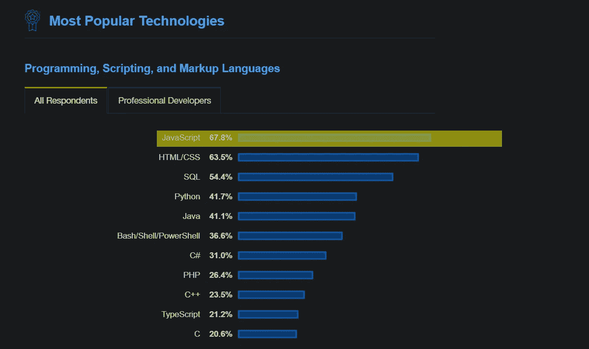

# 2020 年你应该押注 JavaScript 的 5 个理由

> 原文：<https://betterprogramming.pub/5-reasons-why-you-should-bet-on-javascript-in-2020-2203938ceb16>

## 世界上最流行的编程语言一直在发展

制造者在 [Unsplash](https://unsplash.com/s/photos/learn?utm_source=unsplash&utm_medium=referral&utm_content=creditCopyText) 上 [NESA 的照片](https://unsplash.com/@nesabymakers?utm_source=unsplash&utm_medium=referral&utm_content=creditCopyText)

想学习编码吗？还是好奇想学一门新的编程语言？你已经到达了正确的部分，在那里你将清除你通常在那个精确的时刻面临的任何疑虑。今天我会给你五个你应该赌 JavaScript 的理由。最终，你会意识到后端、前端、桌面和移动创造的力量。这真的不可思议吗？

正如我上面所说的，无论你是在考虑学习编程还是仅仅想学习一种新的编程语言，首先想到的是你应该学习哪种编程语言，不是吗？

太好了，你在做决定。但是，你的脑子要随着下一场战斗爆炸了。让我们看看，PHP 听起来很有用，因为我可以构建网页和服务器端的 web 应用程序。Java 似乎在公司层面用得很多，Python 也是到处都极力推荐的，至于 C#，我目前还不太了解。好吧，我想我已经决定了:我想我应该学这个——或者这个。等等，也许从我的软件工程师朋友那里得到反馈是个更好的主意。最后他们的建议是选一个就这样；哪个真的不重要。哇，这太复杂了。停下来。停下来。

让我们摆脱这场战斗。我将给出令人信服的理由，说明为什么在选择编程语言时 JavaScript 是一个安全的赌注。

# 1.为后端、前端、桌面和移动设备创建应用的能力

从我的角度来看，这一条是你应该在 2020 年，甚至更远的将来押注 JavaScript 的最重要的原因。几年前，您只能用 JavaScript 在前端创建应用程序，然后在后端创建。然而，在 2020 年，你有能力创建用 Electron 构建的桌面应用程序，这是一个用 JavaScript、HTML 和 CSS 等 web 技术创建原生应用程序的框架。这方面的一些例子有:Slack、Whatsapp、Discord、Atlassian、Skype 等等——实际上，还有一个无穷无尽的列表。

还不服气？2015 年，我们有了 React Native，这是一个由脸书创建的开源移动应用框架。现在，您可以使用 JS/ReactJS 构建跨平台应用程序:IOS、Android 和 web。那不是真的很棒很诱人吗？

您需要关注的是，如果您知道、理解并坚持 JavaScript 的核心原则，您将有能力创建跨平台的应用程序。就一次。

# 2.JavaScript 存在于浏览器中，它可以在任何地方运行

JavaScript 是网络的标准语言。的确，它是事实上的语言。到 2020 年，如果你学会了，你将不仅能够构建现代的网络应用程序，还能构建任何设备和平台的任何应用程序。

此外，你可能已经注意到技术作为一个整体是如何变化的。它们的变化如此之大，以至于在新版本发布之前，你还没有完全学会一个版本。最糟糕的是，有时他们完全不相容。

由于 JavaScript 在浏览器中运行，您不需要经历任何环境或编辑器配置的痛苦。

# 3.JavaScript 是几乎所有网站中最重要的部分之一

尝试在浏览器中禁用 JavaScript 一分钟，一切都会变得令人头疼。你会看到你最喜欢的网站是如何因为严重依赖 JavaScript 而停止工作的。Spotify、脸书和 Instagram 甚至都不会加载，你也不能播放音乐或发表评论。此外，Twitter 不会每秒更新推文。

# 4.JavaScript 是世界上最流行的编程语言

根据 Stack Overflow Developer[2019 年的调查](https://insights.stackoverflow.com/survey/2019#technology-_-programming-scripting-and-markup-languages)，JavaScript 连续第七年不仅是最受欢迎的编程语言，也是世界上最常用的语言。因为这个事实，它成为初学者或经验丰富的开发人员的好选择。

[栈溢出开发者调查 2019](https://insights.stackoverflow.com/survey/2019#technology-_-programming-scripting-and-markup-languages)

# 5.到处都有很多工作机会

最后一个并不是最不重要的。如果你正在考虑辞掉目前的工作，或者正在寻找新的工作，你会注意到 JavaScript 世界里有很多工作机会。你将有很大的机会快速进入一份令人兴奋的工作，实现你的梦想。然而，等一下——除非你做好准备，否则这不会太容易。所以，请查看我的文章《【2020 年 5 个前端预测和趋势》中的资源，这将帮助你实现新工作的目标。

# 包装东西

当然，有比这些更多的理由来押注 JavaScript。不过，还是总结一下吧。

*   您可以为前端、后端、桌面和移动设备构建跨平台应用。
*   JavaScript 是网络的标准。
*   没有 JavaScript 的网站/站点/应用是不可能做好的。
*   如果你学好了 JavaScript，你被雇用的机会很高。招聘人员之间疯狂争夺 JavaScript 开发人员。

感谢阅读！我希望这篇文章对你有所帮助。