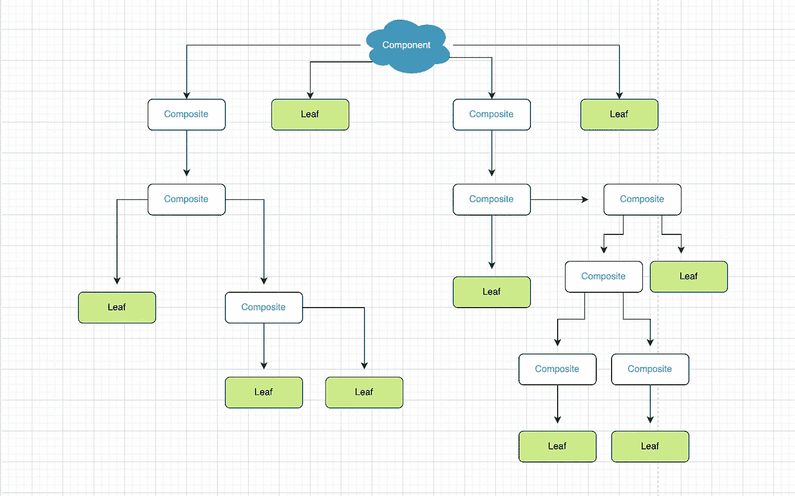

# 你应该知道复合设计模式的 5 个理由

> 原文：<https://betterprogramming.pub/5-reasons-why-you-should-know-the-composite-design-pattern-226ecc651ce9>

## 用复合模式编写智能代码

*穆罕默德·拉赫马尼在 Unsplash 上的照片*

在开发动态用户界面时，复合模式可以成为你的瑞士军刀。当我们开发 web 应用程序时，我们在客户端使用 DOM。这是完美的，因为 DOM 是如何构造的。

目标是将一个以上的对象组成一个特定的树形结构，代表一个*部分-整体层次*。

*部分-整体*关系是指集合中的每个对象都是*整体*组合的*部分*。这个*【整体】*构图是*部分*的集合。当我们想到部分-整体层次结构时，它是一个树形结构，其中每个单独的*【叶子】*或*【节点】*被视为与树中的每个其他叶子或节点相同，允许它们在我们的程序中被统一处理。这意味着对象的集合或组(叶子/节点的子树)是*也是*叶子或节点。

这是我们从视觉角度看它的样子:

在软件工程中，开发人员可以利用这种模式，在这种模式下，他们需要处理深度嵌套的对象，而不必担心以后的实现细节。这是一个强大的技术，可以帮助解决复杂的问题，我们将在这篇文章中看到。

在这篇文章中，我将解释为什么知道复合设计模式是至关重要的。

# 您可以像处理单个对象一样处理集合

统一处理对象和对象集合已经很强大了。

您很可能已经处理过使用它的代码。如果您熟悉 DOM，那么您已经熟悉了从 DOM 节点遍历子节点

因为 DOM 是结构化的，其中节点与其周围的节点具有部分-整体关系，所以我们可以统一使用 DOM。下面的例子是使用简单的遍历函数突出显示元素的`img`子元素的简单方法:

# 递归变得更容易

在前面的代码示例中，我们看到了遍历 DOM 是如何让我们突出显示 DOM 节点集合的。但是代码还显示了`traverse`函数中的*递归*。

递归变得很容易，因为代码变得很小，这有助于更容易地维护和阅读代码。*不需要执行* `*for loop*` *或跟踪任何状态来遍历和访问所有后代*。

# 你可以找到任何 DOM 元素的位置

由于复合结构的性质，我们可以利用这种能力遍历 DOM 节点的树。

在 DOM 中寻找一个元素的位置可能是一场噩梦，尤其是当它们被调整为不同的`position`值时。

当然，我们可以使用类似于`myElement.getBoundingClientRect()`的东西，因为它会返回我们的位置，所以今天就到此为止。但是这并不真正可靠，因为如果你向下滚动页面，你实际上可以得到一个负值(在这种情况下，你必须包括`window.pageYOffset`)，因为它是相对于滚动窗口计算的。

我们可以利用这个模式，通过遍历树来找到元素在 DOM 中的位置，因为它们都是这个接口:

# 您可以了解如何在 react 中进行支撑训练

这听起来可能很傻，但是你应该意识到正确的钻探依赖于共享`children`接口的每个 react 组件(返回的元素/组件是幕后的`children`):

当我们需要扩展现有对象时，只要我们保持叶节点/复合节点的签名或接口，保持对象的一致性是一项非常简单的任务。这意味着可伸缩性在未来不会成为大问题。

# 可以轻松创建表单

表单很好地展示了它们在创建健壮的应用程序中的有效性。下面的例子展示了这种模式在开发表单时提供的强大功能:

扩展`Field`类简单而简短。由于实例的复合性质，我们能够通过调用统一的`value` getter 函数将所有值抓取到一个漂亮的 JSON 对象中:

结果:

当开发人员使用组件时，他们不必担心任何实现细节，这使他们能够专注于为他们的应用程序编写实际代码。

# 结论

本帖到此结束！我希望你发现这是有用的，并期待在未来更多！