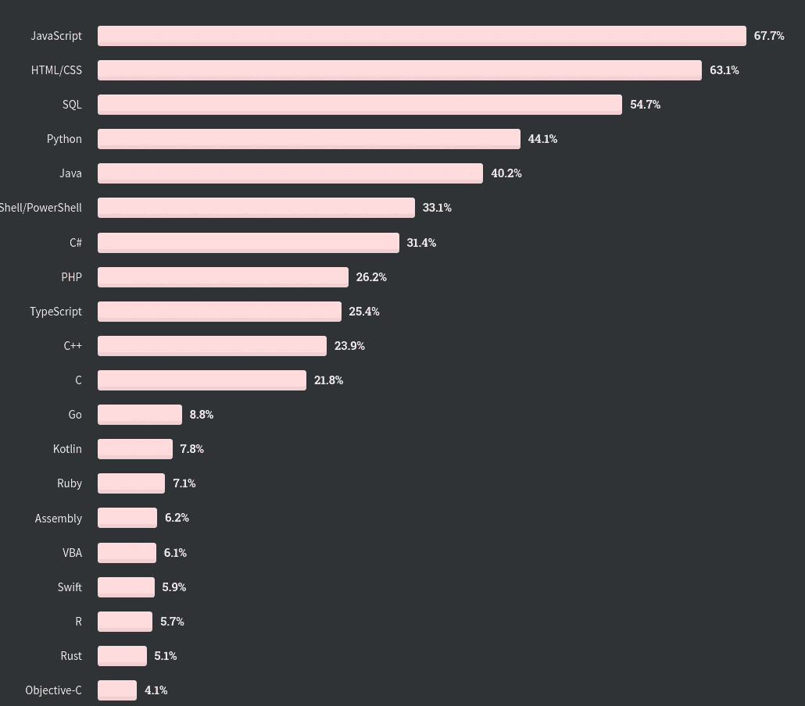
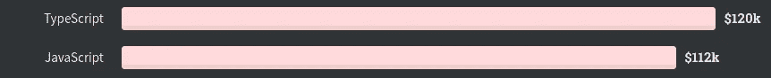
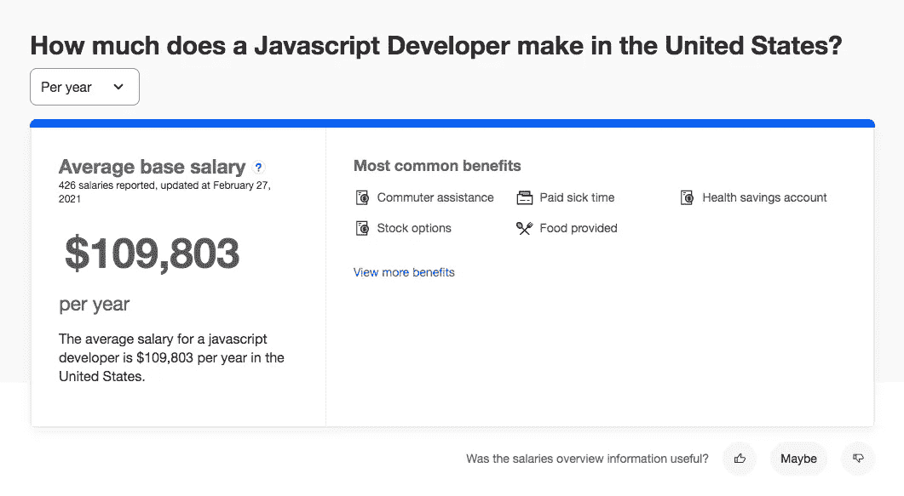

# 2021 年你应该学习 JavaScript 的 5 个理由

> 原文：<https://betterprogramming.pub/5-reasons-you-should-learn-javascript-in-2021-e72c5c4654c4>

## web 开发语言仍然有着光明的未来

马库斯·温克勒在 [Unsplash](https://unsplash.com/s/photos/2021?utm_source=unsplash&utm_medium=referral&utm_content=creditCopyText) 上的照片。

经常有人问我，应该从哪种编程语言开始学习编程。这个问题的答案非常简单:编程语言无关紧要。重要的是逻辑推理和你第一次接触编程范例。当你沉浸在这个行业中时，剩下的就会一步步来。

然而，事实是，我遇到过很多反对学习 JavaScript 的人，因为它在业界的恶名。诚然，JavaScript 生来就有目的，业界已经用它来解决原本没有打算解决的问题。这导致它在资深开发人员或来自其他编程范例的开发人员中名声不佳。但我们不能忽视的是，六年多来(2015 年)，JavaScript 一直在接受年度更新。此外，它有一个庞大的社区，为它提供支持，并审查可能的改进。

在这篇文章中，我将给出为什么你应该在 2021 年学习 JavaScript 的理由——除了你不想把自己奉献给前端的事实之外，因为前端是它的第一个执行环境。

# 1.初学者友好的

我想谈谈我在计算机科学领域的开端。当我大约 11 岁开始开发软件时，我第一次学习 Pascal 和 C 编程语言，没有工具或编译器的帮助来了解发生了什么。事实上，开始学习开发软件是非常困难的，你需要一个导师在这条道路上给你一点指导。

今天，有许多工具可以开始开发软件，但 JavaScript 是一种允许初学者开始开发软件的语言。当然，这个软件不会是解决手头问题的最佳方案，但是一个新手将会编写代码行并开始他们的软件开发生涯。

下一步是不要停止学习，要考虑如何一天一天的提高，但是你已经在发展的世界里了。换句话说，JavaScript 是一种新手友好的语言，允许新开发人员进入该领域。

经验丰富的开发人员的任务是引导新开发人员走上正确的开发道路。新手必须倾听并学习老手的经验。但那是另一个话题，我们可以在另一个时间讨论。

# 2.世界上最流行的编程语言

这种说法可能会伤害异国语言爱好者，他们与其他语言相比提高了性能或安全性，但属于少数。在我们的例子中，JavaScript 是世界上使用最多、最流行的编程语言，这使得它成为新手的绝佳选择。

这主要是因为在前端世界(在网络上)，没有对立的语言。编程语言被垄断了。在过去，它与 VisualBasic 脚本、动作脚本(Flash)甚至 Java 小程序竞争。但是这些语言都没有在 JavaScript 中存活下来。事实上，唯一开始在前端占据显著位置的语言是 TypeScript，它是 JavaScript 超集。所以强烈建议深入了解 JavaScript 的工作原理。

来源:[堆栈溢出调查](https://insights.stackoverflow.com/survey/2020)

# 3.大量的 JavaScript 工作

在任何领域或软件开发环境中，我们都可以找到几种解决同一类型问题的编程语言。然而，我们已经评论过 JavaScript 在 web 应用前端市场上具有“垄断”地位。与其他语言相比，这一事实已经使它处于一种优越的地位。

JavaScript 找工作最有意思的是，现在所有的前端工具/框架都是基于 JavaScript 的，强烈建议深入了解 JavaScript 的工作原理。换句话说，如果你想在 React、Vue 甚至 Angular(它使用 TypeScript 作为一种语言)中找一份工作，你将需要掌握 JavaScript 知识。

因此，学习和理解 JavaScript 会让你获得一份好的高薪工作。事实上，web 开发行业有一个大问题可以让我们找到一份好工作:缺乏对 JavaScript 语言有扎实知识的专业人士。

使用 JavaScript 的顶级付费技术:React，JavaScript，Node.js 来源:[栈溢出调查](https://insights.stackoverflow.com/survey/2020)。

在撰写本文时，的确表明在美国有超过 67，000 个[职位](https://www.indeed.com/jobs?q=Javascript&_ga=2.188876206.440199382.1614872271-141671481.1612371351)需要 JavaScript

不仅有大量的工作机会，而且平均工资也很有吸引力:每年 109803 美元。

来源:[确实](https://www.indeed.com/career/javascript-developer/salaries)。

# 4.到处都是

当我还是一名大学生时，我听说 Java 是一场革命，因为我们只需编写一次代码，它就可以在所有设备上运行——这是真的，Java 设法通过其虚拟机将我们从操作系统中抽象出来。我爱上了 Java 背后的想法，今天，我们有了更容易、更舒适的执行 JavaScript 代码的“虚拟机”(即网络浏览器)。因此，在所有安装了网络浏览器的环境中，我们都会有 JavaScript。这意味着我们几乎可以拥有最终用户可以使用的所有设备。

这还没有结束。十多年来，多亏了 [Node.js](https://fossbytes.com/node-js-version-6-lts-released-features/) ，JavaScript 才得以在服务器上执行。事实上，这允许我们在小型设备上用 JavaScript 编写代码，而不需要图形环境。

# 5.社区

在世界上独一无二是人类多年来一直追求的。事实上，在时尚、汽车和珠宝行业，这是对用户有额外成本的东西。

在我们的背景下，独一无二或孤独是一种危险。我们的工作是协作的。这是一个你必须与你的同事完全同步的工作领域，而这正是人多力量大的时候。如果使用编程语言的社区创建了库，解决了疑问，并通过修订帮助语言保持活力，这些都是优势。

社区的规模非常重要，与其他语言相比，JavaScript 的社区可能是世界上最大的。

这里有一些数据可以帮助我们推断出 JavaScript 社区是世界上最大的社区之一:

*   最大的 StackOverflow 社区——Stack Overflow 是最大的编程问答平台，在这里你可以看到社区是如何帮助解决其他同事的问题的。
*   最大的 Meetup 社区——Meetup 是一个平台，可以让你和与你有相同兴趣的人联系。在编程语言方面，处理 JavaScript 的社区数量是平台上最多的(全球大约有 3600 个，超过 150 万成员)。
*   GitHub 上标签最多的语言。GitHub 是现存的主要开源库(被微软收购)。在这个平台上，JavaScript 是这个平台上托管的所有项目中标签最多的编程语言。

由[沙恩·朗斯](https://unsplash.com/@shanerounce?utm_source=unsplash&utm_medium=referral&utm_content=creditCopyText)在 [Unsplash](https://unsplash.com/s/photos/community?utm_source=unsplash&utm_medium=referral&utm_content=creditCopyText) 上拍摄的照片。

# 结论

本文不是关于 JavaScript 编程语言是否是解决您的问题的最佳选择，或者它是否需要转换。我们研究了为什么你应该在 2020 年甚至未来几年学习 JavaScript。

作为一名软件开发人员，这是一个考虑到积极因素的分析。当然，可能会有另一种语言或环境在几年后取代 JavaScript，但你可以将你在这种语言中学到的东西转移到下一种语言。

在我看来，你不应该错过学习 JavaScript 的机会，因为它比其他语言有着有趣的优势。